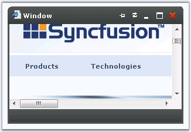

::: {style="DISPLAY: none"}
{#d2h_url_template}{#d2h_package_url style="WIDTH: 0px; DISPLAY: none; HEIGHT: 0px"}
:::

:::: {.d2h_secondary_topic style="PADDING-BOTTOM: 10pt; MARGIN: 0pt; PADDING-LEFT: 0pt; PADDING-RIGHT: 0pt; PADDING-TOP: 0pt"}
##### Caption Button Features {#caption-button-features style="tab-stops: 0pt"}

[]{style="FONT-FAMILY: 'Trebuchet MS','sans-serif'; COLOR: #15428b; FONT-SIZE: 9pt"} 

The Window control is available with the **Minimize** button, **Maximize** button, **Restore** button, **Refresh** button and **Pin** button. Using these features, we can minimize, maximize, restore, refresh and pin the Window control to any position on the screen.

[]{style="FONT-FAMILY: 'Trebuchet MS','sans-serif'; COLOR: #15428b; FONT-SIZE: 9pt"} 

::: {align="center"}
  ------------------- -------------------------------------------------------------------------------------------------------------
  Property            Description
  ShowPinButton       When set to True, the Pin button is shown in the Window header. Default value is False.
  ShowRefreshButton   When set to True, the Refresh Button is shown in the Window header. Default value is False.
  ShowMinMaxButtons   When set to True, the Minimize and Maximize buttons are shown in the Window header. Default value is False.
  ------------------- -------------------------------------------------------------------------------------------------------------
:::

[]{style="FONT-FAMILY: 'Trebuchet MS','sans-serif'; COLOR: #15428b; FONT-SIZE: 9pt"} 

+------------------------------------------------------------------------------------------------+
| **[\[C#\]]{style="FONT-FAMILY: 'Courier New'"}**                                               |
|                                                                                                |
| []{style="FONT-FAMILY: 'Courier New'; COLOR: blue"}                                            |
|                                                                                                |
| [Window1.ShowPinButton = [true]{style="COLOR: blue"};]{style="FONT-FAMILY: 'Courier New'"}     |
|                                                                                                |
| [Window1.ShowRefreshButton = [true]{style="COLOR: blue"};]{style="FONT-FAMILY: 'Courier New'"} |
|                                                                                                |
| [Window1.ShowMinMaxButtons = [true]{style="COLOR: blue"};]{style="FONT-FAMILY: 'Courier New'"} |
+------------------------------------------------------------------------------------------------+

[]{style="FONT-FAMILY: 'Trebuchet MS','sans-serif'; COLOR: #15428b"} 

+-----------------------------------------------------------------------------------------------+
| **[\[VB\]]{style="FONT-FAMILY: 'Courier New'"}**                                              |
|                                                                                               |
| []{style="FONT-FAMILY: 'Courier New'; COLOR: blue"}                                           |
|                                                                                               |
| [Window1.ShowPinButton = [True]{style="COLOR: blue"}]{style="FONT-FAMILY: 'Courier New'"}     |
|                                                                                               |
| [Window1.ShowRefreshButton = [True]{style="COLOR: blue"}]{style="FONT-FAMILY: 'Courier New'"} |
|                                                                                               |
| [Window1.ShowMinMaxButtons = [True]{style="COLOR: blue"}]{style="FONT-FAMILY: 'Courier New'"} |
+-----------------------------------------------------------------------------------------------+

[]{style="FONT-FAMILY: 'Trebuchet MS','sans-serif'; COLOR: #15428b; FONT-SIZE: 9pt"} 

{border="0"}

 Figure 432

[]{#related-topics}
::::
