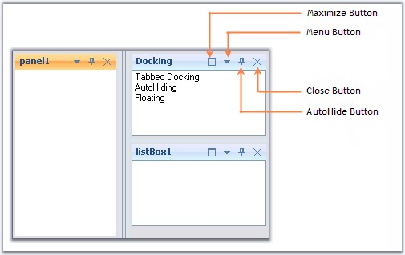

::: {style="DISPLAY: none"}
{#d2h_url_template}{#d2h_package_url style="WIDTH: 0px; DISPLAY: none; HEIGHT: 0px"}
:::

::::: {.d2h_secondary_topic style="PADDING-BOTTOM: 10pt; MARGIN: 0pt; PADDING-LEFT: 0pt; PADDING-RIGHT: 0pt; PADDING-TOP: 0pt"}
##### Caption Buttons {#caption-buttons style="tab-stops: 0pt"}

[]{style="COLOR: #15428b"} 

The buttons available for the docked control and the properties which controls the visibility of the button are discussed in this section.

[]{style="COLOR: #15428b"} 

{border="0"}

**[]{style="COLOR: #15428b"}** 

Figure 59: Buttons for the Docked Control

[]{style="COLOR: #15428b"} 

Menu Button

[]{style="COLOR: #15428b"} 

The menu button in a docked control can be made visible or hidden by setting the **MenuButtonEnabled** property to true. Clicking this button will display the context menu items.

[]{style="COLOR: #15428b"} 

Maximize Button

[]{style="COLOR: #15428b"} 

Maximize button can be enabled by using the **MaximizeButtonEnabled** property. This maximize button allows users to maximize / restore a docking window, so that a clear view of the contents can be made visible.

[]{style="COLOR: #15428b"} 

::: {style="BORDER-BOTTOM: windowtext 1pt solid; BORDER-LEFT: medium none; PADDING-BOTTOM: 1pt; MARGIN-TOP: 9pt; PADDING-LEFT: 0pt; PADDING-RIGHT: 0pt; MARGIN-BOTTOM: 9pt; BORDER-TOP: windowtext 1pt solid; BORDER-RIGHT: medium none; PADDING-TOP: 1pt"}
{border="0"} Note: The Maximize button will be visible only if any other control is docked to the bottom of the former control.
:::

[]{style="COLOR: #15428b"} 

Close Button

[]{style="COLOR: #15428b"} 

The visibility of the Close button can be controlled using the **CloseEnabled** property.

[]{style="COLOR: #15428b"} 

AutoHide Button

[]{style="COLOR: #15428b"} 

Setting **AutoHideEnabled** property shows or hides the auto hide button in the docked control. Clicking this button will autohide the docked controls.

[]{style="COLOR: #15428b"} 

::: {style="BORDER-BOTTOM: windowtext 1pt solid; BORDER-LEFT: medium none; PADDING-BOTTOM: 1pt; MARGIN-TOP: 9pt; PADDING-LEFT: 0pt; PADDING-RIGHT: 0pt; MARGIN-BOTTOM: 9pt; BORDER-TOP: windowtext 1pt solid; BORDER-RIGHT: medium none; PADDING-TOP: 1pt"}
{border="0"} Note:[ ]{style="COLOR: black"}Docking Manager let you customize the above default buttons and also add custom caption buttons. See Custom Caption Buttons for more details.
:::

[]{style="COLOR: #15428b"} 

See Also

[]{style="COLOR: #15428b"} 

[Context Menu]{.UGHyperlink}[, ]{.UGHyperlink}[AutoHiding]{.UGHyperlink}[]{.UGHyperlink}

[]{#related-topics}
:::::
