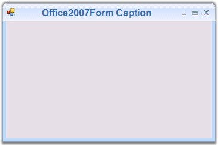

::: {style="DISPLAY: none"}
{#d2h_url_template}{#d2h_package_url style="WIDTH: 0px; DISPLAY: none; HEIGHT: 0px"}
:::

::: {.d2h_secondary_topic style="PADDING-BOTTOM: 10pt; MARGIN: 0pt; PADDING-LEFT: 0pt; PADDING-RIGHT: 0pt; PADDING-TOP: 0pt"}
##### Caption Settings {#caption-settings style="tab-stops: 0pt"}

[]{style="COLOR: #15428b"} 

The Office2007Form\'s caption can be aligned to left, right or center using **CaptionAlign** property. It font style can be specified in **CaptionFont** property.

[]{style="COLOR: #15428b"} 

+-----------------------------------------------------------------------------------------------------------------------------------------------------------------------------------------------------------------------------------------------------------------------------------------------------------------------------------------------------+
| **[\[C#\]]{style="FONT-FAMILY: 'Courier New'; COLOR: black"}**                                                                                                                                                                                                                                                                                      |
|                                                                                                                                                                                                                                                                                                                                                     |
| []{style="COLOR: #15428b"}                                                                                                                                                                                                                                                                                                                          |
|                                                                                                                                                                                                                                                                                                                                                     |
| [this]{style="FONT-FAMILY: 'Courier New'; COLOR: blue"}[.CaptionAlign = System.Windows.Forms.HorizontalAlignment.Center;]{style="FONT-FAMILY: 'Courier New'"}                                                                                                                                                                                       |
|                                                                                                                                                                                                                                                                                                                                                     |
| [this]{style="FONT-FAMILY: 'Courier New'; COLOR: blue"}[.CaptionFont = [new]{style="COLOR: blue"} System.Drawing.Font([\"Arial\"]{style="COLOR: maroon"}, 12.25F, System.Drawing.FontStyle.Bold, System.Drawing.GraphicsUnit.Point, (([byte]{style="COLOR: blue"})(0)));]{style="FONT-FAMILY: 'Courier New'"}[]{style="FONT-FAMILY: 'Courier New'"} |
+-----------------------------------------------------------------------------------------------------------------------------------------------------------------------------------------------------------------------------------------------------------------------------------------------------------------------------------------------------+

[]{#p1098}[]{style="COLOR: #15428b"} 

+--------------------------------------------------------------------------------------------------------------------------------------------------------------------------------------------------------------------------------------------------------------------------------------------------------------------------------------------------+
| **[\[VB.NET\]]{style="FONT-FAMILY: 'Courier New'; COLOR: black"}**                                                                                                                                                                                                                                                                               |
|                                                                                                                                                                                                                                                                                                                                                  |
| []{style="COLOR: black"}                                                                                                                                                                                                                                                                                                                         |
|                                                                                                                                                                                                                                                                                                                                                  |
| [Me]{style="FONT-FAMILY: 'Courier New'; COLOR: blue"}[.CaptionAlign = System.Windows.Forms.HorizontalAlignment.Center ]{style="FONT-FAMILY: 'Courier New'"}                                                                                                                                                                                      |
|                                                                                                                                                                                                                                                                                                                                                  |
| [Me]{style="FONT-FAMILY: 'Courier New'; COLOR: blue"}[.CaptionFont = [New]{style="COLOR: blue"} System.Drawing.Font([\"Arial\"]{style="COLOR: maroon"}, 12.25F, System.Drawing.FontStyle.Bold, System.Drawing.GraphicsUnit.Point, [CByte]{style="COLOR: blue"}((0))) ]{style="FONT-FAMILY: 'Courier New'"}[]{style="FONT-FAMILY: 'Courier New'"} |
+--------------------------------------------------------------------------------------------------------------------------------------------------------------------------------------------------------------------------------------------------------------------------------------------------------------------------------------------------+

[]{style="COLOR: #15428b"} 

{border="0"}

[]{style="COLOR: #15428b"} 

***[]{style="COLOR: #15428b"}*** 

Figure 1297: CaptionAlign = \"Center\"; CaptionFont = \"Arial, 12.25F\"

 

 

[]{#related-topics}
:::
