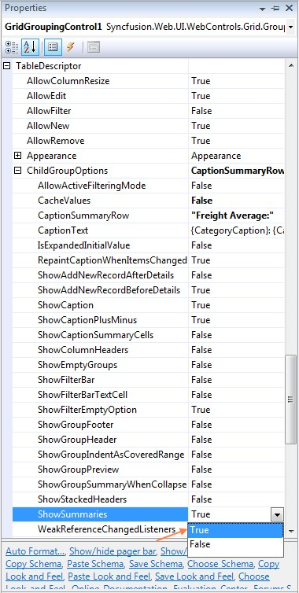

::: {style="DISPLAY: none"}
{#d2h_url_template}{#d2h_package_url style="WIDTH: 0px; DISPLAY: none; HEIGHT: 0px"}
:::

::::: {#nsbanner .d2h_main_nsbanner style="BORDER-BOTTOM: #999999 1px solid; POSITION: relative; PADDING-BOTTOM: 0px; BACKGROUND-COLOR: transparent; PADDING-LEFT: 0px; PADDING-RIGHT: 0px; DISPLAY: none; BORDER-TOP: #999999 1px solid; PADDING-TOP: 0px; LEFT: 0px"}
:::: {#TitleRow .d2h_main_titlerow style="PADDING-BOTTOM: 4px; BACKGROUND-COLOR: transparent; PADDING-LEFT: 22px; WIDTH: 100%; PADDING-RIGHT: 10px; DISPLAY: none; PADDING-TOP: 4px"}
::: {#ienav .d2h_main_ienav style="DISPLAY: none"}
{#D2HPrevious .D2HPreviousEnabled}  {#D2HNext .D2HNextEnabled}
:::
::::
:::::

:::: {#nstext .d2h_main_nstext style="PADDING-BOTTOM: 10px; BACKGROUND-COLOR: transparent; PADDING-LEFT: 22px; PADDING-RIGHT: 10px; HEIGHT: 100%; OVERFLOW: auto; PADDING-TOP: 5px" hasuserbackground="true" valign="bottom"}
::: {#d2h_breadcrumbs .d2h_breadcrumbs}
[Essential Studio User Guide Documentation](ms-xhelp:///?Id=12457748-09e3-4d74-a240-8e049cedf030){.d2h_breadcrumbsNormal}[ \> ]{.d2h_breadcrumbsLinkSeparator}[User Interface Edition](ms-xhelp:///?Id=c29296b7-531c-413b-a0ec-488ca1f7f669){.d2h_breadcrumbsNormal}[ \> ]{.d2h_breadcrumbsLinkSeparator}[Essential ASP.NET](ms-xhelp:///?Id=25c35330-c127-4dad-9a92-ed79dc7261a6){.d2h_breadcrumbsNormal}[ \> ]{.d2h_breadcrumbsLinkSeparator}[Essential Grid]{.d2h_breadcrumbsContentsOnly}[ \> ]{.d2h_breadcrumbsLinkSeparator}[Concepts and Features](ms-xhelp:///?Id=9e489974-524d-457c-9881-e458b1321685){.d2h_breadcrumbsNormal}[ \> ]{.d2h_breadcrumbsLinkSeparator}[Summary](ms-xhelp:///?Id=99ccb45f-cf88-4212-a6e0-481362ff7f20){.d2h_breadcrumbsNormal}
:::

### Caption Summary {#caption-summary style="tab-stops: 0pt"}

[]{style="FONT-FAMILY: 'Trebuchet MS','sans-serif'; COLOR: #15428b; FONT-SIZE: 9pt"} 

Through Designer

[]{style="FONT-FAMILY: 'Trebuchet MS','sans-serif'; COLOR: #15428b; FONT-SIZE: 9pt"} 

To define the Summary Row that should be used for displaying summaries on the Group Caption Bar, you need to set the following properties from the ChildGroupOptions.

[]{style="FONT-FAMILY: 'Trebuchet MS','sans-serif'; COLOR: #15428b; FONT-SIZE: 9pt"} 

[·      ]{style="FONT-FAMILY: Symbol"}**ShowCaptionSummaryCells** - is to set for showing the summaries on the group caption bar.

[·      ]{style="FONT-FAMILY: Symbol"}**CaptionSummaryRow** - accepts string values, which describes the name of the summary row.

[]{style="FONT-FAMILY: 'Trebuchet MS','sans-serif'; COLOR: #15428b; FONT-SIZE: 9pt"} 

{border="0"}

Figure 100

[]{style="FONT-FAMILY: 'Trebuchet MS','sans-serif'; COLOR: #15428b; FONT-SIZE: 9pt"} 

[·      ]{style="FONT-FAMILY: Symbol"}Through Code

[]{style="COLOR: #4a5c8c; FONT-SIZE: 8pt"} 

+----------------------------------------------------------------------------------------------------------------------------------------------------------------------------------------------------------------------------------------------------------------------------------------------------------------------------------------------------------------------------------------+
| **[\[C#\]]{style="FONT-FAMILY: 'Courier New'; COLOR: black"}**                                                                                                                                                                                                                                                                                                                         |
|                                                                                                                                                                                                                                                                                                                                                                                        |
| []{style="FONT-FAMILY: 'Courier New'; COLOR: black"}                                                                                                                                                                                                                                                                                                                                   |
|                                                                                                                                                                                                                                                                                                                                                                                        |
| [GridTableDescriptor]{style="FONT-FAMILY: 'Courier New'; COLOR: teal"}[ mainTD = [this]{style="COLOR: blue"}.GridGroupingControl1.TableDescriptor;]{style="FONT-FAMILY: 'Courier New'"}                                                                                                                                                                                                |
|                                                                                                                                                                                                                                                                                                                                                                                        |
| []{style="FONT-FAMILY: 'Courier New'"}                                                                                                                                                                                                                                                                                                                                                 |
|                                                                                                                                                                                                                                                                                                                                                                                        |
| [// Defines SummaryColumnDescriptor]{style="FONT-FAMILY: 'Courier New'; COLOR: green"}                                                                                                                                                                                                                                                                                                 |
|                                                                                                                                                                                                                                                                                                                                                                                        |
| [GridSummaryColumnDescriptor]{style="FONT-FAMILY: 'Courier New'; COLOR: teal"}[ summaryColumn2 = [new]{style="COLOR: blue"} [GridSummaryColumnDescriptor]{style="COLOR: teal"}([\"FreightTotalAvg\"]{style="COLOR: maroon"}, SummaryType.DoubleAggregate, [\"Freight\"]{style="COLOR: maroon"}, [\"{Average:\$###.00}\"]{style="COLOR: maroon"});]{style="FONT-FAMILY: 'Courier New'"} |
|                                                                                                                                                                                                                                                                                                                                                                                        |
| []{style="FONT-FAMILY: 'Courier New'"}                                                                                                                                                                                                                                                                                                                                                 |
|                                                                                                                                                                                                                                                                                                                                                                                        |
| [//Defines SummaryRowDescriptor]{style="FONT-FAMILY: 'Courier New'; COLOR: green"}                                                                                                                                                                                                                                                                                                     |
|                                                                                                                                                                                                                                                                                                                                                                                        |
| [GridSummaryRowDescriptor]{style="FONT-FAMILY: 'Courier New'; COLOR: teal"}[ summaryRow2 = [new]{style="COLOR: blue"} [GridSummaryRowDescriptor]{style="COLOR: teal"}();]{style="FONT-FAMILY: 'Courier New'"}                                                                                                                                                                          |
|                                                                                                                                                                                                                                                                                                                                                                                        |
| [summaryRow2.Name = [\"Freight Average:\"]{style="COLOR: maroon"};]{style="FONT-FAMILY: 'Courier New'"}                                                                                                                                                                                                                                                                                |
|                                                                                                                                                                                                                                                                                                                                                                                        |
| [summaryRow2.Visible = [true]{style="COLOR: blue"};]{style="FONT-FAMILY: 'Courier New'"}                                                                                                                                                                                                                                                                                               |
|                                                                                                                                                                                                                                                                                                                                                                                        |
| [summaryRow2.SummaryColumns.Add(summaryColumn2);]{style="FONT-FAMILY: 'Courier New'"}                                                                                                                                                                                                                                                                                                  |
|                                                                                                                                                                                                                                                                                                                                                                                        |
| [mainTD.SummaryRows.Add(summaryRow2);]{style="FONT-FAMILY: 'Courier New'"}                                                                                                                                                                                                                                                                                                             |
|                                                                                                                                                                                                                                                                                                                                                                                        |
| []{style="FONT-FAMILY: 'Courier New'"}                                                                                                                                                                                                                                                                                                                                                 |
|                                                                                                                                                                                                                                                                                                                                                                                        |
| [// Here you define the summary row that should be used for displaying summaries in caption bar.]{style="FONT-FAMILY: 'Courier New'; COLOR: green"}                                                                                                                                                                                                                                    |
|                                                                                                                                                                                                                                                                                                                                                                                        |
| [mainTD.ChildGroupOptions.ShowCaptionSummaryCells = [true]{style="COLOR: blue"};]{style="FONT-FAMILY: 'Courier New'"}                                                                                                                                                                                                                                                                  |
|                                                                                                                                                                                                                                                                                                                                                                                        |
| [mainTD.ChildGroupOptions.CaptionSummaryRow = [\"Freight Average:\"]{style="COLOR: maroon"};]{style="FONT-FAMILY: 'Courier New'"}                                                                                                                                                                                                                                                      |
+----------------------------------------------------------------------------------------------------------------------------------------------------------------------------------------------------------------------------------------------------------------------------------------------------------------------------------------------------------------------------------------+

[]{style="FONT-FAMILY: 'Trebuchet MS','sans-serif'; COLOR: #15428b; FONT-SIZE: 9pt"} 

+----------------------------------------------------------------------------------------------------------------------------------------------------------------------------------------------------------------------------------------------------------------------------------------------------------------------------------------------------------------------------------------+
| **[\[VB.NET\]]{style="FONT-FAMILY: 'Courier New'; COLOR: black"}**                                                                                                                                                                                                                                                                                                                     |
|                                                                                                                                                                                                                                                                                                                                                                                        |
| []{style="FONT-FAMILY: 'Courier New'; COLOR: black"}                                                                                                                                                                                                                                                                                                                                   |
|                                                                                                                                                                                                                                                                                                                                                                                        |
| [GridTableDescriptor]{style="FONT-FAMILY: 'Courier New'; COLOR: teal"}[ mainTD = [this]{style="COLOR: blue"}.GridGroupingControl1.TableDescriptor;]{style="FONT-FAMILY: 'Courier New'"}                                                                                                                                                                                                |
|                                                                                                                                                                                                                                                                                                                                                                                        |
| []{style="FONT-FAMILY: 'Courier New'"}                                                                                                                                                                                                                                                                                                                                                 |
|                                                                                                                                                                                                                                                                                                                                                                                        |
| [// Defines SummaryColumnDescriptor]{style="FONT-FAMILY: 'Courier New'; COLOR: green"}                                                                                                                                                                                                                                                                                                 |
|                                                                                                                                                                                                                                                                                                                                                                                        |
| [GridSummaryColumnDescriptor]{style="FONT-FAMILY: 'Courier New'; COLOR: teal"}[ summaryColumn2 = [new]{style="COLOR: blue"} [GridSummaryColumnDescriptor]{style="COLOR: teal"}([\"FreightTotalAvg\"]{style="COLOR: maroon"}, SummaryType.DoubleAggregate, [\"Freight\"]{style="COLOR: maroon"}, [\"{Average:\$###.00}\"]{style="COLOR: maroon"});]{style="FONT-FAMILY: 'Courier New'"} |
|                                                                                                                                                                                                                                                                                                                                                                                        |
| []{style="FONT-FAMILY: 'Courier New'"}                                                                                                                                                                                                                                                                                                                                                 |
|                                                                                                                                                                                                                                                                                                                                                                                        |
| [//Defines SummaryRowDescriptor]{style="FONT-FAMILY: 'Courier New'; COLOR: green"}                                                                                                                                                                                                                                                                                                     |
|                                                                                                                                                                                                                                                                                                                                                                                        |
| [GridSummaryRowDescriptor]{style="FONT-FAMILY: 'Courier New'; COLOR: teal"}[ summaryRow2 = [new]{style="COLOR: blue"} [GridSummaryRowDescriptor]{style="COLOR: teal"}();]{style="FONT-FAMILY: 'Courier New'"}                                                                                                                                                                          |
|                                                                                                                                                                                                                                                                                                                                                                                        |
| [summaryRow2.Name = [\"Freight Average:\"]{style="COLOR: maroon"};]{style="FONT-FAMILY: 'Courier New'"}                                                                                                                                                                                                                                                                                |
|                                                                                                                                                                                                                                                                                                                                                                                        |
| [summaryRow2.Visible = [true]{style="COLOR: blue"};]{style="FONT-FAMILY: 'Courier New'"}                                                                                                                                                                                                                                                                                               |
|                                                                                                                                                                                                                                                                                                                                                                                        |
| [summaryRow2.SummaryColumns.Add(summaryColumn2);]{style="FONT-FAMILY: 'Courier New'"}                                                                                                                                                                                                                                                                                                  |
|                                                                                                                                                                                                                                                                                                                                                                                        |
| [mainTD.SummaryRows.Add(summaryRow2);]{style="FONT-FAMILY: 'Courier New'"}                                                                                                                                                                                                                                                                                                             |
|                                                                                                                                                                                                                                                                                                                                                                                        |
| []{style="FONT-FAMILY: 'Courier New'"}                                                                                                                                                                                                                                                                                                                                                 |
|                                                                                                                                                                                                                                                                                                                                                                                        |
| [// Here you define the summary row that should be used for displaying summaries in caption bar.]{style="FONT-FAMILY: 'Courier New'; COLOR: green"}                                                                                                                                                                                                                                    |
|                                                                                                                                                                                                                                                                                                                                                                                        |
| [mainTD.ChildGroupOptions.ShowCaptionSummaryCells = [true]{style="COLOR: blue"};]{style="FONT-FAMILY: 'Courier New'"}                                                                                                                                                                                                                                                                  |
|                                                                                                                                                                                                                                                                                                                                                                                        |
| [mainTD.ChildGroupOptions.CaptionSummaryRow = [\"Freight Average:\"]{style="COLOR: maroon"};]{style="FONT-FAMILY: 'Courier New'"}                                                                                                                                                                                                                                                      |
+----------------------------------------------------------------------------------------------------------------------------------------------------------------------------------------------------------------------------------------------------------------------------------------------------------------------------------------------------------------------------------------+

[]{#p78} 

[]{#related-topics}
::::
