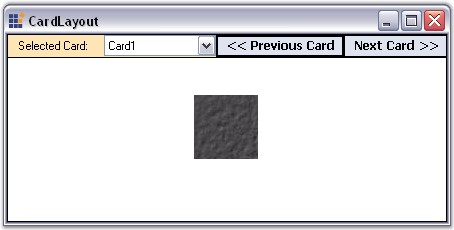

::: {style="DISPLAY: none"}
{#d2h_url_template}{#d2h_package_url style="WIDTH: 0px; DISPLAY: none; HEIGHT: 0px"}
:::

:::: {.d2h_secondary_topic style="PADDING-BOTTOM: 10pt; MARGIN: 0pt; PADDING-LEFT: 0pt; PADDING-RIGHT: 0pt; PADDING-TOP: 0pt"}
#### CardLayout {#cardlayout style="tab-stops: 0pt"}

[]{style="FONT-SIZE: 8pt"} 

A CardLayout is a Layout Manager that is applied to a Container, and components are added to the layout in a particular form and not between different forms. It treats each component in the Container as a card. Only one card is visible at a time, and the Container acts as a stack of cards. The first component added to a CardLayout object is the visible component when the Container is first displayed.

[]{style="FONT-FAMILY: 'Verdana','sans-serif'; FONT-SIZE: 8pt"} 

The Child component / card can either be made to fill or simply centered within the Container. Some common uses of a CardLayout are to create WizardControls and property pages.

[]{style="COLOR: #15428b"} 

::: {style="BORDER-BOTTOM: windowtext 1pt solid; BORDER-LEFT: medium none; PADDING-BOTTOM: 1pt; MARGIN-TOP: 9pt; PADDING-LEFT: 0pt; PADDING-RIGHT: 0pt; MARGIN-BOTTOM: 9pt; BORDER-TOP: windowtext 1pt solid; BORDER-RIGHT: medium none; PADDING-TOP: 1pt"}
{border="0"} Note: The WizardControl uses the CardLayout component internally in it\'s implementation.
:::

[]{style="COLOR: #15428b"} 

In it\'s simplest form, this Layout Manager can be used to automatically arrange the Child components in one or more rows, as given below.

[]{style="COLOR: #15428b"} 

{border="0"}

[]{style="COLOR: #15428b"} 

Figure 660: CardLayout Showing One Picture at a Time

 

A Sample which demonstrates the CardLayout is available in the below sample installation path.

 

..My Documents\\Syncfusion\\EssentialStudio\\Version Number\\Windows\\Tools.Windows\\Samples\\2.0\\Layout Manager Package\\LayoutManagers

[]{style="COLOR: #15428b"} 

See Also

[[]{style="TEXT-DECORATION: none"}]{.UGHyperlink} 

[[·      ]{style="FONT-FAMILY: Symbol; TEXT-DECORATION: none; text-underline: none"}]{.UGHyperlink}[Creating a Simple Layout]{.UGHyperlink}[, ]{.UGHyperlink}

More:

[ ]{#related-topics}

[{border="0" align="absMiddle"}Configuring CardLayout](ms-xhelp:///?Id=b388c892-c77d-4a65-bd1e-1f661efba33e){style="TEXT-DECORATION: none"}

[{border="0" align="absMiddle"}Configuring Child Controls](ms-xhelp:///?Id=57754eff-446a-48f6-b352-9f82846dfbd4){style="TEXT-DECORATION: none"}
::::
