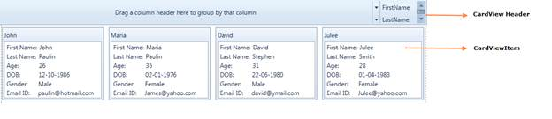

::: {style="DISPLAY: none"}
{#d2h_url_template}{#d2h_package_url style="WIDTH: 0px; DISPLAY: none; HEIGHT: 0px"}
:::

::: {.d2h_secondary_topic style="PADDING-BOTTOM: 10pt; MARGIN: 0pt; PADDING-LEFT: 0pt; PADDING-RIGHT: 0pt; PADDING-TOP: 0pt"}
#### CardView {#cardview style="tab-stops: 0pt"}

Use Case Scenarios

CardView control helps to sort or group items based on the given field names.Structure of the CardView Control

 

The following screenshot displays the CardView:

 

{border="0"}

Figure 101: Structure of the CardView Control

**[]{style="FONT-FAMILY: 'Trebuchet MS','sans-serif'; BACKGROUND: red; COLOR: white; FONT-SIZE: 9pt"}** 

[·    ]{style="FONT-FAMILY: Symbol; FONT-SIZE: 11pt"}**CardViewHeader:** It shows the header of the card view control[]{style="FONT-FAMILY: 'Calibri','sans-serif'; COLOR: #4f6228; FONT-SIZE: 11pt"}

[·    ]{style="FONT-FAMILY: Symbol; FONT-SIZE: 11pt"}**CardViewItem:** It contains the list of ComboBox's items[]{style="FONT-FAMILY: 'Calibri','sans-serif'; COLOR: #4f6228; FONT-SIZE: 11pt"}

 

Sample link

1.   Select Start -\> Programs -\> Syncfusion -\> Essential Studio 9.2.0.137 -\> Dashboard.

2.   Select Run Locally Installed Samples in WPF CardView.

3.   Now select the CardView item in the tree.

4.   Choose CardView demo.

 

More:

[ ]{#related-topics}

[{border="0" align="absMiddle"}Appearance](ms-xhelp:///?Id=456b756f-ba59-4355-8230-cd61477e4b8a){style="TEXT-DECORATION: none"}

[{border="0" align="absMiddle"}Blendability](ms-xhelp:///?Id=9ea44134-5850-436c-ab7d-1a33266dcd86){style="TEXT-DECORATION: none"}

[{border="0" align="absMiddle"}Features of CardView control](ms-xhelp:///?Id=a3535c06-1b44-40de-99eb-66d5233589de){style="TEXT-DECORATION: none"}
:::
