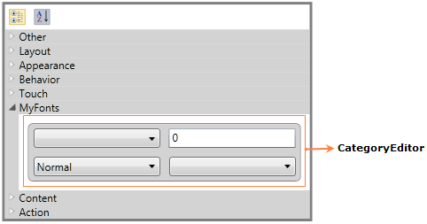

::: {style="DISPLAY: none"}
{#d2h_url_template}{#d2h_package_url style="WIDTH: 0px; DISPLAY: none; HEIGHT: 0px"}
:::

::: {.d2h_secondary_topic style="PADDING-BOTTOM: 10pt; MARGIN: 0pt; PADDING-LEFT: 0pt; PADDING-RIGHT: 0pt; PADDING-TOP: 0pt"}
#### CategoryEditor support {#categoryeditor-support style="tab-stops: 0pt"}

The PropertyGrid control supports several built-in editors, to give a good look and feel for the application (like in Expression Blend) using CustomEditors or CategoryEditors. CategoryEditor support enables you to set related properties (one or more properties) on a custom control. CategoryEditor can be applied for Grouping. While sorting, default editors will be displayed.

 

Adding CategoryEditor support to an Application

Using CategoryEditor, you can set the related properties on a custom control.

In the below example, Text related properties are grouped under one category using CategoryEditor support. You can add any number of CategoryEditors. You must add property names in the **Properties** collection CategoryEditor. Theproperties can also be shown in a  separate tab using the **Category** property of CategoryEditor. You have to set the Template to group the related properties, using the **EditorTemplate** property of CategoryEditor.

In the below example, **FontWeightButton** and **FontListBox** are the custom controls.

[]{style="FONT-FAMILY: 'Trebuchet MS','sans-serif'; COLOR: #15428b; FONT-SIZE: 9pt"} 

+-----------------------------------------------------------------------------------------------------------------------------------------------------------------------------------------------------------------------------------------------------------------------------------------------------------------------------------------------------------------------------------------------------------------------------------------------------------------------------------------------------------------------------------------------------------------------------------------------------------------------------------------------------------------------------------------------------------------------------------------------------------------------------------------------------------------------------------------------------------------------------------------------------------------+
| **[\[XAML\]]{style="FONT-FAMILY: 'Courier New'"}**                                                                                                                                                                                                                                                                                                                                                                                                                                                                                                                                                                                                                                                                                                                                                                                                                                                              |
|                                                                                                                                                                                                                                                                                                                                                                                                                                                                                                                                                                                                                                                                                                                                                                                                                                                                                                                 |
| [           ]{style="FONT-FAMILY: Consolas"}                                                                                                                                                                                                                                                                                                                                                                                                                                                                                                                                                                                                                                                                                                                                                                                                                                                                    |
|                                                                                                                                                                                                                                                                                                                                                                                                                                                                                                                                                                                                                                                                                                                                                                                                                                                                                                                 |
| [\<]{style="FONT-FAMILY: 'Courier New'; COLOR: blue"}[syncfusion]{style="FONT-FAMILY: 'Courier New'; COLOR: #a31515"}[:]{style="FONT-FAMILY: 'Courier New'; COLOR: blue"}[PropertyGrid]{style="FONT-FAMILY: 'Courier New'; COLOR: #a31515"}[ x]{style="FONT-FAMILY: 'Courier New'; COLOR: red"}[:]{style="FONT-FAMILY: 'Courier New'; COLOR: blue"}[Name]{style="FONT-FAMILY: 'Courier New'; COLOR: red"}[=\"propertyGrid\"]{style="FONT-FAMILY: 'Courier New'; COLOR: blue"}[ SelectedObject]{style="FONT-FAMILY: 'Courier New'; COLOR: red"}[=\"{]{style="FONT-FAMILY: 'Courier New'; COLOR: blue"}[Binding]{style="FONT-FAMILY: 'Courier New'; COLOR: #a31515"}[ ElementName]{style="FONT-FAMILY: 'Courier New'; COLOR: red"}[=Btn}\"]{style="FONT-FAMILY: 'Courier New'; COLOR: blue"}[ Margin]{style="FONT-FAMILY: 'Courier New'; COLOR: red"}[=\"50\"]{style="FONT-FAMILY: 'Courier New'; COLOR: blue"}[\ |
|                            [ Width]{style="COLOR: red"}[=\"350\"]{style="COLOR: blue"}[ BorderBrush]{style="COLOR: red"}[=\"Gray\"]{style="COLOR: blue"}[ BorderThickness]{style="COLOR: red"}[=\"3\"]{style="COLOR: blue"}[ HorizontalAlignment]{style="COLOR: red"}[=\"Center\"]{style="COLOR: blue"}[ VerticalAlignment]{style="COLOR: red"}[=\"Center\"\>]{style="COLOR: blue"}\                                                                                                                                                                                                                                                                                                                                                                                                                                                                                                                            |
| [    ]{style="COLOR: #a31515"}[\<]{style="COLOR: blue"}[syncfusion]{style="COLOR: #a31515"}[:]{style="COLOR: blue"}[PropertyGrid.CategoryEditors]{style="COLOR: #a31515"}[\>]{style="COLOR: blue"}\                                                                                                                                                                                                                                                                                                                                                                                                                                                                                                                                                                                                                                                                                                             |
| [        ]{style="COLOR: #a31515"}[\<]{style="COLOR: blue"}[syncfusion]{style="COLOR: #a31515"}[:]{style="COLOR: blue"}[CategoryEditor]{style="COLOR: #a31515"}[ Category]{style="COLOR: red"}[=\"MyFonts\"\>]{style="COLOR: blue"}\                                                                                                                                                                                                                                                                                                                                                                                                                                                                                                                                                                                                                                                                            |
| [            ]{style="COLOR: #a31515"}[\<]{style="COLOR: blue"}[syncfusion]{style="COLOR: #a31515"}[:]{style="COLOR: blue"}[CategoryEditor.Properties]{style="COLOR: #a31515"}[\>]{style="COLOR: blue"}\                                                                                                                                                                                                                                                                                                                                                                                                                                                                                                                                                                                                                                                                                                        |
| [                ]{style="COLOR: #a31515"}[\<]{style="COLOR: blue"}[syncfusion]{style="COLOR: #a31515"}[:]{style="COLOR: blue"}[CategoryEditorProperty]{style="COLOR: #a31515"}[ Name]{style="COLOR: red"}[=\"FontSize\"/\>]{style="COLOR: blue"}\                                                                                                                                                                                                                                                                                                                                                                                                                                                                                                                                                                                                                                                              |
| [                ]{style="COLOR: #a31515"}[\<]{style="COLOR: blue"}[syncfusion]{style="COLOR: #a31515"}[:]{style="COLOR: blue"}[CategoryEditorProperty]{style="COLOR: #a31515"}[ Name]{style="COLOR: red"}[=\"FontFamily\"/\>]{style="COLOR: blue"}\                                                                                                                                                                                                                                                                                                                                                                                                                                                                                                                                                                                                                                                            |
| [                ]{style="COLOR: #a31515"}[\<]{style="COLOR: blue"}[syncfusion]{style="COLOR: #a31515"}[:]{style="COLOR: blue"}[CategoryEditorProperty]{style="COLOR: #a31515"}[ Name]{style="COLOR: red"}[=\"FontStyle\"/\>]{style="COLOR: blue"}\                                                                                                                                                                                                                                                                                                                                                                                                                                                                                                                                                                                                                                                             |
| [                ]{style="COLOR: #a31515"}[\<]{style="COLOR: blue"}[syncfusion]{style="COLOR: #a31515"}[:]{style="COLOR: blue"}[CategoryEditorProperty]{style="COLOR: #a31515"}[ Name]{style="COLOR: red"}[=\"FontWeight\"/\>]{style="COLOR: blue"}\                                                                                                                                                                                                                                                                                                                                                                                                                                                                                                                                                                                                                                                            |
| [            ]{style="COLOR: #a31515"}[\</]{style="COLOR: blue"}[syncfusion]{style="COLOR: #a31515"}[:]{style="COLOR: blue"}[CategoryEditor.Properties]{style="COLOR: #a31515"}[\>]{style="COLOR: blue"}\                                                                                                                                                                                                                                                                                                                                                                                                                                                                                                                                                                                                                                                                                                       |
| [            ]{style="COLOR: #a31515"}[\<]{style="COLOR: blue"}[syncfusion]{style="COLOR: #a31515"}[:]{style="COLOR: blue"}[CategoryEditor.EditorTemplate]{style="COLOR: #a31515"}[\>]{style="COLOR: blue"}\                                                                                                                                                                                                                                                                                                                                                                                                                                                                                                                                                                                                                                                                                                    |
| [                ]{style="COLOR: #a31515"}[\<]{style="COLOR: blue"}[DataTemplate]{style="COLOR: #a31515"}[\>]{style="COLOR: blue"}\                                                                                                                                                                                                                                                                                                                                                                                                                                                                                                                                                                                                                                                                                                                                                                             |
| [                    ]{style="COLOR: #a31515"}[\<]{style="COLOR: blue"}[Border]{style="COLOR: #a31515"}[ HorizontalAlignment]{style="COLOR: red"}[=\"Stretch\"]{style="COLOR: blue"}[ VerticalAlignment]{style="COLOR: red"}[=\"Stretch\"]{style="COLOR: blue"}[ BorderBrush]{style="COLOR: red"}[=\"Gray\"]{style="COLOR: blue"}[ BorderThickness]{style="COLOR: red"}[=\"1\"]{style="COLOR: blue"}[ Margin]{style="COLOR: red"}[=\"10\"]{style="COLOR: blue"}[ Background]{style="COLOR: red"}[=\"LightGray\"]{style="COLOR: blue"}[ CornerRadius]{style="COLOR: red"}[=\"5\"\>]{style="COLOR: blue"}\                                                                                                                                                                                                                                                                                                        |
| [                        ]{style="COLOR: #a31515"}[\<]{style="COLOR: blue"}[Grid]{style="COLOR: #a31515"}[\>]{style="COLOR: blue"}\                                                                                                                                                                                                                                                                                                                                                                                                                                                                                                                                                                                                                                                                                                                                                                             |
| [                            ]{style="COLOR: #a31515"}[\<]{style="COLOR: blue"}[Grid.ColumnDefinitions]{style="COLOR: #a31515"}[\>]{style="COLOR: blue"}\                                                                                                                                                                                                                                                                                                                                                                                                                                                                                                                                                                                                                                                                                                                                                       |
| [                                ]{style="COLOR: #a31515"}[\<]{style="COLOR: blue"}[ColumnDefinition]{style="COLOR: #a31515"}[ Width]{style="COLOR: red"}[=\"5\*\"/\>]{style="COLOR: blue"}\                                                                                                                                                                                                                                                                                                                                                                                                                                                                                                                                                                                                                                                                                                                    |
| [                                ]{style="COLOR: #a31515"}[\<]{style="COLOR: blue"}[ColumnDefinition]{style="COLOR: #a31515"}[ Width]{style="COLOR: red"}[=\"5\*\"/\>]{style="COLOR: blue"}\                                                                                                                                                                                                                                                                                                                                                                                                                                                                                                                                                                                                                                                                                                                    |
| [                            ]{style="COLOR: #a31515"}[\</]{style="COLOR: blue"}[Grid.ColumnDefinitions]{style="COLOR: #a31515"}[\>]{style="COLOR: blue"}\                                                                                                                                                                                                                                                                                                                                                                                                                                                                                                                                                                                                                                                                                                                                                      |
| [                            ]{style="COLOR: #a31515"}[\<]{style="COLOR: blue"}[Grid.RowDefinitions]{style="COLOR: #a31515"}[\>]{style="COLOR: blue"}\                                                                                                                                                                                                                                                                                                                                                                                                                                                                                                                                                                                                                                                                                                                                                          |
| [                                ]{style="COLOR: #a31515"}[\<]{style="COLOR: blue"}[RowDefinition]{style="COLOR: #a31515"}[ Height]{style="COLOR: red"}[=\"Auto\"/\>]{style="COLOR: blue"}\                                                                                                                                                                                                                                                                                                                                                                                                                                                                                                                                                                                                                                                                                                                     |
| [                                ]{style="COLOR: #a31515"}[\<]{style="COLOR: blue"}[RowDefinition]{style="COLOR: #a31515"}[ Height]{style="COLOR: red"}[=\"Auto\"/\>]{style="COLOR: blue"}\                                                                                                                                                                                                                                                                                                                                                                                                                                                                                                                                                                                                                                                                                                                     |
| [                            ]{style="COLOR: #a31515"}[\</]{style="COLOR: blue"}[Grid.RowDefinitions]{style="COLOR: #a31515"}[\>]{style="COLOR: blue"}\                                                                                                                                                                                                                                                                                                                                                                                                                                                                                                                                                                                                                                                                                                                                                         |
| [                            ]{style="COLOR: #a31515"}[\<]{style="COLOR: blue"}[local]{style="COLOR: #a31515"}[:]{style="COLOR: blue"}[FontListBox]{style="COLOR: #a31515"}[ SelectedValue]{style="COLOR: red"}[=\"{]{style="COLOR: blue"}[Binding]{style="COLOR: #a31515"}[ Path]{style="COLOR: red"}[=CategoryValueProperties\[FontFamily\].Value,]{style="COLOR: blue"}[Mode]{style="COLOR: red"}[=TwoWay}\"]{style="COLOR: blue"}[ Grid.Row]{style="COLOR: red"}[=\"0\"]{style="COLOR: blue"}[ Grid.Column]{style="COLOR: red"}[=\"0\"]{style="COLOR: blue"}[ Margin]{style="COLOR: red"}[=\"5\"/\>]{style="COLOR: blue"}\                                                                                                                                                                                                                                                                                  |
| [                            ]{style="COLOR: #a31515"}[\<]{style="COLOR: blue"}[shared]{style="COLOR: #a31515"}[:]{style="COLOR: blue"}[IntegerTextBox]{style="COLOR: #a31515"}[ Value]{style="COLOR: red"}[=\"{]{style="COLOR: blue"}[Binding]{style="COLOR: #a31515"}[ Path]{style="COLOR: red"}[=CategoryValueProperties\[FontSize\].Value,]{style="COLOR: blue"}[Mode]{style="COLOR: red"}[=TwoWay}\"]{style="COLOR: blue"}[ Grid.Row]{style="COLOR: red"}[=\"0\"]{style="COLOR: blue"}[ Grid.Column]{style="COLOR: red"}[=\"1\"]{style="COLOR: blue"}[ Margin]{style="COLOR: red"}[=\"5\"/\>]{style="COLOR: blue"}\                                                                                                                                                                                                                                                                                        |
| [                            ]{style="COLOR: #a31515"}[\<]{style="COLOR: blue"}[local]{style="COLOR: #a31515"}[:]{style="COLOR: blue"}[FontWeightButton]{style="COLOR: #a31515"}[ SelectedValue]{style="COLOR: red"}[=\"{]{style="COLOR: blue"}[Binding]{style="COLOR: #a31515"}[ Path]{style="COLOR: red"}[=CategoryValueProperties\[FontWeight\].Value,]{style="COLOR: blue"}[Mode]{style="COLOR: red"}[=TwoWay}\"]{style="COLOR: blue"}[ Grid.Row]{style="COLOR: red"}[=\"1\"]{style="COLOR: blue"}[ Grid.Column]{style="COLOR: red"}[=\"0\"]{style="COLOR: blue"}[ Margin]{style="COLOR: red"}[=\"5\"]{style="COLOR: blue"}[ PropType]{style="COLOR: red"}[=\"FontWeight\"/\>]{style="COLOR: blue"}\                                                                                                                                                                                                        |
| [                            ]{style="COLOR: #a31515"}[\<]{style="COLOR: blue"}[local]{style="COLOR: #a31515"}[:]{style="COLOR: blue"}[FontWeightButton]{style="COLOR: #a31515"}[ SelectedValue]{style="COLOR: red"}[=\"{]{style="COLOR: blue"}[Binding]{style="COLOR: #a31515"}[ Path]{style="COLOR: red"}[=CategoryValueProperties\[FontStyle\].Value,]{style="COLOR: blue"}[Mode]{style="COLOR: red"}[=TwoWay}\"]{style="COLOR: blue"}[ Grid.Row]{style="COLOR: red"}[=\"1\"]{style="COLOR: blue"}[ Grid.Column]{style="COLOR: red"}[=\"1\"]{style="COLOR: blue"}[ Margin]{style="COLOR: red"}[=\"5\"]{style="COLOR: blue"}[ PropType]{style="COLOR: red"}[=\"FontStyle\"/\>]{style="COLOR: blue"}\                                                                                                                                                                                                          |
| [                        ]{style="COLOR: #a31515"}[\</]{style="COLOR: blue"}[Grid]{style="COLOR: #a31515"}[\>]{style="COLOR: blue"}\                                                                                                                                                                                                                                                                                                                                                                                                                                                                                                                                                                                                                                                                                                                                                                            |
| [                    ]{style="COLOR: #a31515"}[\</]{style="COLOR: blue"}[Border]{style="COLOR: #a31515"}[\>]{style="COLOR: blue"}\                                                                                                                                                                                                                                                                                                                                                                                                                                                                                                                                                                                                                                                                                                                                                                              |
| [                ]{style="COLOR: #a31515"}[\</]{style="COLOR: blue"}[DataTemplate]{style="COLOR: #a31515"}[\>]{style="COLOR: blue"}\                                                                                                                                                                                                                                                                                                                                                                                                                                                                                                                                                                                                                                                                                                                                                                            |
| [            ]{style="COLOR: #a31515"}[\</]{style="COLOR: blue"}[syncfusion]{style="COLOR: #a31515"}[:]{style="COLOR: blue"}[CategoryEditor.EditorTemplate]{style="COLOR: #a31515"}[\>]{style="COLOR: blue"}\                                                                                                                                                                                                                                                                                                                                                                                                                                                                                                                                                                                                                                                                                                   |
| [        ]{style="COLOR: #a31515"}[\</]{style="COLOR: blue"}[syncfusion]{style="COLOR: #a31515"}[:]{style="COLOR: blue"}[CategoryEditor]{style="COLOR: #a31515"}[\>]{style="COLOR: blue"}\                                                                                                                                                                                                                                                                                                                                                                                                                                                                                                                                                                                                                                                                                                                      |
| [    ]{style="COLOR: #a31515"}[\</]{style="COLOR: blue"}[syncfusion]{style="COLOR: #a31515"}[:]{style="COLOR: blue"}[PropertyGrid.CategoryEditors]{style="COLOR: #a31515"}[\>]{style="COLOR: blue"}\                                                                                                                                                                                                                                                                                                                                                                                                                                                                                                                                                                                                                                                                                                            |
| [\</]{style="COLOR: blue"}[syncfusion]{style="COLOR: #a31515"}[:]{style="COLOR: blue"}[PropertyGrid]{style="COLOR: #a31515"}[\>]{style="COLOR: blue"}]{style="FONT-FAMILY: 'Courier New'"}                                                                                                                                                                                                                                                                                                                                                                                                                                                                                                                                                                                                                                                                                                                      |
|                                                                                                                                                                                                                                                                                                                                                                                                                                                                                                                                                                                                                                                                                                                                                                                                                                                                                                                 |
| []{style="FONT-FAMILY: 'Courier New'"}                                                                                                                                                                                                                                                                                                                                                                                                                                                                                                                                                                                                                                                                                                                                                                                                                                                                          |
+-----------------------------------------------------------------------------------------------------------------------------------------------------------------------------------------------------------------------------------------------------------------------------------------------------------------------------------------------------------------------------------------------------------------------------------------------------------------------------------------------------------------------------------------------------------------------------------------------------------------------------------------------------------------------------------------------------------------------------------------------------------------------------------------------------------------------------------------------------------------------------------------------------------------+

 

{border="0"}

Figure 823: PropertyGrid

 

Properties

Table 73: CategoryEditor Table

  ----------------- ---------------------------------------------------------------------------------------------------------------- -------------------- -------------------------- -----------------
  Property          Description                                                                                                      Type                 Data Type                  Reference links
  CategoryEditors   CategoryEditor support enables you to set the related properties (one or more properties) on a custom control.   DependencyProperty   CategoryEditorCollection   
  ----------------- ---------------------------------------------------------------------------------------------------------------- -------------------- -------------------------- -----------------

[]{style="FONT-FAMILY: 'Calibri','sans-serif'; COLOR: black"} 

Sample Link

[]{style="FONT-FAMILY: 'Trebuchet MS','sans-serif'; COLOR: #15428b; FONT-SIZE: 9pt"} 

1.   Select Start -\> Programs -\> Syncfusion -\> Essential Studio x.x.xx -\> Dashboard.

2.   Select   Run Locally Installed Samples in WPF Button.

3.   Now expand the PropertyGrid treeview item in the Sample Browser.

4.   Choose any one of the samples listed under it to launch.

**[]{style="COLOR: #c00000"}** 

[]{#related-topics}
:::
