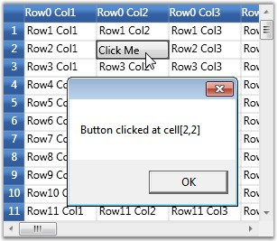

::: {style="DISPLAY: none"}
{#d2h_url_template}{#d2h_package_url style="WIDTH: 0px; DISPLAY: none; HEIGHT: 0px"}
:::

::: {.d2h_secondary_topic style="PADDING-BOTTOM: 10pt; MARGIN: 0pt; PADDING-LEFT: 0pt; PADDING-RIGHT: 0pt; PADDING-TOP: 0pt"}
#### CellButtonClick {#cellbuttonclick style="tab-stops: 0pt"}

[]{#p233}This event is triggered when a cell button is clicked. It receives an argument of type GridCellButtonClickEventArgs, which helps display the row and column indices of the cell whose button is clicked. For example: If the cell button clicked is placed in the second row and second column, the display message will be- "Button clicked at cell \[2,2\]".

**[]{style="COLOR: #15428b"}** 

Example

 

This event can be triggered using the following code:

[]{style="COLOR: #15428b"} 

+---------------------------------------------------------------------------------------------------------------------------------------------------------------------------+
| [\[C#\]]{style="FONT-FAMILY: 'Courier New'; COLOR: black"}                                                                                                                |
|                                                                                                                                                                           |
| **[]{style="FONT-FAMILY: 'Courier New'; COLOR: black"}**                                                                                                                  |
|                                                                                                                                                                           |
| [grid.CellButtonClick += [new]{style="COLOR: blue"} [GridCellButtonClickEventHandler]{style="COLOR: #2b91af"}(grid_CellButtonClick);]{style="FONT-FAMILY: 'Courier New'"} |
+---------------------------------------------------------------------------------------------------------------------------------------------------------------------------+

[]{style="COLOR: #15428b"} 

Event Handler

**[]{style="COLOR: #15428b"}** 

The following event handler sets up new data for clipboard paste.

**[]{style="COLOR: #15428b"}** 

+----------------------------------------------------------------------------------------------------------------------------------------------------------------------------------------------------------------------+
| [\[C#\]]{style="FONT-FAMILY: 'Courier New'; COLOR: black"}                                                                                                                                                           |
|                                                                                                                                                                                                                      |
| []{style="FONT-FAMILY: 'Courier New'"}                                                                                                                                                                               |
|                                                                                                                                                                                                                      |
| [void]{style="FONT-FAMILY: 'Courier New'; COLOR: blue"}[ grid_CellButtonClick([object]{style="COLOR: blue"} sender, GridCellButtonClickEventArgs e)]{style="FONT-FAMILY: 'Courier New'"}                             |
|                                                                                                                                                                                                                      |
| [{]{style="FONT-FAMILY: 'Courier New'"}                                                                                                                                                                              |
|                                                                                                                                                                                                                      |
| [    MessageBox.Show([\"Button clicked at cell\[\"]{style="COLOR: #a31515"} + e.RowIndex + [\",\"]{style="COLOR: #a31515"} + e.ColumnIndex + [\"\]\"]{style="COLOR: #a31515"});]{style="FONT-FAMILY: 'Courier New'"} |
|                                                                                                                                                                                                                      |
| [}]{style="FONT-FAMILY: 'Courier New'"}                                                                                                                                                                              |
+----------------------------------------------------------------------------------------------------------------------------------------------------------------------------------------------------------------------+

[]{style="COLOR: #15428b"} 

Output

**[]{style="COLOR: #15428b"}** 

The following output is generated using the code above.

[]{style="COLOR: #15428b"} 

{border="0"}

Figure 99: CellButtonClick

 

 

[]{#related-topics}
:::
