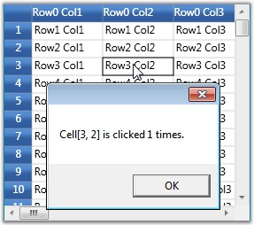

::: {style="DISPLAY: none"}
{#d2h_url_template}{#d2h_package_url style="WIDTH: 0px; DISPLAY: none; HEIGHT: 0px"}
:::

::: {.d2h_secondary_topic style="PADDING-BOTTOM: 10pt; MARGIN: 0pt; PADDING-LEFT: 0pt; PADDING-RIGHT: 0pt; PADDING-TOP: 0pt"}
#### CellClick {#cellclick style="tab-stops: 0pt"}

[]{style="FONT-FAMILY: 'Trebuchet MS','sans-serif'; COLOR: #15428b; FONT-SIZE: 9pt"} 

This event is triggered when a cell is clicked. It receives an argument of type GridCellClickEventArgs  which helps display the row and column indices of the cell that is clicked with its click count. For example: If the cell clicked is placed in the third row and second column and clicked once, the display message will be- "Cell \[3,2\] is clicked 1 times".

[]{style="FONT-FAMILY: 'Trebuchet MS','sans-serif'; COLOR: #15428b; FONT-SIZE: 9pt"} 

Example

**[]{style="FONT-FAMILY: 'Trebuchet MS','sans-serif'; COLOR: #15428b; FONT-SIZE: 9pt"}** 

This event can be triggered using the following code:

[]{style="FONT-FAMILY: 'Trebuchet MS','sans-serif'; COLOR: #15428b; FONT-SIZE: 9pt"} 

+---------------------------------------------------------------------------------------------------------------------------------------------------------+
| **[\[C#\]]{style="FONT-FAMILY: 'Courier New'; COLOR: black"}**                                                                                          |
|                                                                                                                                                         |
| **[]{style="FONT-FAMILY: 'Courier New'; COLOR: black"}**                                                                                                |
|                                                                                                                                                         |
| [grid.CellClick += [new]{style="COLOR: blue"} [GridCellClickEventHandler]{style="COLOR: #2b91af"}(grid_CellClick);]{style="FONT-FAMILY: 'Courier New'"} |
+---------------------------------------------------------------------------------------------------------------------------------------------------------+

[]{style="FONT-FAMILY: 'Trebuchet MS','sans-serif'; COLOR: #15428b; FONT-SIZE: 9pt"} 

Event Handler

**[]{style="FONT-FAMILY: 'Trebuchet MS','sans-serif'; COLOR: #15428b; FONT-SIZE: 9pt"}** 

+------------------------------------------------------------------------------------------------------------------------------------------------------------------------------------------------------------------------------------------------------------------------+
| **[\[C#\]]{style="FONT-FAMILY: 'Courier New'; COLOR: black"}**                                                                                                                                                                                                         |
|                                                                                                                                                                                                                                                                        |
| []{style="FONT-FAMILY: 'Courier New'"}                                                                                                                                                                                                                                 |
|                                                                                                                                                                                                                                                                        |
| [void]{style="FONT-FAMILY: 'Courier New'; COLOR: blue"}[ grid_CellClick([object]{style="COLOR: blue"} sender, GridCellClickEventArgs e)]{style="FONT-FAMILY: 'Courier New'"}                                                                                           |
|                                                                                                                                                                                                                                                                        |
| [{]{style="FONT-FAMILY: 'Courier New'"}                                                                                                                                                                                                                                |
|                                                                                                                                                                                                                                                                        |
| [    MessageBox.Show([\"Cell\[\"]{style="COLOR: #a31515"} + e.RowIndex + [\", \"]{style="COLOR: #a31515"} + e.ColumnIndex + [\"\] is clicked \"]{style="COLOR: #a31515"} + e.ClickCount + [\" times.\"]{style="COLOR: #a31515"});]{style="FONT-FAMILY: 'Courier New'"} |
|                                                                                                                                                                                                                                                                        |
| [}]{style="FONT-FAMILY: 'Courier New'"}                                                                                                                                                                                                                                |
+------------------------------------------------------------------------------------------------------------------------------------------------------------------------------------------------------------------------------------------------------------------------+

[]{style="FONT-FAMILY: 'Trebuchet MS','sans-serif'; COLOR: #15428b; FONT-SIZE: 9pt"} 

Output

**[]{style="FONT-FAMILY: 'Trebuchet MS','sans-serif'; COLOR: #15428b; FONT-SIZE: 9pt"}** 

The following output is generated using the code above.

[]{style="FONT-FAMILY: 'Trebuchet MS','sans-serif'; COLOR: #15428b; FONT-SIZE: 9pt"} 

{border="0"}

 

Figure 85: CellClick

[]{#p209} 

 

[]{#related-topics}
:::
