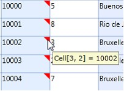
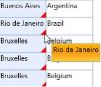
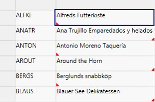

::: {style="DISPLAY: none"}
{#d2h_url_template}{#d2h_package_url style="WIDTH: 0px; DISPLAY: none; HEIGHT: 0px"}
:::

:::: {.d2h_secondary_topic style="PADDING-BOTTOM: 10pt; MARGIN: 0pt; PADDING-LEFT: 0pt; PADDING-RIGHT: 0pt; PADDING-TOP: 0pt"}
#### Cell Comments {#cell-comments style="tab-stops: 0pt"}

[]{style="FONT-FAMILY: 'Trebuchet MS','sans-serif'; BACKGROUND: white; COLOR: #15428b; FONT-SIZE: 9pt"} 

[Essential Grid provides support to associate individual cells with ]{style="BACKGROUND: white"}**Cell Comments**. **Comments** are notes used to provide context to your data in grid cells. They are used to display information about a cell or range of cells. Text in the comments can be in placed as rich text format to emphasize a comment for a cell. [You can place any kind of content---such as text, image, or any control---into the ]{style="BACKGROUND: white"}comment host.

**[]{style="FONT-FAMILY: 'Trebuchet MS','sans-serif'; COLOR: #15428b; FONT-SIZE: 9pt"}** 

Comment Options

**[]{style="FONT-FAMILY: 'Trebuchet MS','sans-serif'; COLOR: #15428b; FONT-SIZE: 9pt"}** 

There are two options to set a Comment for the cells:

[]{style="FONT-FAMILY: 'Trebuchet MS','sans-serif'; COLOR: #15428b; FONT-SIZE: 9pt"} 

1.   Comment Property

2.   CommentTemplateKey Property.

**[]{style="FONT-FAMILY: 'Trebuchet MS','sans-serif'; COLOR: #15428b; FONT-SIZE: 9pt"}** 

Comment Property

**[]{style="FONT-FAMILY: 'Trebuchet MS','sans-serif'; COLOR: #15428b; FONT-SIZE: 9pt"}** 

**Comment** is a string type property. This property is used to display the default **Data Template** for the comment text.

The following code illustrates this.

[]{style="FONT-FAMILY: 'Trebuchet MS','sans-serif'; COLOR: #15428b; FONT-SIZE: 9pt"} 

+-------------------------------------------------------------------------------------------------------------+
| **[\[C#\]]{style="FONT-FAMILY: 'Calibri','sans-serif'; COLOR: black; FONT-SIZE: 12pt"}**                    |
|                                                                                                             |
| [                style.Comment = style.Text;]{style="FONT-FAMILY: 'Calibri','sans-serif'; FONT-SIZE: 12pt"} |
+-------------------------------------------------------------------------------------------------------------+

**[]{style="FONT-FAMILY: 'Calibri','sans-serif'; COLOR: black; FONT-SIZE: 12pt"}** 

When the code runs, the following output displays.

**[]{style="FONT-FAMILY: 'Calibri','sans-serif'; COLOR: black; FONT-SIZE: 12pt"}** 

**[]{style="FONT-FAMILY: 'Calibri','sans-serif'; COLOR: black; FONT-SIZE: 12pt"}** 

{border="0"}

 

Figure 68: Comment Property

**[]{style="FONT-FAMILY: 'Calibri','sans-serif'; COLOR: #0099ff; FONT-SIZE: 13pt"}** 

CommentTemplateKey Property

**[]{style="FONT-FAMILY: 'Trebuchet MS','sans-serif'; COLOR: #15428b; FONT-SIZE: 9pt"}** 

Grid exposes a style property named **CommentTemplateKey** used for generating Comment. This is used to define the style content to be displayed in the comment. Users can define this template in **XAML** and assign its name to the **style.CommentTemplateKey** property.

Display a customized text block in the comment host, by using the following code.

[]{style="FONT-FAMILY: 'Trebuchet MS','sans-serif'; COLOR: #15428b; FONT-SIZE: 9pt"} 

1.   Define a Template for Comments.

[]{style="FONT-FAMILY: 'Trebuchet MS','sans-serif'; COLOR: #15428b; FONT-SIZE: 9pt"} 

+-------------------------------------------------------------------------------------------------------------------------------------------------------------------------------------------------------------------------------------------------------------------------------------------------------------------------------------------------------------------------------------------------------------------------------------------------------------------------------------------------------------------------------------------------------------------------------------------------------------------------------------------------------------------------------------------------------------------------------------------------------------------------------------------------------------------------------------------------------+
| **[\[XAML\]]{style="FONT-FAMILY: 'Courier New'; COLOR: #333333"}**                                                                                                                                                                                                                                                                                                                                                                                                                                                                                                                                                                                                                                                                                                                                                                                    |
|                                                                                                                                                                                                                                                                                                                                                                                                                                                                                                                                                                                                                                                                                                                                                                                                                                                       |
| **[]{style="FONT-FAMILY: 'Courier New'; COLOR: #333333"}**                                                                                                                                                                                                                                                                                                                                                                                                                                                                                                                                                                                                                                                                                                                                                                                            |
|                                                                                                                                                                                                                                                                                                                                                                                                                                                                                                                                                                                                                                                                                                                                                                                                                                                       |
| [\<]{style="FONT-FAMILY: 'Courier New'; COLOR: blue"}[DataTemplate]{style="FONT-FAMILY: 'Courier New'; COLOR: #a31515"}[ x]{style="FONT-FAMILY: 'Courier New'; COLOR: red"}[:]{style="FONT-FAMILY: 'Courier New'; COLOR: blue"}[Key]{style="FONT-FAMILY: 'Courier New'; COLOR: red"}[=\"tooltip\"\>]{style="FONT-FAMILY: 'Courier New'; COLOR: blue"}                                                                                                                                                                                                                                                                                                                                                                                                                                                                                                 |
|                                                                                                                                                                                                                                                                                                                                                                                                                                                                                                                                                                                                                                                                                                                                                                                                                                                       |
| [        ]{style="FONT-FAMILY: 'Courier New'; COLOR: #a31515"}[\<]{style="FONT-FAMILY: 'Courier New'; COLOR: blue"}[Border]{style="FONT-FAMILY: 'Courier New'; COLOR: #a31515"}[    [ Background]{style="COLOR: red"}[=\"{]{style="COLOR: blue"}[StaticResource]{style="COLOR: #a31515"}[ BackBrush]{style="COLOR: red"}[}\"]{style="COLOR: blue"}]{style="FONT-FAMILY: 'Courier New'"}                                                                                                                                                                                                                                                                                                                                                                                                                                                               |
|                                                                                                                                                                                                                                                                                                                                                                                                                                                                                                                                                                                                                                                                                                                                                                                                                                                       |
| [                       [ BorderBrush]{style="COLOR: red"}[=\"{]{style="COLOR: blue"}[StaticResource]{style="COLOR: #a31515"}[ SolidBorderBrush]{style="COLOR: red"}[}\"]{style="COLOR: blue"}]{style="FONT-FAMILY: 'Courier New'"}                                                                                                                                                                                                                                                                                                                                                                                                                                                                                                                                                                                                                   |
|                                                                                                                                                                                                                                                                                                                                                                                                                                                                                                                                                                                                                                                                                                                                                                                                                                                       |
| [           [ Name]{style="COLOR: red"}[=\"Border\"]{style="COLOR: blue"}     ]{style="FONT-FAMILY: 'Courier New'"}                                                                                                                                                                                                                                                                                                                                                                                                                                                                                                                                                                                                                                                                                                                                   |
|                                                                                                                                                                                                                                                                                                                                                                                                                                                                                                                                                                                                                                                                                                                                                                                                                                                       |
| [           [ BorderThickness]{style="COLOR: red"}[=\"1\"]{style="COLOR: blue"} ]{style="FONT-FAMILY: 'Courier New'"}                                                                                                                                                                                                                                                                                                                                                                                                                                                                                                                                                                                                                                                                                                                                 |
|                                                                                                                                                                                                                                                                                                                                                                                                                                                                                                                                                                                                                                                                                                                                                                                                                                                       |
| [           [ \>]{style="COLOR: blue"}]{style="FONT-FAMILY: 'Courier New'"}                                                                                                                                                                                                                                                                                                                                                                                                                                                                                                                                                                                                                                                                                                                                                                           |
|                                                                                                                                                                                                                                                                                                                                                                                                                                                                                                                                                                                                                                                                                                                                                                                                                                                       |
| [            ]{style="FONT-FAMILY: 'Courier New'; COLOR: #a31515"}[\<]{style="FONT-FAMILY: 'Courier New'; COLOR: blue"}[TextBlock]{style="FONT-FAMILY: 'Courier New'; COLOR: #a31515"}[ Text]{style="FONT-FAMILY: 'Courier New'; COLOR: red"}[=\"{]{style="FONT-FAMILY: 'Courier New'; COLOR: blue"}[Binding]{style="FONT-FAMILY: 'Courier New'; COLOR: #a31515"}[ Path]{style="FONT-FAMILY: 'Courier New'; COLOR: red"}[=CellValue}\"]{style="FONT-FAMILY: 'Courier New'; COLOR: blue"}[ Padding]{style="FONT-FAMILY: 'Courier New'; COLOR: red"}[=\"2\"]{style="FONT-FAMILY: 'Courier New'; COLOR: blue"}[ Height]{style="FONT-FAMILY: 'Courier New'; COLOR: red"}[=\"30\"]{style="FONT-FAMILY: 'Courier New'; COLOR: blue"}[ Width]{style="FONT-FAMILY: 'Courier New'; COLOR: red"}[=\"Auto\"/\>]{style="FONT-FAMILY: 'Courier New'; COLOR: blue"} |
|                                                                                                                                                                                                                                                                                                                                                                                                                                                                                                                                                                                                                                                                                                                                                                                                                                                       |
| [        ]{style="FONT-FAMILY: 'Courier New'; COLOR: #a31515"}[\</]{style="FONT-FAMILY: 'Courier New'; COLOR: blue"}[Border]{style="FONT-FAMILY: 'Courier New'; COLOR: #a31515"}[\>]{style="FONT-FAMILY: 'Courier New'; COLOR: blue"}                                                                                                                                                                                                                                                                                                                                                                                                                                                                                                                                                                                                                 |
|                                                                                                                                                                                                                                                                                                                                                                                                                                                                                                                                                                                                                                                                                                                                                                                                                                                       |
| [\</]{style="FONT-FAMILY: 'Courier New'; COLOR: blue"}[DataTemplate]{style="FONT-FAMILY: 'Courier New'; COLOR: #a31515"}[\>]{style="FONT-FAMILY: 'Courier New'; COLOR: blue"}                                                                                                                                                                                                                                                                                                                                                                                                                                                                                                                                                                                                                                                                         |
+-------------------------------------------------------------------------------------------------------------------------------------------------------------------------------------------------------------------------------------------------------------------------------------------------------------------------------------------------------------------------------------------------------------------------------------------------------------------------------------------------------------------------------------------------------------------------------------------------------------------------------------------------------------------------------------------------------------------------------------------------------------------------------------------------------------------------------------------------------+

**[]{style="FONT-FAMILY: 'Calibri','sans-serif'; COLOR: #333333; FONT-SIZE: 12pt"}** 

2.   Associating the above template with the Grid Cell.

[]{style="FONT-FAMILY: 'Trebuchet MS','sans-serif'; COLOR: #15428b; FONT-SIZE: 9pt"} 

[]{style="FONT-FAMILY: 'Trebuchet MS','sans-serif'; COLOR: #15428b; FONT-SIZE: 9pt"} 

+---------------------------------------------------------------------------------------------------------------------------------------------------------------------------------------------------------+
| **[\[C#\]]{style="FONT-FAMILY: 'Courier New'; COLOR: black"}**                                                                                                                                          |
|                                                                                                                                                                                                         |
| **[]{style="FONT-FAMILY: 'Courier New'; COLOR: black"}**                                                                                                                                                |
|                                                                                                                                                                                                         |
| [var style = model\[1, 2\];]{style="FONT-FAMILY: 'Courier New'; COLOR: black"}                                                                                                                          |
|                                                                                                                                                                                                         |
| []{style="FONT-FAMILY: 'Courier New'; COLOR: black"}                                                                                                                                                    |
|                                                                                                                                                                                                         |
| [style.CellValue = customer.ContactName;]{style="FONT-FAMILY: 'Courier New'; COLOR: black"}                                                                                                             |
|                                                                                                                                                                                                         |
| []{style="FONT-FAMILY: 'Courier New'; COLOR: black"}                                                                                                                                                    |
|                                                                                                                                                                                                         |
| [var cust = customer.Orders.Select(o =\> o.OrderDetails.Select(od =\> od.Products).Select(p =\> p.Categories)).ToList();]{style="FONT-FAMILY: 'Courier New'; COLOR: black"}                             |
|                                                                                                                                                                                                         |
| []{style="FONT-FAMILY: 'Courier New'; COLOR: black"}                                                                                                                                                    |
|                                                                                                                                                                                                         |
| [var finalList = cust.Select(c =\> new]{style="FONT-FAMILY: 'Courier New'; COLOR: black"}                                                                                                               |
|                                                                                                                                                                                                         |
| []{style="FONT-FAMILY: 'Courier New'; COLOR: black"}                                                                                                                                                    |
|                                                                                                                                                                                                         |
| [{]{style="FONT-FAMILY: 'Courier New'; COLOR: black"}                                                                                                                                                   |
|                                                                                                                                                                                                         |
| []{style="FONT-FAMILY: 'Courier New'; COLOR: black"}                                                                                                                                                    |
|                                                                                                                                                                                                         |
| [    Count = c.Count(),]{style="FONT-FAMILY: 'Courier New'; COLOR: black"}                                                                                                                              |
|                                                                                                                                                                                                         |
| []{style="FONT-FAMILY: 'Courier New'; COLOR: black"}                                                                                                                                                    |
|                                                                                                                                                                                                         |
| [    Categories = c]{style="FONT-FAMILY: 'Courier New'; COLOR: black"}                                                                                                                                  |
|                                                                                                                                                                                                         |
| []{style="FONT-FAMILY: 'Courier New'; COLOR: black"}                                                                                                                                                    |
|                                                                                                                                                                                                         |
| [}).ToList();]{style="FONT-FAMILY: 'Courier New'; COLOR: black"}                                                                                                                                        |
|                                                                                                                                                                                                         |
| []{style="FONT-FAMILY: 'Courier New'; COLOR: black"}                                                                                                                                                    |
|                                                                                                                                                                                                         |
| [style.ItemsSource = finalList;]{style="FONT-FAMILY: 'Courier New'; COLOR: black"}                                                                                                                      |
|                                                                                                                                                                                                         |
| []{style="FONT-FAMILY: 'Courier New'; COLOR: black"}                                                                                                                                                    |
|                                                                                                                                                                                                         |
| []{style="FONT-FAMILY: 'Courier New'; COLOR: black"}                                                                                                                                                    |
|                                                                                                                                                                                                         |
| [// Assign template.]{style="FONT-FAMILY: 'Courier New'; COLOR: black"}                                                                                                                                 |
|                                                                                                                                                                                                         |
| []{style="FONT-FAMILY: 'Courier New'; COLOR: black"}                                                                                                                                                    |
|                                                                                                                                                                                                         |
| [style.CommentTemplateKey = \"]{style="FONT-FAMILY: 'Courier New'; COLOR: black"}[ tooltip]{style="FONT-FAMILY: 'Courier New'; COLOR: #333333"}[ \";]{style="FONT-FAMILY: 'Courier New'; COLOR: black"} |
+---------------------------------------------------------------------------------------------------------------------------------------------------------------------------------------------------------+

[]{style="FONT-FAMILY: 'Calibri','sans-serif'; COLOR: black; FONT-SIZE: 12pt"} 

When the code runs, the following output displays.

[]{style="FONT-FAMILY: 'Trebuchet MS','sans-serif'; COLOR: #15428b; FONT-SIZE: 9pt"} 

**[]{style="FONT-FAMILY: 'Calibri','sans-serif'; COLOR: black; FONT-SIZE: 12pt"}** 

{border="0"}

Figure 69: Customized Comment

**[]{style="FONT-FAMILY: 'Trebuchet MS','sans-serif'; COLOR: #15428b; FONT-SIZE: 9pt"}** 

**[]{style="FONT-FAMILY: 'Trebuchet MS','sans-serif'; COLOR: #15428b; FONT-SIZE: 9pt"}** 

CommentAlignment

**[]{style="FONT-FAMILY: 'Trebuchet MS','sans-serif'; COLOR: #15428b; FONT-SIZE: 9pt"}** 

Users can align comments position using **CommentAlignment** property.

Alignment Options:

[]{style="FONT-FAMILY: 'Trebuchet MS','sans-serif'; COLOR: #15428b; FONT-SIZE: 9pt"} 

[·      ]{style="FONT-FAMILY: Symbol"}Top-left

[·      ]{style="FONT-FAMILY: Symbol"}Top-right

[·      ]{style="FONT-FAMILY: Symbol"}Bottom-left

[·      ]{style="FONT-FAMILY: Symbol"}Bottom-right corners.

[]{style="FONT-FAMILY: 'Trebuchet MS','sans-serif'; COLOR: #15428b; FONT-SIZE: 9pt"} 

[]{style="FONT-FAMILY: 'Trebuchet MS','sans-serif'; COLOR: #15428b; FONT-SIZE: 9pt"} 

Align the comment, by using the following code.

::: {style="BORDER-BOTTOM: windowtext 1pt solid; BORDER-LEFT: medium none; PADDING-BOTTOM: 1pt; MARGIN-TOP: 9pt; PADDING-LEFT: 0pt; PADDING-RIGHT: 0pt; MARGIN-BOTTOM: 9pt; BORDER-TOP: windowtext 1pt solid; BORDER-RIGHT: medium none; PADDING-TOP: 1pt"}
          {border="0"}Note: cell comment is aligned to the bottom left.
:::

[]{style="FONT-FAMILY: 'Trebuchet MS','sans-serif'; COLOR: #15428b; FONT-SIZE: 9pt"} 

+------------------------------------------------------------------------------------------------------------+
| **[\[C#\]]{style="FONT-FAMILY: 'Courier New'; COLOR: black"}**                                             |
|                                                                                                            |
| []{style="FONT-FAMILY: 'Courier New'; COLOR: black"}                                                       |
|                                                                                                            |
| [style.CommentAlignment = CommentAlignment.Bottom-Left;]{style="FONT-FAMILY: 'Courier New'; COLOR: black"} |
+------------------------------------------------------------------------------------------------------------+

[]{style="FONT-FAMILY: 'Calibri','sans-serif'; COLOR: black; FONT-SIZE: 12pt"} 

[]{style="FONT-FAMILY: 'Calibri','sans-serif'; COLOR: black; FONT-SIZE: 12pt"} 

+-----------------------------------------------------------------------------------------------------------+
| **[\[VB\]]{style="FONT-FAMILY: 'Courier New'; COLOR: black"}**                                            |
|                                                                                                           |
| []{style="FONT-FAMILY: 'Courier New'; COLOR: black"}                                                      |
|                                                                                                           |
| [style.CommentAlignment = CommentAlignment.Bottom-Left]{style="FONT-FAMILY: 'Courier New'; COLOR: black"} |
+-----------------------------------------------------------------------------------------------------------+

**[]{style="FONT-FAMILY: 'Calibri','sans-serif'; COLOR: black; FONT-SIZE: 12pt"}** 

When the code runs, the following output displays.

[]{style="FONT-FAMILY: 'Trebuchet MS','sans-serif'; COLOR: #15428b; FONT-SIZE: 9pt"} 

[]{style="FONT-FAMILY: 'Trebuchet MS','sans-serif'; COLOR: #15428b; FONT-SIZE: 9pt"} 

{border="0"}

 

Figure 70: Comment Alignment

[]{#p193} 

[]{#related-topics}
::::
