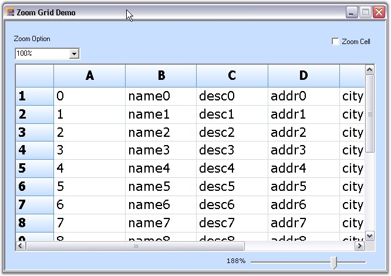
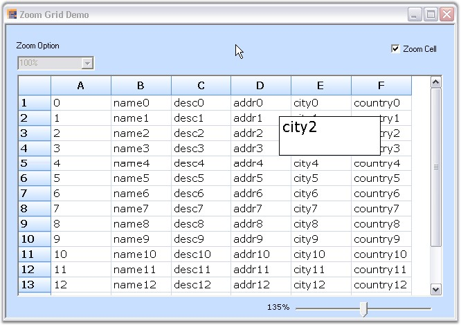

::: {style="DISPLAY: none"}
{#d2h_url_template}{#d2h_package_url style="WIDTH: 0px; DISPLAY: none; HEIGHT: 0px"}
:::

::::: {.d2h_secondary_topic style="PADDING-BOTTOM: 10pt; MARGIN: 0pt; PADDING-LEFT: 0pt; PADDING-RIGHT: 0pt; PADDING-TOP: 0pt"}
##### Cell-level and grid-level {#cell-level-and-grid-level style="tab-stops: 0pt"}

[]{style="FONT-FAMILY: 'Trebuchet MS','sans-serif'; COLOR: #15428b; FONT-SIZE: 9pt"} 

We can implement zooming functionality in Essential Grid to show a magnified image of the Grid for better visualization. A method named ZoomGrid is used for this purpose. It accepts the percentage of zoom as the parameter and then uses this value to set the font size and cell size for the grid.  Zooming can be implemented at cell-level and at grid-level.

[]{style="FONT-FAMILY: 'Trebuchet MS','sans-serif'; COLOR: #15428b; FONT-SIZE: 9pt"} 

The preceding screen shot shows a grid that is zoomed to the grid-level.

[]{style="FONT-FAMILY: 'Trebuchet MS','sans-serif'; COLOR: #15428b; FONT-SIZE: 9pt"} 

{border="0"}

[]{style="FONT-FAMILY: 'Trebuchet MS','sans-serif'; COLOR: #15428b; FONT-SIZE: 9pt"} 

*[Figure ]{style="FONT-SIZE: 9pt"}[196]{style="FONT-SIZE: 9pt"}[: Grid zoomed at Grid Level]{style="FONT-SIZE: 9pt"}*

[]{style="FONT-FAMILY: 'Trebuchet MS','sans-serif'; COLOR: #15428b; FONT-SIZE: 9pt"} 

The preceding screen shot shows a grid that is zoomed to the cell-level.

 

{border="0"}

***[]{style="FONT-FAMILY: 'Trebuchet MS','sans-serif'; COLOR: #15428b; FONT-SIZE: 9pt"}*** 

*[Figure ]{style="FONT-SIZE: 9pt"}[197]{style="FONT-SIZE: 9pt"}[: Grid zoomed at Cell Level]{style="FONT-SIZE: 9pt"}*

[]{style="FONT-FAMILY: 'Trebuchet MS','sans-serif'; COLOR: #15428b; FONT-SIZE: 9pt"} 

Example

**[]{style="FONT-FAMILY: 'Trebuchet MS','sans-serif'; COLOR: #15428b; FONT-SIZE: 9pt"}** 

This example implements zooming functionality for Essential Grid at cell-level.

Follow the steps listed below:

[]{style="FONT-FAMILY: 'Trebuchet MS','sans-serif'; COLOR: #15428b; FONT-SIZE: 9pt"} 

1.   Call the **ZoomGrid** method by passing the percentage of zoom as the parameter. The below code illustrates this.

[]{style="FONT-FAMILY: 'Trebuchet MS','sans-serif'; COLOR: #15428b; FONT-SIZE: 9pt"} 

+-----------------------------------------------------------------------------------------------------------------------------------------------------------------------------+
| **[\[C#\]]{style="FONT-FAMILY: 'Courier New'; COLOR: black"}**                                                                                                              |
|                                                                                                                                                                             |
| []{style="FONT-FAMILY: 'Courier New'; COLOR: black"}                                                                                                                        |
|                                                                                                                                                                             |
| [private]{style="FONT-FAMILY: 'Courier New'; COLOR: blue"}[ [void]{style="COLOR: blue"} zoomGrid([float]{style="COLOR: blue"} percent)]{style="FONT-FAMILY: 'Courier New'"} |
|                                                                                                                                                                             |
| [{]{style="FONT-FAMILY: 'Courier New'"}                                                                                                                                     |
|                                                                                                                                                                             |
| [    [this]{style="COLOR: blue"}.gridControl1.BeginUpdate();]{style="FONT-FAMILY: 'Courier New'"}                                                                           |
|                                                                                                                                                                             |
| [    currentPercent = percent;]{style="FONT-FAMILY: 'Courier New'"}                                                                                                         |
|                                                                                                                                                                             |
| [    [for]{style="COLOR: blue"} ([int]{style="COLOR: blue"} i = 0; i \<= gridControl1.ColCount; i++)]{style="FONT-FAMILY: 'Courier New'"}                                   |
|                                                                                                                                                                             |
| [    {]{style="FONT-FAMILY: 'Courier New'"}                                                                                                                                 |
|                                                                                                                                                                             |
| [        [for]{style="COLOR: blue"} ([int]{style="COLOR: blue"} j = 0; j \<= gridControl1.RowCount; j++)]{style="FONT-FAMILY: 'Courier New'"}                               |
|                                                                                                                                                                             |
| [        [this]{style="COLOR: blue"}.gridControl1\[j, i\].Font.Size = fontSize \* currentPercent;]{style="FONT-FAMILY: 'Courier New'"}                                      |
|                                                                                                                                                                             |
| [        [this]{style="COLOR: blue"}.gridControl1.Model.ColWidths\[i\] = ([int]{style="COLOR: blue"})(percent \* defColWidth);]{style="FONT-FAMILY: 'Courier New'"}         |
|                                                                                                                                                                             |
| [    }]{style="FONT-FAMILY: 'Courier New'"}                                                                                                                                 |
|                                                                                                                                                                             |
| []{style="FONT-FAMILY: 'Courier New'"}                                                                                                                                      |
|                                                                                                                                                                             |
| [    [this]{style="COLOR: blue"}.gridControl1.ColWidths\[0\] = ([int]{style="COLOR: blue"})(percent \* headerColWd);]{style="FONT-FAMILY: 'Courier New'"}                   |
|                                                                                                                                                                             |
| [    [this]{style="COLOR: blue"}.gridControl1.DefaultColWidth = ([int]{style="COLOR: blue"})(percent \* defColWidth);]{style="FONT-FAMILY: 'Courier New'"}                  |
|                                                                                                                                                                             |
| [    [this]{style="COLOR: blue"}.gridControl1.DefaultRowHeight = ([int]{style="COLOR: blue"})(percent \* defRowHeight);]{style="FONT-FAMILY: 'Courier New'"}                |
|                                                                                                                                                                             |
| [    [this]{style="COLOR: blue"}.gridControl1.RowHeights\[0\] = ([int]{style="COLOR: blue"})(percent \* headerRowHt);]{style="FONT-FAMILY: 'Courier New'"}                  |
|                                                                                                                                                                             |
| [    [this]{style="COLOR: blue"}.gridControl1.EndUpdate();]{style="FONT-FAMILY: 'Courier New'"}                                                                             |
|                                                                                                                                                                             |
| [    [this]{style="COLOR: blue"}.gridControl1.Refresh();]{style="FONT-FAMILY: 'Courier New'"}                                                                               |
|                                                                                                                                                                             |
| [}]{style="FONT-FAMILY: 'Courier New'"}                                                                                                                                     |
+-----------------------------------------------------------------------------------------------------------------------------------------------------------------------------+

[]{style="FONT-FAMILY: 'Trebuchet MS','sans-serif'; COLOR: #15428b; FONT-SIZE: 9pt"} 

+------------------------------------------------------------------------------------------------------------------------------------------------------------------------------------------------------------------------------------+
| **[\[VB.NET\]]{style="FONT-FAMILY: 'Courier New'; COLOR: black"}**                                                                                                                                                                 |
|                                                                                                                                                                                                                                    |
| []{style="FONT-FAMILY: 'Courier New'; COLOR: black"}                                                                                                                                                                               |
|                                                                                                                                                                                                                                    |
| [Private]{style="FONT-FAMILY: 'Courier New'; COLOR: blue"}[ [Sub]{style="COLOR: blue"} zoomGrid([ByVal]{style="COLOR: blue"} percent [As]{style="COLOR: blue"} [Single]{style="COLOR: blue"})]{style="FONT-FAMILY: 'Courier New'"} |
|                                                                                                                                                                                                                                    |
| [    [Me]{style="COLOR: blue"}.label1.Text = [Me]{style="COLOR: blue"}.trackBar1.Value.ToString() & [\"%\"]{style="COLOR: #a31515"}]{style="FONT-FAMILY: 'Courier New'"}                                                           |
|                                                                                                                                                                                                                                    |
| [    [Me]{style="COLOR: blue"}.label1.Refresh()]{style="FONT-FAMILY: 'Courier New'"}                                                                                                                                               |
|                                                                                                                                                                                                                                    |
| []{style="FONT-FAMILY: 'Courier New'"}                                                                                                                                                                                             |
|                                                                                                                                                                                                                                    |
| [    [Me]{style="COLOR: blue"}.gridControl1.BeginUpdate()]{style="FONT-FAMILY: 'Courier New'"}                                                                                                                                     |
|                                                                                                                                                                                                                                    |
| [    currentPercent = percent]{style="FONT-FAMILY: 'Courier New'"}                                                                                                                                                                 |
|                                                                                                                                                                                                                                    |
| [    [For]{style="COLOR: blue"} i [As]{style="COLOR: blue"} [Integer]{style="COLOR: blue"} = 0 [To]{style="COLOR: blue"} gridControl1.ColCount]{style="FONT-FAMILY: 'Courier New'"}                                                |
|                                                                                                                                                                                                                                    |
| [        [For]{style="COLOR: blue"} j [As]{style="COLOR: blue"} [Integer]{style="COLOR: blue"} = 0 [To]{style="COLOR: blue"} gridControl1.RowCount]{style="FONT-FAMILY: 'Courier New'"}                                            |
|                                                                                                                                                                                                                                    |
| [            [Me]{style="COLOR: blue"}.gridControl1(j, i).Font.Size = fontSize \* currentPercent]{style="FONT-FAMILY: 'Courier New'"}                                                                                              |
|                                                                                                                                                                                                                                    |
| [        [Next]{style="COLOR: blue"} j]{style="FONT-FAMILY: 'Courier New'"}                                                                                                                                                        |
|                                                                                                                                                                                                                                    |
| [        [Me]{style="COLOR: blue"}.gridControl1.Model.ColWidths(i) = [CInt]{style="COLOR: blue"}(Fix(percent \* defColWidth))]{style="FONT-FAMILY: 'Courier New'"}                                                                 |
|                                                                                                                                                                                                                                    |
| [    [Next]{style="COLOR: blue"} i]{style="FONT-FAMILY: 'Courier New'"}                                                                                                                                                            |
|                                                                                                                                                                                                                                    |
| []{style="FONT-FAMILY: 'Courier New'"}                                                                                                                                                                                             |
|                                                                                                                                                                                                                                    |
| [    [Me]{style="COLOR: blue"}.gridControl1.ColWidths(0) = [CInt]{style="COLOR: blue"}(Fix(percent \* headerColWd))]{style="FONT-FAMILY: 'Courier New'"}                                                                           |
|                                                                                                                                                                                                                                    |
| [    [Me]{style="COLOR: blue"}.gridControl1.DefaultColWidth = [CInt]{style="COLOR: blue"}(Fix(percent \* defColWidth))]{style="FONT-FAMILY: 'Courier New'"}                                                                        |
|                                                                                                                                                                                                                                    |
| [    [Me]{style="COLOR: blue"}.gridControl1.DefaultRowHeight = [CInt]{style="COLOR: blue"}(Fix(percent \* defRowHeight))]{style="FONT-FAMILY: 'Courier New'"}                                                                      |
|                                                                                                                                                                                                                                    |
| [    [Me]{style="COLOR: blue"}.gridControl1.RowHeights(0) = [CInt]{style="COLOR: blue"}(Fix(percent \* headerRowHt))]{style="FONT-FAMILY: 'Courier New'"}                                                                          |
|                                                                                                                                                                                                                                    |
| [    [Me]{style="COLOR: blue"}.gridControl1.EndUpdate()]{style="FONT-FAMILY: 'Courier New'"}                                                                                                                                       |
|                                                                                                                                                                                                                                    |
| [    [Me]{style="COLOR: blue"}.gridControl1.Refresh()]{style="FONT-FAMILY: 'Courier New'"}                                                                                                                                         |
|                                                                                                                                                                                                                                    |
| [End]{style="FONT-FAMILY: 'Courier New'; COLOR: blue"}[ [Sub]{style="COLOR: blue"}]{style="FONT-FAMILY: 'Courier New'"}                                                                                                            |
+------------------------------------------------------------------------------------------------------------------------------------------------------------------------------------------------------------------------------------+

[]{style="FONT-FAMILY: 'Trebuchet MS','sans-serif'; COLOR: #15428b; FONT-SIZE: 9pt"} 

The preceding code sets the font and cell size using the percent parameter.

[]{style="FONT-FAMILY: 'Trebuchet MS','sans-serif'; COLOR: #15428b; FONT-SIZE: 9pt"} 

2.   When the cell to be zoomed is clicked, handle the CellClick event to display it as a zoomed cell. Here we use a PictureBox to show the magnified view of the cell content.

[]{style="FONT-FAMILY: 'Trebuchet MS','sans-serif'; COLOR: #15428b; FONT-SIZE: 9pt"} 

::: {style="BORDER-BOTTOM: windowtext 1pt solid; BORDER-LEFT: medium none; PADDING-BOTTOM: 1pt; MARGIN-TOP: 9pt; PADDING-LEFT: 0pt; PADDING-RIGHT: 0pt; MARGIN-BOTTOM: 9pt; BORDER-TOP: windowtext 1pt solid; BORDER-RIGHT: medium none; PADDING-TOP: 1pt"}
{border="0"}Note: A PictureBox is a Microsoft's .NET Control used to display an image.

 
:::

+-----------------------------------------------------------------------------------------------------------------------------------------------------------------------------------------------------------------------------------------------------------------------------------------------+
| **[\[C#\]]{style="FONT-FAMILY: 'Courier New'; COLOR: black"}**                                                                                                                                                                                                                                |
|                                                                                                                                                                                                                                                                                               |
| []{style="FONT-FAMILY: 'Courier New'"}                                                                                                                                                                                                                                                        |
|                                                                                                                                                                                                                                                                                               |
| [// Code to show zoom window.]{style="FONT-FAMILY: 'Courier New'; COLOR: green"}                                                                                                                                                                                                              |
|                                                                                                                                                                                                                                                                                               |
| [private]{style="FONT-FAMILY: 'Courier New'; COLOR: blue"}[ System.Windows.Forms.[PictureBox]{style="COLOR: #2b91af"} zoomWindow;]{style="FONT-FAMILY: 'Courier New'"}                                                                                                                        |
|                                                                                                                                                                                                                                                                                               |
| [private]{style="FONT-FAMILY: 'Courier New'; COLOR: blue"}[ [void]{style="COLOR: blue"} gridControl1_CellClick([object]{style="COLOR: blue"} sender, [GridCellClickEventArgs]{style="COLOR: #2b91af"} e)]{style="FONT-FAMILY: 'Courier New'"}                                                 |
|                                                                                                                                                                                                                                                                                               |
| [{]{style="FONT-FAMILY: 'Courier New'"}                                                                                                                                                                                                                                                       |
|                                                                                                                                                                                                                                                                                               |
| [    [if]{style="COLOR: blue"} (e.RowIndex \> 0 && e.ColIndex \> 0)]{style="FONT-FAMILY: 'Courier New'"}                                                                                                                                                                                      |
|                                                                                                                                                                                                                                                                                               |
| [    {]{style="FONT-FAMILY: 'Courier New'"}                                                                                                                                                                                                                                                   |
|                                                                                                                                                                                                                                                                                               |
| [        [if]{style="COLOR: blue"} (checkBox1.Checked)]{style="FONT-FAMILY: 'Courier New'"}                                                                                                                                                                                                   |
|                                                                                                                                                                                                                                                                                               |
| [        {]{style="FONT-FAMILY: 'Courier New'"}                                                                                                                                                                                                                                               |
|                                                                                                                                                                                                                                                                                               |
| [            [if]{style="COLOR: blue"} (!zoomWindow.Visible)]{style="FONT-FAMILY: 'Courier New'"}                                                                                                                                                                                             |
|                                                                                                                                                                                                                                                                                               |
| [            [this]{style="COLOR: blue"}.zoomWindow.Visible = [true]{style="COLOR: blue"};]{style="FONT-FAMILY: 'Courier New'"}                                                                                                                                                               |
|                                                                                                                                                                                                                                                                                               |
| [            [Point]{style="COLOR: #2b91af"} p1 = [new]{style="COLOR: blue"} [Point]{style="COLOR: #2b91af"}(0, 0);]{style="FONT-FAMILY: 'Courier New'"}                                                                                                                                      |
|                                                                                                                                                                                                                                                                                               |
| [            [Size]{style="COLOR: #2b91af"} s = [new]{style="COLOR: blue"} [Size]{style="COLOR: #2b91af"}([this]{style="COLOR: blue"}.gridControl1.ColWidths\[e.ColIndex\] + 10, [this]{style="COLOR: blue"}.gridControl1.RowHeights\[e.RowIndex\] + 5);]{style="FONT-FAMILY: 'Courier New'"} |
|                                                                                                                                                                                                                                                                                               |
| [            s.Width += 50;]{style="FONT-FAMILY: 'Courier New'"}                                                                                                                                                                                                                              |
|                                                                                                                                                                                                                                                                                               |
| [            s.Height += 30;]{style="FONT-FAMILY: 'Courier New'"}                                                                                                                                                                                                                             |
|                                                                                                                                                                                                                                                                                               |
| [            [Rectangle]{style="COLOR: #2b91af"} rect = [new]{style="COLOR: blue"} [Rectangle]{style="COLOR: #2b91af"}(p1, s);]{style="FONT-FAMILY: 'Courier New'"}                                                                                                                           |
|                                                                                                                                                                                                                                                                                               |
| [            zoomWindow.Size = s;]{style="FONT-FAMILY: 'Courier New'"}                                                                                                                                                                                                                        |
|                                                                                                                                                                                                                                                                                               |
| []{style="FONT-FAMILY: 'Courier New'"}                                                                                                                                                                                                                                                        |
|                                                                                                                                                                                                                                                                                               |
| [            [Bitmap]{style="COLOR: #2b91af"} bmp = [new]{style="COLOR: blue"} [Bitmap]{style="COLOR: #2b91af"}(s.Width, s.Height);]{style="FONT-FAMILY: 'Courier New'"}                                                                                                                      |
|                                                                                                                                                                                                                                                                                               |
| [            [Graphics]{style="COLOR: #2b91af"} g = [Graphics]{style="COLOR: #2b91af"}.FromImage(bmp);]{style="FONT-FAMILY: 'Courier New'"}                                                                                                                                                   |
|                                                                                                                                                                                                                                                                                               |
| [            [GridStyleInfo]{style="COLOR: #2b91af"} style = gridControl1\[e.RowIndex, e.ColIndex\];]{style="FONT-FAMILY: 'Courier New'"}                                                                                                                                                     |
|                                                                                                                                                                                                                                                                                               |
| [            [float]{style="COLOR: blue"} size = style.Font.Size;]{style="FONT-FAMILY: 'Courier New'"}                                                                                                                                                                                        |
|                                                                                                                                                                                                                                                                                               |
| [            style.Font.Size = 15.5f;]{style="FONT-FAMILY: 'Courier New'"}                                                                                                                                                                                                                    |
|                                                                                                                                                                                                                                                                                               |
| [            gridControl1.DrawSingleCell(g, e.RowIndex, e.ColIndex, rect, style, [true]{style="COLOR: blue"}, [true]{style="COLOR: blue"});]{style="FONT-FAMILY: 'Courier New'"}                                                                                                              |
|                                                                                                                                                                                                                                                                                               |
| [            g.Dispose();]{style="FONT-FAMILY: 'Courier New'"}                                                                                                                                                                                                                                |
|                                                                                                                                                                                                                                                                                               |
| []{style="FONT-FAMILY: 'Courier New'"}                                                                                                                                                                                                                                                        |
|                                                                                                                                                                                                                                                                                               |
| [            [this]{style="COLOR: blue"}.zoomWindow.Image = bmp;]{style="FONT-FAMILY: 'Courier New'"}                                                                                                                                                                                         |
|                                                                                                                                                                                                                                                                                               |
| [            [this]{style="COLOR: blue"}.zoomWindow.BorderStyle = [BorderStyle]{style="COLOR: #2b91af"}.FixedSingle;]{style="FONT-FAMILY: 'Courier New'"}                                                                                                                                     |
|                                                                                                                                                                                                                                                                                               |
| [            [this]{style="COLOR: blue"}.zoomWindow.Visible = [true]{style="COLOR: blue"};]{style="FONT-FAMILY: 'Courier New'"}                                                                                                                                                               |
|                                                                                                                                                                                                                                                                                               |
| [            [Point]{style="COLOR: #2b91af"} pt = [this]{style="COLOR: blue"}.gridControl1.ViewLayout.RowColToPoint(e.RowIndex, e.ColIndex, [GridCellSizeKind]{style="COLOR: #2b91af"}.VisibleSize);]{style="FONT-FAMILY: 'Courier New'"}                                                     |
|                                                                                                                                                                                                                                                                                               |
| [            pt.Y += 60;]{style="FONT-FAMILY: 'Courier New'"}                                                                                                                                                                                                                                 |
|                                                                                                                                                                                                                                                                                               |
| [            zoomWindow.Location = pt;]{style="FONT-FAMILY: 'Courier New'"}                                                                                                                                                                                                                   |
|                                                                                                                                                                                                                                                                                               |
| []{style="FONT-FAMILY: 'Courier New'"}                                                                                                                                                                                                                                                        |
|                                                                                                                                                                                                                                                                                               |
| [            style.Font.Size = size;]{style="FONT-FAMILY: 'Courier New'"}                                                                                                                                                                                                                     |
|                                                                                                                                                                                                                                                                                               |
| [        }]{style="FONT-FAMILY: 'Courier New'"}                                                                                                                                                                                                                                               |
|                                                                                                                                                                                                                                                                                               |
| [    }]{style="FONT-FAMILY: 'Courier New'"}                                                                                                                                                                                                                                                   |
|                                                                                                                                                                                                                                                                                               |
| [    [else]{style="COLOR: blue"}]{style="FONT-FAMILY: 'Courier New'"}                                                                                                                                                                                                                         |
|                                                                                                                                                                                                                                                                                               |
| [    {]{style="FONT-FAMILY: 'Courier New'"}                                                                                                                                                                                                                                                   |
|                                                                                                                                                                                                                                                                                               |
| [        [this]{style="COLOR: blue"}.zoomWindow.Visible = [false]{style="COLOR: blue"};]{style="FONT-FAMILY: 'Courier New'"}                                                                                                                                                                  |
|                                                                                                                                                                                                                                                                                               |
| [        [MessageBox]{style="COLOR: #2b91af"}.Show([\"Not a record cell\"]{style="COLOR: #a31515"});]{style="FONT-FAMILY: 'Courier New'"}                                                                                                                                                     |
|                                                                                                                                                                                                                                                                                               |
| [    }]{style="FONT-FAMILY: 'Courier New'"}                                                                                                                                                                                                                                                   |
|                                                                                                                                                                                                                                                                                               |
| [}]{style="FONT-FAMILY: 'Courier New'"}                                                                                                                                                                                                                                                       |
+-----------------------------------------------------------------------------------------------------------------------------------------------------------------------------------------------------------------------------------------------------------------------------------------------+

[]{style="FONT-FAMILY: 'Trebuchet MS','sans-serif'; COLOR: #15428b; FONT-SIZE: 9pt"} 

+----------------------------------------------------------------------------------------------------------------------------------------------------------------------------------------------------------------------------------------------------------------------------------------------------------------------------------+
| **[\[VB.NET\]]{style="FONT-FAMILY: 'Courier New'; COLOR: black"}**                                                                                                                                                                                                                                                               |
|                                                                                                                                                                                                                                                                                                                                  |
| []{style="FONT-FAMILY: 'Courier New'; COLOR: #15428b"}                                                                                                                                                                                                                                                                           |
|                                                                                                                                                                                                                                                                                                                                  |
| [Private]{style="FONT-FAMILY: 'Courier New'; COLOR: blue"}[ zoomWindow [As]{style="COLOR: blue"} System.Windows.Forms.PictureBox]{style="FONT-FAMILY: 'Courier New'"}                                                                                                                                                            |
|                                                                                                                                                                                                                                                                                                                                  |
| []{style="FONT-FAMILY: 'Courier New'; COLOR: green"}                                                                                                                                                                                                                                                                             |
|                                                                                                                                                                                                                                                                                                                                  |
| [\' Code to show zoom window.]{style="FONT-FAMILY: 'Courier New'; COLOR: green"}                                                                                                                                                                                                                                                 |
|                                                                                                                                                                                                                                                                                                                                  |
| [Private]{style="FONT-FAMILY: 'Courier New'; COLOR: blue"}[ [Sub]{style="COLOR: blue"} gridControl1_CellClick([ByVal]{style="COLOR: blue"} sender [As]{style="COLOR: blue"} [Object]{style="COLOR: blue"}, [ByVal]{style="COLOR: blue"} e [As]{style="COLOR: blue"} GridCellClickEventArgs)]{style="FONT-FAMILY: 'Courier New'"} |
|                                                                                                                                                                                                                                                                                                                                  |
| [    [If]{style="COLOR: blue"} e.RowIndex \> 0 [AndAlso]{style="COLOR: blue"} e.ColIndex \> 0 [Then]{style="COLOR: blue"}]{style="FONT-FAMILY: 'Courier New'"}                                                                                                                                                                   |
|                                                                                                                                                                                                                                                                                                                                  |
| [        [If]{style="COLOR: blue"} checkBox1.Checked [Then]{style="COLOR: blue"}]{style="FONT-FAMILY: 'Courier New'"}                                                                                                                                                                                                            |
|                                                                                                                                                                                                                                                                                                                                  |
| [            [If]{style="COLOR: blue"} ([Not]{style="COLOR: blue"} zoomWindow.Visible) [Then]{style="COLOR: blue"}]{style="FONT-FAMILY: 'Courier New'"}                                                                                                                                                                          |
|                                                                                                                                                                                                                                                                                                                                  |
| [                [Me]{style="COLOR: blue"}.zoomWindow.Visible = [True]{style="COLOR: blue"}]{style="FONT-FAMILY: 'Courier New'"}                                                                                                                                                                                                 |
|                                                                                                                                                                                                                                                                                                                                  |
| [            [End]{style="COLOR: blue"} [If]{style="COLOR: blue"}]{style="FONT-FAMILY: 'Courier New'"}                                                                                                                                                                                                                           |
|                                                                                                                                                                                                                                                                                                                                  |
| [            [Dim]{style="COLOR: blue"} p1 [As]{style="COLOR: blue"} Point = [New]{style="COLOR: blue"} Point(0, 0)]{style="FONT-FAMILY: 'Courier New'"}                                                                                                                                                                         |
|                                                                                                                                                                                                                                                                                                                                  |
| [            [Dim]{style="COLOR: blue"} s [As]{style="COLOR: blue"} Size = [New]{style="COLOR: blue"} Size([Me]{style="COLOR: blue"}.gridControl1.ColWidths(e.ColIndex) + 10, [Me]{style="COLOR: blue"}.gridControl1.RowHeights(e.RowIndex) + 5)]{style="FONT-FAMILY: 'Courier New'"}                                            |
|                                                                                                                                                                                                                                                                                                                                  |
| [            s.Width += 50]{style="FONT-FAMILY: 'Courier New'"}                                                                                                                                                                                                                                                                  |
|                                                                                                                                                                                                                                                                                                                                  |
| [            s.Height += 30]{style="FONT-FAMILY: 'Courier New'"}                                                                                                                                                                                                                                                                 |
|                                                                                                                                                                                                                                                                                                                                  |
| [            [Dim]{style="COLOR: blue"} rect [As]{style="COLOR: blue"} Rectangle = [New]{style="COLOR: blue"} Rectangle(p1, s)]{style="FONT-FAMILY: 'Courier New'"}                                                                                                                                                              |
|                                                                                                                                                                                                                                                                                                                                  |
| [            zoomWindow.Size = s]{style="FONT-FAMILY: 'Courier New'"}                                                                                                                                                                                                                                                            |
|                                                                                                                                                                                                                                                                                                                                  |
| []{style="FONT-FAMILY: 'Courier New'"}                                                                                                                                                                                                                                                                                           |
|                                                                                                                                                                                                                                                                                                                                  |
| [            [Dim]{style="COLOR: blue"} bmp [As]{style="COLOR: blue"} Bitmap = [New]{style="COLOR: blue"} Bitmap(s.Width, s.Height)]{style="FONT-FAMILY: 'Courier New'"}                                                                                                                                                         |
|                                                                                                                                                                                                                                                                                                                                  |
| [            [Dim]{style="COLOR: blue"} g [As]{style="COLOR: blue"} Graphics = Graphics.FromImage(bmp)]{style="FONT-FAMILY: 'Courier New'"}                                                                                                                                                                                      |
|                                                                                                                                                                                                                                                                                                                                  |
| [            [Dim]{style="COLOR: blue"} style [As]{style="COLOR: blue"} GridStyleInfo = gridControl1(e.RowIndex, e.ColIndex)]{style="FONT-FAMILY: 'Courier New'"}                                                                                                                                                                |
|                                                                                                                                                                                                                                                                                                                                  |
| [            [Dim]{style="COLOR: blue"} size [As]{style="COLOR: blue"} [Single]{style="COLOR: blue"} = style.Font.Size]{style="FONT-FAMILY: 'Courier New'"}                                                                                                                                                                      |
|                                                                                                                                                                                                                                                                                                                                  |
| [            style.Font.Size = 15.5F]{style="FONT-FAMILY: 'Courier New'"}                                                                                                                                                                                                                                                        |
|                                                                                                                                                                                                                                                                                                                                  |
| [            gridControl1.DrawSingleCell(g, e.RowIndex, e.ColIndex, rect, style, [True]{style="COLOR: blue"}, [True]{style="COLOR: blue"})]{style="FONT-FAMILY: 'Courier New'"}                                                                                                                                                  |
|                                                                                                                                                                                                                                                                                                                                  |
| [            g.Dispose()]{style="FONT-FAMILY: 'Courier New'"}                                                                                                                                                                                                                                                                    |
|                                                                                                                                                                                                                                                                                                                                  |
| []{style="FONT-FAMILY: 'Courier New'"}                                                                                                                                                                                                                                                                                           |
|                                                                                                                                                                                                                                                                                                                                  |
| [            [Me]{style="COLOR: blue"}.zoomWindow.Image = bmp]{style="FONT-FAMILY: 'Courier New'"}                                                                                                                                                                                                                               |
|                                                                                                                                                                                                                                                                                                                                  |
| [            [Me]{style="COLOR: blue"}.zoomWindow.BorderStyle = BorderStyle.FixedSingle]{style="FONT-FAMILY: 'Courier New'"}                                                                                                                                                                                                     |
|                                                                                                                                                                                                                                                                                                                                  |
| [            [Me]{style="COLOR: blue"}.zoomWindow.Visible = [True]{style="COLOR: blue"}]{style="FONT-FAMILY: 'Courier New'"}                                                                                                                                                                                                     |
|                                                                                                                                                                                                                                                                                                                                  |
| [            [Dim]{style="COLOR: blue"} pt [As]{style="COLOR: blue"} Point = [Me]{style="COLOR: blue"}.gridControl1.ViewLayout.RowColToPoint(e.RowIndex, e.ColIndex, GridCellSizeKind.VisibleSize)]{style="FONT-FAMILY: 'Courier New'"}                                                                                          |
|                                                                                                                                                                                                                                                                                                                                  |
| [            pt.Y += 60]{style="FONT-FAMILY: 'Courier New'"}                                                                                                                                                                                                                                                                     |
|                                                                                                                                                                                                                                                                                                                                  |
| [            zoomWindow.Location = pt]{style="FONT-FAMILY: 'Courier New'"}                                                                                                                                                                                                                                                       |
|                                                                                                                                                                                                                                                                                                                                  |
| []{style="FONT-FAMILY: 'Courier New'"}                                                                                                                                                                                                                                                                                           |
|                                                                                                                                                                                                                                                                                                                                  |
| [            style.Font.Size = size]{style="FONT-FAMILY: 'Courier New'"}                                                                                                                                                                                                                                                         |
|                                                                                                                                                                                                                                                                                                                                  |
| [        [End]{style="COLOR: blue"} [If]{style="COLOR: blue"}]{style="FONT-FAMILY: 'Courier New'"}                                                                                                                                                                                                                               |
|                                                                                                                                                                                                                                                                                                                                  |
| [    [Else]{style="COLOR: blue"}]{style="FONT-FAMILY: 'Courier New'"}                                                                                                                                                                                                                                                            |
|                                                                                                                                                                                                                                                                                                                                  |
| [        [Me]{style="COLOR: blue"}.zoomWindow.Visible = [False]{style="COLOR: blue"}]{style="FONT-FAMILY: 'Courier New'"}                                                                                                                                                                                                        |
|                                                                                                                                                                                                                                                                                                                                  |
| [        MessageBox.Show([\"Not a record cell\"]{style="COLOR: #a31515"})]{style="FONT-FAMILY: 'Courier New'"}                                                                                                                                                                                                                   |
|                                                                                                                                                                                                                                                                                                                                  |
| [    [End]{style="COLOR: blue"} [If]{style="COLOR: blue"}]{style="FONT-FAMILY: 'Courier New'"}                                                                                                                                                                                                                                   |
|                                                                                                                                                                                                                                                                                                                                  |
| [End]{style="FONT-FAMILY: 'Courier New'; COLOR: blue"}[ [Sub]{style="COLOR: blue"}]{style="FONT-FAMILY: 'Courier New'"}                                                                                                                                                                                                          |
+----------------------------------------------------------------------------------------------------------------------------------------------------------------------------------------------------------------------------------------------------------------------------------------------------------------------------------+

[]{style="FONT-FAMILY: 'Trebuchet MS','sans-serif'; COLOR: #15428b; FONT-SIZE: 9pt"} 

Now when you click any cell, it displays a picture box over the cell showing the cell content in a magnified manner.

[]{style="FONT-FAMILY: 'Trebuchet MS','sans-serif'; COLOR: #15428b; FONT-SIZE: 9pt"} 

::: {style="BORDER-BOTTOM: windowtext 1pt solid; BORDER-LEFT: medium none; PADDING-BOTTOM: 1pt; MARGIN-TOP: 9pt; PADDING-LEFT: 0pt; PADDING-RIGHT: 0pt; MARGIN-BOTTOM: 9pt; BORDER-TOP: windowtext 1pt solid; BORDER-RIGHT: medium none; PADDING-TOP: 1pt"}
{border="0"}Note: For more details on this feature, refer the following browser sample:
:::

[]{style="FONT-FAMILY: 'Trebuchet MS','sans-serif'; COLOR: #15428b; FONT-SIZE: 9pt"} 

***\<Install Location\>\\Syncfusion\\EssentialStudio\\\[Version Number\]\\Windows\\Grid.Windows\\Samples\\2.0\\Zoom and Scrolling\\Zoom Grid Demo***

 

[]{#p358} 

 

[]{#related-topics}
:::::
