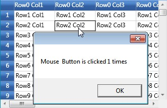
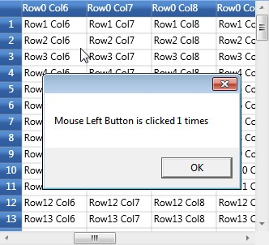

::: {style="DISPLAY: none"}
{#d2h_url_template}{#d2h_package_url style="WIDTH: 0px; DISPLAY: none; HEIGHT: 0px"}
:::

::: {.d2h_secondary_topic style="PADDING-BOTTOM: 10pt; MARGIN: 0pt; PADDING-LEFT: 0pt; PADDING-RIGHT: 0pt; PADDING-TOP: 0pt"}
#### Cell Mouse Events[]{#p235} {#cell-mouse-events style="tab-stops: 0pt"}

The following are the cell mouse events:

 

[·      ]{style="FONT-FAMILY: Symbol"}CellMouseDown-Occurs when a mouse button is pressed in a grid cell with the click count.

[·      ]{style="FONT-FAMILY: Symbol"}CellMouseUP--Occurs when a mouse button is released in a grid cell with the click count.

[·      ]{style="FONT-FAMILY: Symbol"}CellMouseHover -- Occurs when the mouse is hovered over a grid cell.

[·      ]{style="FONT-FAMILY: Symbol"}CellMouseMove -- Occurs when the mouse is moved around the grid cell.

 

These events receive an argument of type GridCellMouseControllerEventArgs that provides information related to mouse events including the click position.

 

Example

 

These events can be triggered using the following code:

 

+-----------------------------------------------------------------------------------------------------------------------------------------------------------------------------+
| [\[C#\]]{style="FONT-FAMILY: 'Courier New'; COLOR: black"}                                                                                                                  |
|                                                                                                                                                                             |
| []{style="FONT-FAMILY: 'Courier New'"}                                                                                                                                      |
|                                                                                                                                                                             |
| [grid.CellMouseDown += [new]{style="COLOR: blue"} [GridCellMouseControllerEventHandler]{style="COLOR: #2b91af"}(grid_CellMouseDown);]{style="FONT-FAMILY: 'Courier New'"}   |
|                                                                                                                                                                             |
| [grid.CellMouseHover += [new]{style="COLOR: blue"} [GridCellMouseControllerEventHandler]{style="COLOR: #2b91af"}(grid_CellMouseHover);]{style="FONT-FAMILY: 'Courier New'"} |
|                                                                                                                                                                             |
| [grid.CellMouseMove += [new]{style="COLOR: blue"} [GridCellMouseControllerEventHandler]{style="COLOR: #2b91af"}(grid_CellMouseMove);]{style="FONT-FAMILY: 'Courier New'"}   |
|                                                                                                                                                                             |
| [grid.CellMouseUp += [new]{style="COLOR: blue"} [GridCellMouseControllerEventHandler]{style="COLOR: #2b91af"}(grid_CellMouseUp);]{style="FONT-FAMILY: 'Courier New'"}       |
+-----------------------------------------------------------------------------------------------------------------------------------------------------------------------------+

 

Event Handlers

 

+-------------------------------------------------------------------------------------------------------------------------------------------------------------------------------------------------------------------------------------------------------------------------------+
| [\[C#\]]{style="FONT-FAMILY: 'Courier New'; COLOR: black"}                                                                                                                                                                                                                    |
|                                                                                                                                                                                                                                                                               |
| []{style="FONT-FAMILY: 'Courier New'"}                                                                                                                                                                                                                                        |
|                                                                                                                                                                                                                                                                               |
| [void]{style="FONT-FAMILY: 'Courier New'; COLOR: blue"}[ grid_CellMouseUp([object]{style="COLOR: blue"} sender, GridCellMouseControllerEventArgs args)]{style="FONT-FAMILY: 'Courier New'"}                                                                                   |
|                                                                                                                                                                                                                                                                               |
| [{]{style="FONT-FAMILY: 'Courier New'"}                                                                                                                                                                                                                                       |
|                                                                                                                                                                                                                                                                               |
| [    MessageBox.Show([\"Mouse \"]{style="COLOR: #a31515"} + args.MouseControllerEventArgs.Button + [\" Button is clicked \"]{style="COLOR: #a31515"} + args.MouseControllerEventArgs.ClickCount + [\" times\"]{style="COLOR: #a31515"});]{style="FONT-FAMILY: 'Courier New'"} |
|                                                                                                                                                                                                                                                                               |
| [}]{style="FONT-FAMILY: 'Courier New'"}                                                                                                                                                                                                                                       |
|                                                                                                                                                                                                                                                                               |
| []{style="FONT-FAMILY: 'Courier New'"}                                                                                                                                                                                                                                        |
|                                                                                                                                                                                                                                                                               |
| [void]{style="FONT-FAMILY: 'Courier New'; COLOR: blue"}[ grid_CellMouseMove([object]{style="COLOR: blue"} sender, GridCellMouseControllerEventArgs args)]{style="FONT-FAMILY: 'Courier New'"}                                                                                 |
|                                                                                                                                                                                                                                                                               |
| [{]{style="FONT-FAMILY: 'Courier New'"}                                                                                                                                                                                                                                       |
|                                                                                                                                                                                                                                                                               |
| [    RowColumnIndex cell = grid.PointToCellRowColumnIndex(args.MouseControllerEventArgs.Location);]{style="FONT-FAMILY: 'Courier New'"}                                                                                                                                       |
|                                                                                                                                                                                                                                                                               |
| [    MessageBox.Show([\"Mouse is at cell\[\"]{style="COLOR: #a31515"} + cell.RowIndex + [\", \"]{style="COLOR: #a31515"} + cell.ColumnIndex + [\"\]\"]{style="COLOR: #a31515"});]{style="FONT-FAMILY: 'Courier New'"}                                                         |
|                                                                                                                                                                                                                                                                               |
| [}]{style="FONT-FAMILY: 'Courier New'"}                                                                                                                                                                                                                                       |
|                                                                                                                                                                                                                                                                               |
| []{style="FONT-FAMILY: 'Courier New'"}                                                                                                                                                                                                                                        |
|                                                                                                                                                                                                                                                                               |
| [void]{style="FONT-FAMILY: 'Courier New'; COLOR: blue"}[ grid_CellMouseHover([object]{style="COLOR: blue"} sender, GridCellMouseControllerEventArgs args)]{style="FONT-FAMILY: 'Courier New'"}                                                                                |
|                                                                                                                                                                                                                                                                               |
| [{]{style="FONT-FAMILY: 'Courier New'"}                                                                                                                                                                                                                                       |
|                                                                                                                                                                                                                                                                               |
| [    RowColumnIndex cell = grid.PointToCellRowColumnIndex(args.MouseControllerEventArgs.Location);]{style="FONT-FAMILY: 'Courier New'"}                                                                                                                                       |
|                                                                                                                                                                                                                                                                               |
| [    MessageBox.Show([\"Mouse is hovering the cell\[\"]{style="COLOR: #a31515"}+cell.RowIndex+[\", \"]{style="COLOR: #a31515"}+cell.ColumnIndex+[\"\]\"]{style="COLOR: #a31515"});]{style="FONT-FAMILY: 'Courier New'"}                                                       |
|                                                                                                                                                                                                                                                                               |
| [}]{style="FONT-FAMILY: 'Courier New'"}                                                                                                                                                                                                                                       |
|                                                                                                                                                                                                                                                                               |
| []{style="FONT-FAMILY: 'Courier New'"}                                                                                                                                                                                                                                        |
|                                                                                                                                                                                                                                                                               |
| [void]{style="FONT-FAMILY: 'Courier New'; COLOR: blue"}[ grid_CellMouseDown([object]{style="COLOR: blue"} sender, GridCellMouseControllerEventArgs args)]{style="FONT-FAMILY: 'Courier New'"}                                                                                 |
|                                                                                                                                                                                                                                                                               |
| [{]{style="FONT-FAMILY: 'Courier New'"}                                                                                                                                                                                                                                       |
|                                                                                                                                                                                                                                                                               |
| [    MessageBox.Show([\"Mouse \"]{style="COLOR: #a31515"} + args.MouseControllerEventArgs.Button + [\" Button is clicked \"]{style="COLOR: #a31515"} + args.MouseControllerEventArgs.ClickCount + [\" times\"]{style="COLOR: #a31515"});]{style="FONT-FAMILY: 'Courier New'"} |
|                                                                                                                                                                                                                                                                               |
| [}]{style="FONT-FAMILY: 'Courier New'"}                                                                                                                                                                                                                                       |
+-------------------------------------------------------------------------------------------------------------------------------------------------------------------------------------------------------------------------------------------------------------------------------+

 

Output

 

The following outputs are generated using the code above.

 

{border="0"}

Figure 101: MouseUp

***[]{style="COLOR: #15428b"}*** 

{border="0"}

Figure 102: MouseMove

**[]{style="COLOR: #15428b"}** 

{border="0"}

Figure 103: MouseHover

***[]{style="COLOR: #15428b"}*** 

{border="0"}

Figure 104: MouseDown

 

 

 

[]{#related-topics}
:::
