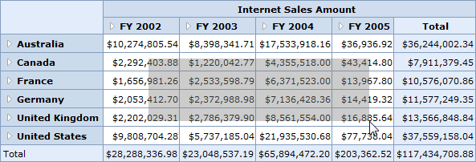

::: {style="DISPLAY: none"}
{#d2h_url_template}{#d2h_package_url style="WIDTH: 0px; DISPLAY: none; HEIGHT: 0px"}
:::

::::: {#nsbanner .d2h_main_nsbanner style="BORDER-BOTTOM: #999999 1px solid; POSITION: relative; PADDING-BOTTOM: 0px; BACKGROUND-COLOR: transparent; PADDING-LEFT: 0px; PADDING-RIGHT: 0px; DISPLAY: none; BORDER-TOP: #999999 1px solid; PADDING-TOP: 0px; LEFT: 0px"}
:::: {#TitleRow .d2h_main_titlerow style="PADDING-BOTTOM: 4px; BACKGROUND-COLOR: transparent; PADDING-LEFT: 22px; WIDTH: 100%; PADDING-RIGHT: 10px; DISPLAY: none; PADDING-TOP: 4px"}
::: {#ienav .d2h_main_ienav style="DISPLAY: none"}
{#D2HPrevious .D2HPreviousEnabled}  {#D2HNext .D2HNextEnabled}
:::
::::
:::::

:::::: {#nstext .d2h_main_nstext style="PADDING-BOTTOM: 10px; BACKGROUND-COLOR: transparent; PADDING-LEFT: 22px; PADDING-RIGHT: 10px; HEIGHT: 100%; OVERFLOW: auto; PADDING-TOP: 5px" hasuserbackground="true" valign="bottom"}
::: {#d2h_breadcrumbs .d2h_breadcrumbs}
[Essential Studio User Guide Documentation](ms-xhelp:///?Id=12457748-09e3-4d74-a240-8e049cedf030){.d2h_breadcrumbsNormal}[ \> ]{.d2h_breadcrumbsLinkSeparator}[Business Intelligence Edition](ms-xhelp:///?Id=fdf33dd8-62b2-47b9-ad7b-fc50e590bca5){.d2h_breadcrumbsNormal}[ \> ]{.d2h_breadcrumbsLinkSeparator}[Essential BI ASP.NET](ms-xhelp:///?Id=99c6694e-59c3-4c59-abb5-ce9ce9a948bc){.d2h_breadcrumbsNormal}[ \> ]{.d2h_breadcrumbsLinkSeparator}[Essential BI Grid]{.d2h_breadcrumbsContentsOnly}[ \> ]{.d2h_breadcrumbsLinkSeparator}[Concepts and Features](ms-xhelp:///?Id=6745c49b-2e43-4f50-aaf9-6e9c42650969){.d2h_breadcrumbsNormal}
:::

## Cell Selection {#cell-selection style="tab-stops: 0pt"}

This feature allows you to select a specific range of value cells and display them in a simple chart.

Tables for Properties and Events

 

Properties

::: {align="center"}
  --------------------- ---------------------------------------------------------- ------------- ------------
  Properties            Description                                                Type           Data Type
  EnableCellSelection   This property allows value cell selection on mouse drag.   Server side   Boolean
  --------------------- ---------------------------------------------------------- ------------- ------------
:::

 

Events

::: {align="center"}
  Event                    Description                                                                                                   Arguments                                                                                                                           Type
  --------------- --------------------------------------------------------------------------------------------------------------------- ------------------------------------------------------------------------------------------------------------------------------------ -------------
  CellSelection   This event would be raised as soon as the selection process is over, that is, when the mouse eft click is released.   **CellSelectionEventArg** contains a collection of **PivotCellDescriptor**, which is nothing but the detail of the selected cells.   Server side
:::

 

Adding Cell Selection to an Application

If you want to add a cell selection feature to the application, use following code snippet:

 

+-----------------------------------------------------------------------------------------------------------------------------------------------------------------------------------------------------------------------------------------------------------------------------------------+
| **[\[C#\]]{style="FONT-FAMILY: 'Courier New'"}**                                                                                                                                                                                                                                        |
|                                                                                                                                                                                                                                                                                         |
| [// Enabling Cell Selection]{style="FONT-FAMILY: 'Courier New'; COLOR: green"}                                                                                                                                                                                                          |
|                                                                                                                                                                                                                                                                                         |
| [this]{style="FONT-FAMILY: 'Courier New'; COLOR: blue"}[.OlapGrid1.EnableCellSelection = [true]{style="COLOR: blue"};]{style="FONT-FAMILY: 'Courier New'"}                                                                                                                              |
|                                                                                                                                                                                                                                                                                         |
| []{style="FONT-FAMILY: 'Courier New'"}                                                                                                                                                                                                                                                  |
|                                                                                                                                                                                                                                                                                         |
| [// Event raised on Cell Selection]{style="FONT-FAMILY: 'Courier New'; COLOR: green"}                                                                                                                                                                                                   |
|                                                                                                                                                                                                                                                                                         |
| [this]{style="FONT-FAMILY: 'Courier New'; COLOR: blue"}[.OlapGrid1.CellSelection += ]{style="FONT-FAMILY: 'Courier New'"}[new]{style="FONT-FAMILY: 'Courier New'; COLOR: blue"}[ OlapGrid.RaiseCellSelectionMouseHandler(OlapGrid1_CellSelection);]{style="FONT-FAMILY: 'Courier New'"} |
+-----------------------------------------------------------------------------------------------------------------------------------------------------------------------------------------------------------------------------------------------------------------------------------------+

[]{style="FONT-FAMILY: 'Courier New'"} 

+------------------------------------------------------------------------------------------------------------------------------------------------------------------------------------------------------------------------------------------+
| **[\[VB\]]{style="FONT-FAMILY: 'Courier New'"}**                                                                                                                                                                                         |
|                                                                                                                                                                                                                                          |
| [\' Enabling Cell Selection]{style="FONT-FAMILY: 'Courier New'; COLOR: green"}[ ]{style="FONT-FAMILY: 'Courier New'; COLOR: blue"}                                                                                                       |
|                                                                                                                                                                                                                                          |
| [Me]{style="FONT-FAMILY: 'Courier New'; COLOR: blue"}[.OlapGrid1.EnableCellSelection = [True]{style="COLOR: blue"}]{style="FONT-FAMILY: 'Courier New'"}                                                                                  |
|                                                                                                                                                                                                                                          |
| []{style="FONT-FAMILY: 'Courier New'; COLOR: blue"}                                                                                                                                                                                      |
|                                                                                                                                                                                                                                          |
| [// Event raised on Cell Selection]{style="FONT-FAMILY: 'Courier New'; COLOR: green"}                                                                                                                                                    |
|                                                                                                                                                                                                                                          |
| [AddHandler]{style="FONT-FAMILY: 'Courier New'; COLOR: blue"}[ OlapGrid1.CellSelection, [AddressOf]{style="COLOR: blue"} OlapGrid1_CellSelection]{style="FONT-FAMILY: 'Courier New'"}[]{style="FONT-FAMILY: 'Courier New'; COLOR: blue"} |
+------------------------------------------------------------------------------------------------------------------------------------------------------------------------------------------------------------------------------------------+

 

{border="0"}

Figure 32: Cell Selection and Displaying them in a Simple Chart

 

Sample Link

A demo is available at the following link:

**..\\Syncfusion\\EssentialStudio\\\<VersionNumber\>\\BI\\Web\\OlapGrid.Web\\Samples\\3.5\\Application Scenario\\** **CellSelectionDemo**

 

[]{#related-topics}
::::::
