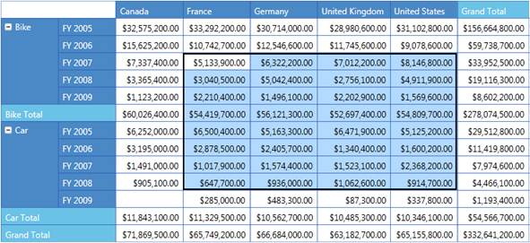

::: {style="DISPLAY: none"}
{#d2h_url_template}{#d2h_package_url style="WIDTH: 0px; DISPLAY: none; HEIGHT: 0px"}
:::

::::: {#nsbanner .d2h_main_nsbanner style="BORDER-BOTTOM: #999999 1px solid; POSITION: relative; PADDING-BOTTOM: 0px; BACKGROUND-COLOR: transparent; PADDING-LEFT: 0px; PADDING-RIGHT: 0px; DISPLAY: none; BORDER-TOP: #999999 1px solid; PADDING-TOP: 0px; LEFT: 0px"}
:::: {#TitleRow .d2h_main_titlerow style="PADDING-BOTTOM: 4px; BACKGROUND-COLOR: transparent; PADDING-LEFT: 22px; WIDTH: 100%; PADDING-RIGHT: 10px; DISPLAY: none; PADDING-TOP: 4px"}
::: {#ienav .d2h_main_ienav style="DISPLAY: none"}
{#D2HPrevious .D2HPreviousEnabled}  {#D2HNext .D2HNextEnabled}
:::
::::
:::::

:::: {#nstext .d2h_main_nstext style="PADDING-BOTTOM: 10px; BACKGROUND-COLOR: transparent; PADDING-LEFT: 22px; PADDING-RIGHT: 10px; HEIGHT: 100%; OVERFLOW: auto; PADDING-TOP: 5px" hasuserbackground="true" valign="bottom"}
::: {#d2h_breadcrumbs .d2h_breadcrumbs}
[Essential Studio User Guide Documentation](ms-xhelp:///?Id=12457748-09e3-4d74-a240-8e049cedf030){.d2h_breadcrumbsNormal}[ \> ]{.d2h_breadcrumbsLinkSeparator}[Business Intelligence Edition](ms-xhelp:///?Id=fdf33dd8-62b2-47b9-ad7b-fc50e590bca5){.d2h_breadcrumbsNormal}[ \> ]{.d2h_breadcrumbsLinkSeparator}[Essential BI Silverlight](ms-xhelp:///?Id=c006b39c-6aa2-4637-b7de-3e7b6cb3f9f9){.d2h_breadcrumbsNormal}[ \> ]{.d2h_breadcrumbsLinkSeparator}[Essential Pivot Grid]{.d2h_breadcrumbsContentsOnly}[ \> ]{.d2h_breadcrumbsLinkSeparator}[Features](ms-xhelp:///?Id=9d7968f1-d52c-4e79-a6ae-fb01305e9f98){.d2h_breadcrumbsNormal}
:::

## Cell Selection {#cell-selection style="tab-stops: 0pt"}

 

**PivotGrid** for Silverlight supports Cell Selection as in Microsoft Excel where you can select Grid value cells. When a cell is selected an event called **PivotGridSelectionChanged** will be triggered and **PivotGridSelectionChangedEventArgs** will return an **IEnumerable** collection of columns, rows, and values for the selected cell. Also, **EventArgs** will return the **CellRange** and the reason for selection, such as **mousedown**, **mousemove**, **mouseup** etc.

 

Adding Cell Selection

You can create a **PivotGrid** and specify a Cell Selection, as shown in the following code snippets.

 

+----------------------------------------------------------------------------------------------------------------------------------------------------------------------------------------------------------------------------------------------+
| **[\[XAML\]]{style="FONT-FAMILY: 'Courier New'"}**                                                                                                                                                                                           |
|                                                                                                                                                                                                                                              |
| [\<!\--Adding PivotGridControl and enabling Cell Selection.\--\>]{style="FONT-FAMILY: 'Courier New'"}**[]{style="FONT-FAMILY: 'Courier New'"}**                                                                                              |
|                                                                                                                                                                                                                                              |
| [\<]{style="FONT-FAMILY: 'Courier New'; COLOR: blue"}[syncfusion[:]{style="COLOR: blue"}PivotGridControl [AllowSelection]{style="COLOR: red"}[=\"True\"\>]{style="COLOR: blue"} []{style="COLOR: blue"}]{style="FONT-FAMILY: 'Courier New'"} |
|                                                                                                                                                                                                                                              |
| [\</]{style="FONT-FAMILY: 'Courier New'; COLOR: blue"}[syncfusion[:]{style="COLOR: blue"}PivotGridControl\>[]{style="COLOR: blue"}]{style="FONT-FAMILY: 'Courier New'"}                                                                      |
|                                                                                                                                                                                                                                              |
| []{style="FONT-FAMILY: 'Courier New'"}                                                                                                                                                                                                       |
+----------------------------------------------------------------------------------------------------------------------------------------------------------------------------------------------------------------------------------------------+

 

+---------------------------------------------------------------------------------------------------------------------------------------------------------------------------------------------------------------------------------------------------------------------------------------------------------------------------------------------------------------------------------------------------------------------------------+
| **[\[C#\]]{style="FONT-FAMILY: 'Courier New'"}**                                                                                                                                                                                                                                                                                                                                                                                |
|                                                                                                                                                                                                                                                                                                                                                                                                                                 |
| [this]{style="FONT-FAMILY: 'Courier New'; COLOR: blue"}[.pivotGrid1.ItemSource = [ProductSales]{style="COLOR: #2b91af"}.GetSalesData();            ]{style="FONT-FAMILY: 'Courier New'"}                                                                                                                                                                                                                                        |
|                                                                                                                                                                                                                                                                                                                                                                                                                                 |
| [            // Adding Pivot Columns.]{style="FONT-FAMILY: 'Courier New'"}                                                                                                                                                                                                                                                                                                                                                      |
|                                                                                                                                                                                                                                                                                                                                                                                                                                 |
| [            [this]{style="COLOR: blue"}.pivotGrid1.PivotColumns.Add([new]{style="COLOR: blue"} [PivotItem]{style="COLOR: #2b91af"}() { FieldMappingName = [\"Country\"]{style="COLOR: #a31515"}, TotalHeader = [\"Total\"]{style="COLOR: #a31515"} });]{style="FONT-FAMILY: 'Courier New'"}                                                                                                                                    |
|                                                                                                                                                                                                                                                                                                                                                                                                                                 |
| [            // Adding Pivot Rows.]{style="FONT-FAMILY: 'Courier New'"}                                                                                                                                                                                                                                                                                                                                                         |
|                                                                                                                                                                                                                                                                                                                                                                                                                                 |
| [            [this]{style="COLOR: blue"}.pivotGrid1.PivotRows.Add([new]{style="COLOR: blue"} [PivotItem]{style="COLOR: #2b91af"}() { FieldMappingName = [\"Product\"]{style="COLOR: #a31515"}, TotalHeader = [\"Total\"]{style="COLOR: #a31515"} });]{style="FONT-FAMILY: 'Courier New'"}                                                                                                                                       |
|                                                                                                                                                                                                                                                                                                                                                                                                                                 |
| [            [this]{style="COLOR: blue"}.pivotGrid1.PivotRows.Add([new]{style="COLOR: blue"} [PivotItem]{style="COLOR: #2b91af"}() { FieldMappingName = [\"Date\"]{style="COLOR: #a31515"}, TotalHeader = [\"Total\"]{style="COLOR: #a31515"} });]{style="FONT-FAMILY: 'Courier New'"}                                                                                                                                          |
|                                                                                                                                                                                                                                                                                                                                                                                                                                 |
| [            // Adding Pivot Calculations.]{style="FONT-FAMILY: 'Courier New'"}                                                                                                                                                                                                                                                                                                                                                 |
|                                                                                                                                                                                                                                                                                                                                                                                                                                 |
| [            [this]{style="COLOR: blue"}.pivotGrid1.PivotCalculations.Add([new]{style="COLOR: blue"} [PivotComputationInfo]{style="COLOR: #2b91af"}() { FieldName = [\"Amount\"]{style="COLOR: #a31515"}, SummaryType = [SummaryType]{style="COLOR: #2b91af"}.DoubleTotalSum, CalculationName = [\"DoubleTotalSum\"]{style="COLOR: #a31515"}, Format = [\"C\"]{style="COLOR: #a31515"} });]{style="FONT-FAMILY: 'Courier New'"} |
|                                                                                                                                                                                                                                                                                                                                                                                                                                 |
| [            // Enable Cell Selection.]{style="FONT-FAMILY: 'Courier New'"}**[]{style="FONT-FAMILY: 'Courier New'"}**                                                                                                                                                                                                                                                                                                           |
|                                                                                                                                                                                                                                                                                                                                                                                                                                 |
| [            this]{style="FONT-FAMILY: 'Courier New'; COLOR: blue"}[.]{style="FONT-FAMILY: 'Courier New'"}[pivotGrid1]{style="FONT-FAMILY: 'Courier New'"}[.AllowSelection = [true]{style="COLOR: blue"};]{style="FONT-FAMILY: 'Courier New'"}                                                                                                                                                                                  |
|                                                                                                                                                                                                                                                                                                                                                                                                                                 |
| [            [this]{style="COLOR: blue"}.pivotGrid1.Refresh();]{style="FONT-FAMILY: 'Courier New'"}                                                                                                                                                                                                                                                                                                                             |
|                                                                                                                                                                                                                                                                                                                                                                                                                                 |
| []{style="FONT-FAMILY: 'Courier New'"}                                                                                                                                                                                                                                                                                                                                                                                          |
+---------------------------------------------------------------------------------------------------------------------------------------------------------------------------------------------------------------------------------------------------------------------------------------------------------------------------------------------------------------------------------------------------------------------------------+

 

+-------------------------------------------------------------------------------------------------------------------------------------------------------------------------------------------------------------------------------------------------------------------------------------------------+
| **[\[VB\]]{style="FONT-FAMILY: 'Courier New'"}**                                                                                                                                                                                                                                                |
|                                                                                                                                                                                                                                                                                                 |
| []{style="FONT-FAMILY: 'Courier New'; COLOR: green"}                                                                                                                                                                                                                                            |
|                                                                                                                                                                                                                                                                                                 |
| [\' Specifying the ItemSource for Pivot Grid.]{style="FONT-FAMILY: 'Courier New'; COLOR: green"}                                                                                                                                                                                                |
|                                                                                                                                                                                                                                                                                                 |
| [                  [Me]{style="COLOR: blue"}.PivotGridControl1.ItemSource = ProductSales.GetSalesData()]{style="FONT-FAMILY: 'Courier New'"}                                                                                                                                                    |
|                                                                                                                                                                                                                                                                                                 |
| [                  [\' Adding Pivot Rows to Grid.]{style="COLOR: green"}]{style="FONT-FAMILY: 'Courier New'"}                                                                                                                                                                                   |
|                                                                                                                                                                                                                                                                                                 |
| [                  [Me]{style="COLOR: blue"}.PivotGridControl1.PivotRows.Add([New]{style="COLOR: blue"} PivotItem [With]{style="COLOR: blue"} {.FieldMappingName = \"Product\", .TotalHeader = \"Total\"})]{style="FONT-FAMILY: 'Courier New'"}                                                 |
|                                                                                                                                                                                                                                                                                                 |
| [                  [Me]{style="COLOR: blue"}.PivotGridControl1.PivotRows.Add([New]{style="COLOR: blue"} PivotItem [With]{style="COLOR: blue"} {.FieldMappingName = \"Year\", .TotalHeader = \"Total\"})]{style="FONT-FAMILY: 'Courier New'"}                                                    |
|                                                                                                                                                                                                                                                                                                 |
| [                  [\' Adding Pivot Colums to Grid.]{style="COLOR: green"}]{style="FONT-FAMILY: 'Courier New'"}                                                                                                                                                                                 |
|                                                                                                                                                                                                                                                                                                 |
| [                  [Me]{style="COLOR: blue"}.PivotGridControl1.PivotColumns.Add([New]{style="COLOR: blue"} PivotItem [With]{style="COLOR: blue"} {.FieldMappingName = \"Country\", .TotalHeader = \"Total\"})]{style="FONT-FAMILY: 'Courier New'"}                                              |
|                                                                                                                                                                                                                                                                                                 |
| [                  [Me]{style="COLOR: blue"}.PivotGridControl1.PivotColumns.Add([New]{style="COLOR: blue"} PivotItem [With]{style="COLOR: blue"} {.FieldMappingName = \"State\", .TotalHeader = \"Total\"})]{style="FONT-FAMILY: 'Courier New'"}                                                |
|                                                                                                                                                                                                                                                                                                 |
| [                  [\' Adding PivotCalculations to Grid.]{style="COLOR: green"}]{style="FONT-FAMILY: 'Courier New'"}                                                                                                                                                                            |
|                                                                                                                                                                                                                                                                                                 |
| [                  [Me]{style="COLOR: blue"}.PivotGridControl1.PivotCalculations.Add([New]{style="COLOR: blue"} PivotComputationInfo [With]{style="COLOR: blue"} {.FieldName = \"Amount\", .Format=\"C\", .SummaryType = SummaryType.DoubleTotalSum})]{style="FONT-FAMILY: 'Courier New'"}      |
|                                                                                                                                                                                                                                                                                                 |
| [                  [Me]{style="COLOR: blue"}.PivotGridControl1.PivotCalculations.Add([New]{style="COLOR: blue"} PivotComputationInfo [With]{style="COLOR: blue"} {.FieldName = \"Quantity\", .Format =\"#,##0\"})]{style="FONT-FAMILY: 'Courier New'"}                                          |
|                                                                                                                                                                                                                                                                                                 |
| [                    ]{style="FONT-FAMILY: 'Courier New'; COLOR: green"}                                                                                                                                                                                                                        |
|                                                                                                                                                                                                                                                                                                 |
| [                   \' Enable Cell Selection.]{style="FONT-FAMILY: 'Courier New'"}                                                                                                                                                                                                              |
|                                                                                                                                                                                                                                                                                                 |
| [                   Me]{style="FONT-FAMILY: 'Courier New'; COLOR: blue"}[.]{style="FONT-FAMILY: 'Courier New'"}[PivotGridControl1]{style="FONT-FAMILY: 'Courier New'"}[.AllowSelection = [True]{style="COLOR: blue"}]{style="FONT-FAMILY: 'Courier New'"}[]{style="FONT-FAMILY: 'Courier New'"} |
|                                                                                                                                                                                                                                                                                                 |
| [                   [Me]{style="COLOR: blue"}.PivotGridControl1.Refresh()]{style="FONT-FAMILY: 'Courier New'"}                                                                                                                                                                                  |
|                                                                                                                                                                                                                                                                                                 |
| []{style="FONT-FAMILY: 'Courier New'; COLOR: green"}                                                                                                                                                                                                                                            |
|                                                                                                                                                                                                                                                                                                 |
| **[]{style="FONT-FAMILY: 'Courier New'"}**                                                                                                                                                                                                                                                      |
+-------------------------------------------------------------------------------------------------------------------------------------------------------------------------------------------------------------------------------------------------------------------------------------------------+

 

{border="0"}

Figure 10: PivotGrid Cell Selection

 

 

Sample Link

..\\..\\ ***Syncfusion\\BI\\Silverlight\\Syncfusion.PivotGrid.Silverlight.Samples\\Syncfusion.PivotGrid.Silverlight.Samples\\Samples\\CellSelectionDemo***

[]{#related-topics}
::::
