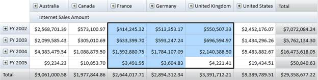

::: {style="DISPLAY: none"}
{#d2h_url_template} {#d2h_package_url style="WIDTH: 0px; DISPLAY: none; HEIGHT: 0px"}
:::

::::: {#nsbanner .d2h_main_nsbanner style="BORDER-BOTTOM: #999999 1px solid; POSITION: relative; PADDING-BOTTOM: 0px; BACKGROUND-COLOR: transparent; PADDING-LEFT: 0px; PADDING-RIGHT: 0px; DISPLAY: none; BORDER-TOP: #999999 1px solid; PADDING-TOP: 0px; LEFT: 0px"}
:::: {#TitleRow .d2h_main_titlerow style="PADDING-BOTTOM: 4px; BACKGROUND-COLOR: transparent; PADDING-LEFT: 22px; WIDTH: 100%; PADDING-RIGHT: 10px; DISPLAY: none; PADDING-TOP: 4px"}
::: {#ienav .d2h_main_ienav style="DISPLAY: none"}
{#D2HPrevious .D2HPreviousEnabled}  {#D2HNext .D2HNextEnabled}
:::
::::
:::::

:::: {#nstext .d2h_main_nstext style="PADDING-BOTTOM: 10px; BACKGROUND-COLOR: transparent; PADDING-LEFT: 22px; PADDING-RIGHT: 10px; HEIGHT: 100%; OVERFLOW: auto; PADDING-TOP: 5px" hasuserbackground="true" valign="bottom"}
::: {#d2h_breadcrumbs .d2h_breadcrumbs}
[Essential Studio User Guide Documentation](ms-xhelp:///?Id=12457748-09e3-4d74-a240-8e049cedf030){.d2h_breadcrumbsNormal} [ \> ]{.d2h_breadcrumbsLinkSeparator} [Business Intelligence Edition](ms-xhelp:///?Id=fdf33dd8-62b2-47b9-ad7b-fc50e590bca5){.d2h_breadcrumbsNormal} [ \> ]{.d2h_breadcrumbsLinkSeparator} [Essential BI WPF](ms-xhelp:///?Id=41e3d586-d922-4a01-8272-679fe4ae7343){.d2h_breadcrumbsNormal} [ \> ]{.d2h_breadcrumbsLinkSeparator} [Essential BI Grid]{.d2h_breadcrumbsContentsOnly} [ \> ]{.d2h_breadcrumbsLinkSeparator} [Concepts and Features](ms-xhelp:///?Id=ea758680-939d-4d65-8abe-8c3be198af29){.d2h_breadcrumbsNormal}
:::

## Cell Selection {#cell-selection style="tab-stops: 0pt"}

OlapGrid for WPF supports excel like cell selection where you can select grid value cells as like in MS-Excel. On cell selection, an event called OlapGridSelectionChanged will be triggered and the OlapGridSelectionChangedEventArgs will return an IEnumerable collection of column, row and value of the corresponding selected cell. The EventArgs will also return the cell range and the selection reason like mousedown, mousemove, mouseup etc.

 

Use Case Scenarios

Using Cell Selection, you can select cells that can be copied to clipboard or notepad. You can perform custom operation on cell selection and also can bind any control based on the selected cell values.

 

Adding Cell Selection

The following code snippets show how to create an OlapGrid and specify its cell selection.

 

+--------------------------------------------------------------------------------------------------------------------------------------------------------------------------------------------------------------------------------------------------------+
| **\[XAML\]**                                                                                                                                                                                                                                           |
|                                                                                                                                                                                                                                                        |
| [\<!\--Adding OlapGrid and Enabling Cell Selection\--\>]{style="COLOR: green"} **[]{style="FONT-SIZE: 11pt"}**                                                                                                                                         |
|                                                                                                                                                                                                                                                        |
| [\<]{style="COLOR: blue"} [syncfusion]{style="COLOR: #a31515"} [:]{style="COLOR: blue"} [OlapGrid ]{style="COLOR: #a31515"} [AllowSelection]{style="COLOR: red"} [=\"True\"\>]{style="COLOR: blue"} []{style="COLOR: #a31515"} []{style="COLOR: blue"} |
|                                                                                                                                                                                                                                                        |
| [\</]{style="COLOR: blue"} [syncfusion]{style="COLOR: #a31515"} [:]{style="COLOR: blue"} [OlapGrid\>]{style="COLOR: #a31515"} []{style="COLOR: blue"}                                                                                                  |
|                                                                                                                                                                                                                                                        |
|                                                                                                                                                                                                                                                        |
+--------------------------------------------------------------------------------------------------------------------------------------------------------------------------------------------------------------------------------------------------------+

[]{style="COLOR: #c00000"} 

+------------------------------------------------------------------------------------------------------------------------------------+
| **\[C#\]**                                                                                                                         |
|                                                                                                                                    |
| [OlapGrid]{style="COLOR: #2b91af"} OlapGrid1 = [new]{style="COLOR: blue"}[OlapGrid]{style="COLOR: #2b91af"}();                     |
|                                                                                                                                    |
| [// Instantiating OlapDataManager.]{style="COLOR: green"}                                                                          |
|                                                                                                                                    |
| [OlapDataManager]{style="COLOR: #2b91af"} olapDataManager = [new]{style="COLOR: blue"}[OlapDataManager]{style="COLOR: #2b91af"}(); |
|                                                                                                                                    |
| [// Set current report for OlapDataManager.]{style="COLOR: green"}                                                                 |
|                                                                                                                                    |
| olapDataManager.SetCurrentReport(olapReport());                                                                                    |
|                                                                                                                                    |
| [// Specifying OlapDataManager to Grid.]{style="COLOR: green"}                                                                     |
|                                                                                                                                    |
| [this]{style="COLOR: blue"}.OlapGrid1.OlapDataManager = OlapDataManager;                                                           |
|                                                                                                                                    |
| [// Enable Cell Selection.]{style="COLOR: green"}                                                                                  |
|                                                                                                                                    |
| [this]{style="COLOR: blue"}.OlapGrid1.AllowSelection = [true]{style="COLOR: blue"};                                                |
|                                                                                                                                    |
| [// Data binding.]{style="COLOR: green"}                                                                                           |
|                                                                                                                                    |
| [this]{style="COLOR: blue"}.OlapGrid1.DataBind();                                                                                  |
|                                                                                                                                    |
|                                                                                                                                    |
+------------------------------------------------------------------------------------------------------------------------------------+

[]{style="COLOR: #c00000"} 

+-------------------------------------------------------------------------------------------------------------------------------------+
| **\[VB\]**                                                                                                                          |
|                                                                                                                                     |
| []{style="COLOR: green"}                                                                                                            |
|                                                                                                                                     |
| [Dim]{style="COLOR: blue"} OlapGrid1 [As]{style="COLOR: blue"} OlapGrid = [New]{style="COLOR: blue"} OlapGrid()                     |
|                                                                                                                                     |
| [\' Instantiating OlapDataManager. ]{style="COLOR: green"}                                                                          |
|                                                                                                                                     |
| [Dim]{style="COLOR: blue"} olapDataManager [As]{style="COLOR: blue"} OlapDataManager = [New]{style="COLOR: blue"} OlapDataManager() |
|                                                                                                                                     |
| [\' Set current report for OlapDataManager.]{style="COLOR: green"}                                                                  |
|                                                                                                                                     |
| olapDataManager.SetCurrentReport(olapReport())                                                                                      |
|                                                                                                                                     |
| [\' Specifying OlapDataManager to Grid.]{style="COLOR: green"}                                                                      |
|                                                                                                                                     |
| [Me]{style="COLOR: blue"}.OlapGrid1.OlapDataManager = OlapDataManager                                                               |
|                                                                                                                                     |
| [\' Enable Cell Selection.]{style="COLOR: green"}                                                                                   |
|                                                                                                                                     |
| [Me]{style="COLOR: blue"}.OlapGrid1.AllowSelection = [True]{style="COLOR: blue"}                                                    |
|                                                                                                                                     |
| [\' Data binding.]{style="COLOR: green"}                                                                                            |
|                                                                                                                                     |
| [Me]{style="COLOR: blue"}.OlapGrid1.DataBind()                                                                                      |
|                                                                                                                                     |
|                                                                                                                                     |
+-------------------------------------------------------------------------------------------------------------------------------------+

 

The screen shot below illustrates the Cell Selection.

 

{border="0"}

Figure 36: OlapGrid Cell Selection

 

Sample Link

A sample application that illustrates Cell Selection Chart is distributed along with the Essential OLAP Grid WPF installation and can be found at:  

**..\\..\\ Syncfusion\\BI\\WPF\\OlapGrid.WPF\\Samples\\Appearance\\Cell Selection Demo**

 

 

[]{#related-topics}
::::
