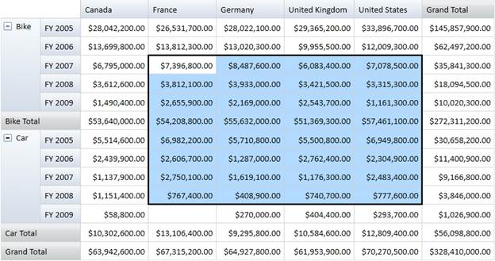

::: {style="DISPLAY: none"}
{#d2h_url_template}{#d2h_package_url style="WIDTH: 0px; DISPLAY: none; HEIGHT: 0px"}
:::

::::: {#nsbanner .d2h_main_nsbanner style="BORDER-BOTTOM: #999999 1px solid; POSITION: relative; PADDING-BOTTOM: 0px; BACKGROUND-COLOR: transparent; PADDING-LEFT: 0px; PADDING-RIGHT: 0px; DISPLAY: none; BORDER-TOP: #999999 1px solid; PADDING-TOP: 0px; LEFT: 0px"}
:::: {#TitleRow .d2h_main_titlerow style="PADDING-BOTTOM: 4px; BACKGROUND-COLOR: transparent; PADDING-LEFT: 22px; WIDTH: 100%; PADDING-RIGHT: 10px; DISPLAY: none; PADDING-TOP: 4px"}
::: {#ienav .d2h_main_ienav style="DISPLAY: none"}
{#D2HPrevious .D2HPreviousEnabled}  {#D2HNext .D2HNextEnabled}
:::
::::
:::::

:::: {#nstext .d2h_main_nstext style="PADDING-BOTTOM: 10px; BACKGROUND-COLOR: transparent; PADDING-LEFT: 22px; PADDING-RIGHT: 10px; HEIGHT: 100%; OVERFLOW: auto; PADDING-TOP: 5px" hasuserbackground="true" valign="bottom"}
::: {#d2h_breadcrumbs .d2h_breadcrumbs}
[Essential Studio User Guide Documentation](ms-xhelp:///?Id=12457748-09e3-4d74-a240-8e049cedf030){.d2h_breadcrumbsNormal}[ \> ]{.d2h_breadcrumbsLinkSeparator}[Business Intelligence Edition](ms-xhelp:///?Id=fdf33dd8-62b2-47b9-ad7b-fc50e590bca5){.d2h_breadcrumbsNormal}[ \> ]{.d2h_breadcrumbsLinkSeparator}[Essential BI Windows](ms-xhelp:///?Id=af2b5ead-c104-4cdd-b5e2-2b2aee61afe3){.d2h_breadcrumbsNormal}[ \> ]{.d2h_breadcrumbsLinkSeparator}[Concepts and Features](ms-xhelp:///?Id=4c7c53bf-fd09-4600-aaf4-4f09cc0f9359){.d2h_breadcrumbsNormal}
:::

## Cell Selection {#cell-selection style="tab-stops: 0pt"}

The PivotGrid for Windows Forms supports  cell selection where you can select grid value cells similar to Microsoft Excel. On cell selection, an event called *PivotGridSelectionChanged* will be triggered and the *PivotGridSelectionChangedEventArgs* will return an *IEnumerable* collection of column, row and value of the corresponding selected cell.

 

Use Case Scenarios

Using the cell selection support, you can select the cells that can be copied to clipboard or notepad. You can perform custom operation on cell selection and also bind any control based on the selected cell values.

 

Adding Cell Selection

The following code snippets show how to create a PivotGrid and specify cell selection.

 

+----------------------------------------------------------------------------------------------------------------------------------------------------------------------------------------------------------------------------------------------------------------+
| **[\[C#\]]{style="FONT-FAMILY: 'Courier New'"}**                                                                                                                                                                                                               |
|                                                                                                                                                                                                                                                                |
| [// Instantiating PivotGridControl]{style="FONT-FAMILY: 'Courier New'; COLOR: green"}[]{style="FONT-FAMILY: 'Courier New'"}                                                                                                                                    |
|                                                                                                                                                                                                                                                                |
| [PivotGridControl]{style="FONT-FAMILY: 'Courier New'; COLOR: #2b91af"}[ pivotGridControl1 = [new]{style="COLOR: blue"} [PivotGridControl]{style="COLOR: #2b91af"}();]{style="FONT-FAMILY: 'Courier New'"}                                                      |
|                                                                                                                                                                                                                                                                |
| [// Adding PivotRows]{style="FONT-FAMILY: 'Courier New'; COLOR: green"}[]{style="FONT-FAMILY: 'Courier New'"}                                                                                                                                                  |
|                                                                                                                                                                                                                                                                |
| [pivotGridControl1.PivotRows.Add([new]{style="COLOR: blue"} [PivotItem]{style="COLOR: #2b91af"} { FieldHeader = [\"Product\"]{style="COLOR: #a31515"} });]{style="FONT-FAMILY: 'Courier New'"}                                                                 |
|                                                                                                                                                                                                                                                                |
| [pivotGridControl1.PivotColumns.Add([new]{style="COLOR: blue"} [PivotItem]{style="COLOR: #2b91af"} { FieldHeader = [\"Date\"]{style="COLOR: #a31515"} });]{style="FONT-FAMILY: 'Courier New'"}                                                                 |
|                                                                                                                                                                                                                                                                |
| [// Adding PivotColumns]{style="FONT-FAMILY: 'Courier New'; COLOR: green"}[]{style="FONT-FAMILY: 'Courier New'"}                                                                                                                                               |
|                                                                                                                                                                                                                                                                |
| [pivotGridControl1.PivotColumns.Add([new]{style="COLOR: blue"} [PivotItem]{style="COLOR: #2b91af"} { FieldHeader = [\"Country\"]{style="COLOR: #a31515"} });]{style="FONT-FAMILY: 'Courier New'"}                                                              |
|                                                                                                                                                                                                                                                                |
| [pivotGridControl1.PivotColumns.Add([new]{style="COLOR: blue"} [PivotItem]{style="COLOR: #2b91af"} { FieldHeader = [\"State\"]{style="COLOR: #a31515"} });]{style="FONT-FAMILY: 'Courier New'"}                                                                |
|                                                                                                                                                                                                                                                                |
| [// Adding PivotCalculations]{style="FONT-FAMILY: 'Courier New'; COLOR: green"}[]{style="FONT-FAMILY: 'Courier New'"}                                                                                                                                          |
|                                                                                                                                                                                                                                                                |
| [pivotGridControl1.PivotCalculations.Add([new]{style="COLOR: blue"} [PivotComputationInfo]{style="COLOR: #2b91af"} { FieldName=[\"Amount\"]{style="COLOR: #a31515"} , Format=[\"C\"]{style="COLOR: #a31515"}});]{style="FONT-FAMILY: 'Courier New'"}           |
|                                                                                                                                                                                                                                                                |
| [pivotGridControl1.PivotCalculations.Add([new]{style="COLOR: blue"} [PivotComputationInfo]{style="COLOR: #2b91af"} { FieldName = [\"Quantity\"]{style="COLOR: #a31515"}, Format = [\"#,##0\"]{style="COLOR: #a31515"} });]{style="FONT-FAMILY: 'Courier New'"} |
|                                                                                                                                                                                                                                                                |
| [// Enabling cell selection]{style="FONT-FAMILY: 'Courier New'; COLOR: green"}**[]{style="FONT-FAMILY: 'Courier New'"}**                                                                                                                                       |
|                                                                                                                                                                                                                                                                |
| [this]{style="FONT-FAMILY: 'Courier New'; COLOR: blue"}[.pivotGridControl1.AllowSelection = [false]{style="COLOR: blue"};]{style="FONT-FAMILY: 'Courier New'"}                                                                                                 |
|                                                                                                                                                                                                                                                                |
| []{style="FONT-FAMILY: 'Courier New'"}                                                                                                                                                                                                                         |
+----------------------------------------------------------------------------------------------------------------------------------------------------------------------------------------------------------------------------------------------------------------+

[]{style="COLOR: #c00000"} 

+-------------------------------------------------------------------------------------------------------------------------------------------------------------------------------------------------------------+
| **[\[VB\]]{style="FONT-FAMILY: 'Courier New'"}**                                                                                                                                                            |
|                                                                                                                                                                                                             |
| []{style="FONT-FAMILY: 'Courier New'; COLOR: green"}                                                                                                                                                        |
|                                                                                                                                                                                                             |
| [\' Instantiating PivotGridControl]{style="FONT-FAMILY: 'Courier New'; COLOR: green"}[]{style="FONT-FAMILY: 'Courier New'"}                                                                                 |
|                                                                                                                                                                                                             |
| [Dim]{style="FONT-FAMILY: 'Courier New'; COLOR: blue"}[ pivotGridControl1 [As]{style="COLOR: blue"} PivotGridControl = [New]{style="COLOR: blue"} PivotGridControl()]{style="FONT-FAMILY: 'Courier New'"}   |
|                                                                                                                                                                                                             |
| [\' Adding PivotRows]{style="FONT-FAMILY: 'Courier New'; COLOR: green"}[]{style="FONT-FAMILY: 'Courier New'"}                                                                                               |
|                                                                                                                                                                                                             |
| [pivotGridControl1.PivotRows.Add([New]{style="COLOR: blue"} PivotItem [With]{style="COLOR: blue"} {.FieldHeader = \"Product\"})]{style="FONT-FAMILY: 'Courier New'"}                                        |
|                                                                                                                                                                                                             |
| [pivotGridControl1.PivotColumns.Add([New]{style="COLOR: blue"} PivotItem [With]{style="COLOR: blue"} {.FieldHeader = \"Date\"})]{style="FONT-FAMILY: 'Courier New'"}                                        |
|                                                                                                                                                                                                             |
| [\' Adding PivotColumns]{style="FONT-FAMILY: 'Courier New'; COLOR: green"}[]{style="FONT-FAMILY: 'Courier New'"}                                                                                            |
|                                                                                                                                                                                                             |
| [pivotGridControl1.PivotColumns.Add([New]{style="COLOR: blue"} PivotItem [With]{style="COLOR: blue"} {.FieldHeader = \"Country\"})]{style="FONT-FAMILY: 'Courier New'"}                                     |
|                                                                                                                                                                                                             |
| [pivotGridControl1.PivotColumns.Add([New]{style="COLOR: blue"} PivotItem [With]{style="COLOR: blue"} {.FieldHeader = \"State\"})]{style="FONT-FAMILY: 'Courier New'"}                                       |
|                                                                                                                                                                                                             |
| [\' Adding PivotCalculations]{style="FONT-FAMILY: 'Courier New'; COLOR: green"}[]{style="FONT-FAMILY: 'Courier New'"}                                                                                       |
|                                                                                                                                                                                                             |
| [pivotGridControl1.PivotCalculations.Add([New]{style="COLOR: blue"} PivotComputationInfo [With]{style="COLOR: blue"} {.FieldName=\"Amount\", .Format=\"C\"})]{style="FONT-FAMILY: 'Courier New'"}           |
|                                                                                                                                                                                                             |
| [pivotGridControl1.PivotCalculations.Add([New]{style="COLOR: blue"} PivotComputationInfo [With]{style="COLOR: blue"} {.FieldName = \"Quantity\", .Format = \"#,##0\"})]{style="FONT-FAMILY: 'Courier New'"} |
|                                                                                                                                                                                                             |
| [\' Enabling cell selection]{style="FONT-FAMILY: 'Courier New'; COLOR: green"}[]{style="FONT-FAMILY: 'Courier New'"}                                                                                        |
|                                                                                                                                                                                                             |
| [Me]{style="FONT-FAMILY: 'Courier New'; COLOR: blue"}[.pivotGridControl1.AllowSelection = [False]{style="COLOR: blue"}]{style="FONT-FAMILY: 'Courier New'"}                                                 |
|                                                                                                                                                                                                             |
| **[]{style="FONT-FAMILY: 'Courier New'"}**                                                                                                                                                                  |
+-------------------------------------------------------------------------------------------------------------------------------------------------------------------------------------------------------------+

 

{border="0"}

Figure 12: PivotGrid Cell Selection

 

[]{#related-topics}
::::
