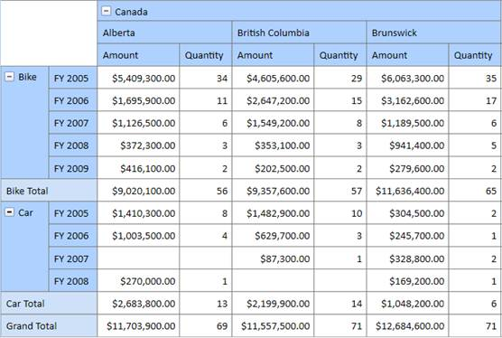

::: {style="DISPLAY: none"}
{#d2h_url_template} {#d2h_package_url style="WIDTH: 0px; DISPLAY: none; HEIGHT: 0px"}
:::

::: {.d2h_secondary_topic style="PADDING-BOTTOM: 10pt; MARGIN: 0pt; PADDING-LEFT: 0pt; PADDING-RIGHT: 0pt; PADDING-TOP: 0pt"}
#### Cell Style {#cell-style style="tab-stops: 0pt"}

The following properties of a grid cell can be customized so that the grid appears in a custom style rather than the default one.

+---------------+---------------------------------------------------+-------------+------------------+----------------+
|               |                                                   |             |                  |                |
|               |                                                   |             |                  |                |
| Property Name | Description                                       | Type        | Value it Accepts | Reference link |
|               |                                                   |             |                  |                |
|               |                                                   |             |                  |                |
+---------------+---------------------------------------------------+-------------+------------------+----------------+
| Background    | Gets or sets the background color of a grid cell. | Brush       | \-               | \-             |
+---------------+---------------------------------------------------+-------------+------------------+----------------+
| FontFamily    | Gets or sets the font family of a grid cell.      | FontFamily  | \-               | \-             |
+---------------+---------------------------------------------------+-------------+------------------+----------------+
| FontSize      | Gets or sets the font size of a grid cell.        | int         | \-               | \-             |
+---------------+---------------------------------------------------+-------------+------------------+----------------+
| FontWeight    | Gets or sets the font weigh of a grid cell.       | FontWeight  | \-               | \-             |
+---------------+---------------------------------------------------+-------------+------------------+----------------+
| Foreground    | Gets or sets the foreground color of a grid cell. | Brush       | \-               | \-             |
+---------------+---------------------------------------------------+-------------+------------------+----------------+

[]{style="FONT-FAMILY: 'Trebuchet MS','sans-serif'; COLOR: #15428b; FONT-SIZE: 9pt"} 

Column, row, summary, and value cells of a grid can be formatted independently using the following properties:

[·      ]{style="FONT-FAMILY: Symbol"} **ColumnHeaderCellStyle** -- Specifies the style for column headers.

[·      ]{style="FONT-FAMILY: Symbol"} **RowHeaderCellStyle** -- Specifies the style for row headers.

[·      ]{style="FONT-FAMILY: Symbol"} **SummaryCellStyle** -- Specifies the style for summary cells.

[·      ]{style="FONT-FAMILY: Symbol"} **ValueCellStyle**  --  Specifies the style for value cells.

 

+-----------------------------------------------------------------------------------------------------------------------------------------------------------------------------------------------------------------------------------------------------------------+
| **[\[C#\] ]{style="FONT-FAMILY: 'Courier New'"}**                                                                                                                                                                                                               |
|                                                                                                                                                                                                                                                                 |
| [            [// Specifying the Background color for Grid column header]{style="COLOR: green"}]{style="FONT-FAMILY: 'Courier New'"}                                                                                                                             |
|                                                                                                                                                                                                                                                                 |
| [            [this]{style="COLOR: blue"}.PivotGridControl1.ColumnHeaderCellStyle.Background = [new]{style="COLOR: blue"}[SolidColorBrush]{style="COLOR: #2b91af"}([Color]{style="COLOR: #2b91af"}.FromRgb(175, 209, 255));]{style="FONT-FAMILY: 'Courier New'"} |
|                                                                                                                                                                                                                                                                 |
| [            [// Specifying the Background color for Grid row header]{style="COLOR: green"}]{style="FONT-FAMILY: 'Courier New'"}                                                                                                                                |
|                                                                                                                                                                                                                                                                 |
| [            [this]{style="COLOR: blue"}.PivotGridControl1.RowHeaderCellStyle.Background = [new]{style="COLOR: blue"}[SolidColorBrush]{style="COLOR: #2b91af"}([Color]{style="COLOR: #2b91af"}.FromRgb(175, 209, 255));]{style="FONT-FAMILY: 'Courier New'"}    |
|                                                                                                                                                                                                                                                                 |
| [            [// Specifying the Background color for Grid summary cell]{style="COLOR: green"}]{style="FONT-FAMILY: 'Courier New'"}                                                                                                                              |
|                                                                                                                                                                                                                                                                 |
| [            [this]{style="COLOR: blue"}.PivotGridControl1.SummaryCellStyle.Background = [new]{style="COLOR: blue"}[SolidColorBrush]{style="COLOR: #2b91af"}([Color]{style="COLOR: #2b91af"}.FromRgb(206, 225, 248)); ]{style="FONT-FAMILY: 'Courier New'"}     |
|                                                                                                                                                                                                                                                                 |
| []{style="FONT-FAMILY: 'Courier New'"}                                                                                                                                                                                                                          |
+-----------------------------------------------------------------------------------------------------------------------------------------------------------------------------------------------------------------------------------------------------------------+

 

[]{style="FONT-FAMILY: 'Courier New'"} 

+-----------------------------------------------------------------------------------------------------------------------------------------------------------------------------------------------------------+
| **[\[VB\]]{style="FONT-FAMILY: 'Courier New'"}**                                                                                                                                                          |
|                                                                                                                                                                                                           |
| [            [\' Specifying the Background color for Grid column header]{style="COLOR: green"}]{style="FONT-FAMILY: 'Courier New'"}                                                                       |
|                                                                                                                                                                                                           |
| [            [Me]{style="COLOR: blue"}.PivotGridControl1.ColumnHeaderCellStyle.Background = [New]{style="COLOR: blue"} SolidColorBrush(Color.FromRgb(175, 209, 255))]{style="FONT-FAMILY: 'Courier New'"} |
|                                                                                                                                                                                                           |
| [            [\' Specifying the Background color for Grid row header]{style="COLOR: green"}]{style="FONT-FAMILY: 'Courier New'"}                                                                          |
|                                                                                                                                                                                                           |
| [            [Me]{style="COLOR: blue"}.PivotGridControl1.RowHeaderCellStyle.Background = [New]{style="COLOR: blue"} SolidColorBrush(Color.FromRgb(175, 209, 255))]{style="FONT-FAMILY: 'Courier New'"}    |
|                                                                                                                                                                                                           |
| [            [\' Specifying the Background color for Grid summary cell]{style="COLOR: green"}]{style="FONT-FAMILY: 'Courier New'"}                                                                        |
|                                                                                                                                                                                                           |
| [            [Me]{style="COLOR: blue"}.PivotGridControl1.SummaryCellStyle.Background = [New]{style="COLOR: blue"} SolidColorBrush(Color.FromRgb(206, 225, 248))]{style="FONT-FAMILY: 'Courier New'"}      |
|                                                                                                                                                                                                           |
| []{style="FONT-FAMILY: 'Courier New'"}                                                                                                                                                                    |
+-----------------------------------------------------------------------------------------------------------------------------------------------------------------------------------------------------------+

[]{style="FONT-FAMILY: 'Courier New'"} 

The formatting set in the above code generates the following PivotTable.

[]{style="FONT-FAMILY: 'Courier New'"} 

{border="0"}

 

Figure 10: Formatted PivotGrid

[]{#related-topics}
:::
