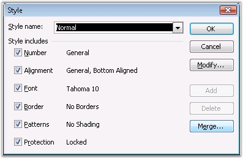
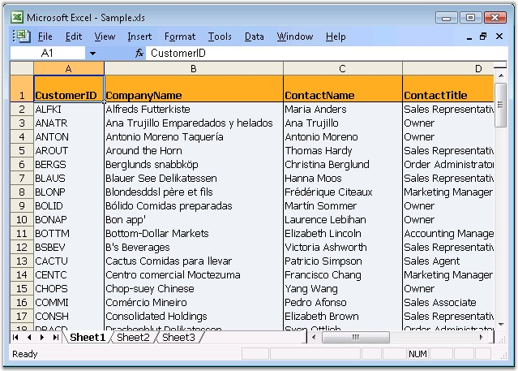

::: {style="DISPLAY: none"}
{#d2h_url_template}{#d2h_package_url style="WIDTH: 0px; DISPLAY: none; HEIGHT: 0px"}
:::

::::: {.d2h_secondary_topic style="PADDING-BOTTOM: 10pt; MARGIN: 0pt; PADDING-LEFT: 0pt; PADDING-RIGHT: 0pt; PADDING-TOP: 0pt"}
##### Cell Styles {#cell-styles style="tab-stops: 0pt"}

 

[]{#p45}Microsoft Excel provides users, the ability to create and apply styles to cells, by accruing a few benefits. First, it gives the users a way to create a consistent-looking document, without the need to do plenty of direct formatting. Second, it gives the users the ability to quickly change the formatting of all cells that use a particular style.

 

This section explains various styles created by using XlsIO. Following are the styles discussed in this section.

 

###### []{#_Default_Styles}4.1.1.6.1.1 Default Styles {#default-styles style="tab-stops: 0pt"}

 

Microsoft Excel provides support to create styles by using the **Style** dialog box (Go to the **Format** menu and click **Styles** command). It also permits to modify and add new styles, which can be applied to a range of cells.

 

{border="0"}

Figure 44: Style Dialog Box[]{style="FONT-FAMILY: 'Trebuchet MS','sans-serif'; COLOR: #15428b"}

 

Applying Default style in XlsIO

 

XlsIO provides various ways to apply styles. **IStyle** interface is used for creating styles. You can set the default styles created with groups of styles to a range of rows and columns. This is the most optimized approach to format rows and columns with large number of cells with same styles.

 

Following code example illustrates how to create and apply default styles for a range of rows and columns.

 

+----------------------------------------------------------------------------------------------------------------------------------------------------------------------------------+
| **[\[C#\]]{style="FONT-FAMILY: 'Courier New'"}**                                                                                                                                 |
|                                                                                                                                                                                  |
| **[]{style="FONT-FAMILY: 'Courier New'"}**                                                                                                                                       |
|                                                                                                                                                                                  |
| [// Define the default styles that need to be applied to rows and columns.]{style="FONT-FAMILY: 'Courier New'; COLOR: green"}                                                    |
|                                                                                                                                                                                  |
| [IStyle]{style="FONT-FAMILY: 'Courier New'; COLOR: #2b91af"}[ rowStyle = workbook.Styles.Add([\"RowStyle\"]{style="COLOR: #a31515"});]{style="FONT-FAMILY: 'Courier New'"}       |
|                                                                                                                                                                                  |
| [rowStyle.Color = [Color]{style="COLOR: #2b91af"}.LightCoral;]{style="FONT-FAMILY: 'Courier New'"}                                                                               |
|                                                                                                                                                                                  |
| [IStyle]{style="FONT-FAMILY: 'Courier New'; COLOR: #2b91af"}[ columnStyle = workbook.Styles.Add([\"ColumnStyle\"]{style="COLOR: #a31515"});]{style="FONT-FAMILY: 'Courier New'"} |
|                                                                                                                                                                                  |
| [columnStyle.Color = [Color]{style="COLOR: #2b91af"}.Orange;]{style="FONT-FAMILY: 'Courier New'"}                                                                                |
|                                                                                                                                                                                  |
| []{style="FONT-FAMILY: 'Courier New'"}                                                                                                                                           |
|                                                                                                                                                                                  |
| [//Set Column Default Style]{style="FONT-FAMILY: 'Courier New'; COLOR: green"}                                                                                                   |
|                                                                                                                                                                                  |
| [sheet.SetDefaultRowStyle(1, 2, rowStyle);]{style="FONT-FAMILY: 'Courier New'"}                                                                                                  |
|                                                                                                                                                                                  |
| []{style="FONT-FAMILY: 'Courier New'"}                                                                                                                                           |
|                                                                                                                                                                                  |
| [//Set Column Default Style]{style="FONT-FAMILY: 'Courier New'; COLOR: green"}                                                                                                   |
|                                                                                                                                                                                  |
| [sheet.SetDefaultColumnStyle(1, 2, columnStyle); [     ]{style="COLOR: black"}     ]{style="FONT-FAMILY: 'Courier New'"}                                                         |
+----------------------------------------------------------------------------------------------------------------------------------------------------------------------------------+

[]{style="FONT-FAMILY: 'Trebuchet MS','sans-serif'; COLOR: #15428b; FONT-SIZE: 9pt"} 

+-----------------------------------------------------------------------------------------------------------------------------------------------------------------------------------------------------------+
| **[\[VB.NET\]]{style="FONT-FAMILY: 'Courier New'"}**                                                                                                                                                      |
|                                                                                                                                                                                                           |
| **[]{style="FONT-FAMILY: 'Courier New'"}**                                                                                                                                                                |
|                                                                                                                                                                                                           |
| [\'Define the default styles that need to be applied to rows and columns]{style="FONT-FAMILY: 'Courier New'; COLOR: green"}                                                                               |
|                                                                                                                                                                                                           |
| [Dim]{style="FONT-FAMILY: 'Courier New'; COLOR: blue"}[ rowStyle [As]{style="COLOR: blue"} IStyle = workbook.Styles.Add([\"RowStyle\"]{style="COLOR: maroon"})]{style="FONT-FAMILY: 'Courier New'"}       |
|                                                                                                                                                                                                           |
| [rowStyle.Color = Color.LightCoral]{style="FONT-FAMILY: 'Courier New'"}                                                                                                                                   |
|                                                                                                                                                                                                           |
| [Dim]{style="FONT-FAMILY: 'Courier New'; COLOR: blue"}[ columnStyle [As]{style="COLOR: blue"} IStyle = workbook.Styles.Add([\"ColumnStyle\"]{style="COLOR: maroon"})]{style="FONT-FAMILY: 'Courier New'"} |
|                                                                                                                                                                                                           |
| [columnStyle.Color = Color.Orange]{style="FONT-FAMILY: 'Courier New'"}                                                                                                                                    |
|                                                                                                                                                                                                           |
| []{style="FONT-FAMILY: 'Courier New'"}                                                                                                                                                                    |
|                                                                                                                                                                                                           |
| [\'Set Column Default Style]{style="FONT-FAMILY: 'Courier New'; COLOR: green"}                                                                                                                            |
|                                                                                                                                                                                                           |
| [sheet.SetDefaultRowStyle(1, 2, rowStyle)]{style="FONT-FAMILY: 'Courier New'"}                                                                                                                            |
|                                                                                                                                                                                                           |
| []{style="FONT-FAMILY: 'Courier New'"}                                                                                                                                                                    |
|                                                                                                                                                                                                           |
| [\'Set Column Default Style]{style="FONT-FAMILY: 'Courier New'; COLOR: green"}                                                                                                                            |
|                                                                                                                                                                                                           |
| [sheet.SetDefaultColumnStyle(1, 2, columnStyle)]{style="FONT-FAMILY: 'Courier New'"}                                                                                                                      |
+-----------------------------------------------------------------------------------------------------------------------------------------------------------------------------------------------------------+

[]{style="FONT-FAMILY: 'Trebuchet MS','sans-serif'; COLOR: #15428b; FONT-SIZE: 9pt"} 

::: {style="BORDER-BOTTOM: windowtext 1pt solid; BORDER-LEFT: medium none; PADDING-BOTTOM: 1pt; MARGIN-TOP: 9pt; PADDING-LEFT: 0pt; PADDING-RIGHT: 0pt; MARGIN-BOTTOM: 9pt; BORDER-TOP: windowtext 1pt solid; BORDER-RIGHT: medium none; PADDING-TOP: 1pt"}
{border="0"}Note: Applying custom styles will override the original styles.
:::

[]{style="FONT-FAMILY: 'Trebuchet MS','sans-serif'; COLOR: #15428b; FONT-SIZE: 9pt"} 

See Also

[]{style="FONT-FAMILY: 'Trebuchet MS','sans-serif'; COLOR: #15428b; FONT-SIZE: 9pt"} 

[[Global Styles]{.UGHyperlink}](#p46)[]{.UGHyperlink}

 

###### []{#p46}[]{#_Global_Styles}4.1.1.6.1.2 Global Styles {#global-styles style="tab-stops: 0pt"}

 

XlsIO provides support for adding and modifying common (or global) styles that can be applied to one or more cells in a workbook. These styles can be created and applied to several ranges of cells in the workbook. Note that the usage of common styles to format spreadsheets is the recommended approach, since setting a separate style for each cell can reduce the performance considerably.

 

::: {style="BORDER-BOTTOM: windowtext 1pt solid; BORDER-LEFT: medium none; PADDING-BOTTOM: 1pt; MARGIN-TOP: 9pt; PADDING-LEFT: 0pt; PADDING-RIGHT: 0pt; MARGIN-BOTTOM: 9pt; BORDER-TOP: windowtext 1pt solid; BORDER-RIGHT: medium none; PADDING-TOP: 1pt"}
{border="0"}Note: If you want to apply more than one style for cells, enclose the style within the Begin and End calls. This will improve the performance.
:::

[]{style="FONT-FAMILY: 'Trebuchet MS','sans-serif'; COLOR: #15428b; FONT-SIZE: 9pt"} 

+----------------------------------------------------------------------------------------------------------------------------------------------------------------------------------+
| **[\[C#\]]{style="FONT-FAMILY: 'Courier New'"}**                                                                                                                                 |
|                                                                                                                                                                                  |
| **[]{style="FONT-FAMILY: 'Courier New'"}**                                                                                                                                       |
|                                                                                                                                                                                  |
| [// Formatting]{style="FONT-FAMILY: 'Courier New'; COLOR: green"}                                                                                                                |
|                                                                                                                                                                                  |
| []{style="FONT-FAMILY: 'Courier New'; COLOR: green"}                                                                                                                             |
|                                                                                                                                                                                  |
| [// Global styles should be used when the same style needs to be applied to more than ]{style="FONT-FAMILY: 'Courier New'; COLOR: green"}                                        |
|                                                                                                                                                                                  |
| [// one cell. This usage of a global style reduces memory usage.]{style="FONT-FAMILY: 'Courier New'; COLOR: green"}                                                              |
|                                                                                                                                                                                  |
| []{style="FONT-FAMILY: 'Courier New'; COLOR: green"}                                                                                                                             |
|                                                                                                                                                                                  |
| [// Header Style]{style="FONT-FAMILY: 'Courier New'; COLOR: green"}                                                                                                              |
|                                                                                                                                                                                  |
| [IStyle]{style="FONT-FAMILY: 'Courier New'; COLOR: #2b91af"}[ headerStyle = workbook.Styles.Add([\"HeaderStyle\"]{style="COLOR: #a31515"});]{style="FONT-FAMILY: 'Courier New'"} |
|                                                                                                                                                                                  |
| []{style="FONT-FAMILY: 'Courier New'"}                                                                                                                                           |
|                                                                                                                                                                                  |
| [// Add custom colors to the palette.]{style="FONT-FAMILY: 'Courier New'; COLOR: green"}                                                                                         |
|                                                                                                                                                                                  |
| [headerStyle.BeginUpdate();]{style="FONT-FAMILY: 'Courier New'"}                                                                                                                 |
|                                                                                                                                                                                  |
| [workbook.SetPaletteColor(8, [Color]{style="COLOR: #2b91af"}.FromArgb(255, 174, 33));]{style="FONT-FAMILY: 'Courier New'"}                                                       |
|                                                                                                                                                                                  |
| [headerStyle.Color = [Color]{style="COLOR: #2b91af"}.FromArgb(255, 174, 33);]{style="FONT-FAMILY: 'Courier New'"}                                                                |
|                                                                                                                                                                                  |
| [headerStyle.Font.Bold = [true]{style="COLOR: blue"};]{style="FONT-FAMILY: 'Courier New'"}                                                                                       |
|                                                                                                                                                                                  |
| [headerStyle.Borders\[[ExcelBordersIndex]{style="COLOR: #2b91af"}.EdgeLeft\].LineStyle = [ExcelLineStyle]{style="COLOR: #2b91af"}.Thin;]{style="FONT-FAMILY: 'Courier New'"}     |
|                                                                                                                                                                                  |
| [headerStyle.Borders\[[ExcelBordersIndex]{style="COLOR: #2b91af"}.EdgeRight\].LineStyle = [ExcelLineStyle]{style="COLOR: #2b91af"}.Thin;]{style="FONT-FAMILY: 'Courier New'"}    |
|                                                                                                                                                                                  |
| [headerStyle.Borders\[[ExcelBordersIndex]{style="COLOR: #2b91af"}.EdgeTop\].LineStyle = [ExcelLineStyle]{style="COLOR: #2b91af"}.Thin;]{style="FONT-FAMILY: 'Courier New'"}      |
|                                                                                                                                                                                  |
| [headerStyle.Borders\[[ExcelBordersIndex]{style="COLOR: #2b91af"}.EdgeBottom\].LineStyle = [ExcelLineStyle]{style="COLOR: #2b91af"}.Thin;]{style="FONT-FAMILY: 'Courier New'"}   |
|                                                                                                                                                                                  |
| [headerStyle.EndUpdate();]{style="FONT-FAMILY: 'Courier New'"}                                                                                                                   |
|                                                                                                                                                                                  |
| []{style="FONT-FAMILY: 'Courier New'"}                                                                                                                                           |
|                                                                                                                                                                                  |
| [// Body Style]{style="FONT-FAMILY: 'Courier New'; COLOR: green"}                                                                                                                |
|                                                                                                                                                                                  |
| [IStyle]{style="FONT-FAMILY: 'Courier New'; COLOR: #2b91af"}[ bodyStyle = workbook.Styles.Add([\"BodyStyle\"]{style="COLOR: #a31515"});]{style="FONT-FAMILY: 'Courier New'"}     |
|                                                                                                                                                                                  |
| []{style="FONT-FAMILY: 'Courier New'"}                                                                                                                                           |
|                                                                                                                                                                                  |
| [// Add custom colors to the palette.]{style="FONT-FAMILY: 'Courier New'; COLOR: green"}                                                                                         |
|                                                                                                                                                                                  |
| [bodyStyle.BeginUpdate();]{style="FONT-FAMILY: 'Courier New'"}                                                                                                                   |
|                                                                                                                                                                                  |
| [workbook.SetPaletteColor(9, [Color]{style="COLOR: #2b91af"}.FromArgb(239, 243, 247));]{style="FONT-FAMILY: 'Courier New'"}                                                      |
|                                                                                                                                                                                  |
| [bodyStyle.Color = [Color]{style="COLOR: #2b91af"}.FromArgb(239, 243, 247);]{style="FONT-FAMILY: 'Courier New'"}                                                                 |
|                                                                                                                                                                                  |
| [bodyStyle.Borders\[[ExcelBordersIndex]{style="COLOR: #2b91af"}.EdgeLeft\].LineStyle = [ExcelLineStyle]{style="COLOR: #2b91af"}.Thin;]{style="FONT-FAMILY: 'Courier New'"}       |
|                                                                                                                                                                                  |
| [bodyStyle.Borders\[[ExcelBordersIndex]{style="COLOR: #2b91af"}.EdgeRight\].LineStyle = [ExcelLineStyle]{style="COLOR: #2b91af"}.Thin;]{style="FONT-FAMILY: 'Courier New'"}      |
|                                                                                                                                                                                  |
| [bodyStyle.EndUpdate();]{style="FONT-FAMILY: 'Courier New'"}                                                                                                                     |
|                                                                                                                                                                                  |
| []{style="FONT-FAMILY: 'Courier New'"}                                                                                                                                           |
|                                                                                                                                                                                  |
| [// Apply the defined styles.]{style="FONT-FAMILY: 'Courier New'; COLOR: green"}                                                                                                 |
|                                                                                                                                                                                  |
| [// Apply Body Style.]{style="FONT-FAMILY: 'Courier New'; COLOR: green"}                                                                                                         |
|                                                                                                                                                                                  |
| [sheet.UsedRange.CellStyleName = [\"BodyStyle\"]{style="COLOR: #a31515"};]{style="FONT-FAMILY: 'Courier New'"}                                                                   |
|                                                                                                                                                                                  |
| []{style="FONT-FAMILY: 'Courier New'"}                                                                                                                                           |
|                                                                                                                                                                                  |
| [// Apply Header style.]{style="FONT-FAMILY: 'Courier New'; COLOR: green"}                                                                                                       |
|                                                                                                                                                                                  |
| [sheet.Rows\[0\].CellStyleName = [\"HeaderStyle\"]{style="COLOR: #a31515"};  ]{style="FONT-FAMILY: 'Courier New'"}                                                               |
+----------------------------------------------------------------------------------------------------------------------------------------------------------------------------------+

[]{style="FONT-FAMILY: 'Trebuchet MS','sans-serif'; COLOR: #15428b; FONT-SIZE: 9pt"} 

+------------------------------------------------------------------------------------------------------------------------------------------------------------------------------------------------------------+
| **[\[VB.NET\]]{style="FONT-FAMILY: 'Courier New'"}**                                                                                                                                                       |
|                                                                                                                                                                                                            |
| **[]{style="FONT-FAMILY: 'Courier New'"}**                                                                                                                                                                 |
|                                                                                                                                                                                                            |
| [\' Formatting]{style="FONT-FAMILY: 'Courier New'; COLOR: green"}                                                                                                                                          |
|                                                                                                                                                                                                            |
| []{style="FONT-FAMILY: 'Courier New'; COLOR: green"}                                                                                                                                                       |
|                                                                                                                                                                                                            |
| [\' Global styles should be used when the same style needs to be applied to more than ]{style="FONT-FAMILY: 'Courier New'; COLOR: green"}                                                                  |
|                                                                                                                                                                                                            |
| [\' one cell. This usage of a global style reduces memory usage.]{style="FONT-FAMILY: 'Courier New'; COLOR: green"}                                                                                        |
|                                                                                                                                                                                                            |
| []{style="FONT-FAMILY: 'Courier New'; COLOR: green"}                                                                                                                                                       |
|                                                                                                                                                                                                            |
| [\' Header Style]{style="FONT-FAMILY: 'Courier New'; COLOR: green"}                                                                                                                                        |
|                                                                                                                                                                                                            |
| [Dim]{style="FONT-FAMILY: 'Courier New'; COLOR: blue"}[ headerStyle [As]{style="COLOR: blue"} IStyle = workbook.Styles.Add([\"Header Style\"]{style="COLOR: maroon"})]{style="FONT-FAMILY: 'Courier New'"} |
|                                                                                                                                                                                                            |
| []{style="FONT-FAMILY: 'Courier New'"}                                                                                                                                                                     |
|                                                                                                                                                                                                            |
| [\' Add custom colors to the palette.]{style="FONT-FAMILY: 'Courier New'; COLOR: green"}                                                                                                                   |
|                                                                                                                                                                                                            |
| [headerStyle.BeginUpdate()]{style="FONT-FAMILY: 'Courier New'"}                                                                                                                                            |
|                                                                                                                                                                                                            |
| [workbook.SetPaletteColor(8,Color.FromArgb(255,174,33))]{style="FONT-FAMILY: 'Courier New'"}                                                                                                               |
|                                                                                                                                                                                                            |
| [headerStyle.Color = Color.FromArgb(255,174,33)]{style="FONT-FAMILY: 'Courier New'"}                                                                                                                       |
|                                                                                                                                                                                                            |
| [headerStyle.Font.Bold = [True]{style="COLOR: blue"}]{style="FONT-FAMILY: 'Courier New'"}                                                                                                                  |
|                                                                                                                                                                                                            |
| [headerStyle.Borders(ExcelBordersIndex.EdgeLeft).LineStyle = ExcelLineStyle.Thin]{style="FONT-FAMILY: 'Courier New'"}                                                                                      |
|                                                                                                                                                                                                            |
| [headerStyle.Borders(ExcelBordersIndex.EdgeRight).LineStyle = ExcelLineStyle.Thin]{style="FONT-FAMILY: 'Courier New'"}                                                                                     |
|                                                                                                                                                                                                            |
| [headerStyle.Borders(ExcelBordersIndex.EdgeTop).LineStyle = ExcelLineStyle.Thin]{style="FONT-FAMILY: 'Courier New'"}                                                                                       |
|                                                                                                                                                                                                            |
| [headerStyle.Borders(ExcelBordersIndex.EdgeBottom).LineStyle = ExcelLineStyle.Thin]{style="FONT-FAMILY: 'Courier New'"}                                                                                    |
|                                                                                                                                                                                                            |
| [headerStyle.EndUpdate()]{style="FONT-FAMILY: 'Courier New'"}                                                                                                                                              |
|                                                                                                                                                                                                            |
| []{style="FONT-FAMILY: 'Courier New'"}                                                                                                                                                                     |
|                                                                                                                                                                                                            |
| [\' Body Style]{style="FONT-FAMILY: 'Courier New'; COLOR: green"}                                                                                                                                          |
|                                                                                                                                                                                                            |
| [Dim]{style="FONT-FAMILY: 'Courier New'; COLOR: blue"}[ bodyStyle [As]{style="COLOR: blue"} IStyle = workbook.Styles.Add([\"BodyStyle\"]{style="COLOR: maroon"})]{style="FONT-FAMILY: 'Courier New'"}      |
|                                                                                                                                                                                                            |
| []{style="FONT-FAMILY: 'Courier New'"}                                                                                                                                                                     |
|                                                                                                                                                                                                            |
| [\' Add custom colors to the palette.]{style="FONT-FAMILY: 'Courier New'; COLOR: green"}                                                                                                                   |
|                                                                                                                                                                                                            |
| [bodyStyle.BeginUpdate()]{style="FONT-FAMILY: 'Courier New'"}                                                                                                                                              |
|                                                                                                                                                                                                            |
| [workbook.SetPaletteColor(9,Color.FromArgb(239,243,247))]{style="FONT-FAMILY: 'Courier New'"}                                                                                                              |
|                                                                                                                                                                                                            |
| [bodyStyle.Color = Color.FromArgb(239,243,247)]{style="FONT-FAMILY: 'Courier New'"}                                                                                                                        |
|                                                                                                                                                                                                            |
| [bodyStyle.Borders(ExcelBordersIndex.EdgeLeft).LineStyle = ExcelLineStyle.Thin]{style="FONT-FAMILY: 'Courier New'"}                                                                                        |
|                                                                                                                                                                                                            |
| [bodyStyle.Borders(ExcelBordersIndex.EdgeRight).LineStyle = ExcelLineStyle.Thin]{style="FONT-FAMILY: 'Courier New'"}                                                                                       |
|                                                                                                                                                                                                            |
| [bodyStyle.EndUpdate()]{style="FONT-FAMILY: 'Courier New'"}                                                                                                                                                |
|                                                                                                                                                                                                            |
| []{style="FONT-FAMILY: 'Courier New'"}                                                                                                                                                                     |
|                                                                                                                                                                                                            |
| [\' Apply the defined styles.]{style="FONT-FAMILY: 'Courier New'; COLOR: green"}                                                                                                                           |
|                                                                                                                                                                                                            |
| [\' Apply Body Style.]{style="FONT-FAMILY: 'Courier New'; COLOR: green"}                                                                                                                                   |
|                                                                                                                                                                                                            |
| [sheet.UsedRange.CellStyleName = [\"BodyStyle\"]{style="COLOR: #a31515"}]{style="FONT-FAMILY: 'Courier New'"}                                                                                              |
|                                                                                                                                                                                                            |
| []{style="FONT-FAMILY: 'Courier New'"}                                                                                                                                                                     |
|                                                                                                                                                                                                            |
| [\' Apply Header style.]{style="FONT-FAMILY: 'Courier New'; COLOR: green"}                                                                                                                                 |
|                                                                                                                                                                                                            |
| [sheet.Rows\[0\].CellStyleName = [\"HeaderStyle\"]{style="COLOR: #a31515"}]{style="FONT-FAMILY: 'Courier New'"}                                                                                            |
+------------------------------------------------------------------------------------------------------------------------------------------------------------------------------------------------------------+

[]{style="FONT-FAMILY: 'Trebuchet MS','sans-serif'; COLOR: #15428b; FONT-SIZE: 9pt"} 

{border="0"}

Figure 45: XlsIO with Global Styles[]{style="FONT-FAMILY: 'Trebuchet MS','sans-serif'; COLOR: #15428b"}

**[]{style="FONT-FAMILY: 'Trebuchet MS','sans-serif'; COLOR: #15428b; FONT-SIZE: 9pt"}** 

**[]{style="FONT-FAMILY: 'Trebuchet MS','sans-serif'; COLOR: #15428b; FONT-SIZE: 9pt"}** 

For More Information Refer:

**[]{style="FONT-FAMILY: 'Trebuchet MS','sans-serif'; COLOR: #15428b; FONT-SIZE: 9pt"}** 

[[Default Styles]{.UGHyperlink}]()[]{.UGHyperlink}

 

 

[]{#related-topics}
:::::
