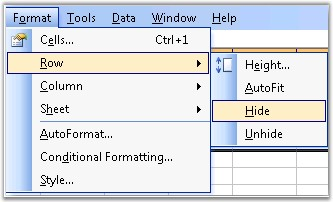
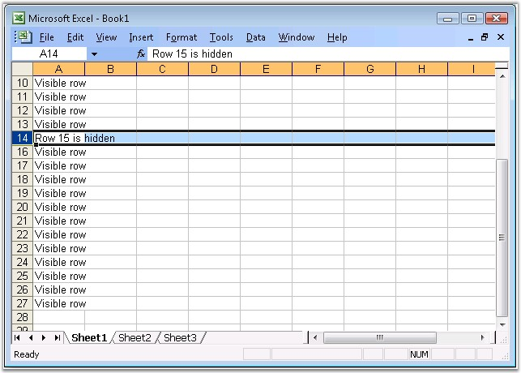
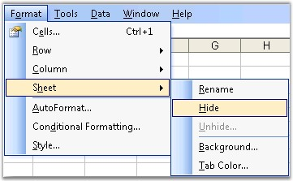
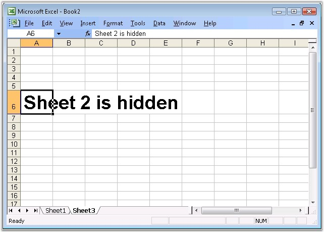

::: {style="DISPLAY: none"}
{#d2h_url_template}{#d2h_package_url style="WIDTH: 0px; DISPLAY: none; HEIGHT: 0px"}
:::

:::: {.d2h_secondary_topic style="PADDING-BOTTOM: 10pt; MARGIN: 0pt; PADDING-LEFT: 0pt; PADDING-RIGHT: 0pt; PADDING-TOP: 0pt"}
##### Cell Visibility {#cell-visibility style="tab-stops: 0pt"}

[]{style="FONT-FAMILY: 'Trebuchet MS','sans-serif'; COLOR: #15428b; FONT-SIZE: 9pt"} 

Controlling the visibility of a cell is one of the most useful features in MS Excel. It allows to show/hide the rows and columns according to the needs of the user, and produce fairly readable content, when there is large data in the worksheet.

 

Following section explains the support provided by XlsIO to hide/unhide sheets and rows/columns.

 

 

###### []{#p60}4.1.3.3.2.1 Hide/Unhide Rows and Columns {#hideunhide-rows-and-columns style="tab-stops: 0pt"}

 

Excel allows to hide a row/column by using the Hide command, but a row or column also becomes hidden when you change its row height or column width to zero. Also, you can show a hidden row/column by using the Unhide command.

 

{border="0"}

Figure 65: Hiding a row[]{style="FONT-FAMILY: 'Trebuchet MS','sans-serif'; COLOR: #15428b"}

 

Hiding and Unhiding Rows in XlsIO

 

XlsIO provides support for hiding/unhiding rows and columns. This can be done by using **ShowRow** and **ShowColumn** methods.

 

+------------------------------------------------------------------------------------------------------------------------------------------------------------------------------------------+
| **[\[C#\]]{style="FONT-FAMILY: 'Courier New'"}**                                                                                                                                         |
|                                                                                                                                                                                          |
| **[]{style="FONT-FAMILY: 'Courier New'"}**                                                                                                                                               |
|                                                                                                                                                                                          |
| [// Hiding the First Column and Second Row.]{style="FONT-FAMILY: 'Courier New'; COLOR: green"}                                                                                           |
|                                                                                                                                                                                          |
| [sheet.ShowColumn( 1, ]{style="FONT-FAMILY: 'Courier New'; COLOR: black"}[false]{style="FONT-FAMILY: 'Courier New'; COLOR: blue"}[ );]{style="FONT-FAMILY: 'Courier New'; COLOR: black"} |
|                                                                                                                                                                                          |
| [sheet.ShowRow( 2, ]{style="FONT-FAMILY: 'Courier New'; COLOR: black"}[false]{style="FONT-FAMILY: 'Courier New'; COLOR: blue"}[ );]{style="FONT-FAMILY: 'Courier New'; COLOR: black"}    |
|                                                                                                                                                                                          |
| []{style="FONT-FAMILY: 'Courier New'"}                                                                                                                                                   |
|                                                                                                                                                                                          |
| [// Hiding the Fifth Column and Fifth Row.]{style="FONT-FAMILY: 'Courier New'; COLOR: green"}                                                                                            |
|                                                                                                                                                                                          |
| [sheet.ShowColumn( 5, ]{style="FONT-FAMILY: 'Courier New'; COLOR: black"}[false]{style="FONT-FAMILY: 'Courier New'; COLOR: blue"}[ );]{style="FONT-FAMILY: 'Courier New'; COLOR: black"} |
|                                                                                                                                                                                          |
| [sheet.ShowRow( 5, ]{style="FONT-FAMILY: 'Courier New'; COLOR: black"}[false]{style="FONT-FAMILY: 'Courier New'; COLOR: blue"}[ );]{style="FONT-FAMILY: 'Courier New'; COLOR: black"}    |
|                                                                                                                                                                                          |
| []{style="FONT-FAMILY: 'Courier New'"}                                                                                                                                                   |
|                                                                                                                                                                                          |
| [// Unhiding the Fifth Column and Second Row.]{style="FONT-FAMILY: 'Courier New'; COLOR: green"}                                                                                         |
|                                                                                                                                                                                          |
| [sheet.ShowColumn( 5, ]{style="FONT-FAMILY: 'Courier New'; COLOR: black"}[true]{style="FONT-FAMILY: 'Courier New'; COLOR: blue"}[ );]{style="FONT-FAMILY: 'Courier New'; COLOR: black"}  |
|                                                                                                                                                                                          |
| [sheet.ShowRow( 2, ]{style="FONT-FAMILY: 'Courier New'; COLOR: black"}[true]{style="FONT-FAMILY: 'Courier New'; COLOR: blue"}[ );]{style="FONT-FAMILY: 'Courier New'; COLOR: black"}     |
+------------------------------------------------------------------------------------------------------------------------------------------------------------------------------------------+

[]{style="FONT-FAMILY: 'Trebuchet MS','sans-serif'; COLOR: #15428b; FONT-SIZE: 9pt"} 

+---------------------------------------------------------------------------------------------------------------------------------------------------------------------------------------+
| **[\[VB.NET\]]{style="FONT-FAMILY: 'Courier New'"}**                                                                                                                                  |
|                                                                                                                                                                                       |
| **[]{style="FONT-FAMILY: 'Courier New'"}**                                                                                                                                            |
|                                                                                                                                                                                       |
| [\' Hiding the First Column and Second Row.]{style="FONT-FAMILY: 'Courier New'; COLOR: green"}                                                                                        |
|                                                                                                                                                                                       |
| [sheet.ShowColumn(1, ]{style="FONT-FAMILY: 'Courier New'; COLOR: black"}[False]{style="FONT-FAMILY: 'Courier New'; COLOR: blue"}[)]{style="FONT-FAMILY: 'Courier New'; COLOR: black"} |
|                                                                                                                                                                                       |
| [sheet.ShowRow(2, ]{style="FONT-FAMILY: 'Courier New'; COLOR: black"}[False]{style="FONT-FAMILY: 'Courier New'; COLOR: blue"}[)]{style="FONT-FAMILY: 'Courier New'; COLOR: black"}    |
|                                                                                                                                                                                       |
| []{style="FONT-FAMILY: 'Courier New'"}                                                                                                                                                |
|                                                                                                                                                                                       |
| [\' Hiding the Fifth Column and Fifth Row.]{style="FONT-FAMILY: 'Courier New'; COLOR: green"}                                                                                         |
|                                                                                                                                                                                       |
| [sheet.ShowColumn(5, ]{style="FONT-FAMILY: 'Courier New'; COLOR: black"}[False]{style="FONT-FAMILY: 'Courier New'; COLOR: blue"}[)]{style="FONT-FAMILY: 'Courier New'; COLOR: black"} |
|                                                                                                                                                                                       |
| [sheet.ShowRow(5, ]{style="FONT-FAMILY: 'Courier New'; COLOR: black"}[False]{style="FONT-FAMILY: 'Courier New'; COLOR: blue"}[)]{style="FONT-FAMILY: 'Courier New'; COLOR: black"}    |
|                                                                                                                                                                                       |
| []{style="FONT-FAMILY: 'Courier New'"}                                                                                                                                                |
|                                                                                                                                                                                       |
| [\' Unhiding the Fifth Column and Second Row.]{style="FONT-FAMILY: 'Courier New'; COLOR: green"}                                                                                      |
|                                                                                                                                                                                       |
| [sheet.ShowColumn(5, ]{style="FONT-FAMILY: 'Courier New'; COLOR: black"}[True]{style="FONT-FAMILY: 'Courier New'; COLOR: blue"}[)]{style="FONT-FAMILY: 'Courier New'; COLOR: black"}  |
|                                                                                                                                                                                       |
| [sheet.ShowRow(2, ]{style="FONT-FAMILY: 'Courier New'; COLOR: black"}[True]{style="FONT-FAMILY: 'Courier New'; COLOR: blue"}[)]{style="FONT-FAMILY: 'Courier New'; COLOR: black"}     |
+---------------------------------------------------------------------------------------------------------------------------------------------------------------------------------------+

[]{style="FONT-FAMILY: 'Trebuchet MS','sans-serif'; COLOR: #15428b; FONT-SIZE: 9pt"} 

{border="0"}

Figure 66: Worksheet with a hidden row

 

XlsIO also provides options to provide focus to a particular row/column, when it is opened by using the **TopVisibleRow** and **LeftVisibleColumn** properties respectively.

 

+----------------------------------------------------------------------------------------+
| **[\[C#\]]{style="FONT-FAMILY: 'Courier New'"}**                                       |
|                                                                                        |
| []{style="FONT-FAMILY: 'Courier New'"}                                                 |
|                                                                                        |
| [//Scrolls to 40th row]{style="FONT-FAMILY: 'Courier New'; COLOR: green"}              |
|                                                                                        |
| [sheet.TopVisibleRow = 40;]{style="FONT-FAMILY: 'Courier New'"}                        |
|                                                                                        |
| []{style="FONT-FAMILY: 'Courier New'"}                                                 |
|                                                                                        |
| [//Scrolls to 7 column when opening]{style="FONT-FAMILY: 'Courier New'; COLOR: green"} |
|                                                                                        |
| [sheet.LeftVisibleColumn = 7;  ]{style="FONT-FAMILY: 'Courier New'"}                   |
+----------------------------------------------------------------------------------------+

[]{style="FONT-FAMILY: 'Trebuchet MS','sans-serif'; COLOR: #15428b; FONT-SIZE: 9pt"} 

+----------------------------------------------------------------------------------------+
| **[\[VB.NET\]]{style="FONT-FAMILY: 'Courier New'"}**                                   |
|                                                                                        |
| []{style="FONT-FAMILY: 'Courier New'"}                                                 |
|                                                                                        |
| [\'Scrolls to 40th row]{style="FONT-FAMILY: 'Courier New'; COLOR: green"}              |
|                                                                                        |
| [sheet.TopVisibleRow = 40]{style="FONT-FAMILY: 'Courier New'"}                         |
|                                                                                        |
| []{style="FONT-FAMILY: 'Courier New'"}                                                 |
|                                                                                        |
| [\'Scrolls to 7 column when opening]{style="FONT-FAMILY: 'Courier New'; COLOR: green"} |
|                                                                                        |
| [sheet.LeftVisibleColumn = 7]{style="FONT-FAMILY: 'Courier New'"}                      |
+----------------------------------------------------------------------------------------+

 

This is especially useful, when the spreadsheet has large number of records, and the user wants to view a particular row/column that has some details, without scrolling to that row/column after opening it. Note that these row and column indexes are \"one based**\"**.

 

###### []{#p61}4.1.3.3.2.2 Hide/Unhide Worksheet {#hideunhide-worksheet style="tab-stops: 0pt"}

 

Excel has the sheet tab bar that appears at the bottom of the screen with tab scrolling buttons displayed on the left side. Excel provides an option to show/hide a sheet from the user view. This is done by selecting the \"Hide\" item in the context menu of the sheet.

 

{border="0"}

Figure 67: Hiding a Worksheet[]{style="FONT-FAMILY: 'Trebuchet MS','sans-serif'; COLOR: #15428b"}

 

Hiding and Unhiding a Worksheet in XlsIO

 

XlsIO also allows to hide/unhide worksheets by using the **Visibility** property. Following APIs are used to hide/unhide worksheets.

[]{style="FONT-FAMILY: 'Trebuchet MS','sans-serif'; COLOR: #15428b; FONT-SIZE: 9pt"} 

+-------------------------------------------------------------------------------------------------------------+
| **[\[C#\]]{style="FONT-FAMILY: 'Courier New'"}**                                                            |
|                                                                                                             |
| **[]{style="FONT-FAMILY: 'Courier New'"}**                                                                  |
|                                                                                                             |
| [sheet.Visibility = [WorksheetVisibility]{style="COLOR: teal"}.Hidden;]{style="FONT-FAMILY: 'Courier New'"} |
+-------------------------------------------------------------------------------------------------------------+

[]{style="FONT-FAMILY: 'Courier New'; COLOR: black; FONT-SIZE: 9pt"} 

+------------------------------------------------------------------------------------------------------------+
| **[\[VB.NET\]]{style="FONT-FAMILY: 'Courier New'"}**                                                       |
|                                                                                                            |
| **[]{style="FONT-FAMILY: 'Courier New'"}**                                                                 |
|                                                                                                            |
| [sheet.Visibility = [WorksheetVisibility]{style="COLOR: teal"}.Hidden]{style="FONT-FAMILY: 'Courier New'"} |
+------------------------------------------------------------------------------------------------------------+

[]{style="FONT-FAMILY: 'Trebuchet MS','sans-serif'; COLOR: #15428b; FONT-SIZE: 9pt"} 

{border="0"}

Figure 68: Hidden Worksheet[]{style="FONT-FAMILY: 'Trebuchet MS','sans-serif'; COLOR: #15428b"}

[]{style="FONT-FAMILY: 'Courier New'; COLOR: black; FONT-SIZE: 9pt"} 

You can also hide all the tabs in the worksheet by using the **DisplayWorkbookTabs** option in the IWorkbook.

[]{style="FONT-FAMILY: 'Trebuchet MS','sans-serif'; COLOR: #15428b; FONT-SIZE: 9pt"} 

XlsIO also provides an option to activate a worksheet, while opening it in the workbook, which is equivalent to clicking a worksheet in MS Excel. This is done by using the **Activate** method.

**[]{style="COLOR: black"}** 

+-----------------------------------------------------------------------+
| **[\[C#\]]{style="FONT-FAMILY: 'Courier New'"}**                      |
|                                                                       |
| **[]{style="FONT-FAMILY: 'Courier New'"}**                            |
|                                                                       |
| [sheet.Activate();]{style="FONT-FAMILY: 'Courier New'"}               |
+-----------------------------------------------------------------------+

[]{style="FONT-FAMILY: 'Trebuchet MS','sans-serif'; COLOR: #15428b; FONT-SIZE: 9pt"} 

+-----------------------------------------------------------------------+
| **[\[VB.NET\]]{style="FONT-FAMILY: 'Courier New'"}**                  |
|                                                                       |
| **[]{style="FONT-FAMILY: 'Courier New'"}**                            |
|                                                                       |
| [sheet.Activate()]{style="FONT-FAMILY: 'Courier New'"}                |
+-----------------------------------------------------------------------+

 

 

###### 4.1.3.3.2.3 Adding Feature to show or hide a particular range of rows/columns {#adding-feature-to-show-or-hide-a-particular-range-of-rowscolumns style="tab-stops: 0pt"}

 

**Hiding and Unhiding Rows in XlsIO**

 

XlsIO provides support for hiding/unhiding rows and columns. This can be done by using **ShowRow**, **ShowColumn and ShowRange** methods as shown in the following code snippet:

 

+----------------------------------------------------------------------------------------------------------------------------------------------------------------------------------------------------------------+
| **[\[C#\]]{style="FONT-FAMILY: 'Courier New'"}**                                                                                                                                                               |
|                                                                                                                                                                                                                |
|                                                                                                                                                                                                                |
|                                                                                                                                                                                                                |
| [// Hiding the First Column and Second Row.]{style="FONT-FAMILY: 'Courier New'; COLOR: green"}                                                                                                                 |
|                                                                                                                                                                                                                |
| [sheet.ShowColumn( 1, ]{style="FONT-FAMILY: 'Courier New'; COLOR: black"}[false]{style="FONT-FAMILY: 'Courier New'; COLOR: blue"}[ );]{style="FONT-FAMILY: 'Courier New'; COLOR: black"}                       |
|                                                                                                                                                                                                                |
| [sheet.ShowRow( 2, ]{style="FONT-FAMILY: 'Courier New'; COLOR: black"}[false]{style="FONT-FAMILY: 'Courier New'; COLOR: blue"}[ );]{style="FONT-FAMILY: 'Courier New'; COLOR: black"}                          |
|                                                                                                                                                                                                                |
|                                                                                                                                                                                                                |
|                                                                                                                                                                                                                |
| [// Hiding the Fifth Column and Fifth Row.]{style="FONT-FAMILY: 'Courier New'; COLOR: green"}                                                                                                                  |
|                                                                                                                                                                                                                |
| [sheet.ShowColumn( 5, ]{style="FONT-FAMILY: 'Courier New'; COLOR: black"}[false]{style="FONT-FAMILY: 'Courier New'; COLOR: blue"}[ );]{style="FONT-FAMILY: 'Courier New'; COLOR: black"}                       |
|                                                                                                                                                                                                                |
| [sheet.ShowRow( 5, ]{style="FONT-FAMILY: 'Courier New'; COLOR: black"}[false]{style="FONT-FAMILY: 'Courier New'; COLOR: blue"}[ );]{style="FONT-FAMILY: 'Courier New'; COLOR: black"}                          |
|                                                                                                                                                                                                                |
|                                                                                                                                                                                                                |
|                                                                                                                                                                                                                |
| [// Unhiding the Fifth Column and Second Row.]{style="FONT-FAMILY: 'Courier New'; COLOR: green"}                                                                                                               |
|                                                                                                                                                                                                                |
| [sheet.ShowColumn( 5, ]{style="FONT-FAMILY: 'Courier New'; COLOR: black"}[true]{style="FONT-FAMILY: 'Courier New'; COLOR: blue"}[ );]{style="FONT-FAMILY: 'Courier New'; COLOR: black"}                        |
|                                                                                                                                                                                                                |
| [sheet.ShowRow( 2, ]{style="FONT-FAMILY: 'Courier New'; COLOR: black"}[true]{style="FONT-FAMILY: 'Courier New'; COLOR: blue"}[ );]{style="FONT-FAMILY: 'Courier New'; COLOR: black"}                           |
|                                                                                                                                                                                                                |
| []{style="FONT-FAMILY: 'Courier New'; COLOR: black"}                                                                                                                                                           |
|                                                                                                                                                                                                                |
| [IRange]{style="FONT-FAMILY: 'Courier New'; COLOR: #2b91af"}[ range = sheet\[1, 4\];]{style="FONT-FAMILY: 'Courier New'"}                                                                                      |
|                                                                                                                                                                                                                |
| [//Hiding the first to thrid row and first to thrid column]{style="FONT-FAMILY: 'Courier New'; COLOR: green"}[]{style="FONT-FAMILY: 'Courier New'"}                                                            |
|                                                                                                                                                                                                                |
| [sheet.ShowRange(range, [false]{style="COLOR: blue"});]{style="FONT-FAMILY: 'Courier New'"}                                                                                                                    |
|                                                                                                                                                                                                                |
| []{style="FONT-FAMILY: 'Courier New'"}                                                                                                                                                                         |
|                                                                                                                                                                                                                |
| [IRange]{style="FONT-FAMILY: 'Courier New'; COLOR: #2b91af"}[ firstRange = ws\[1, 1,3,3\];]{style="FONT-FAMILY: 'Courier New'"}                                                                                |
|                                                                                                                                                                                                                |
| [IRange]{style="FONT-FAMILY: 'Courier New'; COLOR: #2b91af"}[ secondRange = ws\[5, 5, 7, 7\];]{style="FONT-FAMILY: 'Courier New'"}                                                                             |
|                                                                                                                                                                                                                |
| [RangesCollection]{style="FONT-FAMILY: 'Courier New'; COLOR: #2b91af"}[ rangeCollection = [new]{style="COLOR: blue"} [RangesCollection]{style="COLOR: #2b91af"}(app, ws);]{style="FONT-FAMILY: 'Courier New'"} |
|                                                                                                                                                                                                                |
| [rangCollection.Add(firstRange);]{style="FONT-FAMILY: 'Courier New'"}                                                                                                                                          |
|                                                                                                                                                                                                                |
| [rangeCollection.Add(secondRange);]{style="FONT-FAMILY: 'Courier New'"}                                                                                                                                        |
|                                                                                                                                                                                                                |
| [//Hiding the collection of ranges]{style="FONT-FAMILY: 'Courier New'; COLOR: green"}                                                                                                                          |
|                                                                                                                                                                                                                |
| [ws.ShowRange(rangeCollection, [false]{style="COLOR: blue"});]{style="FONT-FAMILY: 'Courier New'"}                                                                                                             |
+----------------------------------------------------------------------------------------------------------------------------------------------------------------------------------------------------------------+

 

+----------------------------------------------------------------------------------------------------------------------------------------------------------------------------------------------------------------+
| **[\[VB.NET\]]{style="FONT-FAMILY: 'Courier New'"}**                                                                                                                                                           |
|                                                                                                                                                                                                                |
|                                                                                                                                                                                                                |
|                                                                                                                                                                                                                |
| [\'Hiding the First Column and Second Row.]{style="FONT-FAMILY: 'Courier New'; COLOR: green"}                                                                                                                  |
|                                                                                                                                                                                                                |
| [sheet.ShowColumn(1, ]{style="FONT-FAMILY: 'Courier New'; COLOR: black"}[False]{style="FONT-FAMILY: 'Courier New'; COLOR: blue"}[)]{style="FONT-FAMILY: 'Courier New'; COLOR: black"}                          |
|                                                                                                                                                                                                                |
| [sheet.ShowRow(2, ]{style="FONT-FAMILY: 'Courier New'; COLOR: black"}[False]{style="FONT-FAMILY: 'Courier New'; COLOR: blue"}[)]{style="FONT-FAMILY: 'Courier New'; COLOR: black"}                             |
|                                                                                                                                                                                                                |
|                                                                                                                                                                                                                |
|                                                                                                                                                                                                                |
| [\'Hiding the Fifth Column and Fifth Row.]{style="FONT-FAMILY: 'Courier New'; COLOR: green"}                                                                                                                   |
|                                                                                                                                                                                                                |
| [sheet.ShowColumn(5, ]{style="FONT-FAMILY: 'Courier New'; COLOR: black"}[False]{style="FONT-FAMILY: 'Courier New'; COLOR: blue"}[)]{style="FONT-FAMILY: 'Courier New'; COLOR: black"}                          |
|                                                                                                                                                                                                                |
| [sheet.ShowRow(5, ]{style="FONT-FAMILY: 'Courier New'; COLOR: black"}[False]{style="FONT-FAMILY: 'Courier New'; COLOR: blue"}[)]{style="FONT-FAMILY: 'Courier New'; COLOR: black"}                             |
|                                                                                                                                                                                                                |
|                                                                                                                                                                                                                |
|                                                                                                                                                                                                                |
| [\'Unhiding the Fifth Column and Second Row.]{style="FONT-FAMILY: 'Courier New'; COLOR: green"}                                                                                                                |
|                                                                                                                                                                                                                |
| [sheet.ShowColumn(5, ]{style="FONT-FAMILY: 'Courier New'; COLOR: black"}[True]{style="FONT-FAMILY: 'Courier New'; COLOR: blue"}[)]{style="FONT-FAMILY: 'Courier New'; COLOR: black"}                           |
|                                                                                                                                                                                                                |
| [sheet.ShowRow(2, ]{style="FONT-FAMILY: 'Courier New'; COLOR: black"}[True]{style="FONT-FAMILY: 'Courier New'; COLOR: blue"}[)]{style="FONT-FAMILY: 'Courier New'; COLOR: black"}                              |
|                                                                                                                                                                                                                |
| []{style="FONT-FAMILY: 'Courier New'; COLOR: black"}                                                                                                                                                           |
|                                                                                                                                                                                                                |
| [IRange]{style="FONT-FAMILY: 'Courier New'; COLOR: #2b91af"}[ range = sheet\[1, 4\];]{style="FONT-FAMILY: 'Courier New'"}                                                                                      |
|                                                                                                                                                                                                                |
| [//Hiding the first to thrid row and first to thrid column]{style="FONT-FAMILY: 'Courier New'; COLOR: green"}[]{style="FONT-FAMILY: 'Courier New'"}                                                            |
|                                                                                                                                                                                                                |
| [sheet.ShowRange(range, [false]{style="COLOR: blue"});]{style="FONT-FAMILY: 'Courier New'"}                                                                                                                    |
|                                                                                                                                                                                                                |
| []{style="FONT-FAMILY: 'Courier New'"}                                                                                                                                                                         |
|                                                                                                                                                                                                                |
| [IRange]{style="FONT-FAMILY: 'Courier New'; COLOR: #2b91af"}[ firstRange = ws\[1, 1,3,3\];]{style="FONT-FAMILY: 'Courier New'"}                                                                                |
|                                                                                                                                                                                                                |
| [IRange]{style="FONT-FAMILY: 'Courier New'; COLOR: #2b91af"}[ secondRange = ws\[5, 5, 7, 7\];]{style="FONT-FAMILY: 'Courier New'"}                                                                             |
|                                                                                                                                                                                                                |
| [RangesCollection]{style="FONT-FAMILY: 'Courier New'; COLOR: #2b91af"}[ rangeCollection = [new]{style="COLOR: blue"} [RangesCollection]{style="COLOR: #2b91af"}(app, ws);]{style="FONT-FAMILY: 'Courier New'"} |
|                                                                                                                                                                                                                |
| [rangCollection.Add(firstRange);]{style="FONT-FAMILY: 'Courier New'"}                                                                                                                                          |
|                                                                                                                                                                                                                |
| [rangeCollection.Add(secondRange);]{style="FONT-FAMILY: 'Courier New'"}                                                                                                                                        |
|                                                                                                                                                                                                                |
| [//Hiding the collection of ranges]{style="FONT-FAMILY: 'Courier New'; COLOR: green"}                                                                                                                          |
|                                                                                                                                                                                                                |
| [ws.ShowRange(rangeCollection, [false]{style="COLOR: blue"});]{style="FONT-FAMILY: 'Courier New'"}                                                                                                             |
+----------------------------------------------------------------------------------------------------------------------------------------------------------------------------------------------------------------+

 

Methods

::: {align="center"}
+-------------------------------------+--------------------------------------------------+
| Prototype                           | Description                                      |
+-------------------------------------+--------------------------------------------------+
| ShowRange (IRange, bool)            | Shows or hides a particular range                |
|                                     |                                                  |
|                                     |                                                  |
+-------------------------------------+--------------------------------------------------+
| ShowRange(IRange\[\], bool)         | Shows or hides a particular array of ranges      |
+-------------------------------------+--------------------------------------------------+
| ShowRange( RasngesCollection, bool) | Shows or hides a particular collection of ranges |
+-------------------------------------+--------------------------------------------------+
:::

 

 

[]{#related-topics}
::::
