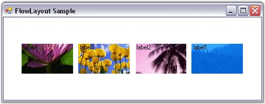
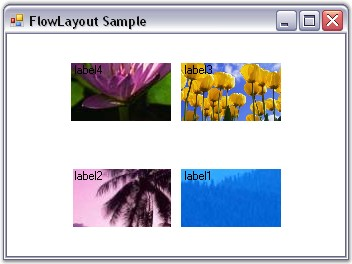

::: {style="DISPLAY: none"}
{#d2h_url_template}{#d2h_package_url style="WIDTH: 0px; DISPLAY: none; HEIGHT: 0px"}
:::

:::: {.d2h_secondary_topic style="PADDING-BOTTOM: 10pt; MARGIN: 0pt; PADDING-LEFT: 0pt; PADDING-RIGHT: 0pt; PADDING-TOP: 0pt"}
##### Centering the Child Controls Horizontally and Vertically {#centering-the-child-controls-horizontally-and-vertically style="tab-stops: 0pt"}

[]{style="COLOR: #15428b"} 

This topic illustrates how to center the Child controls both vertically and horizontally using the Child constraints.

[]{style="COLOR: #15428b"} 

::: {style="BORDER-BOTTOM: windowtext 1pt solid; BORDER-LEFT: medium none; PADDING-BOTTOM: 1pt; MARGIN-TOP: 9pt; PADDING-LEFT: 0pt; PADDING-RIGHT: 0pt; MARGIN-BOTTOM: 9pt; BORDER-TOP: windowtext 1pt solid; BORDER-RIGHT: medium none; PADDING-TOP: 1pt"}
{border="0"} Note: Constraints need to be used because the Child controls will otherwise be centered either vertically or horizontally based on whether the layout mode is \'Vertical\' or \'Horizontal\'.
:::

[]{style="COLOR: #15428b"} 

When the layout mode is \'Horizontal\', set the **HAlign** property to \'Center\' and **ProportionalRowHeight** property to \'True\' in the constraints for all the Child controls. This will center the Child controls vertically and horizontally as shown.

**[]{style="COLOR: #15428b"}** 

+-------------------------------------------------------------------------------------------------------------------------------------------------------------------------------------------------------------------------------------------------------------------------------------------------------------------------------------------------------------------------------------------------------------------------------------------------------------------------------------------------------------------------------------------------------+
| **[\[C#\]]{style="FONT-FAMILY: 'Courier New'; COLOR: black"}**                                                                                                                                                                                                                                                                                                                                                                                                                                                                                        |
|                                                                                                                                                                                                                                                                                                                                                                                                                                                                                                                                                       |
| []{style="COLOR: black"}                                                                                                                                                                                                                                                                                                                                                                                                                                                                                                                              |
|                                                                                                                                                                                                                                                                                                                                                                                                                                                                                                                                                       |
| [this]{style="FONT-FAMILY: 'Courier New'; COLOR: blue"}[.flowLayout1.SetConstraints([this]{style="COLOR: blue"}.textBox1, [new]{style="COLOR: blue"} Syncfusion.Windows.Forms.Tools.[FlowLayoutConstraints]{style="COLOR: teal"}([true]{style="COLOR: blue"}, Syncfusion.Windows.Forms.Tools.[HorzFlowAlign]{style="COLOR: teal"}.Center, Syncfusion.Windows.Forms.Tools.[VertFlowAlign]{style="COLOR: teal"}.Center, [false]{style="COLOR: blue"}, [false]{style="COLOR: blue"}, [true]{style="COLOR: blue"}));]{style="FONT-FAMILY: 'Courier New'"} |
+-------------------------------------------------------------------------------------------------------------------------------------------------------------------------------------------------------------------------------------------------------------------------------------------------------------------------------------------------------------------------------------------------------------------------------------------------------------------------------------------------------------------------------------------------------+

[]{style="COLOR: #15428b"} 

+-----------------------------------------------------------------------------------------------------------------------------------------------------------------------------------------------------------------------------------------------------------------------------------------------------------------------------------------------------------------------------------------------------------------------------------------------------------------------------+
| **[\[VB.NET\]]{style="FONT-FAMILY: 'Courier New'; COLOR: black"}**                                                                                                                                                                                                                                                                                                                                                                                                          |
|                                                                                                                                                                                                                                                                                                                                                                                                                                                                             |
| []{style="COLOR: black"}                                                                                                                                                                                                                                                                                                                                                                                                                                                    |
|                                                                                                                                                                                                                                                                                                                                                                                                                                                                             |
| [Me]{style="FONT-FAMILY: 'Courier New'; COLOR: blue"}[.flowLayout1.SetConstraints([Me]{style="COLOR: blue"}.textBox1, [New]{style="COLOR: blue"} Syncfusion.Windows.Forms.Tools.FlowLayoutConstraints([True]{style="COLOR: blue"}, Syncfusion.Windows.Forms.Tools.HorzFlowAlign.Center, Syncfusion.Windows.Forms.Tools.VertFlowAlign.Center, [False]{style="COLOR: blue"}, [False]{style="COLOR: blue"}, [True]{style="COLOR: blue"}))]{style="FONT-FAMILY: 'Courier New'"} |
+-----------------------------------------------------------------------------------------------------------------------------------------------------------------------------------------------------------------------------------------------------------------------------------------------------------------------------------------------------------------------------------------------------------------------------------------------------------------------------+

[]{style="COLOR: #15428b"} 

{border="0"}

[]{style="COLOR: #15428b"} 

Figure 676: Centered Controls in Horizontal FlowLayout

[]{style="COLOR: #15428b"} 

When the **ProportionalRowHeight** property is set to \'True\', any extra space at the bottom will be equally distributed among all the available rows, thereby increasing the logical height of the rows. The Child controls within these rows will then vertically align to the center of the row (since **VAlign** property is set to**[ ]{style="COLOR: black"}**[\'C]{style="COLOR: black"}enter\', by default), thereby resulting in the layout seen above.

[]{style="COLOR: #15428b"} 

When resized to a smaller width, two rows are created resulting in the layout shown below.

[]{style="COLOR: #15428b"} 

{border="0"}

[]{style="COLOR: #15428b"} 

Figure 677: Centered Controls in Horizontal FlowLayout in Multiple Rows

[]{style="COLOR: #15428b"} 

See Also

[]{style="COLOR: #15428b"} 

[Configuring FlowLayout]{.UGHyperlink}[, ]{.UGHyperlink}[FlowLayout - Configuring Child Controls]{.UGHyperlink}[, ]{.UGHyperlink}[Enabling Constrained FlowLayout on a Container]{.UGHyperlink}[ ]{.UGHyperlink}

[]{#related-topics}
::::
