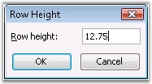
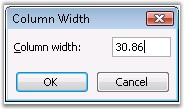
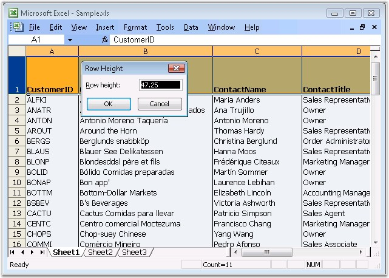
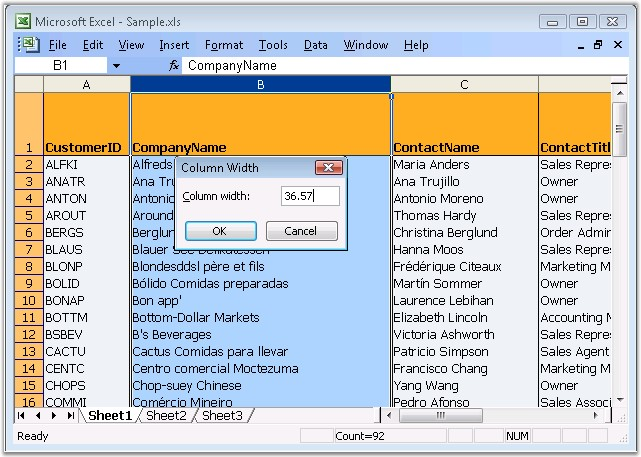
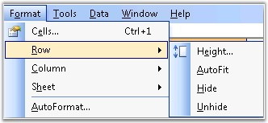

::: {style="DISPLAY: none"}
{#d2h_url_template}{#d2h_package_url style="WIDTH: 0px; DISPLAY: none; HEIGHT: 0px"}
:::

:::::: {.d2h_secondary_topic style="PADDING-BOTTOM: 10pt; MARGIN: 0pt; PADDING-LEFT: 0pt; PADDING-RIGHT: 0pt; PADDING-TOP: 0pt"}
##### Changing Cell Size {#changing-cell-size style="tab-stops: 0pt"}

 

This section deals with customizing the cell width and height as per the users needs. There are two ways to change the cell size. They are as follows.

 

[·      ]{style="FONT-FAMILY: Symbol"}Changing the row height and column width manually, with the values specified.

[·      ]{style="FONT-FAMILY: Symbol"}Changing the row height and column width automatically, to fit the text into the cell.

 

This is discussed in the following topics.

 

###### []{#p57}4.1.3.3.1.1 Row Height and Column Width {#row-height-and-column-width style="tab-stops: 0pt"}

 

MS Excel allows to set the row height and column width by using the **Format** menu option. Go to the **Format** menu, click **Row/Column** and then click **Height/Width** option.

[]{style="FONT-FAMILY: 'Trebuchet MS','sans-serif'; COLOR: #15428b; FONT-SIZE: 9pt"} 

[{border="0"}{border="0"}]{style="FONT-FAMILY: 'Trebuchet MS','sans-serif'; COLOR: #15428b; FONT-SIZE: 9pt"}

Figure 61: Row Height and Column Width dialog boxes in Excel[]{style="FONT-FAMILY: 'Trebuchet MS','sans-serif'; COLOR: #15428b"}

[]{style="FONT-FAMILY: 'Trebuchet MS','sans-serif'; COLOR: #15428b; FONT-SIZE: 9pt"} 

**[]{style="FONT-FAMILY: 'Trebuchet MS','sans-serif'; COLOR: #15428b; FONT-SIZE: 9pt"}** 

Specifying Row Height and Column Width in XlsIO

[]{style="FONT-FAMILY: 'Trebuchet MS','sans-serif'; COLOR: #15428b; FONT-SIZE: 9pt"} 

XlsIO allows to specify a column width of 0 to 255 in a spreadsheet. This value represents the number of characters that can be displayed in a cell that is formatted with the standard font. The default column width is 8.43 characters, which is the default value of MS Excel. If a column has a width of 0, the column is hidden.

 

Similarly, you can specify a row height of 0 to 409. Note that this is the restriction of MS Excel. This value represents the height measurement in points (1 point equals approximately 1/72 inch or 0.035 cm). The default row height is 12.75 points. If a row has a height of 0, the row is hidden.

 

XlsIO provides support for setting the **RowHeight** and **ColumnWidth** properties in a worksheet. You can also set the column width and row height in pixels, by using the **IWorksheet.SetColumnWidthInPixel** and **IWorksheet.SetRowHeightInPixel** methods respectively.

[]{style="FONT-FAMILY: 'Trebuchet MS','sans-serif'; COLOR: #15428b; FONT-SIZE: 9pt"} 

+---------------------------------------------------------------------------------------------------------+
| **[\[C#\]]{style="FONT-FAMILY: 'Courier New'"}**                                                        |
|                                                                                                         |
| []{style="FONT-FAMILY: 'Courier New'"}                                                                  |
|                                                                                                         |
| [// Changing the Column Width.]{style="FONT-FAMILY: 'Courier New'; COLOR: green"}                       |
|                                                                                                         |
| [sheet.Range\[[\"A1\"]{style="COLOR: #a31515"}\].ColumnWidth = 20;]{style="FONT-FAMILY: 'Courier New'"} |
|                                                                                                         |
| [sheet.Range\[[\"B1\"]{style="COLOR: #a31515"}\].ColumnWidth = 30;]{style="FONT-FAMILY: 'Courier New'"} |
|                                                                                                         |
| [sheet.Range\[[\"C1\"]{style="COLOR: #a31515"}\].ColumnWidth = 40;]{style="FONT-FAMILY: 'Courier New'"} |
|                                                                                                         |
| [sheet.Range\[[\"D1\"]{style="COLOR: #a31515"}\].ColumnWidth = 50;]{style="FONT-FAMILY: 'Courier New'"} |
|                                                                                                         |
| []{style="FONT-FAMILY: 'Courier New'"}                                                                  |
|                                                                                                         |
| [// Changing the Row Height.]{style="FONT-FAMILY: 'Courier New'; COLOR: green"}                         |
|                                                                                                         |
| [sheet.Range\[[\"A2\"]{style="COLOR: #a31515"}\].RowHeight = 20;]{style="FONT-FAMILY: 'Courier New'"}   |
|                                                                                                         |
| [sheet.Range\[[\"A4\"]{style="COLOR: #a31515"}\].RowHeight = 35;]{style="FONT-FAMILY: 'Courier New'"}   |
|                                                                                                         |
| [sheet.Range\[[\"A5\"]{style="COLOR: #a31515"}\].RowHeight = 50;]{style="FONT-FAMILY: 'Courier New'"}   |
|                                                                                                         |
| [sheet.Range\[[\"A7\"]{style="COLOR: #a31515"}\].RowHeight = 60;  ]{style="FONT-FAMILY: 'Courier New'"} |
+---------------------------------------------------------------------------------------------------------+

[]{style="FONT-FAMILY: 'Trebuchet MS','sans-serif'; COLOR: #15428b; FONT-SIZE: 9pt"} 

+-----------------------------------------------------------------------------------------------------+
| **[\[VB.NET\]]{style="FONT-FAMILY: 'Courier New'"}**                                                |
|                                                                                                     |
| []{style="FONT-FAMILY: 'Courier New'"}                                                              |
|                                                                                                     |
| [\' Changing the Column Width.]{style="FONT-FAMILY: 'Courier New'; COLOR: green"}                   |
|                                                                                                     |
| [sheet.Range([\"A1\"]{style="COLOR: maroon"}).ColumnWidth = 20]{style="FONT-FAMILY: 'Courier New'"} |
|                                                                                                     |
| [sheet.Range([\"B1\"]{style="COLOR: maroon"}).ColumnWidth = 30]{style="FONT-FAMILY: 'Courier New'"} |
|                                                                                                     |
| [sheet.Range([\"C1\"]{style="COLOR: maroon"}).ColumnWidth = 40]{style="FONT-FAMILY: 'Courier New'"} |
|                                                                                                     |
| [sheet.Range([\"D1\"]{style="COLOR: maroon"}).ColumnWidth = 50]{style="FONT-FAMILY: 'Courier New'"} |
|                                                                                                     |
| []{style="FONT-FAMILY: 'Courier New'"}                                                              |
|                                                                                                     |
| [\' Changing the Row Height.]{style="FONT-FAMILY: 'Courier New'; COLOR: green"}                     |
|                                                                                                     |
| [sheet.Range([\"A2\"]{style="COLOR: maroon"}).RowHeight = 20]{style="FONT-FAMILY: 'Courier New'"}   |
|                                                                                                     |
| [sheet.Range([\"A4\"]{style="COLOR: maroon"}).RowHeight = 35]{style="FONT-FAMILY: 'Courier New'"}   |
|                                                                                                     |
| [sheet.Range([\"A5\"]{style="COLOR: maroon"}).RowHeight = 50]{style="FONT-FAMILY: 'Courier New'"}   |
|                                                                                                     |
| [sheet.Range([\"A7\"]{style="COLOR: maroon"}).RowHeight = 60 ]{style="FONT-FAMILY: 'Courier New'"}  |
+-----------------------------------------------------------------------------------------------------+

[]{style="FONT-FAMILY: 'Trebuchet MS','sans-serif'; COLOR: #15428b; FONT-SIZE: 9pt"} 

{border="0"}

Figure 62: Setting row height in XlsIO[]{style="FONT-FAMILY: 'Trebuchet MS','sans-serif'; COLOR: #15428b"}

[]{style="FONT-FAMILY: 'Trebuchet MS','sans-serif'; COLOR: #15428b; FONT-SIZE: 9pt"} 

{border="0"}

Figure 63: Setting column width in XlsIO**[]{style="FONT-STYLE: normal; FONT-FAMILY: 'Trebuchet MS','sans-serif'; COLOR: #15428b"}**

[]{style="FONT-FAMILY: 'Trebuchet MS','sans-serif'; COLOR: #15428b; FONT-SIZE: 9pt"} 

 

###### []{#p58}4.1.3.3.1.2 AutoFit Rows and Columns {#autofit-rows-and-columns style="tab-stops: 0pt"}

**[]{style="FONT-FAMILY: 'Segoe UI','sans-serif'; COLOR: black"}** 

AutoFit is the option in MS Excel that can be enabled or disabled through the **Format** menu. AutoFit is the name given to the automatic width (or height) adjustment, to fit the contents of a cell, row or column.

[]{style="FONT-FAMILY: 'Trebuchet MS','sans-serif'; COLOR: #15428b; FONT-SIZE: 9pt"} 

[{border="0"}]{style="FONT-FAMILY: 'Trebuchet MS','sans-serif'; COLOR: #15428b; FONT-SIZE: 9pt"}

Figure 64: AutoFit in Excel

[]{style="FONT-FAMILY: 'Trebuchet MS','sans-serif'; COLOR: #15428b; FONT-SIZE: 9pt"} 

XlsIO also provides support to autofit the contents in a worksheet. You can autofit a range of cells, or a single column/row, or autofit within the given range.

 

This section demonstrates various autofit techniques supported by XlsIO.

 

AutoFit Single Row/Column

 

XlsIO allows to resize the cells in a column or row, based on the row/column index given. Following code example illustrates autofitting a single row/column.

 

+---------------------------------------------------------------------------------------------------------------------------------------------------+
| **[\[C#\]]{style="FONT-FAMILY: 'Courier New'"}**                                                                                                  |
|                                                                                                                                                   |
| []{style="FONT-FAMILY: 'Courier New'"}                                                                                                            |
|                                                                                                                                                   |
| [sheet.Range\[[\"E1\"]{style="COLOR: #a31515"}\].Text = [\"This is the Long Text\"]{style="COLOR: #a31515"};]{style="FONT-FAMILY: 'Courier New'"} |
|                                                                                                                                                   |
| []{style="FONT-FAMILY: 'Courier New'"}                                                                                                            |
|                                                                                                                                                   |
| [// AutoFit applied to a Single Column.]{style="FONT-FAMILY: 'Courier New'; COLOR: green"}                                                        |
|                                                                                                                                                   |
| [sheet.AutofitColumn(5);]{style="FONT-FAMILY: 'Courier New'"}                                                                                     |
|                                                                                                                                                   |
| []{style="FONT-FAMILY: 'Courier New'"}                                                                                                            |
|                                                                                                                                                   |
| [// AutoFit applied to a Single Row.]{style="FONT-FAMILY: 'Courier New'; COLOR: green"}                                                           |
|                                                                                                                                                   |
| [sheet.AutofitRow(1); ]{style="FONT-FAMILY: 'Courier New'"}                                                                                       |
+---------------------------------------------------------------------------------------------------------------------------------------------------+

[]{style="FONT-FAMILY: 'Trebuchet MS','sans-serif'; COLOR: #15428b; FONT-SIZE: 9pt"} 

+----------------------------------------------------------------------------------------------------------------------------------------------+
| **[\[VB.NET\]]{style="FONT-FAMILY: 'Courier New'"}**                                                                                         |
|                                                                                                                                              |
| **[]{style="FONT-FAMILY: 'Courier New'"}**                                                                                                   |
|                                                                                                                                              |
| [sheet.Range([\"E1\"]{style="COLOR: maroon"}).Text = [\"This is the Long Text\"]{style="COLOR: maroon"}]{style="FONT-FAMILY: 'Courier New'"} |
|                                                                                                                                              |
| []{style="FONT-FAMILY: 'Courier New'"}                                                                                                       |
|                                                                                                                                              |
| [\' AutoFit applied to a Single Column.]{style="FONT-FAMILY: 'Courier New'; COLOR: green"}                                                   |
|                                                                                                                                              |
| [sheet.AutofitColumn(5)]{style="FONT-FAMILY: 'Courier New'"}                                                                                 |
|                                                                                                                                              |
| []{style="FONT-FAMILY: 'Courier New'"}                                                                                                       |
|                                                                                                                                              |
| [\' AutoFit applied to a Single Row.]{style="FONT-FAMILY: 'Courier New'; COLOR: green"}                                                      |
|                                                                                                                                              |
| [sheet.AutofitRow(1) ]{style="FONT-FAMILY: 'Courier New'"}                                                                                   |
+----------------------------------------------------------------------------------------------------------------------------------------------+

[]{style="FONT-FAMILY: 'Trebuchet MS','sans-serif'; COLOR: #15428b; FONT-SIZE: 9pt"} 

::: {style="BORDER-BOTTOM: windowtext 1pt solid; BORDER-LEFT: medium none; PADDING-BOTTOM: 1pt; MARGIN-TOP: 9pt; PADDING-LEFT: 0pt; PADDING-RIGHT: 0pt; MARGIN-BOTTOM: 9pt; BORDER-TOP: windowtext 1pt solid; BORDER-RIGHT: medium none; PADDING-TOP: 1pt"}
{border="0"}Note: These indexes are \"one based\".
:::

[]{style="FONT-FAMILY: 'Trebuchet MS','sans-serif'; COLOR: #15428b; FONT-SIZE: 9pt"} 

You can also autofit single row/column as follows.

 

+------------------------------------------------------------------------------------------+
| **[\[C#\]]{style="FONT-FAMILY: 'Courier New'"}**                                         |
|                                                                                          |
| []{style="FONT-FAMILY: 'Courier New'"}                                                   |
|                                                                                          |
| [sheet.Rows\[0\].AutofitRows();]{style="FONT-FAMILY: 'Courier New'; COLOR: black"}       |
|                                                                                          |
| [sheet.Columns\[0\].AutofitColumns();]{style="FONT-FAMILY: 'Courier New'; COLOR: black"} |
+------------------------------------------------------------------------------------------+

[]{style="FONT-FAMILY: 'Trebuchet MS','sans-serif'; COLOR: #15428b; FONT-SIZE: 9pt"} 

+-----------------------------------------------------------------------------------------+
| **[\[VB.NET\]]{style="FONT-FAMILY: 'Courier New'"}**                                    |
|                                                                                         |
| **[]{style="FONT-FAMILY: 'Courier New'"}**                                              |
|                                                                                         |
| [sheet.Rows\[0\].AutofitRows()]{style="FONT-FAMILY: 'Courier New'; COLOR: black"}       |
|                                                                                         |
| [sheet.Columns\[0\].AutofitColumns()]{style="FONT-FAMILY: 'Courier New'; COLOR: black"} |
+-----------------------------------------------------------------------------------------+

[]{style="FONT-FAMILY: 'Trebuchet MS','sans-serif'; COLOR: #15428b; FONT-SIZE: 9pt"} 

::: {style="BORDER-BOTTOM: windowtext 1pt solid; BORDER-LEFT: medium none; PADDING-BOTTOM: 1pt; MARGIN-TOP: 9pt; PADDING-LEFT: 0pt; PADDING-RIGHT: 0pt; MARGIN-BOTTOM: 9pt; BORDER-TOP: windowtext 1pt solid; BORDER-RIGHT: medium none; PADDING-TOP: 1pt"}
{border="0"}Note: Here column and row indexes are \"zero based\".
:::

 

AutoFit Multiple Rows/Columns

 

It is also possible to autofit multiple rows/column based on the range specified as follows.

[]{style="FONT-FAMILY: 'Trebuchet MS','sans-serif'; COLOR: #15428b; FONT-SIZE: 9pt"} 

+-------------------------------------------------------------------------------------------------------------------------------------------------------------------------------------+
| **[\[C#\]]{style="FONT-FAMILY: 'Courier New'"}**                                                                                                                                    |
|                                                                                                                                                                                     |
| []{style="FONT-FAMILY: 'Courier New'"}                                                                                                                                              |
|                                                                                                                                                                                     |
| [// Entering text inside the Cells.]{style="FONT-FAMILY: 'Courier New'; COLOR: green"}                                                                                              |
|                                                                                                                                                                                     |
| [sheet.Range\[[\"A1:D1\"]{style="COLOR: #a31515"}\].Text = [\"This is the Long Text\"]{style="COLOR: #a31515"};]{style="FONT-FAMILY: 'Courier New'"}                                |
|                                                                                                                                                                                     |
| [sheet.Range\[[\"E1\"]{style="COLOR: #a31515"}\].Text = [\"This is the Long Text\"]{style="COLOR: #a31515"};]{style="FONT-FAMILY: 'Courier New'"}                                   |
|                                                                                                                                                                                     |
| [sheet.Range\[[\"A2:A5\"]{style="COLOR: #a31515"}\].Text = [\"This is the Long Text using Autofit Columns and Rows\"]{style="COLOR: #a31515"};]{style="FONT-FAMILY: 'Courier New'"} |
|                                                                                                                                                                                     |
| []{style="FONT-FAMILY: 'Courier New'"}                                                                                                                                              |
|                                                                                                                                                                                     |
| [// AutoFit Applied to a Range.]{style="FONT-FAMILY: 'Courier New'; COLOR: green"}                                                                                                  |
|                                                                                                                                                                                     |
| [sheet.Range\[[\"A1:D1\"]{style="COLOR: #a31515"}\].AutofitColumns();]{style="FONT-FAMILY: 'Courier New'"}                                                                          |
|                                                                                                                                                                                     |
| [sheet.Range\[[\"A2:A5\"]{style="COLOR: #a31515"}\].AutofitRows();]{style="FONT-FAMILY: 'Courier New'"}                                                                             |
|                                                                                                                                                                                     |
| []{style="FONT-FAMILY: 'Courier New'; COLOR: green"}                                                                                                                                |
|                                                                                                                                                                                     |
| [//Autofits all the columns used in the worksheet.]{style="FONT-FAMILY: 'Courier New'; COLOR: green"}                                                                               |
|                                                                                                                                                                                     |
| [sheet.UsedRange.AutofitColumns();]{style="FONT-FAMILY: 'Courier New'"}                                                                                                             |
+-------------------------------------------------------------------------------------------------------------------------------------------------------------------------------------+

[]{style="FONT-FAMILY: 'Trebuchet MS','sans-serif'; COLOR: #15428b; FONT-SIZE: 9pt"} 

+--------------------------------------------------------------------------------------------------------------------------------------------------------------------------------+
| **[\[VB.NET\]]{style="FONT-FAMILY: 'Courier New'"}**                                                                                                                           |
|                                                                                                                                                                                |
| **[]{style="FONT-FAMILY: 'Courier New'"}**                                                                                                                                     |
|                                                                                                                                                                                |
| [\' Entering text inside the Cells.]{style="FONT-FAMILY: 'Courier New'; COLOR: green"}                                                                                         |
|                                                                                                                                                                                |
| [sheet.Range([\"A1:D1\"]{style="COLOR: maroon"}).Text = [\"This is the Long Text\"]{style="COLOR: maroon"}]{style="FONT-FAMILY: 'Courier New'"}                                |
|                                                                                                                                                                                |
| [sheet.Range([\"E1\"]{style="COLOR: maroon"}).Text = [\"This is the Long Text\"]{style="COLOR: maroon"}]{style="FONT-FAMILY: 'Courier New'"}                                   |
|                                                                                                                                                                                |
| [sheet.Range([\"A2:A5\"]{style="COLOR: maroon"}).Text = [\"This is the Long Text using Autofit Columns and Rows\"]{style="COLOR: maroon"}]{style="FONT-FAMILY: 'Courier New'"} |
|                                                                                                                                                                                |
| []{style="FONT-FAMILY: 'Courier New'; COLOR: maroon"}                                                                                                                          |
|                                                                                                                                                                                |
| [\' AutoFit Applied to a Range .]{style="FONT-FAMILY: 'Courier New'; COLOR: green"}                                                                                            |
|                                                                                                                                                                                |
| [sheet.Range([\"A1:D1\"]{style="COLOR: maroon"}).AutofitColumns()]{style="FONT-FAMILY: 'Courier New'"}                                                                         |
|                                                                                                                                                                                |
| [sheet.Range([\"A2:A5\"]{style="COLOR: maroon"}).AutofitRows()]{style="FONT-FAMILY: 'Courier New'"}                                                                            |
|                                                                                                                                                                                |
| []{style="FONT-FAMILY: 'Courier New'"}                                                                                                                                         |
|                                                                                                                                                                                |
| [\'Autofits all the columns used in the worksheet.]{style="FONT-FAMILY: 'Courier New'; COLOR: green"}                                                                          |
|                                                                                                                                                                                |
| [sheet.UsedRange.AutofitColumns()]{style="FONT-FAMILY: 'Courier New'"}                                                                                                         |
+--------------------------------------------------------------------------------------------------------------------------------------------------------------------------------+

[]{style="FONT-FAMILY: 'Trebuchet MS','sans-serif'; COLOR: #15428b; FONT-SIZE: 9pt"} 

AutoFit within a Range of Cells

 

XlsIO also allows to autofit a row/column based on the content in a range of cells within the cells.

 

+---------------------------------------------------------------------------------------------------------------------------------------+
| [// AutoFit columns within a Range.]{style="FONT-FAMILY: 'Courier New'; COLOR: green"}                                                |
|                                                                                                                                       |
| [IWorksheet.Range\[int startRow, int startColumn, int lastRow, int lastColumn\].AutofitColumns()]{style="FONT-FAMILY: 'Courier New'"} |
|                                                                                                                                       |
| []{style="FONT-FAMILY: 'Courier New'"}                                                                                                |
|                                                                                                                                       |
| [// AutoFit rows within a Range.]{style="FONT-FAMILY: 'Courier New'; COLOR: green"}                                                   |
|                                                                                                                                       |
| [IWorksheet.Range\[int startRow, int startColumn, int lastRow, int lastColumn\].AutofitRows();]{style="FONT-FAMILY: 'Courier New'"}   |
+---------------------------------------------------------------------------------------------------------------------------------------+

 

Following code example illustrates autofitting within a range of cells.

 

+-------------------------------------------------------------------------------------------------------------------------------------------------------------------------------------------+
| **[\[C#\]]{style="FONT-FAMILY: 'Courier New'"}**                                                                                                                                          |
|                                                                                                                                                                                           |
| []{style="FONT-FAMILY: 'Courier New'"}                                                                                                                                                    |
|                                                                                                                                                                                           |
| [// Entering text inside the Cells.]{style="FONT-FAMILY: 'Courier New'; COLOR: green"}                                                                                                    |
|                                                                                                                                                                                           |
| [sheet.Range\[B2:I20\].Text = [\"Autofit\"]{style="COLOR: maroon"};]{style="FONT-FAMILY: 'Courier New'"}                                                                                  |
|                                                                                                                                                                                           |
| [sheet.Range\[1, 2\].Value = [\"A very long text, This should be ignored by mySheet.Range\[5, 2, 19, 2\].AutofitColumns()\"]{style="COLOR: maroon"};]{style="FONT-FAMILY: 'Courier New'"} |
|                                                                                                                                                                                           |
| [sheet.Rows\[4\].RowHeight = 90;]{style="FONT-FAMILY: 'Courier New'"}                                                                                                                     |
|                                                                                                                                                                                           |
| [sheet.Rows\[15\].RowHeight = 90;]{style="FONT-FAMILY: 'Courier New'"}                                                                                                                    |
|                                                                                                                                                                                           |
| []{style="FONT-FAMILY: 'Courier New'"}                                                                                                                                                    |
|                                                                                                                                                                                           |
| [// AutoFit columns applied within a Range.]{style="FONT-FAMILY: 'Courier New'; COLOR: green"}                                                                                            |
|                                                                                                                                                                                           |
| [mySheet.Range\[5, 2, 19, 2\].AutofitColumns();]{style="FONT-FAMILY: 'Courier New'"}                                                                                                      |
|                                                                                                                                                                                           |
| []{style="FONT-FAMILY: 'Courier New'"}                                                                                                                                                    |
|                                                                                                                                                                                           |
| [// AutoFit rows applied within a Range.]{style="FONT-FAMILY: 'Courier New'; COLOR: green"}                                                                                               |
|                                                                                                                                                                                           |
| [mySheet.Range\[5, 2, 13, 4\].AutofitRows();]{style="FONT-FAMILY: 'Courier New'"}                                                                                                         |
+-------------------------------------------------------------------------------------------------------------------------------------------------------------------------------------------+

[]{style="FONT-FAMILY: 'Trebuchet MS','sans-serif'; COLOR: #15428b; FONT-SIZE: 9pt"} 

+------------------------------------------------------------------------------------------------------------------------------------------------------------------------------------------+
| **[\[VB.NET\]]{style="FONT-FAMILY: 'Courier New'"}**                                                                                                                                     |
|                                                                                                                                                                                          |
| **[]{style="FONT-FAMILY: 'Courier New'"}**                                                                                                                                               |
|                                                                                                                                                                                          |
| [\' Entering text inside the Cells.]{style="FONT-FAMILY: 'Courier New'; COLOR: green"}                                                                                                   |
|                                                                                                                                                                                          |
| [sheet.Range\[B2:I20\].Text = [\"Autofit\"]{style="COLOR: maroon"}]{style="FONT-FAMILY: 'Courier New'"}                                                                                  |
|                                                                                                                                                                                          |
| [sheet.Range\[1, 2\].Value = \"[A very long text, This should be ignored by mySheet.Range\[5, 2, 19, 2\].AutofitColumns()\"]{style="COLOR: maroon"}]{style="FONT-FAMILY: 'Courier New'"} |
|                                                                                                                                                                                          |
| [sheet.Rows\[4\].RowHeight = 90]{style="FONT-FAMILY: 'Courier New'"}                                                                                                                     |
|                                                                                                                                                                                          |
| [sheet.Rows\[15\].RowHeight = 90]{style="FONT-FAMILY: 'Courier New'"}                                                                                                                    |
|                                                                                                                                                                                          |
| []{style="FONT-FAMILY: 'Courier New'"}                                                                                                                                                   |
|                                                                                                                                                                                          |
| [\' AutoFit columns applied within a Range.]{style="FONT-FAMILY: 'Courier New'; COLOR: green"}                                                                                           |
|                                                                                                                                                                                          |
| [mySheet.Range\[5, 2, 19, 2\].AutofitColumns()]{style="FONT-FAMILY: 'Courier New'"}                                                                                                      |
|                                                                                                                                                                                          |
| []{style="FONT-FAMILY: 'Courier New'"}                                                                                                                                                   |
|                                                                                                                                                                                          |
| [\' AutoFit rows applied within a Range.]{style="FONT-FAMILY: 'Courier New'; COLOR: green"}                                                                                              |
|                                                                                                                                                                                          |
| [mySheet.Range\[5, 2, 13, 4\].AutofitRows()]{style="FONT-FAMILY: 'Courier New'"}                                                                                                         |
+------------------------------------------------------------------------------------------------------------------------------------------------------------------------------------------+

[]{style="FONT-FAMILY: 'Trebuchet MS','sans-serif'; COLOR: #15428b; FONT-SIZE: 9pt"} 

Here, though the cell \"B2\" has long text, autofit will not be applied to this column as the cell inside the range\[5, 2, 19, 2\] has text smaller than that. Similarly, row height for Row 15 will not be affected with AutoFit rows as the range\[5, 2, 13, 4\] has row height smaller than Row 15. 

[]{style="FONT-FAMILY: 'Trebuchet MS','sans-serif'; COLOR: #15428b; FONT-SIZE: 9pt"} 

::: {style="BORDER-BOTTOM: windowtext 1pt solid; BORDER-LEFT: medium none; PADDING-BOTTOM: 1pt; MARGIN-TOP: 9pt; PADDING-LEFT: 0pt; PADDING-RIGHT: 0pt; MARGIN-BOTTOM: 9pt; BORDER-TOP: windowtext 1pt solid; BORDER-RIGHT: medium none; PADDING-TOP: 1pt"}
{border="0"}Note:

 

1\) If a Range text is text wrapped, AutoFitColumn method will not be applied on it.

2\) If a Range is merged, AutoFit methods will not be applied on it. Note that this is the behavior of MS Word.

3\) Implementation of AutoFit methods are more time consuming. Use these methods in minimal for better performance.

 
:::

[]{#related-topics}
::::::
