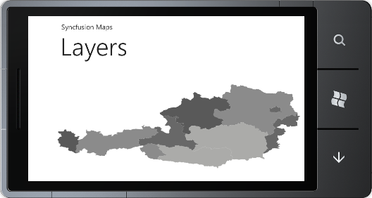
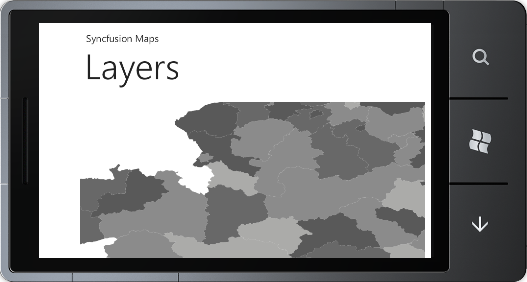

::: {style="DISPLAY: none"}
{#d2h_url_template}{#d2h_package_url style="WIDTH: 0px; DISPLAY: none; HEIGHT: 0px"}
:::

::::: {#nsbanner .d2h_main_nsbanner style="BORDER-BOTTOM: #999999 1px solid; POSITION: relative; PADDING-BOTTOM: 0px; BACKGROUND-COLOR: transparent; PADDING-LEFT: 0px; PADDING-RIGHT: 0px; DISPLAY: none; BORDER-TOP: #999999 1px solid; PADDING-TOP: 0px; LEFT: 0px"}
:::: {#TitleRow .d2h_main_titlerow style="PADDING-BOTTOM: 4px; BACKGROUND-COLOR: transparent; PADDING-LEFT: 22px; WIDTH: 100%; PADDING-RIGHT: 10px; DISPLAY: none; PADDING-TOP: 4px"}
::: {#ienav .d2h_main_ienav style="DISPLAY: none"}
{#D2HPrevious .D2HPreviousEnabled}  {#D2HNext .D2HNextEnabled}
:::
::::
:::::

:::: {#nstext .d2h_main_nstext style="PADDING-BOTTOM: 10px; BACKGROUND-COLOR: transparent; PADDING-LEFT: 22px; PADDING-RIGHT: 10px; HEIGHT: 100%; OVERFLOW: auto; PADDING-TOP: 5px" hasuserbackground="true" valign="bottom"}
::: {#d2h_breadcrumbs .d2h_breadcrumbs}
[Essential Studio User Guide Documentation](ms-xhelp:///?Id=12457748-09e3-4d74-a240-8e049cedf030){.d2h_breadcrumbsNormal}[ \> ]{.d2h_breadcrumbsLinkSeparator}[User Interface Edition](ms-xhelp:///?Id=c29296b7-531c-413b-a0ec-488ca1f7f669){.d2h_breadcrumbsNormal}[ \> ]{.d2h_breadcrumbsLinkSeparator}[Essential Windows Phone](ms-xhelp:///?Id=5ea1999c-4eff-4775-b84e-407dc825f555){.d2h_breadcrumbsNormal}[ \> ]{.d2h_breadcrumbsLinkSeparator}[Essential Maps]{.d2h_breadcrumbsContentsOnly}[ \> ]{.d2h_breadcrumbsLinkSeparator}[Concepts and Features](ms-xhelp:///?Id=fe4335c8-1cb6-47a4-a6f3-e9bc318bba8d){.d2h_breadcrumbsNormal}[ \> ]{.d2h_breadcrumbsLinkSeparator}[Layers](ms-xhelp:///?Id=f7d6105a-4133-487d-af87-1bcfb7d92569){.d2h_breadcrumbsNormal}
:::

### Changing the Layers {#changing-the-layers style="tab-stops: 0pt"}

 

Maps control's content can be set using the *LayeredContent* property of the Map Control. Layered content can be any one of the items of Layers. This denotes the current visible layer of the map. Layered content can be the ShapeFileLayer. The user can display different shapefiles depending on the zoom factor by setting the *TranslateZoomFactor* property on the *ShapeFileLayer*. When ZoomFactor value reaches the *TranslateZoomFactor* value, the content of the Map will be changed, to display the corresponding ShapeFileLayer.

The following code demonstrates how to change the Layers:

 

+--------------------------------------------------------------------------------------------------------------------------------------------------------------------------------------------------------------------------------------------------------------------------------------------------------------------------------------------------------------------------------------------------------------------------------------------------------------------------------------------------------------------------------------------------------------------------------------------------------------------------------------------------------------------------------------------------------------------------------------------------------------------------------------------------------------------------------------------------------------------------------------------------------------------------------------------------------------------------+
| [\[XAML\]]{style="FONT-FAMILY: 'Courier New'"}                                                                                                                                                                                                                                                                                                                                                                                                                                                                                                                                                                                                                                                                                                                                                                                                                                                                                                                           |
|                                                                                                                                                                                                                                                                                                                                                                                                                                                                                                                                                                                                                                                                                                                                                                                                                                                                                                                                                                          |
| [       ]{style="FONT-FAMILY: 'Courier New'; COLOR: #a31515"}[\<]{style="FONT-FAMILY: 'Courier New'; COLOR: blue"}[maps]{style="FONT-FAMILY: 'Courier New'; COLOR: #a31515"}[:]{style="FONT-FAMILY: 'Courier New'; COLOR: blue"}[MapControl]{style="FONT-FAMILY: 'Courier New'; COLOR: #a31515"}[ x]{style="FONT-FAMILY: 'Courier New'; COLOR: red"}[:]{style="FONT-FAMILY: 'Courier New'; COLOR: blue"}[Name]{style="FONT-FAMILY: 'Courier New'; COLOR: red"}[=\"Map\"]{style="FONT-FAMILY: 'Courier New'; COLOR: blue"}[ LayeredContent]{style="FONT-FAMILY: 'Courier New'; COLOR: red"}[=\"{]{style="FONT-FAMILY: 'Courier New'; COLOR: blue"}[Binding]{style="FONT-FAMILY: 'Courier New'; COLOR: #a31515"}[ ElementName]{style="FONT-FAMILY: 'Courier New'; COLOR: red"}[=shapeControl}\"]{style="FONT-FAMILY: 'Courier New'; COLOR: blue"}[ [                              ]{style="COLOR: red"}[\>]{style="COLOR: blue"}]{style="FONT-FAMILY: 'Courier New'"}      |
|                                                                                                                                                                                                                                                                                                                                                                                                                                                                                                                                                                                                                                                                                                                                                                                                                                                                                                                                                                          |
| [                        ]{style="FONT-FAMILY: 'Courier New'; COLOR: #a31515"}[\<]{style="FONT-FAMILY: 'Courier New'; COLOR: blue"}[maps]{style="FONT-FAMILY: 'Courier New'; COLOR: #a31515"}[:]{style="FONT-FAMILY: 'Courier New'; COLOR: blue"}[MapControl.Layers]{style="FONT-FAMILY: 'Courier New'; COLOR: #a31515"}[\>]{style="FONT-FAMILY: 'Courier New'; COLOR: blue"}[]{style="FONT-FAMILY: 'Courier New'"}                                                                                                                                                                                                                                                                                                                                                                                                                                                                                                                                                      |
|                                                                                                                                                                                                                                                                                                                                                                                                                                                                                                                                                                                                                                                                                                                                                                                                                                                                                                                                                                          |
| [                            ]{style="FONT-FAMILY: 'Courier New'; COLOR: #a31515"}[\<]{style="FONT-FAMILY: 'Courier New'; COLOR: blue"}[maps]{style="FONT-FAMILY: 'Courier New'; COLOR: #a31515"}[:]{style="FONT-FAMILY: 'Courier New'; COLOR: blue"}[Layers]{style="FONT-FAMILY: 'Courier New'; COLOR: #a31515"}[\>]{style="FONT-FAMILY: 'Courier New'; COLOR: blue"}[]{style="FONT-FAMILY: 'Courier New'"}                                                                                                                                                                                                                                                                                                                                                                                                                                                                                                                                                             |
|                                                                                                                                                                                                                                                                                                                                                                                                                                                                                                                                                                                                                                                                                                                                                                                                                                                                                                                                                                          |
| [                                ]{style="FONT-FAMILY: 'Courier New'; COLOR: #a31515"}[\<]{style="FONT-FAMILY: 'Courier New'; COLOR: blue"}[maps]{style="FONT-FAMILY: 'Courier New'; COLOR: #a31515"}[:]{style="FONT-FAMILY: 'Courier New'; COLOR: blue"}[ShapeFileLayer]{style="FONT-FAMILY: 'Courier New'; COLOR: #a31515"}[ Uri]{style="FONT-FAMILY: 'Courier New'; COLOR: red"}[=\"WindowsPhoneApplication1.ShapeFiles.wv.shp\"]{style="FONT-FAMILY: 'Courier New'; COLOR: blue"}[ TranslateZoomFactor]{style="FONT-FAMILY: 'Courier New'; COLOR: red"}[=\"1\"]{style="FONT-FAMILY: 'Courier New'; COLOR: blue"}[ x]{style="FONT-FAMILY: 'Courier New'; COLOR: red"}[:]{style="FONT-FAMILY: 'Courier New'; COLOR: blue"}[Name]{style="FONT-FAMILY: 'Courier New'; COLOR: red"}[=\"shapeControl\"]{style="FONT-FAMILY: 'Courier New'; COLOR: blue"}[ [ EnableColorPalette]{style="COLOR: red"}[=\"True\"\>]{style="COLOR: blue"}]{style="FONT-FAMILY: 'Courier New'"} |
|                                                                                                                                                                                                                                                                                                                                                                                                                                                                                                                                                                                                                                                                                                                                                                                                                                                                                                                                                                          |
| [                                ]{style="FONT-FAMILY: 'Courier New'; COLOR: #a31515"}[\</]{style="FONT-FAMILY: 'Courier New'; COLOR: blue"}[maps]{style="FONT-FAMILY: 'Courier New'; COLOR: #a31515"}[:]{style="FONT-FAMILY: 'Courier New'; COLOR: blue"}[ShapeFileLayer]{style="FONT-FAMILY: 'Courier New'; COLOR: #a31515"}[\>]{style="FONT-FAMILY: 'Courier New'; COLOR: blue"}[]{style="FONT-FAMILY: 'Courier New'"}                                                                                                                                                                                                                                                                                                                                                                                                                                                                                                                                                |
|                                                                                                                                                                                                                                                                                                                                                                                                                                                                                                                                                                                                                                                                                                                                                                                                                                                                                                                                                                          |
| [                                ]{style="FONT-FAMILY: 'Courier New'; COLOR: #a31515"}[\<]{style="FONT-FAMILY: 'Courier New'; COLOR: blue"}[maps]{style="FONT-FAMILY: 'Courier New'; COLOR: #a31515"}[:]{style="FONT-FAMILY: 'Courier New'; COLOR: blue"}[ShapeFileLayer]{style="FONT-FAMILY: 'Courier New'; COLOR: #a31515"}[ TranslateZoomFactor]{style="FONT-FAMILY: 'Courier New'; COLOR: red"}[=\"2\"]{style="FONT-FAMILY: 'Courier New'; COLOR: blue"}[ Uri]{style="FONT-FAMILY: 'Courier New'; COLOR: red"}[=\"WindowsPhoneApplication1.ShapeFiles.ma.shp\"]{style="FONT-FAMILY: 'Courier New'; COLOR: blue"}[ [ x]{style="COLOR: red"}[:]{style="COLOR: blue"}[Name]{style="COLOR: red"}[=\"shapeControl1\"]{style="COLOR: blue"}[ EnableColorPalette]{style="COLOR: red"}[=\"True\"\>]{style="COLOR: blue"}]{style="FONT-FAMILY: 'Courier New'"}                                                                                                                |
|                                                                                                                                                                                                                                                                                                                                                                                                                                                                                                                                                                                                                                                                                                                                                                                                                                                                                                                                                                          |
| [                                ]{style="FONT-FAMILY: 'Courier New'; COLOR: #a31515"}[\</]{style="FONT-FAMILY: 'Courier New'; COLOR: blue"}[maps]{style="FONT-FAMILY: 'Courier New'; COLOR: #a31515"}[:]{style="FONT-FAMILY: 'Courier New'; COLOR: blue"}[ShapeFileLayer]{style="FONT-FAMILY: 'Courier New'; COLOR: #a31515"}[\>]{style="FONT-FAMILY: 'Courier New'; COLOR: blue"}[]{style="FONT-FAMILY: 'Courier New'"}                                                                                                                                                                                                                                                                                                                                                                                                                                                                                                                                                |
|                                                                                                                                                                                                                                                                                                                                                                                                                                                                                                                                                                                                                                                                                                                                                                                                                                                                                                                                                                          |
| [                            ]{style="FONT-FAMILY: 'Courier New'; COLOR: #a31515"}[\</]{style="FONT-FAMILY: 'Courier New'; COLOR: blue"}[maps]{style="FONT-FAMILY: 'Courier New'; COLOR: #a31515"}[:]{style="FONT-FAMILY: 'Courier New'; COLOR: blue"}[Layers]{style="FONT-FAMILY: 'Courier New'; COLOR: #a31515"}[\>]{style="FONT-FAMILY: 'Courier New'; COLOR: blue"}[]{style="FONT-FAMILY: 'Courier New'"}                                                                                                                                                                                                                                                                                                                                                                                                                                                                                                                                                            |
|                                                                                                                                                                                                                                                                                                                                                                                                                                                                                                                                                                                                                                                                                                                                                                                                                                                                                                                                                                          |
| [                        ]{style="FONT-FAMILY: 'Courier New'; COLOR: #a31515"}[\</]{style="FONT-FAMILY: 'Courier New'; COLOR: blue"}[maps]{style="FONT-FAMILY: 'Courier New'; COLOR: #a31515"}[:]{style="FONT-FAMILY: 'Courier New'; COLOR: blue"}[MapControl.Layers]{style="FONT-FAMILY: 'Courier New'; COLOR: #a31515"}[\>]{style="FONT-FAMILY: 'Courier New'; COLOR: blue"}[]{style="FONT-FAMILY: 'Courier New'"}                                                                                                                                                                                                                                                                                                                                                                                                                                                                                                                                                     |
|                                                                                                                                                                                                                                                                                                                                                                                                                                                                                                                                                                                                                                                                                                                                                                                                                                                                                                                                                                          |
| [       ]{style="FONT-FAMILY: 'Courier New'; COLOR: #a31515"}[\</]{style="FONT-FAMILY: 'Courier New'; COLOR: blue"}[maps]{style="FONT-FAMILY: 'Courier New'; COLOR: #a31515"}[:]{style="FONT-FAMILY: 'Courier New'; COLOR: blue"}[MapControl]{style="FONT-FAMILY: 'Courier New'; COLOR: #a31515"}[\>]{style="FONT-FAMILY: 'Courier New'; COLOR: blue"}[]{style="FONT-FAMILY: 'Courier New'"}                                                                                                                                                                                                                                                                                                                                                                                                                                                                                                                                                                             |
+--------------------------------------------------------------------------------------------------------------------------------------------------------------------------------------------------------------------------------------------------------------------------------------------------------------------------------------------------------------------------------------------------------------------------------------------------------------------------------------------------------------------------------------------------------------------------------------------------------------------------------------------------------------------------------------------------------------------------------------------------------------------------------------------------------------------------------------------------------------------------------------------------------------------------------------------------------------------------+

 

+---------------------------------------------------------------------------------------------------------------------------------------------------------------------------------------------+
| [\[C#\]]{style="FONT-FAMILY: 'Courier New'"}[           ]{style="FONT-FAMILY: 'Courier New'; COLOR: #2b91af"}[]{style="FONT-FAMILY: 'Courier New'"}                                         |
|                                                                                                                                                                                             |
| [            MapControl]{style="FONT-FAMILY: 'Courier New'; COLOR: #2b91af"}[ map = [new]{style="COLOR: blue"} [MapControl]{style="COLOR: #2b91af"}();]{style="FONT-FAMILY: 'Courier New'"} |
|                                                                                                                                                                                             |
| [            [ShapeFileLayer]{style="COLOR: #2b91af"} shapeLayer = [new]{style="COLOR: blue"} [ShapeFileLayer]{style="COLOR: #2b91af"}();]{style="FONT-FAMILY: 'Courier New'"}              |
|                                                                                                                                                                                             |
| [            shapeLayer.Uri = [\"WindowsPhoneApplication1.ShapeFiles.wv.shp\"]{style="COLOR: #a31515"};]{style="FONT-FAMILY: 'Courier New'"}                                                |
|                                                                                                                                                                                             |
| [            shapeLayer.TranslateZoomFactor = 1d;]{style="FONT-FAMILY: 'Courier New'"}                                                                                                      |
|                                                                                                                                                                                             |
| [            map.Layers.Items.Add(shapeLayer);]{style="FONT-FAMILY: 'Courier New'"}                                                                                                         |
|                                                                                                                                                                                             |
| [            [ShapeFileLayer]{style="COLOR: #2b91af"} shapeLayer1 = [new]{style="COLOR: blue"} [ShapeFileLayer]{style="COLOR: #2b91af"}();]{style="FONT-FAMILY: 'Courier New'"}             |
|                                                                                                                                                                                             |
| [            shapeLayer.Uri = [\"WindowsPhoneApplication1.ShapeFiles.la.shp\"]{style="COLOR: #a31515"};]{style="FONT-FAMILY: 'Courier New'"}                                                |
|                                                                                                                                                                                             |
| [            shapeLayer1.TranslateZoomFactor = 2d;]{style="FONT-FAMILY: 'Courier New'"}                                                                                                     |
|                                                                                                                                                                                             |
| [            map.Layers.Items.Add(shapeLayer1);]{style="FONT-FAMILY: 'Courier New'"}                                                                                                        |
|                                                                                                                                                                                             |
| [            map.LayeredContent = shapeLayer;]{style="FONT-FAMILY: 'Courier New'"}                                                                                                          |
|                                                                                                                                                                                             |
| [            LayoutRoot.Children.Add(map);]{style="FONT-FAMILY: 'Courier New'"}                                                                                                             |
+---------------------------------------------------------------------------------------------------------------------------------------------------------------------------------------------+

 

{border="0"}

Figure 14: MapControl Before Layer Changed

 

 

{border="0"}

Figure 15: MapControl After LayerChanged

 

 

[]{#related-topics}
::::
