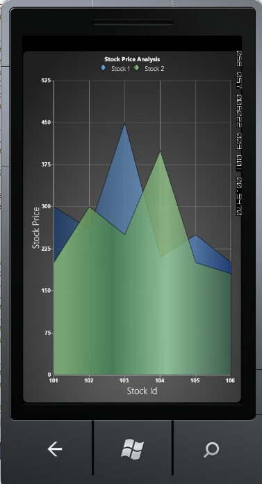

::: {style="DISPLAY: none"}
{#d2h_url_template}{#d2h_package_url style="WIDTH: 0px; DISPLAY: none; HEIGHT: 0px"}
:::

:::::: {.d2h_secondary_topic style="PADDING-BOTTOM: 10pt; MARGIN: 0pt; PADDING-LEFT: 0pt; PADDING-RIGHT: 0pt; PADDING-TOP: 0pt"}
#### Chart Animation {#chart-animation style="tab-stops: 0pt"}

[]{#p111} 

Essential Chart for Windows Phone now comes with animation support. Charts can be animated by using the animation options available. The state-of-the-art animation lets you to create lively charts that can be used for marketing, attractive data presentation, and so on.

[]{style="COLOR: #15428b"} 

It allows you to:

[]{style="COLOR: #15428b"} 

[·      ]{style="FONT-FAMILY: Symbol"}Set the animation option for a chart

[·      ]{style="FONT-FAMILY: Symbol"}Set the type of animation

[·      ]{style="FONT-FAMILY: Symbol"}Set the animation by each series

[·      ]{style="FONT-FAMILY: Symbol"}Set the duration for the animation

[·      ]{style="FONT-FAMILY: Symbol"}Set the effects for animation

[]{style="COLOR: #15428b"} 

Properties

[]{style="COLOR: #15428b"} 

The following table lists the properties and their usage in chart animation.

[]{style="COLOR: #15428b"} 

::: {align="center"}
  ------------------- ------------------------------------------ --------------------- ------------------------
  Property            Description                                Type                  Value Returned
  EnableAnimation     Sets the Animation option for the Chart.   Dependency Property   Boolean
  AnimateOption       Sets the Type of Animation.                Dependency Property   Enum(AnimationOptions)
  AnimateOneByOne     Sets the Animation by each series.         Dependency Property   Boolean
  AnimationDuration   Sets the duration for the Animation.       Dependency Property   Enum(TimeSpan)
  EasingFunction      Sets effects for Animation.                Dependency Property   Enum(IEasingFunction)
  ------------------- ------------------------------------------ --------------------- ------------------------
:::

[]{style="COLOR: #15428b"} 

Events

[]{style="COLOR: #15428b"} 

The following table lists the events and their usage in chart animation.

[]{style="COLOR: #15428b"} 

::: {align="center"}
  -------------------------- ------------------------------------------------------------------------------------------------------- ------------ ---------------------------------------------------
  Event                      Event Trigger                                                                                           Event Args   Purpose
  OnEaseAnimationChanged     Whenever the properties AnimationDuration, AnimateOneByOne, AnimateOption and EnableAnimation change.   \-           To set the Animation option selected by the user.
  OnEnableAnimationChanged   Whenever the properties AnimationDuration, AnimateOneByOne, AnimateOption and EnableAnimation change.   \-           To select or unselect the Animation of chart.
  -------------------------- ------------------------------------------------------------------------------------------------------- ------------ ---------------------------------------------------
:::

[]{style="COLOR: #15428b"} 

Methods

[]{style="COLOR: #15428b"} 

The following table lists the methods and their usage in chart animation.

[]{style="COLOR: #15428b"} 

::: {align="center"}
  ---------------- ------------- --------------------------------------------------------------------------------------
  Method           Return Type   Purpose
  StartAnimation   Void          This method is called when the user starts animation by using the options specified.
  ---------------- ------------- --------------------------------------------------------------------------------------
:::

[]{style="COLOR: #15428b"} 

Enabling and Customizing Chart Animation

[]{style="COLOR: #15428b"} 

The chart animation can be enabled by setting the *EnableAnimation* property to *true*.

[]{style="COLOR: #15428b"} 

+--------------------------------------------------------------------------------------------------------------------------------------------------------------------------------------------------------------------------------------------------------------------------------------------------------------------------------------------------------------------------------------------------------------------------------------------------------------------------------------------------------------------------------------------------------------------------------------------------------------------------------------------------------------------------------------------------+
| [\[XAML\]]{style="FONT-FAMILY: 'Courier New'"}                                                                                                                                                                                                                                                                                                                                                                                                                                                                                                                                                                                                                                                   |
|                                                                                                                                                                                                                                                                                                                                                                                                                                                                                                                                                                                                                                                                                                  |
| []{style="FONT-FAMILY: 'Courier New'"}                                                                                                                                                                                                                                                                                                                                                                                                                                                                                                                                                                                                                                                           |
|                                                                                                                                                                                                                                                                                                                                                                                                                                                                                                                                                                                                                                                                                                  |
| [\<]{style="FONT-FAMILY: 'Courier New'; COLOR: blue"}[syncfusion]{style="FONT-FAMILY: 'Courier New'; COLOR: #a31515"}[:]{style="FONT-FAMILY: 'Courier New'; COLOR: blue"}[ChartSeries]{style="FONT-FAMILY: 'Courier New'; COLOR: #a31515"}[ Type]{style="FONT-FAMILY: 'Courier New'; COLOR: red"}[=\"Column\"]{style="FONT-FAMILY: 'Courier New'; COLOR: blue"}[ EnableEffects]{style="FONT-FAMILY: 'Courier New'; COLOR: red"}[=\"True\"]{style="FONT-FAMILY: 'Courier New'; COLOR: blue"}[ Label]{style="FONT-FAMILY: 'Courier New'; COLOR: red"}[=\"Mark\"]{style="FONT-FAMILY: 'Courier New'; COLOR: blue"}                                                                                  |
|                                                                                                                                                                                                                                                                                                                                                                                                                                                                                                                                                                                                                                                                                                  |
| [EnableAnimation]{style="FONT-FAMILY: 'Courier New'; COLOR: red"}[=\"{]{style="FONT-FAMILY: 'Courier New'; COLOR: blue"}[Binding]{style="FONT-FAMILY: 'Courier New'; COLOR: #a31515"}[ ElementName]{style="FONT-FAMILY: 'Courier New'; COLOR: red"}[=enableanimation, ]{style="FONT-FAMILY: 'Courier New'; COLOR: blue"}[Path]{style="FONT-FAMILY: 'Courier New'; COLOR: red"}[=IsChecked}\"]{style="FONT-FAMILY: 'Courier New'; COLOR: blue"}[ Interior]{style="FONT-FAMILY: 'Courier New'; COLOR: red"}[=\"Blue\"]{style="FONT-FAMILY: 'Courier New'; COLOR: blue"}[ StrokeThickness]{style="FONT-FAMILY: 'Courier New'; COLOR: red"}[=\"2\"]{style="FONT-FAMILY: 'Courier New'; COLOR: blue"} |
|                                                                                                                                                                                                                                                                                                                                                                                                                                                                                                                                                                                                                                                                                                  |
| [DataSource]{style="FONT-FAMILY: 'Courier New'; COLOR: red"}[=\"{]{style="FONT-FAMILY: 'Courier New'; COLOR: blue"}[StaticResource]{style="FONT-FAMILY: 'Courier New'; COLOR: #a31515"}[ data]{style="FONT-FAMILY: 'Courier New'; COLOR: red"}[}\"]{style="FONT-FAMILY: 'Courier New'; COLOR: blue"}[ BindingPathX]{style="FONT-FAMILY: 'Courier New'; COLOR: red"}[=\"Name\" ]{style="FONT-FAMILY: 'Courier New'; COLOR: blue"}[BindingPathsY]{style="FONT-FAMILY: 'Courier New'; COLOR: red"}[=\"Mark, MinMark,MaxMark, Low, High\"]{style="FONT-FAMILY: 'Courier New'; COLOR: blue"}                                                                                                          |
|                                                                                                                                                                                                                                                                                                                                                                                                                                                                                                                                                                                                                                                                                                  |
| [AnimateOneByOne]{style="FONT-FAMILY: 'Courier New'; COLOR: red"}[=\"{]{style="FONT-FAMILY: 'Courier New'; COLOR: blue"}[Binding]{style="FONT-FAMILY: 'Courier New'; COLOR: #a31515"}[ ElementName]{style="FONT-FAMILY: 'Courier New'; COLOR: red"}[=animateind,]{style="FONT-FAMILY: 'Courier New'; COLOR: blue"}[ Path]{style="FONT-FAMILY: 'Courier New'; COLOR: red"}[=IsChecked}\"\>]{style="FONT-FAMILY: 'Courier New'; COLOR: blue"}                                                                                                                                                                                                                                                      |
|                                                                                                                                                                                                                                                                                                                                                                                                                                                                                                                                                                                                                                                                                                  |
| [\</]{style="FONT-FAMILY: 'Courier New'; COLOR: blue"}[syncfusion]{style="FONT-FAMILY: 'Courier New'; COLOR: #a31515"}[:]{style="FONT-FAMILY: 'Courier New'; COLOR: blue"}[ChartSeries]{style="FONT-FAMILY: 'Courier New'; COLOR: #a31515"}[\>]{style="FONT-FAMILY: 'Courier New'; COLOR: blue"}                                                                                                                                                                                                                                                                                                                                                                                                 |
+--------------------------------------------------------------------------------------------------------------------------------------------------------------------------------------------------------------------------------------------------------------------------------------------------------------------------------------------------------------------------------------------------------------------------------------------------------------------------------------------------------------------------------------------------------------------------------------------------------------------------------------------------------------------------------------------------+

[]{style="COLOR: #15428b"} 

+---------------------------------------------------------------------------------------------------------------------------------------------------------+
| [\[C#\]]{style="FONT-FAMILY: 'Courier New'"}                                                                                                            |
|                                                                                                                                                         |
| []{style="FONT-FAMILY: 'Courier New'"}                                                                                                                  |
|                                                                                                                                                         |
| [chart.Areas\[0\].Series\[0\].StartAnimation();]{style="FONT-FAMILY: 'Courier New'"}                                                                    |
|                                                                                                                                                         |
| [chart.Areas\[0\].Series\[0\].AnimationDuration = ts;]{style="FONT-FAMILY: 'Courier New'"}                                                              |
|                                                                                                                                                         |
| [chart.Areas\[0\].Series\[0\].AnimateOption = AnimationOptions.Rotate;]{style="FONT-FAMILY: 'Courier New'"}                                             |
|                                                                                                                                                         |
| [chart.Areas\[0\].Series\[0\].EasingFunction = [new]{style="COLOR: blue"} [ElasticEase]{style="COLOR: #2b91af"}();]{style="FONT-FAMILY: 'Courier New'"} |
+---------------------------------------------------------------------------------------------------------------------------------------------------------+

[]{style="COLOR: #15428b"} 

Run the code. The following output is displayed.

[]{style="COLOR: #15428b"} 

{border="0"}

 

Figure 107 : Chart Animation Enabled[]{style="COLOR: #15428b"}

***[]{style="COLOR: #15428b"}*** 

[]{#related-topics}
::::::
