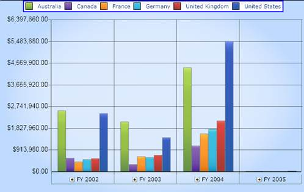
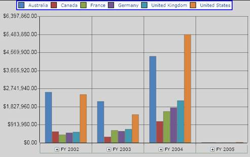

::: {style="DISPLAY: none"}
{#d2h_url_template}{#d2h_package_url style="WIDTH: 0px; DISPLAY: none; HEIGHT: 0px"}
:::

::::: {#nsbanner .d2h_main_nsbanner style="BORDER-BOTTOM: #999999 1px solid; POSITION: relative; PADDING-BOTTOM: 0px; BACKGROUND-COLOR: transparent; PADDING-LEFT: 0px; PADDING-RIGHT: 0px; DISPLAY: none; BORDER-TOP: #999999 1px solid; PADDING-TOP: 0px; LEFT: 0px"}
:::: {#TitleRow .d2h_main_titlerow style="PADDING-BOTTOM: 4px; BACKGROUND-COLOR: transparent; PADDING-LEFT: 22px; WIDTH: 100%; PADDING-RIGHT: 10px; DISPLAY: none; PADDING-TOP: 4px"}
::: {#ienav .d2h_main_ienav style="DISPLAY: none"}
{#D2HPrevious .D2HPreviousEnabled}  {#D2HNext .D2HNextEnabled}
:::
::::
:::::

:::::: {#nstext .d2h_main_nstext style="PADDING-BOTTOM: 10px; BACKGROUND-COLOR: transparent; PADDING-LEFT: 22px; PADDING-RIGHT: 10px; HEIGHT: 100%; OVERFLOW: auto; PADDING-TOP: 5px" hasuserbackground="true" valign="bottom"}
::: {#d2h_breadcrumbs .d2h_breadcrumbs}
[Essential Studio User Guide Documentation](ms-xhelp:///?Id=12457748-09e3-4d74-a240-8e049cedf030){.d2h_breadcrumbsNormal}[ \> ]{.d2h_breadcrumbsLinkSeparator}[Business Intelligence Edition](ms-xhelp:///?Id=fdf33dd8-62b2-47b9-ad7b-fc50e590bca5){.d2h_breadcrumbsNormal}[ \> ]{.d2h_breadcrumbsLinkSeparator}[Essential BI Silverlight](ms-xhelp:///?Id=c006b39c-6aa2-4637-b7de-3e7b6cb3f9f9){.d2h_breadcrumbsNormal}[ \> ]{.d2h_breadcrumbsLinkSeparator}[Essential BI Chart]{.d2h_breadcrumbsContentsOnly}[ \> ]{.d2h_breadcrumbsLinkSeparator}[Concepts and Features](ms-xhelp:///?Id=372b5b83-fed0-46d4-831c-b84fe8c18abb){.d2h_breadcrumbsNormal}
:::

## Chart Appearance {#chart-appearance style="tab-stops: 0pt"}

[]{style="FONT-FAMILY: 'Trebuchet MS','sans-serif'; COLOR: #15428b; FONT-SIZE: 9pt"} 

Essential BI OLAP Chart for Silverlight provides options to customize the appearance of the chart by doing the following:

 

[·      ]{style="FONT-FAMILY: Symbol"}Applying different chart types by using the **ChartType** property.

[·      ]{style="FONT-FAMILY: Symbol"}Setting the Chart legend position.

[·      ]{style="FONT-FAMILY: Symbol"}Aligning the chart to horizontal or vertical alignment.

 

The following table lists the properties that are used to customize the Chart Style and the Legends programmatically:

[]{style="FONT-FAMILY: 'Trebuchet MS','sans-serif'; COLOR: #15428b; FONT-SIZE: 9pt"} 

Table 15: Chart Appearance Properties

 

::: {align="center"}
  --------------------- ---------------------------------------------------------------------------------------------------------------
  Property              Description
  LegendDockPosition    Specifies the position of the legend.
  HorizontalAlignment   Specifies the horizontal alignment of the control within the parent.
  VerticalAlignment     Specifies the vertical alignment of the control within the parent.
  Background            The background property in the OlapArea can be used to customize the background of the chart area.
  Foreground            The foreground property in the OlapArea can be used to customize the foreground text color in the chart area.
  Palette               The Palette property is used for customizing the series with pre-defined business color palettes.
  --------------------- ---------------------------------------------------------------------------------------------------------------
:::

**[]{style="FONT-FAMILY: 'Trebuchet MS','sans-serif'; COLOR: #15428b; FONT-SIZE: 9pt"}** 

Set these properties by using the below code:

[]{style="FONT-FAMILY: 'Trebuchet MS','sans-serif'; COLOR: #15428b; FONT-SIZE: 9pt"} 

+----------------------------------------------------------------------------------------------------------------------------------------------------------------------------------------------------------------------------------------------------------------------------------------------------------------------------------------------------------------------------------------------------------------------------------------------------------------------------------------------------------------------------------------------------------------------------------------------------------------------------------------------------------------------------------------------------------------------------------------------------------------------------------------------------------------------------------------------------------------------------------+
| **[\[XAML\]]{style="FONT-FAMILY: 'Courier New'"}**                                                                                                                                                                                                                                                                                                                                                                                                                                                                                                                                                                                                                                                                                                                                                                                                                               |
|                                                                                                                                                                                                                                                                                                                                                                                                                                                                                                                                                                                                                                                                                                                                                                                                                                                                                  |
| []{style="FONT-FAMILY: 'Times New Roman','serif'"}                                                                                                                                                                                                                                                                                                                                                                                                                                                                                                                                                                                                                                                                                                                                                                                                                               |
|                                                                                                                                                                                                                                                                                                                                                                                                                                                                                                                                                                                                                                                                                                                                                                                                                                                                                  |
| [\<]{style="FONT-FAMILY: 'Courier New'; COLOR: blue"}[sfchart]{style="FONT-FAMILY: 'Courier New'; COLOR: #a31515"}[:]{style="FONT-FAMILY: 'Courier New'; COLOR: blue"}[OlapChart]{style="FONT-FAMILY: 'Courier New'; COLOR: #a31515"}[ x]{style="FONT-FAMILY: 'Courier New'; COLOR: red"}[:]{style="FONT-FAMILY: 'Courier New'; COLOR: blue"}[Name]{style="FONT-FAMILY: 'Courier New'; COLOR: red"}[=\"olapChart1\"]{style="FONT-FAMILY: 'Courier New'; COLOR: blue"}[ LegendDockPosition]{style="FONT-FAMILY: 'Courier New'; COLOR: red"}[=\"Top\"]{style="FONT-FAMILY: 'Courier New'; COLOR: blue"}[ HorizontalAlignment]{style="FONT-FAMILY: 'Courier New'; COLOR: red"}[=\"Stretch\"]{style="FONT-FAMILY: 'Courier New'; COLOR: blue"}[ VerticalAlignment]{style="FONT-FAMILY: 'Courier New'; COLOR: red"}[=\"Stretch\"/\>]{style="FONT-FAMILY: 'Courier New'; COLOR: blue"} |
+----------------------------------------------------------------------------------------------------------------------------------------------------------------------------------------------------------------------------------------------------------------------------------------------------------------------------------------------------------------------------------------------------------------------------------------------------------------------------------------------------------------------------------------------------------------------------------------------------------------------------------------------------------------------------------------------------------------------------------------------------------------------------------------------------------------------------------------------------------------------------------+

[]{style="FONT-FAMILY: 'Trebuchet MS','sans-serif'; COLOR: #15428b; FONT-SIZE: 9pt"} 

+----------------------------------------------------------------------------------------------------------------------------------------------------------------------------------------------+
| **[\[C#\]]{style="FONT-FAMILY: 'Courier New'"}**                                                                                                                                             |
|                                                                                                                                                                                              |
| []{style="FONT-FAMILY: 'Times New Roman','serif'"}                                                                                                                                           |
|                                                                                                                                                                                              |
| [this]{style="FONT-FAMILY: 'Courier New'; COLOR: blue"}[.olapChart1.HorizontalAlignment = HorizontalAlignment.Stretch;]{style="FONT-FAMILY: 'Courier New'"}                                  |
|                                                                                                                                                                                              |
| [this]{style="FONT-FAMILY: 'Courier New'; COLOR: blue"}[.olapChart1.VerticalAlignment = VerticalAlignment.Stretch;]{style="FONT-FAMILY: 'Courier New'"}                                      |
|                                                                                                                                                                                              |
| [this]{style="FONT-FAMILY: 'Courier New'; COLOR: blue"}[.olapChart1.LegendDockPosition = ChartDock.Top;]{style="FONT-FAMILY: 'Courier New'"}                                                 |
|                                                                                                                                                                                              |
| []{style="FONT-FAMILY: Consolas"}                                                                                                                                                            |
|                                                                                                                                                                                              |
| [this]{style="FONT-FAMILY: 'Courier New'; COLOR: blue"}[.olapChart1.OlapArea.Background = [new]{style="COLOR: blue"} SolidColorBrush(Colors.LightGray);]{style="FONT-FAMILY: 'Courier New'"} |
|                                                                                                                                                                                              |
| [this]{style="FONT-FAMILY: 'Courier New'; COLOR: blue"}[.olapChart1.OlapArea.ColorModel.Palette = ChartColorPalette.Palette8;]{style="FONT-FAMILY: 'Courier New'"}                           |
|                                                                                                                                                                                              |
| [this]{style="FONT-FAMILY: 'Courier New'; COLOR: blue"}[.olapChart1.OlapArea.Foreground = new SolidColorBrush(Colors.DarkGray);]{style="FONT-FAMILY: 'Courier New'"}                         |
|                                                                                                                                                                                              |
| []{style="FONT-FAMILY: 'Courier New'"}                                                                                                                                                       |
+----------------------------------------------------------------------------------------------------------------------------------------------------------------------------------------------+

[]{style="FONT-FAMILY: 'Trebuchet MS','sans-serif'; COLOR: #15428b; FONT-SIZE: 9pt"} 

+-------------------------------------------------------------------------------------------------------------------------------------------------------------------------------------------+
| **[\[VB\]]{style="FONT-FAMILY: 'Courier New'"}**                                                                                                                                          |
|                                                                                                                                                                                           |
| []{style="FONT-FAMILY: 'Times New Roman','serif'"}                                                                                                                                        |
|                                                                                                                                                                                           |
| [Me]{style="FONT-FAMILY: 'Courier New'; COLOR: blue"}[.olapChart1.HorizontalAlignment = HorizontalAlignment.Stretch]{style="FONT-FAMILY: 'Courier New'"}                                  |
|                                                                                                                                                                                           |
| [Me]{style="FONT-FAMILY: 'Courier New'; COLOR: blue"}[.olapChart1.VerticalAlignment = VerticalAlignment.Stretch]{style="FONT-FAMILY: 'Courier New'"}                                      |
|                                                                                                                                                                                           |
| [Me]{style="FONT-FAMILY: 'Courier New'; COLOR: blue"}[.olapChart1.LegendDockPosition = ChartDock.Top]{style="FONT-FAMILY: 'Courier New'"}                                                 |
|                                                                                                                                                                                           |
| []{style="FONT-FAMILY: 'Courier New'"}                                                                                                                                                    |
|                                                                                                                                                                                           |
| [Me]{style="FONT-FAMILY: 'Courier New'; COLOR: blue"}[.olapChart1.OlapArea.Background = [New]{style="COLOR: blue"} SolidColorBrush(Colors.LightGray)]{style="FONT-FAMILY: 'Courier New'"} |
|                                                                                                                                                                                           |
| [Me]{style="FONT-FAMILY: 'Courier New'; COLOR: blue"}[.olapChart1.OlapArea.ColorModel.Palette = ChartColorPalette.Palette8]{style="FONT-FAMILY: 'Courier New'"}                           |
|                                                                                                                                                                                           |
| [Me]{style="FONT-FAMILY: 'Courier New'; COLOR: blue"}[.olapChart1.OlapArea.Foreground = [New]{style="COLOR: blue"} SolidColorBrush(Colors.Black)]{style="FONT-FAMILY: 'Courier New'"}     |
|                                                                                                                                                                                           |
| []{style="FONT-FAMILY: 'Courier New'"}                                                                                                                                                    |
+-------------------------------------------------------------------------------------------------------------------------------------------------------------------------------------------+

[]{style="FONT-FAMILY: 'Trebuchet MS','sans-serif'; COLOR: #15428b; FONT-SIZE: 9pt"} 

The following screenshot shows a column chart with the above settings:

[]{style="FONT-FAMILY: 'Calibri','sans-serif'; COLOR: black"} 

{border="0"}

 

Figure 36:  HorizontalAlignment=\"Stretch\"; VerticalAlignment=\"Stretch\"; LegendDockPosition=\"Top\"

**[]{style="FONT-FAMILY: 'Calibri','sans-serif'; COLOR: black"}** 

{border="0"}

 

Figure 37: Background, Foreground and Palette customization

::: {style="BORDER-BOTTOM: windowtext 1pt solid; BORDER-LEFT: medium none; PADDING-BOTTOM: 1pt; MARGIN-TOP: 9pt; PADDING-LEFT: 0pt; PADDING-RIGHT: 0pt; MARGIN-BOTTOM: 9pt; BORDER-TOP: windowtext 1pt solid; BORDER-RIGHT: medium none; PADDING-TOP: 1pt"}
[{border="0"}]{style="FONT-FAMILY: 'Calibri','sans-serif'; COLOR: black"}Note: In the above sample,the Palette8 is used, which is the excel palette.
:::

See also

ChartSeries

[]{#related-topics}
::::::
