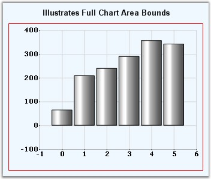
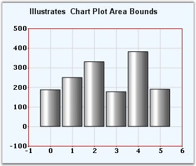

::: {style="DISPLAY: none"}
{#d2h_url_template}{#d2h_package_url style="WIDTH: 0px; DISPLAY: none; HEIGHT: 0px"}
:::

::::: {#nsbanner .d2h_main_nsbanner style="BORDER-BOTTOM: #999999 1px solid; POSITION: relative; PADDING-BOTTOM: 0px; BACKGROUND-COLOR: transparent; PADDING-LEFT: 0px; PADDING-RIGHT: 0px; DISPLAY: none; BORDER-TOP: #999999 1px solid; PADDING-TOP: 0px; LEFT: 0px"}
:::: {#TitleRow .d2h_main_titlerow style="PADDING-BOTTOM: 4px; BACKGROUND-COLOR: transparent; PADDING-LEFT: 22px; WIDTH: 100%; PADDING-RIGHT: 10px; DISPLAY: none; PADDING-TOP: 4px"}
::: {#ienav .d2h_main_ienav style="DISPLAY: none"}
{#D2HPrevious .D2HPreviousEnabled}  {#D2HNext .D2HNextEnabled}
:::
::::
:::::

:::: {#nstext .d2h_main_nstext style="PADDING-BOTTOM: 10px; BACKGROUND-COLOR: transparent; PADDING-LEFT: 22px; PADDING-RIGHT: 10px; HEIGHT: 100%; OVERFLOW: auto; PADDING-TOP: 5px" hasuserbackground="true" valign="bottom"}
::: {#d2h_breadcrumbs .d2h_breadcrumbs}
[Essential Studio User Guide Documentation](ms-xhelp:///?Id=12457748-09e3-4d74-a240-8e049cedf030){.d2h_breadcrumbsNormal}[ \> ]{.d2h_breadcrumbsLinkSeparator}[User Interface Edition](ms-xhelp:///?Id=c29296b7-531c-413b-a0ec-488ca1f7f669){.d2h_breadcrumbsNormal}[ \> ]{.d2h_breadcrumbsLinkSeparator}[Essential ASP.NET](ms-xhelp:///?Id=25c35330-c127-4dad-9a92-ed79dc7261a6){.d2h_breadcrumbsNormal}[ \> ]{.d2h_breadcrumbsLinkSeparator}[Essential Chart]{.d2h_breadcrumbsContentsOnly}[ \> ]{.d2h_breadcrumbsLinkSeparator}[Concepts and Features](ms-xhelp:///?Id=100687ce-82f2-4424-9d16-0949ea76cf15){.d2h_breadcrumbsNormal}[ \> ]{.d2h_breadcrumbsLinkSeparator}[Hit Testing](ms-xhelp:///?Id=9b2e8ab4-a10f-4efe-b0bb-247a06beb43a){.d2h_breadcrumbsNormal}
:::

### Chart Area Bounds {#chart-area-bounds style="tab-stops: 0pt"}

**[]{style="FONT-FAMILY: 'Trebuchet MS','sans-serif'; FONT-SIZE: 9pt"}** 

Full Chart Area Bounds

**[]{style="FONT-FAMILY: 'Trebuchet MS','sans-serif'"}** 

Use the **Bounds** property to get the rectangular area comprising the chart area that includes the axis, axis titles and other sections.

[]{style="FONT-FAMILY: 'Trebuchet MS','sans-serif'; FONT-SIZE: 9pt"} 

+-------------------------------------------------------------------------------------------------------------------------------------------------------------------------------------------------------------------------------------------------------------+
| **[\[C#\]]{style="FONT-FAMILY: 'Courier New'; COLOR: black"}**                                                                                                                                                                                              |
|                                                                                                                                                                                                                                                             |
| **[]{style="FONT-FAMILY: 'Courier New'; COLOR: black"}**                                                                                                                                                                                                    |
|                                                                                                                                                                                                                                                             |
| [this]{style="FONT-FAMILY: 'Courier New'; COLOR: blue"}[.ChartWebControl1.ChartAreaPaint += [new]{style="COLOR: blue"} System.Windows.Forms.[PaintEventHandler]{style="COLOR: teal"}(ChartWebControl1_ChartAreaPaint);]{style="FONT-FAMILY: 'Courier New'"} |
|                                                                                                                                                                                                                                                             |
| []{style="FONT-FAMILY: 'Courier New'; COLOR: black"}                                                                                                                                                                                                        |
|                                                                                                                                                                                                                                                             |
| [void]{style="FONT-FAMILY: 'Courier New'; COLOR: blue"}[ ChartWebControl1_ChartAreaPaint([object]{style="COLOR: blue"} sender, System.Windows.Forms.[PaintEventArgs]{style="COLOR: teal"} e)]{style="FONT-FAMILY: 'Courier New'"}                           |
|                                                                                                                                                                                                                                                             |
| [{]{style="FONT-FAMILY: 'Courier New'"}                                                                                                                                                                                                                     |
|                                                                                                                                                                                                                                                             |
| [    [Rectangle]{style="COLOR: teal"} axisBounds = [this]{style="COLOR: blue"}.ChartWebControl1.ChartWebArea.Bounds;]{style="FONT-FAMILY: 'Courier New'"}                                                                                                   |
|                                                                                                                                                                                                                                                             |
| [   // Render a rectangle around this bounds]{style="FONT-FAMILY: 'Courier New'; COLOR: green"}                                                                                                                                                             |
|                                                                                                                                                                                                                                                             |
| [    e.Graphics.DrawRectangle([Pens]{style="COLOR: teal"}.Red, axisBounds);]{style="FONT-FAMILY: 'Courier New'"}                                                                                                                                            |
|                                                                                                                                                                                                                                                             |
| [}]{style="FONT-FAMILY: 'Courier New'"}                                                                                                                                                                                                                     |
+-------------------------------------------------------------------------------------------------------------------------------------------------------------------------------------------------------------------------------------------------------------+

[]{style="COLOR: red; FONT-SIZE: 8pt"} 

+--------------------------------------------------------------------------------------------------------------------------------------------------------------------------------------------------------------------------------------------------------------------------------------------------------------------------------------------------------+
| **[\[VB.NET\]]{style="FONT-FAMILY: 'Courier New'; COLOR: black"}**                                                                                                                                                                                                                                                                                     |
|                                                                                                                                                                                                                                                                                                                                                        |
| **[]{style="FONT-FAMILY: 'Courier New'; COLOR: black"}**                                                                                                                                                                                                                                                                                               |
|                                                                                                                                                                                                                                                                                                                                                        |
| [AddHandler]{style="FONT-FAMILY: 'Courier New'; COLOR: blue"}[ [Me]{style="COLOR: blue"}.ChartWebControl1.ChartAreaPaint, [AddressOf]{style="COLOR: blue"} ChartWebControl1_ChartAreaPaint]{style="FONT-FAMILY: 'Courier New'"}                                                                                                                        |
|                                                                                                                                                                                                                                                                                                                                                        |
| []{style="FONT-FAMILY: 'Courier New'"}                                                                                                                                                                                                                                                                                                                 |
|                                                                                                                                                                                                                                                                                                                                                        |
| [Private]{style="FONT-FAMILY: 'Courier New'; COLOR: blue"}[ [Sub]{style="COLOR: blue"} ChartWebControl1_ChartAreaPaint([ByVal]{style="COLOR: blue"} sender [As]{style="COLOR: blue"} [Object]{style="COLOR: blue"}, [ByVal]{style="COLOR: blue"} e [As]{style="COLOR: blue"} System.Windows.Forms.PaintEventArgs)]{style="FONT-FAMILY: 'Courier New'"} |
|                                                                                                                                                                                                                                                                                                                                                        |
| [    [Dim]{style="COLOR: blue"} axisBounds [As]{style="COLOR: blue"} Rectangle = [Me]{style="COLOR: blue"}.ChartWebControl1.ChartWebArea.Bounds]{style="FONT-FAMILY: 'Courier New'"}                                                                                                                                                                   |
|                                                                                                                                                                                                                                                                                                                                                        |
| [    [\' Render a rectangle around this bounds]{style="COLOR: green"}]{style="FONT-FAMILY: 'Courier New'"}                                                                                                                                                                                                                                             |
|                                                                                                                                                                                                                                                                                                                                                        |
| [    e.Graphics.DrawRectangle(Pens.Red, axisBounds)]{style="FONT-FAMILY: 'Courier New'"}                                                                                                                                                                                                                                                               |
|                                                                                                                                                                                                                                                                                                                                                        |
| [End]{style="FONT-FAMILY: 'Courier New'; COLOR: blue"}[ [Sub]{style="COLOR: blue"}]{style="FONT-FAMILY: 'Courier New'"}                                                                                                                                                                                                                                |
+--------------------------------------------------------------------------------------------------------------------------------------------------------------------------------------------------------------------------------------------------------------------------------------------------------------------------------------------------------+

[]{style="COLOR: red; FONT-SIZE: 8pt"} 

{border="0"}

**[]{style="FONT-FAMILY: 'Trebuchet MS','sans-serif'; FONT-SIZE: 9pt"}** 

Figure 319: Chart Area Bounds in Red

[]{style="FONT-FAMILY: 'Trebuchet MS','sans-serif'; FONT-SIZE: 9pt"} 

Chart Plot Area Bounds

**[]{style="FONT-FAMILY: 'Trebuchet MS','sans-serif'"}** 

Use the **RenderBounds** property to get the rectangular area comprising just the plot-area, bound by the axes.

[]{style="FONT-FAMILY: 'Trebuchet MS','sans-serif'; FONT-SIZE: 9pt"} 

+-------------------------------------------------------------------------------------------------------------------------------------------------------------------------------------------------------------------------------------------------------------+
| **[\[C#\]]{style="FONT-FAMILY: 'Courier New'; COLOR: black"}**                                                                                                                                                                                              |
|                                                                                                                                                                                                                                                             |
| **[]{style="FONT-FAMILY: 'Courier New'; COLOR: black"}**                                                                                                                                                                                                    |
|                                                                                                                                                                                                                                                             |
| [this]{style="FONT-FAMILY: 'Courier New'; COLOR: blue"}[.ChartWebControl1.ChartAreaPaint += [new]{style="COLOR: blue"} System.Windows.Forms.[PaintEventHandler]{style="COLOR: teal"}(ChartWebControl1_ChartAreaPaint);]{style="FONT-FAMILY: 'Courier New'"} |
|                                                                                                                                                                                                                                                             |
| []{style="FONT-FAMILY: 'Courier New'; COLOR: black"}                                                                                                                                                                                                        |
|                                                                                                                                                                                                                                                             |
| [void]{style="FONT-FAMILY: 'Courier New'; COLOR: blue"}[ ChartWebControl1_ChartAreaPaint([object]{style="COLOR: blue"} sender, System.Windows.Forms.[PaintEventArgs]{style="COLOR: teal"} e)]{style="FONT-FAMILY: 'Courier New'"}                           |
|                                                                                                                                                                                                                                                             |
| [{]{style="FONT-FAMILY: 'Courier New'"}                                                                                                                                                                                                                     |
|                                                                                                                                                                                                                                                             |
| [    [Rectangle]{style="COLOR: teal"} axisBounds = [this]{style="COLOR: blue"}.ChartWebControl1.ChartWebArea.RenderBounds;]{style="FONT-FAMILY: 'Courier New'"}                                                                                             |
|                                                                                                                                                                                                                                                             |
| [    [// Render a rectangle around this bounds]{style="COLOR: green"}]{style="FONT-FAMILY: 'Courier New'"}                                                                                                                                                  |
|                                                                                                                                                                                                                                                             |
| [    e.Graphics.DrawRectangle([Pens]{style="COLOR: teal"}.Red, axisBounds);]{style="FONT-FAMILY: 'Courier New'"}                                                                                                                                            |
|                                                                                                                                                                                                                                                             |
| [}]{style="FONT-FAMILY: 'Courier New'"}                                                                                                                                                                                                                     |
+-------------------------------------------------------------------------------------------------------------------------------------------------------------------------------------------------------------------------------------------------------------+

[]{style="FONT-FAMILY: 'Trebuchet MS','sans-serif'; FONT-SIZE: 9pt"} 

+--------------------------------------------------------------------------------------------------------------------------------------------------------------------------------------------------------------------------------------------------------------------------------------------------------------------------------------------------------+
| **[\[VB.NET\]]{style="FONT-FAMILY: 'Courier New'; COLOR: black"}**                                                                                                                                                                                                                                                                                     |
|                                                                                                                                                                                                                                                                                                                                                        |
| **[]{style="FONT-FAMILY: 'Courier New'; COLOR: black"}**                                                                                                                                                                                                                                                                                               |
|                                                                                                                                                                                                                                                                                                                                                        |
| [AddHandler]{style="FONT-FAMILY: 'Courier New'; COLOR: blue"}[ [Me]{style="COLOR: blue"}.ChartWebControl1.ChartAreaPaint, [AddressOf]{style="COLOR: blue"} ChartWebControl1_ChartAreaPaint]{style="FONT-FAMILY: 'Courier New'"}                                                                                                                        |
|                                                                                                                                                                                                                                                                                                                                                        |
| []{style="FONT-FAMILY: 'Courier New'"}                                                                                                                                                                                                                                                                                                                 |
|                                                                                                                                                                                                                                                                                                                                                        |
| [Private]{style="FONT-FAMILY: 'Courier New'; COLOR: blue"}[ [Sub]{style="COLOR: blue"} ChartWebControl1_ChartAreaPaint([ByVal]{style="COLOR: blue"} sender [As]{style="COLOR: blue"} [Object]{style="COLOR: blue"}, [ByVal]{style="COLOR: blue"} e [As]{style="COLOR: blue"} System.Windows.Forms.PaintEventArgs)]{style="FONT-FAMILY: 'Courier New'"} |
|                                                                                                                                                                                                                                                                                                                                                        |
| [    [Dim]{style="COLOR: blue"} axisBounds [As]{style="COLOR: blue"} Rectangle = [Me]{style="COLOR: blue"}.ChartWebControl1.ChartWebArea.RenderBounds]{style="FONT-FAMILY: 'Courier New'"}                                                                                                                                                             |
|                                                                                                                                                                                                                                                                                                                                                        |
| [    [\' Render a rectangle around this bounds]{style="COLOR: green"}]{style="FONT-FAMILY: 'Courier New'"}                                                                                                                                                                                                                                             |
|                                                                                                                                                                                                                                                                                                                                                        |
| [    e.Graphics.DrawRectangle(Pens.Red, axisBounds)]{style="FONT-FAMILY: 'Courier New'"}                                                                                                                                                                                                                                                               |
|                                                                                                                                                                                                                                                                                                                                                        |
| [End]{style="FONT-FAMILY: 'Courier New'; COLOR: blue"}[ [Sub]{style="COLOR: blue"}]{style="FONT-FAMILY: 'Courier New'"}                                                                                                                                                                                                                                |
+--------------------------------------------------------------------------------------------------------------------------------------------------------------------------------------------------------------------------------------------------------------------------------------------------------------------------------------------------------+

[]{style="COLOR: red; FONT-SIZE: 8pt"} 

{border="0"}

[]{style="FONT-FAMILY: 'Trebuchet MS','sans-serif'; FONT-SIZE: 9pt"} 

Figure 320: Chart Plot Area Bounds in Red

 

[]{#p272} 

[]{#related-topics}
::::
