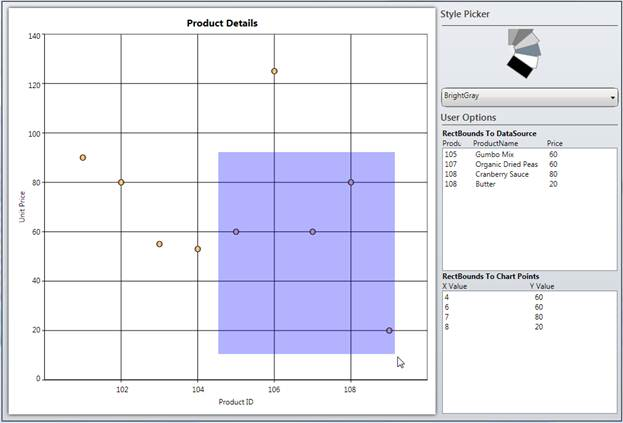

::: {style="DISPLAY: none"}
{#d2h_url_template}{#d2h_package_url style="WIDTH: 0px; DISPLAY: none; HEIGHT: 0px"}
:::

::::: {.d2h_secondary_topic style="PADDING-BOTTOM: 10pt; MARGIN: 0pt; PADDING-LEFT: 0pt; PADDING-RIGHT: 0pt; PADDING-TOP: 0pt"}
##### ChartAreaBounds {#chartareabounds style="tab-stops: 0pt"}

Essential Chart is now enhanced to obtain the list of points and the DataSource present in the user-given rectangle bounds region, using BoundsToPoints and BoundsToDataSource methods of ChartArea control.  The rectangle region given by the user can also convert to the corresponding axes range values using the ConvertBoundsToAxesRangeValues method of ChartArea control.

 

::: {style="BORDER-BOTTOM: windowtext 1pt solid; BORDER-LEFT: medium none; PADDING-BOTTOM: 1pt; MARGIN-TOP: 9pt; PADDING-LEFT: 0pt; PADDING-RIGHT: 0pt; MARGIN-BOTTOM: 9pt; BORDER-TOP: windowtext 1pt solid; BORDER-RIGHT: medium none; PADDING-TOP: 1pt"}
{border="0"}Note:  The given points of the rectangle region can internally convert to the relative position of the ChartArea control.
:::

[]{style="FONT-FAMILY: 'Trebuchet MS','sans-serif'; COLOR: #15428b; FONT-SIZE: 9pt"} 

Use Case Scenario

ChartAreaBounds is used in obtaining the list of points bound to a user-given rectangle .i.e. viewing the survey details in the area selected by the user.

 

{border="0"}

Figure 251: Listing of Data and Chart Points that exist in a User-given Rectangle Region

 

 

Adding ChartAreaBounds to an Application

BoundsToDataSource: You can use the BoundsToDataSource method of ChartArea control to get the list of the data that exist in the given rectangle region.  The following code snippet illustrates the invoke of this method:

 

+------------------------------------------------------------------------------------------------------------------------------------------------------------------------------------+
| **[\[C#\]]{style="FONT-FAMILY: 'Courier New'"}**                                                                                                                                   |
|                                                                                                                                                                                    |
| [  ]{style="FONT-FAMILY: 'Courier New'"}                                                                                                                                           |
|                                                                                                                                                                                    |
| [//Get the List of underlying objects avilable in the given \"rect\" region]{style="FONT-FAMILY: 'Courier New'; COLOR: green"}                                                     |
|                                                                                                                                                                                    |
| [chartdatasource.ItemsSource = chart.Areas\[0\].BoundsToDataSource(rect, chart.Areas\[0\].Series\[0\]);]{style="FONT-FAMILY: 'Courier New'"}[]{style="FONT-FAMILY: 'Courier New'"} |
|                                                                                                                                                                                    |
| []{style="FONT-FAMILY: 'Courier New'"}                                                                                                                                             |
+------------------------------------------------------------------------------------------------------------------------------------------------------------------------------------+

 

BoundsToPoints: You can use the BoundsToPoints method of ChartArea control to get the list of the chart points that exist in the given rectangle region. The following code snippet illustrates how to invoke this method.

 

+--------------------------------------------------------------------------------------------------------------------------------------------------------------------------------+
| **[\[C#\]]{style="FONT-FAMILY: 'Courier New'"}**                                                                                                                               |
|                                                                                                                                                                                |
| **[]{style="FONT-FAMILY: 'Courier New'"}**                                                                                                                                     |
|                                                                                                                                                                                |
| [//Get the list of chart points existing in the given \"rect\" region]{style="FONT-FAMILY: 'Courier New'; COLOR: green"}                                                       |
|                                                                                                                                                                                |
| [chartpoints.ItemsSource = chart.Areas\[0\].BoundsToPoints(rect, chart.Areas\[0\].Series\[0\]);]{style="FONT-FAMILY: 'Courier New'"}**[]{style="FONT-FAMILY: 'Courier New'"}** |
|                                                                                                                                                                                |
| []{style="FONT-FAMILY: 'Courier New'"}                                                                                                                                         |
+--------------------------------------------------------------------------------------------------------------------------------------------------------------------------------+

 

{border="0"}

Figure 252: Listing of Data and Chart Points that exist in a User-given Rectangle Region

**[]{style="FONT-FAMILY: 'Myriad Pro','sans-serif'"}** 

Table 165: Methods

::: {align="center"}
+-----------------------------------------+-----------------------------------------------------------------------------------+---------------------------------------------------------------------------------------------------------------------------------------------------------------------+
| Return Type                             | Method Name                                                                       | Description                                                                                                                                                         |
+=========================================+===================================================================================+=====================================================================================================================================================================+
| ObservableCollection\<object\>          | BoundsToDataSource(Rect rect, ChartSeries series)                                 | Returns the collection of underlying data objects (existing in the user-given rectangle region) from the user bound data on the DataSource property of ChartSeries. |
|                                         |                                                                                   |                                                                                                                                                                     |
|                                         |                                                                                   |                                                                                                                                                                     |
|                                         |                                                                                   |                                                                                                                                                                     |
|                                         |                                                                                   | **rect:**  The given rectangle points can internally convert relative to the ChartArea control.                                                                     |
|                                         |                                                                                   |                                                                                                                                                                     |
|                                         |                                                                                   |                                                                                                                                                                     |
|                                         |                                                                                   |                                                                                                                                                                     |
|                                         |                                                                                   | **series:** Initializes the series, which contains the actual DataSource in Chart Area.                                                                             |
+-----------------------------------------+-----------------------------------------------------------------------------------+---------------------------------------------------------------------------------------------------------------------------------------------------------------------+
| ObservableCollection\<IChartDataPoint\> | BoundsToPoints(Rect rect, ChartSeries series)                                     | Returns the Chart points objects (existing in the given Rect region) from the specific ChartSeries.                                                                 |
|                                         |                                                                                   |                                                                                                                                                                     |
|                                         |                                                                                   |                                                                                                                                                                     |
|                                         |                                                                                   |                                                                                                                                                                     |
|                                         |                                                                                   | **rect:** The given rectangle points can internally convert relative to the ChartArea control.                                                                      |
|                                         |                                                                                   |                                                                                                                                                                     |
|                                         |                                                                                   |                                                                                                                                                                     |
|                                         |                                                                                   |                                                                                                                                                                     |
|                                         |                                                                                   | **series:** Initializes the series, which contains the actual DataSource in the Chart area.                                                                         |
+-----------------------------------------+-----------------------------------------------------------------------------------+---------------------------------------------------------------------------------------------------------------------------------------------------------------------+
| Rect                                    | ConvertBoundsToAxesRangeValues(ChartAxis xAxis, ChartAxis yAxis, Rect actualRect) | Converts the given actual rectangle region coordinates to the corresponding chart axes range values.                                                                |
|                                         |                                                                                   |                                                                                                                                                                     |
|                                         |                                                                                   |                                                                                                                                                                     |
|                                         |                                                                                   |                                                                                                                                                                     |
|                                         |                                                                                   | **xAxis:** Initializes the X-Axis of the particular Chart series.                                                                                                   |
|                                         |                                                                                   |                                                                                                                                                                     |
|                                         |                                                                                   |                                                                                                                                                                     |
|                                         |                                                                                   |                                                                                                                                                                     |
|                                         |                                                                                   | **yAxis:** Initializes the Y-Axis of the particular Chart Series.                                                                                                   |
|                                         |                                                                                   |                                                                                                                                                                     |
|                                         |                                                                                   |                                                                                                                                                                     |
|                                         |                                                                                   |                                                                                                                                                                     |
|                                         |                                                                                   | **actualRect:**  The given rectangle points can internally convert relative to the ChartArea control.                                                               |
+-----------------------------------------+-----------------------------------------------------------------------------------+---------------------------------------------------------------------------------------------------------------------------------------------------------------------+
:::

 

Sample Link

To run the sample:

1.   Open Essential Studio Dashboard by selecting Start -\> Program -\> Syncfusion-\> Essential Studio \<\<Version Number\>\> -\> Dashboard.

2.   To run the UI Chart WPF samples, select Run locally installed samples from the WPF drop-down list in the User Interface pane.

3.   Select Chart in the sample browser.

4.   Select User Interaction from the Essential Chart menu and choose Bounds To Rectangle Demo.

5.   Click the Run Sample button.

To open the sample project:

 

1.   Go to the following location in your system: 

2.   "\<sample installation location\>\\Syncfusion\\EssentialStudio\\Version Number \\WPF\\Chart.WPF\\Samples\\3.5\\WindowsSamples\\User Interaction\\Bounds To Rectangle Demo".

3.   This location contains two sub folders CS and VB.  You can open the sample projects from the respective folders based on your application developing language.

[]{#related-topics}
:::::
