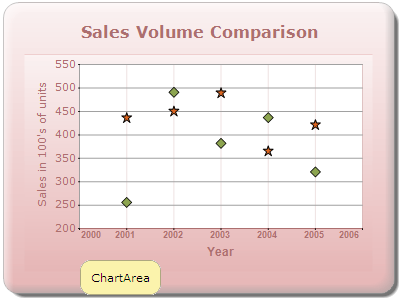

::: {style="DISPLAY: none"}
{#d2h_url_template}{#d2h_package_url style="WIDTH: 0px; DISPLAY: none; HEIGHT: 0px"}
:::

::: {.d2h_secondary_topic style="PADDING-BOTTOM: 10pt; MARGIN: 0pt; PADDING-LEFT: 0pt; PADDING-RIGHT: 0pt; PADDING-TOP: 0pt"}
#### ChartArea ToolTip {#chartarea-tooltip style="tab-stops: 0pt"}

Tooltips can also be set for the whole ChartArea (does not include legends and the space around legends) by using the ChartAreaToolTip. The data point tooltips will override this setting.

**chartModel.ChartAreaToolTip = [\"ChartArea\"]{style="COLOR: #a31515"};**

**[]{style="FONT-FAMILY: 'Calibri','sans-serif'"}** 

{border="0"}

Figure 334: ChartArea Tooltip

[]{style="FONT-FAMILY: 'Calibri','sans-serif'"} 

[]{#related-topics}
:::
