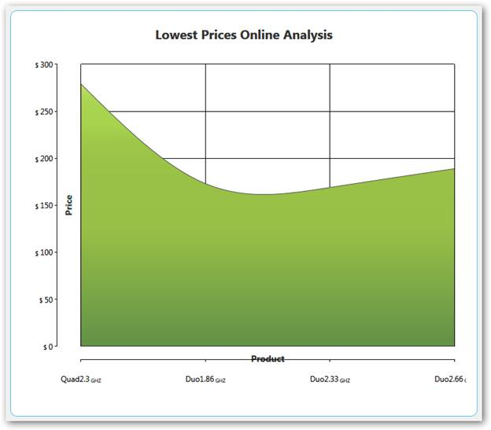
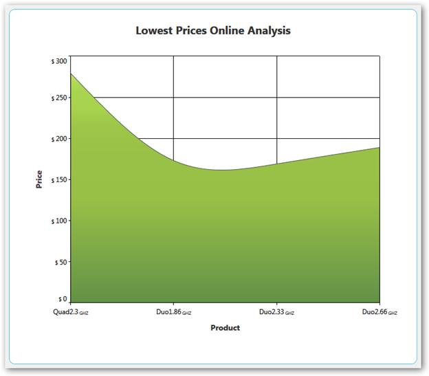
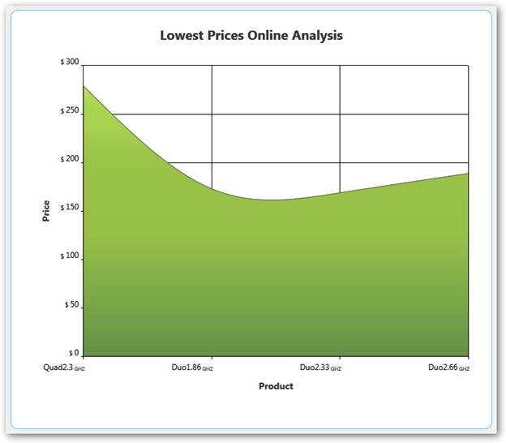

::: {style="DISPLAY: none"}
{#d2h_url_template}{#d2h_package_url style="WIDTH: 0px; DISPLAY: none; HEIGHT: 0px"}
:::

::: {.d2h_secondary_topic style="PADDING-BOTTOM: 10pt; MARGIN: 0pt; PADDING-LEFT: 0pt; PADDING-RIGHT: 0pt; PADDING-TOP: 0pt"}
##### Chart Axis Improvements {#chart-axis-improvements style="tab-stops: 0pt"}

Essential Chart provides support for some improvements in the existing chart axis by implementing the following features.

[·      ]{style="FONT-FAMILY: Symbol"}Axis headers can be positioned inside, outside, or across the chart axes.

[·      ]{style="FONT-FAMILY: Symbol"}Edge labels can be adjusted by setting **EdgeLabelsDrawingMode** to **Fit** to avoid the partial appearance of edge axis labels.

[·      ]{style="FONT-FAMILY: Symbol"}Prefixes and suffixes can be added to chart axes labels to mention the units along with the labels.

[·      ]{style="FONT-FAMILY: Symbol"}Labels can be aligned horizontally and vertically with respect to the specified width and height of chart axis labels.

Properties

+--------------------------+--------------------------------------------------------------------------+-----------------+-----------------------+
| **Property**             | **Description**                                                          | **Type**        | **Data Type**         |
+--------------------------+--------------------------------------------------------------------------+-----------------+-----------------------+
|  HeaderPosition          | Specifies the position of the header with respect to the chart axis.     |  Dependency     | AxisPositions         |
|                          |                                                                          |                 |                       |
|                          | Inside---Header is positioned inside the chart axis.                     |                 |                       |
|                          |                                                                          |                 |                       |
|                          | Outside---Header is positioned outside the chart axis.                   |                 |                       |
|                          |                                                                          |                 |                       |
|                          | Cross---Header is positioned across the chart axis.                      |                 |                       |
+--------------------------+--------------------------------------------------------------------------+-----------------+-----------------------+
| LabelHeight              | Specifies the height of axis labels                                      | Dependency      | double                |
|                          |                                                                          |                 |                       |
|                          |                                                                          |                 |                       |
+--------------------------+--------------------------------------------------------------------------+-----------------+-----------------------+
| LabelWidth               | Specifies the width of axis labels                                       | Dependency      | double                |
+--------------------------+--------------------------------------------------------------------------+-----------------+-----------------------+
| LabelHorizontalAlignment | Aligns the labels horizontally within the specified width of the labels. | Dependency      | HorizontalAlignment   |
+--------------------------+--------------------------------------------------------------------------+-----------------+-----------------------+
| LabelVerticalAlignment   | Aligns the labels horizontally within the specified width of the labels. | Dependency      | VerticalAlignment     |
+--------------------------+--------------------------------------------------------------------------+-----------------+-----------------------+
| LabelsPrefix             | Specifies the prefix for chart axis labels.                              | Dependency      | DataTemplate          |
+--------------------------+--------------------------------------------------------------------------+-----------------+-----------------------+
| LabelsPostfix            | Specifies the suffix for chart axis labels.                              | Dependency      | DataTemplate          |
+--------------------------+--------------------------------------------------------------------------+-----------------+-----------------------+
| EdgeLabelsDrawingMode    | Fit---Draws the edge labels to fit within the chart area                 | Dependency      | EdgeLabelsDrawingMode |
+--------------------------+--------------------------------------------------------------------------+-----------------+-----------------------+

 

Sample Link

To access the chart axis improvement demo:

1.   Open the Syncfusion Dashboard.

2.   Select User Interface.

3.   Click the **WPF** drop-down list and select **Explore Samples**.

4.   Browse to the path Chart.WPF\\Samples\\3.5\\ WindowsSamples\\Chart Axis\\Chart Axis Improvement Demo.[]{style="COLOR: #c00000"}

Adding Axis Improvement properties to an Application

**** 

+---------------------------------------------------------------------------------------------------------------------------------------------------------------------------------------------------------------------------------------------------------------------------------------------------------------------------------------------------------------------------------------------------------------------------------------------------------------------------------------------------------------------+
| **[\[XAML\]]{style="FONT-FAMILY: 'Courier New'"}**                                                                                                                                                                                                                                                                                                                                                                                                                                                                  |
|                                                                                                                                                                                                                                                                                                                                                                                                                                                                                                                     |
| [            \<]{style="FONT-FAMILY: Consolas; COLOR: blue; FONT-SIZE: 9.5pt"}[syncfusion]{style="FONT-FAMILY: Consolas; COLOR: #a31515; FONT-SIZE: 9.5pt"}[:]{style="FONT-FAMILY: Consolas; COLOR: blue; FONT-SIZE: 9.5pt"}[ChartAxis]{style="FONT-FAMILY: Consolas; COLOR: #a31515; FONT-SIZE: 9.5pt"}[ HeaderPosition]{style="FONT-FAMILY: Consolas; COLOR: red; FONT-SIZE: 9.5pt"}[=\"Cross\"]{style="FONT-FAMILY: Consolas; COLOR: blue; FONT-SIZE: 9.5pt"}[]{style="FONT-FAMILY: Consolas; FONT-SIZE: 9.5pt"} |
|                                                                                                                                                                                                                                                                                                                                                                                                                                                                                                                     |
| [                     [ LabelHeight]{style="COLOR: red"}[=\"40\"]{style="COLOR: blue"}[ LabelWidth]{style="COLOR: red"}[=\"120\"]{style="COLOR: blue"}                      ]{style="FONT-FAMILY: Consolas; FONT-SIZE: 9.5pt"}                                                                                                                                                                                                                                                                                      |
|                                                                                                                                                                                                                                                                                                                                                                                                                                                                                                                     |
| [                     [ LabelsPrefix]{style="COLOR: red"}[=\"{]{style="COLOR: blue"}[StaticResource]{style="COLOR: #a31515"}[ yPrefix]{style="COLOR: red"}[}\"]{style="COLOR: blue"} ]{style="FONT-FAMILY: Consolas; FONT-SIZE: 9.5pt"}                                                                                                                                                                                                                                                                             |
|                                                                                                                                                                                                                                                                                                                                                                                                                                                                                                                     |
| [                     [ LabelsPostfix]{style="COLOR: red"}[=\"{]{style="COLOR: blue"}[StaticResource]{style="COLOR: #a31515"}[ yPostfix]{style="COLOR: red"}[}\"]{style="COLOR: blue"}]{style="FONT-FAMILY: Consolas; FONT-SIZE: 9.5pt"}                                                                                                                                                                                                                                                                            |
|                                                                                                                                                                                                                                                                                                                                                                                                                                                                                                                     |
| [                     [ LabelHorizontalAlignment]{style="COLOR: red"}[=\"Left\"]{style="COLOR: blue"}[ LabelVerticalAlignment]{style="COLOR: red"}[=\"Top\"]{style="COLOR: blue"}]{style="FONT-FAMILY: Consolas; FONT-SIZE: 9.5pt"}                                                                                                                                                                                                                                                                                 |
|                                                                                                                                                                                                                                                                                                                                                                                                                                                                                                                     |
| [                     [ EdgeLabelsDrawingMode]{style="COLOR: red"}[=\"Fit\"\>]{style="COLOR: blue"}]{style="FONT-FAMILY: Consolas; FONT-SIZE: 9.5pt"}                                                                                                                                                                                                                                                                                                                                                               |
|                                                                                                                                                                                                                                                                                                                                                                                                                                                                                                                     |
| [            \</]{style="FONT-FAMILY: Consolas; COLOR: blue; FONT-SIZE: 9.5pt"}[syncfusion]{style="FONT-FAMILY: Consolas; COLOR: #a31515; FONT-SIZE: 9.5pt"}[:]{style="FONT-FAMILY: Consolas; COLOR: blue; FONT-SIZE: 9.5pt"}[ChartAxis]{style="FONT-FAMILY: Consolas; COLOR: #a31515; FONT-SIZE: 9.5pt"}[\>]{style="FONT-FAMILY: Consolas; COLOR: blue; FONT-SIZE: 9.5pt"}                                                                                                                                         |
|                                                                                                                                                                                                                                                                                                                                                                                                                                                                                                                     |
|                                                                                                                                                                                                                                                                                                                                                                                                                                                                                                                     |
+---------------------------------------------------------------------------------------------------------------------------------------------------------------------------------------------------------------------------------------------------------------------------------------------------------------------------------------------------------------------------------------------------------------------------------------------------------------------------------------------------------------------+
| **[\[C#\]]{style="FONT-FAMILY: 'Courier New'"}**                                                                                                                                                                                                                                                                                                                                                                                                                                                                    |
|                                                                                                                                                                                                                                                                                                                                                                                                                                                                                                                     |
| [            [this]{style="COLOR: blue"}.primaryAxis.HeaderPosition = [AxisPositions]{style="COLOR: #2b91af"}.Cross;]{style="FONT-FAMILY: Consolas; FONT-SIZE: 9.5pt"}                                                                                                                                                                                                                                                                                                                                              |
|                                                                                                                                                                                                                                                                                                                                                                                                                                                                                                                     |
| [            [this]{style="COLOR: blue"}.primaryAxis.LabelHeight = 40;]{style="FONT-FAMILY: Consolas; FONT-SIZE: 9.5pt"}                                                                                                                                                                                                                                                                                                                                                                                            |
|                                                                                                                                                                                                                                                                                                                                                                                                                                                                                                                     |
| [            [this]{style="COLOR: blue"}.primaryAxis.LabelWidth = 120;]{style="FONT-FAMILY: Consolas; FONT-SIZE: 9.5pt"}                                                                                                                                                                                                                                                                                                                                                                                            |
|                                                                                                                                                                                                                                                                                                                                                                                                                                                                                                                     |
| [            [this]{style="COLOR: blue"}.primaryAxis.LabelHorizontalAlignment = [HorizontalAlignment]{style="COLOR: #2b91af"}.Left;]{style="FONT-FAMILY: Consolas; FONT-SIZE: 9.5pt"}                                                                                                                                                                                                                                                                                                                               |
|                                                                                                                                                                                                                                                                                                                                                                                                                                                                                                                     |
| [            [this]{style="COLOR: blue"}.primaryAxis.LabelVerticalAlignment = [VerticalAlignment]{style="COLOR: #2b91af"}.Top;]{style="FONT-FAMILY: Consolas; FONT-SIZE: 9.5pt"}                                                                                                                                                                                                                                                                                                                                    |
|                                                                                                                                                                                                                                                                                                                                                                                                                                                                                                                     |
| [            [this]{style="COLOR: blue"}.primaryAxis.LabelsPrefix = xPrefix;]{style="FONT-FAMILY: Consolas; FONT-SIZE: 9.5pt"}                                                                                                                                                                                                                                                                                                                                                                                      |
|                                                                                                                                                                                                                                                                                                                                                                                                                                                                                                                     |
| [            [this]{style="COLOR: blue"}.primaryAxis.LabelsPostfix = xPostfix;]{style="FONT-FAMILY: Consolas; FONT-SIZE: 9.5pt"}                                                                                                                                                                                                                                                                                                                                                                                    |
|                                                                                                                                                                                                                                                                                                                                                                                                                                                                                                                     |
| [            [this]{style="COLOR: blue"}.primaryAxis.EdgeLabelsDrawingMode = [EdgeLabelsDrawingMode]{style="COLOR: #2b91af"}.Fit;]{style="FONT-FAMILY: Consolas; FONT-SIZE: 9.5pt"}                                                                                                                                                                                                                                                                                                                                 |
|                                                                                                                                                                                                                                                                                                                                                                                                                                                                                                                     |
| **[]{style="FONT-FAMILY: 'Courier New'"}**                                                                                                                                                                                                                                                                                                                                                                                                                                                                          |
+---------------------------------------------------------------------------------------------------------------------------------------------------------------------------------------------------------------------------------------------------------------------------------------------------------------------------------------------------------------------------------------------------------------------------------------------------------------------------------------------------------------------+

{border="0"}

Figure 204: Primary Axis HeaderPosition \[Across\] and Secondary Axis HeaderPosition \[Inside\] &

Primary Axis Labels with Postfix (GHZ) and Secondary Axis Labels withPrefix (\$)

 {border="0"}

Figure 205: Primary Axis EdgeLabelsDrawingMode \[Fit\] and

Secondary Axis EdgeLabelsDrawingMode \[Shift\]

{border="0"}

Figure 206: Primary Axis LabelWidth \[120\], LabelHorizontalAlignment \[Left\] and

Secondary Axis LabelHeight \[30\], LabelVerticalAlignment \[Top\]

 

[]{#related-topics}
:::
