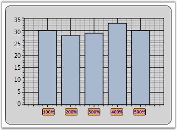

::: {style="DISPLAY: none"}
{#d2h_url_template}{#d2h_package_url style="WIDTH: 0px; DISPLAY: none; HEIGHT: 0px"}
:::

:::: {.d2h_secondary_topic style="PADDING-BOTTOM: 10pt; MARGIN: 0pt; PADDING-LEFT: 0pt; PADDING-RIGHT: 0pt; PADDING-TOP: 0pt"}
##### Chart Axis Label {#chart-axis-label style="tab-stops: 0pt"}

ChartAxis Labels can be customized by using the below given properties.

 

Table 142: ChartAxis Property

::: {align="center"}
+-----------------------------------+--------------------------------------------------------------------------+
| ChartAxis Property                | Description                                                              |
+-----------------------------------+--------------------------------------------------------------------------+
| LabelBackground                   | gets or sets the Background of the ChartAxis Label                       |
+-----------------------------------+--------------------------------------------------------------------------+
| LabelForeground                   | gets or sets the Foreground of the ChartAxis Label                       |
+-----------------------------------+--------------------------------------------------------------------------+
| LabelBorderBrush                  | gets or sets the Border brush of the ChartAxis Label                     |
+-----------------------------------+--------------------------------------------------------------------------+
| LabelBorderThickness              | gets or sets the Border thickness of the ChartAxis Label                 |
+-----------------------------------+--------------------------------------------------------------------------+
| LabelCornerRadius                 | gets or sets the Corner Radius of the ChartAxis Label                    |
+-----------------------------------+--------------------------------------------------------------------------+
| LabelFontFamily                   | gets or sets the FontFamily of the ChartAxis Label                       |
+-----------------------------------+--------------------------------------------------------------------------+
| LabelFontSize                     | gets or sets the FontSize of the ChartAxis Label                         |
+-----------------------------------+--------------------------------------------------------------------------+
| LabelFontWeight                   | gets or sets the FontWeight of the ChartAxis Label                       |
+-----------------------------------+--------------------------------------------------------------------------+
| LabelFormat                       | gets or sets the Format of the ChartAxis Label such as 0.00 or 0 precent |
+-----------------------------------+--------------------------------------------------------------------------+
| LabelDateTimeFormat               | gets or sets the DateTime Format of the ChartAxis Label                  |
|                                   |                                                                          |
|                                   | Applicable when Axis.ValueType is DateTime                               |
+-----------------------------------+--------------------------------------------------------------------------+
:::

 

The below given code snippet could be used to customize the Chart Axis Labels.

[]{style="FONT-FAMILY: 'Trebuchet MS','sans-serif'; COLOR: #15428b"} 

+-------------------------------------------------------------------------------------------------------------------------------------------------------------------------------------------------------------------------------------------------------------------------------------------------------------------------------------------------------------------------------------------------------------------------------------------------------------------------------------------------------------------------------------------------------------------------------------------------------------------------------------------------------------------------------------------------------------------------------------------------------------------------------------------------------------------------------------------------------------------------------------------------------------------------------------+
| **[\[XAML\]]{style="FONT-FAMILY: 'Courier New'"}**                                                                                                                                                                                                                                                                                                                                                                                                                                                                                                                                                                                                                                                                                                                                                                                                                                                                                  |
|                                                                                                                                                                                                                                                                                                                                                                                                                                                                                                                                                                                                                                                                                                                                                                                                                                                                                                                                     |
| []{style="FONT-FAMILY: 'Courier New'"}                                                                                                                                                                                                                                                                                                                                                                                                                                                                                                                                                                                                                                                                                                                                                                                                                                                                                              |
|                                                                                                                                                                                                                                                                                                                                                                                                                                                                                                                                                                                                                                                                                                                                                                                                                                                                                                                                     |
| [\<]{style="FONT-FAMILY: 'Courier New'; COLOR: blue"}[sfchart]{style="FONT-FAMILY: 'Courier New'; COLOR: #a31515"}[:]{style="FONT-FAMILY: 'Courier New'; COLOR: blue"}[ChartArea.PrimaryAxis]{style="FONT-FAMILY: 'Courier New'; COLOR: #a31515"}[\>]{style="FONT-FAMILY: 'Courier New'; COLOR: blue"}                                                                                                                                                                                                                                                                                                                                                                                                                                                                                                                                                                                                                              |
|                                                                                                                                                                                                                                                                                                                                                                                                                                                                                                                                                                                                                                                                                                                                                                                                                                                                                                                                     |
| [\<]{style="FONT-FAMILY: 'Courier New'; COLOR: blue"}[sfchart]{style="FONT-FAMILY: 'Courier New'; COLOR: #a31515"}[:]{style="FONT-FAMILY: 'Courier New'; COLOR: blue"}[ChartAxis]{style="FONT-FAMILY: 'Courier New'; COLOR: #a31515"}[ [ LabelForeground]{style="COLOR: red"}[=\"Blue\"]{style="COLOR: blue"}[ LabelBackground]{style="COLOR: red"}[=\"Orange\"]{style="COLOR: blue"}[ LabelBorderBrush]{style="COLOR: red"}[=\"Black\"]{style="COLOR: blue"}[ LabelBorderThickness]{style="COLOR: red"}[=\"1\"]{style="COLOR: blue"}[ LabelCornerRadius]{style="COLOR: red"}[=\"2\"]{style="COLOR: blue"}[ LabelFontFamily]{style="COLOR: red"}[=\"Calibri\"]{style="COLOR: blue"}[ LabelFontSize]{style="COLOR: red"}[=\"10\"]{style="COLOR: blue"}[ LabelFontWeight]{style="COLOR: red"}[=\"Bold\"]{style="COLOR: blue"}[ LabelFormat]{style="COLOR: red"}[=\"0%\"/\>]{style="COLOR: blue"}]{style="FONT-FAMILY: 'Courier New'"} |
|                                                                                                                                                                                                                                                                                                                                                                                                                                                                                                                                                                                                                                                                                                                                                                                                                                                                                                                                     |
| [\</]{style="FONT-FAMILY: 'Courier New'; COLOR: blue"}[sfchart]{style="FONT-FAMILY: 'Courier New'; COLOR: #a31515"}[:]{style="FONT-FAMILY: 'Courier New'; COLOR: blue"}[ChartArea.PrimaryAxis]{style="FONT-FAMILY: 'Courier New'; COLOR: #a31515"}[\>]{style="FONT-FAMILY: 'Courier New'; COLOR: blue"}                                                                                                                                                                                                                                                                                                                                                                                                                                                                                                                                                                                                                             |
+-------------------------------------------------------------------------------------------------------------------------------------------------------------------------------------------------------------------------------------------------------------------------------------------------------------------------------------------------------------------------------------------------------------------------------------------------------------------------------------------------------------------------------------------------------------------------------------------------------------------------------------------------------------------------------------------------------------------------------------------------------------------------------------------------------------------------------------------------------------------------------------------------------------------------------------+

[]{style="FONT-FAMILY: 'Trebuchet MS','sans-serif'; COLOR: #15428b"} 

+-----------------------------------------------------------------------------------------------------------------------------------------------------------------------------------+
| **[\[C#\]]{style="FONT-FAMILY: 'Courier New'"}**                                                                                                                                  |
|                                                                                                                                                                                   |
| []{style="FONT-FAMILY: 'Courier New'"}                                                                                                                                            |
|                                                                                                                                                                                   |
| [//Sets the Label settings of PrimaryAxis]{style="FONT-FAMILY: 'Courier New'; COLOR: green"}                                                                                      |
|                                                                                                                                                                                   |
| [ Area.PrimaryAxis.LabelForeground = [Brushes]{style="COLOR: #2b91af"}.Blue;]{style="FONT-FAMILY: 'Courier New'"}                                                                 |
|                                                                                                                                                                                   |
| [ Area.PrimaryAxis.LabelBackground = [Brushes]{style="COLOR: #2b91af"}.Orange;]{style="FONT-FAMILY: 'Courier New'"}                                                               |
|                                                                                                                                                                                   |
| [ Area.PrimaryAxis.LabelBorderBrush = [Brushes]{style="COLOR: #2b91af"}.Black;]{style="FONT-FAMILY: 'Courier New'"}                                                               |
|                                                                                                                                                                                   |
| [ Area.PrimaryAxis.LabelBorderThickness = [new]{style="COLOR: blue"} [Thickness]{style="COLOR: #2b91af"}(1);]{style="FONT-FAMILY: 'Courier New'"}                                 |
|                                                                                                                                                                                   |
| [ Area.PrimaryAxis.LabelCornerRadius = [new]{style="COLOR: blue"} [CornerRadius]{style="COLOR: #2b91af"}(2);]{style="FONT-FAMILY: 'Courier New'"}                                 |
|                                                                                                                                                                                   |
| [ Area.PrimaryAxis.LabelFontFamily = [new]{style="COLOR: blue"} [FontFamily]{style="COLOR: #2b91af"}([\"Calibri\"]{style="COLOR: #a31515"});]{style="FONT-FAMILY: 'Courier New'"} |
|                                                                                                                                                                                   |
| [ Area.PrimaryAxis.LabelFontSize = 10;            ]{style="FONT-FAMILY: 'Courier New'"}                                                                                           |
|                                                                                                                                                                                   |
| [ Area.PrimaryAxis.LabelFontWeight = [FontWeights]{style="COLOR: #2b91af"}.Bold;]{style="FONT-FAMILY: 'Courier New'"}                                                             |
|                                                                                                                                                                                   |
| [ Area.PrimaryAxis.LabelFormat = [\"0%\"]{style="COLOR: #a31515"};           ]{style="FONT-FAMILY: 'Courier New'"}                                                                |
+-----------------------------------------------------------------------------------------------------------------------------------------------------------------------------------+

 

Below given figure illustrates Chart with customized Primary Axis labels.

 

{border="0"}

Figure 208: Chart with customized PrimaryAxis Labels

**[]{style="FONT-FAMILY: 'Trebuchet MS','sans-serif'; COLOR: #15428b"}** 

See Also

[[Chart Font Settings]{.UGHyperlink}](ms-xhelp:///?Id=b1c21b8d-8c5c-47cf-9b9b-fcf42554913b)[, ]{style="FONT-FAMILY: 'Trebuchet MS','sans-serif'; COLOR: #15428b; FONT-SIZE: 9pt"}[[Axis Label Rotate]{.UGHyperlink}](ms-xhelp:///?Id=fd92a661-fbc5-45ac-a250-c07dac9b533e)[, ]{style="FONT-FAMILY: 'Trebuchet MS','sans-serif'; COLOR: #15428b; FONT-SIZE: 9pt"}[[Intersecting Labels]{.UGHyperlink}](ms-xhelp:///?Id=d3278943-c58b-4a3e-a82f-c45bdaac2095)[]{style="FONT-FAMILY: 'Trebuchet MS','sans-serif'; COLOR: #15428b; FONT-SIZE: 9pt"}

 

[]{#p140} 

 

[]{#related-topics}
::::
