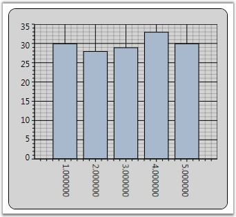

::: {style="DISPLAY: none"}
{#d2h_url_template}{#d2h_package_url style="WIDTH: 0px; DISPLAY: none; HEIGHT: 0px"}
:::

:::: {.d2h_secondary_topic style="PADDING-BOTTOM: 10pt; MARGIN: 0pt; PADDING-LEFT: 0pt; PADDING-RIGHT: 0pt; PADDING-TOP: 0pt"}
##### Chart Axis Label Rotate {#chart-axis-label-rotate style="tab-stops: 0pt"}

ChartAxis labels could be rotated with custom angles. **Axis.LabelRotateAngle** property is used to define the angle in which the Axis Labels need to be rotated.

 

The below given code snippet could be used to customize the labels to be rotated with 90\'.

 

+------------------------------------------------------------------------------------------------------------------------------------------------------------------------------------------------------------------------------------------------------------------------------------------------------------------------------------------------------------------------------------------------------------------------------------------------------------------------------------------------------+
| **[\[XAML\]]{style="FONT-FAMILY: 'Courier New'"}**                                                                                                                                                                                                                                                                                                                                                                                                                                                   |
|                                                                                                                                                                                                                                                                                                                                                                                                                                                                                                      |
| []{style="FONT-FAMILY: 'Courier New'"}                                                                                                                                                                                                                                                                                                                                                                                                                                                               |
|                                                                                                                                                                                                                                                                                                                                                                                                                                                                                                      |
| [\<]{style="FONT-FAMILY: 'Courier New'; COLOR: blue"}[sfchart]{style="FONT-FAMILY: 'Courier New'; COLOR: #a31515"}[:]{style="FONT-FAMILY: 'Courier New'; COLOR: blue"}[ChartArea.PrimaryAxis]{style="FONT-FAMILY: 'Courier New'; COLOR: #a31515"}[\>]{style="FONT-FAMILY: 'Courier New'; COLOR: blue"}                                                                                                                                                                                               |
|                                                                                                                                                                                                                                                                                                                                                                                                                                                                                                      |
| [\<]{style="FONT-FAMILY: 'Courier New'; COLOR: blue"}[sfchart]{style="FONT-FAMILY: 'Courier New'; COLOR: #a31515"}[:]{style="FONT-FAMILY: 'Courier New'; COLOR: blue"}[ChartAxis]{style="FONT-FAMILY: 'Courier New'; COLOR: #a31515"}[ LabelRotateAngle]{style="FONT-FAMILY: 'Courier New'; COLOR: red"}[=\"90\"]{style="FONT-FAMILY: 'Courier New'; COLOR: blue"}[ LabelFormat]{style="FONT-FAMILY: 'Courier New'; COLOR: red"}[=\"0.000000\" /\>]{style="FONT-FAMILY: 'Courier New'; COLOR: blue"} |
|                                                                                                                                                                                                                                                                                                                                                                                                                                                                                                      |
| [\</]{style="FONT-FAMILY: 'Courier New'; COLOR: blue"}[sfchart]{style="FONT-FAMILY: 'Courier New'; COLOR: #a31515"}[:]{style="FONT-FAMILY: 'Courier New'; COLOR: blue"}[ChartArea.PrimaryAxis]{style="FONT-FAMILY: 'Courier New'; COLOR: #a31515"}[\>]{style="FONT-FAMILY: 'Courier New'; COLOR: blue"}                                                                                                                                                                                              |
+------------------------------------------------------------------------------------------------------------------------------------------------------------------------------------------------------------------------------------------------------------------------------------------------------------------------------------------------------------------------------------------------------------------------------------------------------------------------------------------------------+

[]{style="FONT-FAMILY: 'Trebuchet MS','sans-serif'; COLOR: #15428b"} 

+----------------------------------------------------------------------------------------------------+
| **[\[C#\]]{style="FONT-FAMILY: 'Courier New'"}**                                                   |
|                                                                                                    |
| []{style="FONT-FAMILY: 'Courier New'"}                                                             |
|                                                                                                    |
| [//Sets the Label to be rotated with 90\' angle]{style="FONT-FAMILY: 'Courier New'; COLOR: green"} |
|                                                                                                    |
| [ Area.PrimaryAxis.LabelRotateAngle = 90;           ]{style="FONT-FAMILY: 'Courier New'"}          |
+----------------------------------------------------------------------------------------------------+

[]{style="FONT-FAMILY: 'Trebuchet MS','sans-serif'; COLOR: #15428b; FONT-SIZE: 9pt"} 

Below given figure illustrates Chart with Primary Axis labels rotated with 90\' angle

[]{style="FONT-FAMILY: 'Trebuchet MS','sans-serif'; COLOR: #15428b; FONT-SIZE: 9pt"} 

{border="0"}

Figure 211: Primary Axis Labels rotated with 90 degrees Angle

 

::: {style="BORDER-BOTTOM: windowtext 1pt solid; BORDER-LEFT: medium none; PADDING-BOTTOM: 1pt; MARGIN-TOP: 9pt; PADDING-LEFT: 0pt; PADDING-RIGHT: 0pt; MARGIN-BOTTOM: 9pt; BORDER-TOP: windowtext 1pt solid; BORDER-RIGHT: medium none; PADDING-TOP: 1pt"}
{border="0"}Note: LabelRotateAngle property will not have effect when the Axis.IntersectAction property is set as Rotate.
:::

[]{style="FONT-FAMILY: 'Trebuchet MS','sans-serif'; COLOR: #15428b; FONT-SIZE: 9pt"} 

See Also

[[Chart Font Settings]{.UGHyperlink}](ms-xhelp:///?Id=be5d4243-0e64-455e-8324-30f0d5d9afce)[,]{.UGHyperlink}[ ]{style="FONT-FAMILY: 'Trebuchet MS','sans-serif'; COLOR: #15428b; FONT-SIZE: 9pt"}[[Chart Axis Label]{.UGHyperlink}](ms-xhelp:///?Id=be5d4243-0e64-455e-8324-30f0d5d9afce)[, ]{style="FONT-FAMILY: 'Trebuchet MS','sans-serif'; COLOR: #15428b; FONT-SIZE: 9pt"}[[Intersecting Labels]{.UGHyperlink}](ms-xhelp:///?Id=5ff18338-2f26-4cdc-94d4-1b1ce31f9f5a)[]{style="FONT-FAMILY: 'Trebuchet MS','sans-serif'; COLOR: #15428b; FONT-SIZE: 9pt"}

 

[]{#p142} 

 

[]{#related-topics}
::::
