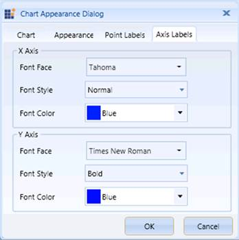

::: {style="DISPLAY: none"}
{#d2h_url_template}{#d2h_package_url style="WIDTH: 0px; DISPLAY: none; HEIGHT: 0px"}
:::

::::: {.d2h_secondary_topic style="PADDING-BOTTOM: 10pt; MARGIN: 0pt; PADDING-LEFT: 0pt; PADDING-RIGHT: 0pt; PADDING-TOP: 0pt"}
##### Chart Axis Labels {#chart-axis-labels style="tab-stops: 0pt"}

[]{style="FONT-FAMILY: 'Calibri','sans-serif'; FONT-SIZE: 11pt"} 

The Appearance dialog box enables you to customize the Labels of the Primary and the Secondary Axes.

###### 1.6.1.11.4.1        Customizing the Font Style of the Primary Axis {#customizing-the-font-style-of-the-primary-axis style="tab-stops: 0pt"}

 

OLAP Chart provides support to dynamically change the Font Family, Font Color, and Font Weight for the Labels of the Primary Axis.

 

::: {align="center"}
  ----------------------------- --------------------------------------------------------------
  Property                      Description
  PrimaryAxis.LabelFontFamily   Specifies the font family for the label of the Primary Axis.
  PrimaryAxis.LabelForeground   Specifies the font color for the label of the Primary Axis.
  PrimaryAxis.LabelFontWeight   Specifies the font weight for the label of the Primary Axis.
  ----------------------------- --------------------------------------------------------------
:::

 

The following code examples illustrate how to customize the font style of the Primary Axis:

 

+-----------------------------------------------------------------------------------------------------------------------------------------------------------------------------+
| **\[C#\]**                                                                                                                                                                  |
|                                                                                                                                                                             |
| [// Set the Font Family.]{style="COLOR: green"}\                                                                                                                            |
| [this]{style="COLOR: blue"}.olapchart1.PrimaryAxis.LabelFontFamily = [new]{style="COLOR: blue"} [FontFamily]{style="COLOR: #2b91af"}([\"Arial\"]{style="COLOR: #a31515"});\ |
|  \                                                                                                                                                                          |
| [// Set the Font Color.]{style="COLOR: green"}\                                                                                                                             |
| [this]{style="COLOR: blue"}.olapchart1.PrimaryAxis.LabelForeground = [Brushes]{style="COLOR: #2b91af"}.LightGray;\                                                          |
|  \                                                                                                                                                                          |
| [// Set the Font Weight.]{style="COLOR: green"}\                                                                                                                            |
| [this]{style="COLOR: blue"}.olapchart1.PrimaryAxis.LabelFontWeight = [FontWeights]{style="COLOR: #2b91af"}.Bold;                                                            |
+-----------------------------------------------------------------------------------------------------------------------------------------------------------------------------+

[]{style="FONT-FAMILY: 'Calibri','sans-serif'; FONT-SIZE: 11pt"} 

+--------------------------------------------------------------------------------------------------------------------------------------------------------------------------+
| **\[VB\]**                                                                                                                                                               |
|                                                                                                                                                                          |
| [\' Set the Font Family.]{style="COLOR: green"}\                                                                                                                         |
| [Me]{style="COLOR: blue"}.olapchart1.PrimaryAxis.LabelFontFamily = [New]{style="COLOR: blue"} [FontFamily]{style="COLOR: #2b91af"}([\"Arial\"]{style="COLOR: #a31515"})\ |
|  \                                                                                                                                                                       |
| [\' Set the Font Color.]{style="COLOR: green"}\                                                                                                                          |
| [Me]{style="COLOR: blue"}.olapchart1.PrimaryAxis.LabelForeground = [Brushes]{style="COLOR: #2b91af"}.LightGray\                                                          |
|  \                                                                                                                                                                       |
| [\' Set the Font Weight.]{style="COLOR: green"}\                                                                                                                         |
| [Me]{style="COLOR: blue"}.olapchart1.PrimaryAxis.LabelFontWeight = [FontWeights]{style="COLOR: #2b91af"}.Bold                                                            |
+--------------------------------------------------------------------------------------------------------------------------------------------------------------------------+

[]{style="FONT-FAMILY: 'Calibri','sans-serif'; FONT-SIZE: 11pt"} 

###### 1.6.1.11.4.2        Customizing the Font Style of the Secondary Axis {#customizing-the-font-style-of-the-secondary-axis style="tab-stops: 0pt"}

 

OLAP Chart provides support to dynamically change the Font Family, Font Color, and Font Weight for the Labels of the Secondary Axis.

 

::: {align="center"}
  ----------------------------- ----------------------------------------------------------------
  Property                      Description
  PrimaryAxis.LabelFontFamily   Specifies the font family for the label of the Secondary Axis.
  PrimaryAxis.LabelForeground   Specifies the font color for the label of the Secondary Axis.
  PrimaryAxis.LabelFontWeight   Specifies the font weight for the label of the Secondary Axis.
  ----------------------------- ----------------------------------------------------------------
:::

 

The following code examples illustrate how to customize the font style of the Secondary Axis:

 

+-------------------------------------------------------------------------------------------------------------------------------------------------------------------------------+
| **\[C#\]**                                                                                                                                                                    |
|                                                                                                                                                                               |
| [// Set the Font Family.]{style="COLOR: green"}\                                                                                                                              |
| [this]{style="COLOR: blue"}.olapchart1.SecondaryAxis.LabelFontFamily = [new]{style="COLOR: blue"} [FontFamily]{style="COLOR: #2b91af"}([\"Arial\"]{style="COLOR: #a31515"});\ |
|  \                                                                                                                                                                            |
| [// Set the Foreground Color.]{style="COLOR: green"}\                                                                                                                         |
| [this]{style="COLOR: blue"}.olapchart1.SecondaryAxis.LabelForeground = [Brushes]{style="COLOR: #2b91af"}.LightGray;\                                                          |
|  \                                                                                                                                                                            |
| [// Set the Font Weight.]{style="COLOR: green"}\                                                                                                                              |
| [this]{style="COLOR: blue"}.olapchart1.SecondaryAxis.LabelFontWeight = [FontWeights]{style="COLOR: #2b91af"}.Bold;                                                            |
+-------------------------------------------------------------------------------------------------------------------------------------------------------------------------------+

[]{style="FONT-FAMILY: 'Calibri','sans-serif'; FONT-SIZE: 11pt"} 

+----------------------------------------------------------------------------------------------------------------------------------------------------------------------------+
| **\[VB\]**                                                                                                                                                                 |
|                                                                                                                                                                            |
| [\' Set the Font Family.]{style="COLOR: green"}\                                                                                                                           |
| [Me]{style="COLOR: blue"}.olapchart1.SecondaryAxis.LabelFontFamily = [New]{style="COLOR: blue"} [FontFamily]{style="COLOR: #2b91af"}([\"Arial\"]{style="COLOR: #a31515"})\ |
|  \                                                                                                                                                                         |
| [\' Set the Foreground Color.]{style="COLOR: green"}\                                                                                                                      |
| [Me]{style="COLOR: blue"}.olapchart1.SecondaryAxis.LabelForeground = [Brushes]{style="COLOR: #2b91af"}.LightGray\                                                          |
|  \                                                                                                                                                                         |
| [\' Set the Font Weight.]{style="COLOR: green"}\                                                                                                                           |
| [Me]{style="COLOR: blue"}.olapchart1.SecondaryAxis.LabelFontWeight = [FontWeights]{style="COLOR: #2b91af"}.Bold                                                            |
+----------------------------------------------------------------------------------------------------------------------------------------------------------------------------+

[]{style="FONT-FAMILY: 'Calibri','sans-serif'; FONT-SIZE: 11pt"} 

{border="0"}

 

Figure 67: Customizing the Chart Axis Labels[]{style="FONT-FAMILY: 'Calibri','sans-serif'; FONT-SIZE: 11pt"}

[]{style="FONT-FAMILY: 'Calibri','sans-serif'; FONT-SIZE: 11pt"} 

A sample, which demonstrates all the appearance properties, is available in the following installation location:

**..\\Syncfusion\\\<Version Number\>\\BI\\WPF\\OlapChart.WPF\\Samples\\Chart Appearance**

[]{style="FONT-FAMILY: 'Calibri','sans-serif'; FONT-SIZE: 11pt"} 

[]{#related-topics}
:::::
