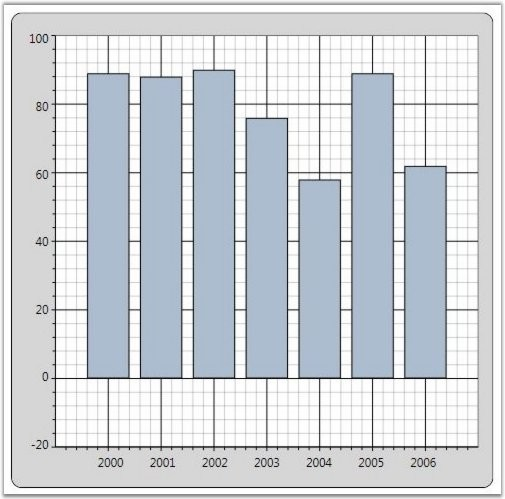
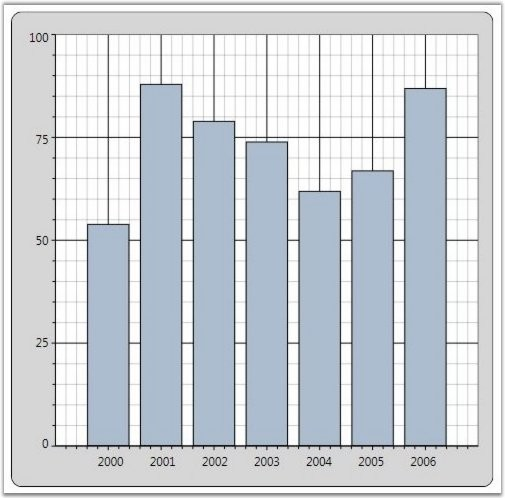
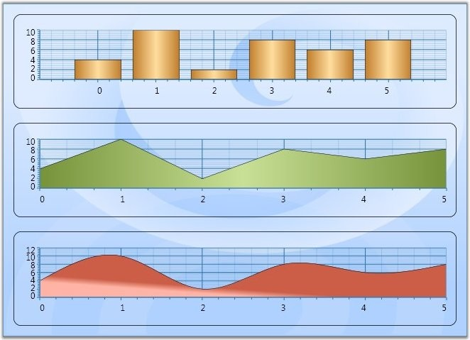
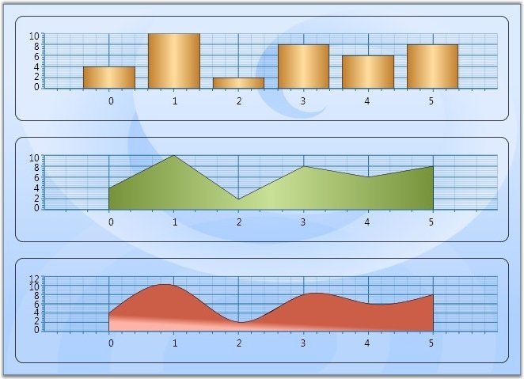
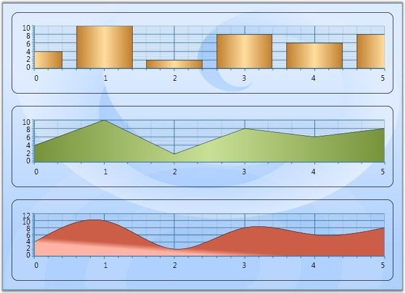
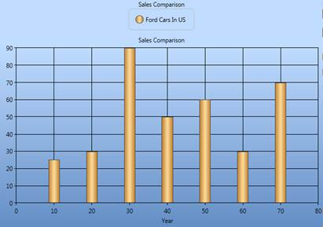
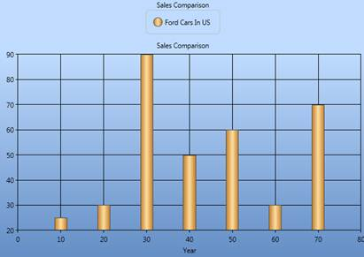

::: {style="DISPLAY: none"}
{#d2h_url_template}{#d2h_package_url style="WIDTH: 0px; DISPLAY: none; HEIGHT: 0px"}
:::

::::::::: {.d2h_secondary_topic style="PADDING-BOTTOM: 10pt; MARGIN: 0pt; PADDING-LEFT: 0pt; PADDING-RIGHT: 0pt; PADDING-TOP: 0pt"}
##### ChartAxis Range {#chartaxis-range style="tab-stops: 0pt"}

Essential Chart for WPF lets you customize the range and intervals that are displayed in the axes. This section discusses the below topics.

[]{style="FONT-FAMILY: 'Trebuchet MS','sans-serif'; COLOR: #15428b; FONT-SIZE: 9pt"} 

[·      ]{style="FONT-FAMILY: Symbol"}Axis Range Customization

[·      ]{style="FONT-FAMILY: Symbol"}AutoRange Customization

[·      ]{style="FONT-FAMILY: Symbol"}Custom Range Support

[·      ]{style="FONT-FAMILY: Symbol"}RangeCalculationMode

[·      ]{style="FONT-FAMILY: Symbol"}VisibleRange

[]{style="FONT-FAMILY: 'Trebuchet MS','sans-serif'; COLOR: #15428b; FONT-SIZE: 9pt"} 

Axis Range Customization

You can customize the range and intervals that are displayed in the axes by using the following ChartAxis properties.

[]{style="FONT-FAMILY: 'Trebuchet MS','sans-serif'; COLOR: #15428b; FONT-SIZE: 9pt"} 

Table 124: ChartAxis Properties

::: {align="center"}
  ---------------------- -------------------------------------------------------------------------------------------------------------------------------------------------------------
  ChartAxis Properties   Description
  IsAutoSetRange         A bool property specifies whether the range of the axis should be set automatically or a custom specified range will be used. Default is true (auto range).
  ---------------------- -------------------------------------------------------------------------------------------------------------------------------------------------------------
:::

[]{style="FONT-FAMILY: 'Trebuchet MS','sans-serif'; COLOR: #15428b; FONT-SIZE: 9pt"} 

Auto Range Customization

With the default \"auto range calculation\" setting (IsAutoSetRange=true) the following properties let you customize the automatic range calculation a bit.

[]{style="FONT-FAMILY: 'Trebuchet MS','sans-serif'; COLOR: #15428b; FONT-SIZE: 9pt"} 

Table 125: ChartAxis Properties

::: {align="center"}
+-----------------------------------------------------------------------------------+-------------------------------------------------------------------------------------------------------------------------------------------------------------------------------------------------------------------------------------------------------------+
| ChartAxis Properties                                                              | Description                                                                                                                                                                                                                                                 |
+-----------------------------------------------------------------------------------+-------------------------------------------------------------------------------------------------------------------------------------------------------------------------------------------------------------------------------------------------------------+
| DesiredIntervalCount                                                              | A integer property used to indicate the preferred total number of intervals to be displayed for auto range calculation.                                                                                                                                     |
|                                                                                   |                                                                                                                                                                                                                                                             |
|                                                                                   |                                                                                                                                                                                                                                                             |
|                                                                                   |                                                                                                                                                                                                                                                             |
|                                                                                   | ::: {style="BORDER-BOTTOM: windowtext 1pt solid; BORDER-LEFT: medium none; PADDING-BOTTOM: 1pt; MARGIN-TOP: 9pt; PADDING-LEFT: 0pt; PADDING-RIGHT: 0pt; MARGIN-BOTTOM: 9pt; BORDER-TOP: windowtext 1pt solid; BORDER-RIGHT: medium none; PADDING-TOP: 1pt"} |
|                                                                                   | {border="0"}Note: DesiredIntervalsCount will not be taken into account when the interval is set.                                                                                                                                |
|                                                                                   | :::                                                                                                                                                                                                                                                         |
+-----------------------------------------------------------------------------------+-------------------------------------------------------------------------------------------------------------------------------------------------------------------------------------------------------------------------------------------------------------+
| RangePadding                                                                      | An enum property, used to specify the spacing of the chart axis for auto range calculation. This property can take three values:                                                                                                                            |
|                                                                                   |                                                                                                                                                                                                                                                             |
|                                                                                   | *None* -- Range of the axis will be calculated from minimum value in the data source to the maximum value in the data source.                                                                                                                               |
|                                                                                   |                                                                                                                                                                                                                                                             |
|                                                                                   | *Normal* -- Range of the axis will be calculated from the nearest multiples of interval from minimum and maximum values in the data source.                                                                                                                 |
|                                                                                   |                                                                                                                                                                                                                                                             |
|                                                                                   | *Additional* -- Range of the axis will be calculated one interval lower from the minimum value to one interval higher than the maximum value in the datasource in terms of multiples of interval.                                                           |
+-----------------------------------------------------------------------------------+-------------------------------------------------------------------------------------------------------------------------------------------------------------------------------------------------------------------------------------------------------------+
| IsSetDataValueRange[]{style="FONT-FAMILY: 'Segoe UI','sans-serif'; COLOR: black"} | A bool property used to calculate the axis range based on the modified data value range.[]{style="FONT-FAMILY: 'Segoe UI','sans-serif'; COLOR: black"}                                                                                                      |
+-----------------------------------------------------------------------------------+-------------------------------------------------------------------------------------------------------------------------------------------------------------------------------------------------------------------------------------------------------------+
:::

**[]{style="FONT-FAMILY: 'Trebuchet MS','sans-serif'; COLOR: #15428b"}** 

+------------------------------------------------------------------------------------------------------------------------------------------------------------------------------------------------------------------------------------------------------------------------------------------------------------------------------------------------------------------------------------------------------------------------------------------------------------------------------------------------------------------------------------------------------------------------------------------------------------------------------------------------------------------------------------------------------------------------------------------------------------------------------+
| **[\[XAML\]]{style="FONT-FAMILY: 'Courier New'"}**                                                                                                                                                                                                                                                                                                                                                                                                                                                                                                                                                                                                                                                                                                                           |
|                                                                                                                                                                                                                                                                                                                                                                                                                                                                                                                                                                                                                                                                                                                                                                              |
| []{style="FONT-FAMILY: 'Courier New'"}                                                                                                                                                                                                                                                                                                                                                                                                                                                                                                                                                                                                                                                                                                                                       |
|                                                                                                                                                                                                                                                                                                                                                                                                                                                                                                                                                                                                                                                                                                                                                                              |
| [\<]{style="FONT-FAMILY: 'Courier New'; COLOR: blue"}[sfchart:Chart]{style="FONT-FAMILY: 'Courier New'; COLOR: #a31515"}[\>]{style="FONT-FAMILY: 'Courier New'; COLOR: blue"}                                                                                                                                                                                                                                                                                                                                                                                                                                                                                                                                                                                                |
|                                                                                                                                                                                                                                                                                                                                                                                                                                                                                                                                                                                                                                                                                                                                                                              |
| [  \<]{style="FONT-FAMILY: 'Courier New'; COLOR: blue"}[sfchart:ChartArea]{style="FONT-FAMILY: 'Courier New'; COLOR: #a31515"}[ ]{style="FONT-FAMILY: 'Courier New'; COLOR: blue"}[Background]{style="FONT-FAMILY: 'Courier New'; COLOR: red"}[=]{style="FONT-FAMILY: 'Courier New'; COLOR: blue"}[\"[LightGray]{style="COLOR: blue"}\"[ ]{style="COLOR: blue"}[GridBackground]{style="COLOR: red"}[=]{style="COLOR: blue"}\"[White]{style="COLOR: blue"}\"[\>]{style="COLOR: blue"}]{style="FONT-FAMILY: 'Courier New'"}                                                                                                                                                                                                                                                    |
|                                                                                                                                                                                                                                                                                                                                                                                                                                                                                                                                                                                                                                                                                                                                                                              |
| [    \<]{style="FONT-FAMILY: 'Courier New'; COLOR: blue"}[sfchart:ChartArea.SecondaryAxis]{style="FONT-FAMILY: 'Courier New'; COLOR: #a31515"}[\>]{style="FONT-FAMILY: 'Courier New'; COLOR: blue"}                                                                                                                                                                                                                                                                                                                                                                                                                                                                                                                                                                          |
|                                                                                                                                                                                                                                                                                                                                                                                                                                                                                                                                                                                                                                                                                                                                                                              |
| [      \<]{style="FONT-FAMILY: 'Courier New'; COLOR: blue"}[sfchart:ChartAxis]{style="FONT-FAMILY: 'Courier New'; COLOR: #a31515"}[ ]{style="FONT-FAMILY: 'Courier New'; COLOR: blue"}[IsAutoSetRange]{style="FONT-FAMILY: 'Courier New'; COLOR: red"}[=]{style="FONT-FAMILY: 'Courier New'; COLOR: blue"}[\"[True]{style="COLOR: blue"}\"[ ]{style="COLOR: blue"}[DesiredIntervalsCount]{style="COLOR: red"}[=]{style="COLOR: blue"}\"[5]{style="COLOR: blue"}\"[ ]{style="COLOR: blue"}[RangePadding]{style="COLOR: red"}[=]{style="COLOR: blue"}\"[Additional]{style="COLOR: blue"}\"[/\>]{style="COLOR: blue"}]{style="FONT-FAMILY: 'Courier New'"}                                                                                                                      |
|                                                                                                                                                                                                                                                                                                                                                                                                                                                                                                                                                                                                                                                                                                                                                                              |
| [    \</]{style="FONT-FAMILY: 'Courier New'; COLOR: blue"}[sfchart:ChartArea.SecondaryAxis]{style="FONT-FAMILY: 'Courier New'; COLOR: #a31515"}[\>]{style="FONT-FAMILY: 'Courier New'; COLOR: blue"}                                                                                                                                                                                                                                                                                                                                                                                                                                                                                                                                                                         |
|                                                                                                                                                                                                                                                                                                                                                                                                                                                                                                                                                                                                                                                                                                                                                                              |
| [    \<]{style="FONT-FAMILY: 'Courier New'; COLOR: blue"}[sfchart:ChartSeries]{style="FONT-FAMILY: 'Courier New'; COLOR: #a31515"}[ ]{style="FONT-FAMILY: 'Courier New'; COLOR: blue"}[Type]{style="FONT-FAMILY: 'Courier New'; COLOR: red"}[=]{style="FONT-FAMILY: 'Courier New'; COLOR: blue"}[\"[Column]{style="COLOR: blue"}\"[ ]{style="COLOR: blue"}[DataSource]{style="COLOR: red"}[=]{style="COLOR: blue"}\"[{StaticResource SeriesData1}]{style="COLOR: blue"}\"[ ]{style="COLOR: blue"}[BindingPathX]{style="COLOR: red"}[=]{style="COLOR: blue"}\"[Year]{style="COLOR: blue"}\"[ ]{style="COLOR: blue"}[BindingPathsY]{style="COLOR: red"}[=]{style="COLOR: blue"}\"[Sales]{style="COLOR: blue"}\"[/\>]{style="COLOR: blue"}]{style="FONT-FAMILY: 'Courier New'"} |
|                                                                                                                                                                                                                                                                                                                                                                                                                                                                                                                                                                                                                                                                                                                                                                              |
| [  \</]{style="FONT-FAMILY: 'Courier New'; COLOR: blue"}[sfchart:ChartArea]{style="FONT-FAMILY: 'Courier New'; COLOR: #a31515"}[\>]{style="FONT-FAMILY: 'Courier New'; COLOR: blue"}                                                                                                                                                                                                                                                                                                                                                                                                                                                                                                                                                                                         |
|                                                                                                                                                                                                                                                                                                                                                                                                                                                                                                                                                                                                                                                                                                                                                                              |
| [\</]{style="FONT-FAMILY: 'Courier New'; COLOR: blue"}[sfchart:Chart]{style="FONT-FAMILY: 'Courier New'; COLOR: #a31515"}[\>]{style="FONT-FAMILY: 'Courier New'; COLOR: blue"}                                                                                                                                                                                                                                                                                                                                                                                                                                                                                                                                                                                               |
+------------------------------------------------------------------------------------------------------------------------------------------------------------------------------------------------------------------------------------------------------------------------------------------------------------------------------------------------------------------------------------------------------------------------------------------------------------------------------------------------------------------------------------------------------------------------------------------------------------------------------------------------------------------------------------------------------------------------------------------------------------------------------+

[]{style="FONT-FAMILY: 'Trebuchet MS','sans-serif'; COLOR: #15428b"} 

+--------------------------------------------------------------------------------------------------------------------------------------------------+
| **[\[C#\]]{style="FONT-FAMILY: 'Courier New'"}**                                                                                                 |
|                                                                                                                                                  |
| []{style="FONT-FAMILY: 'Courier New'"}                                                                                                           |
|                                                                                                                                                  |
| [Chart1.Areas\[0\].SecondaryAxis.IsAutoSetRange = [true]{style="COLOR: blue"};]{style="FONT-FAMILY: 'Courier New'"}                              |
|                                                                                                                                                  |
| [Chart1.Areas\[0\].SecondaryAxis.RangePadding = [ChartRangePaddingType]{style="COLOR: #2b91af"}.Additional;]{style="FONT-FAMILY: 'Courier New'"} |
|                                                                                                                                                  |
| [Chart1.Areas\[0\].SecondaryAxis.DesiredIntervalsCount = 5;]{style="FONT-FAMILY: 'Courier New'"}                                                 |
+--------------------------------------------------------------------------------------------------------------------------------------------------+

[]{style="FONT-FAMILY: 'Trebuchet MS','sans-serif'; COLOR: #15428b; FONT-SIZE: 9pt"} 

{border="0"}

Figure 172: YAxis: IsAutoSetRange = \"True\"; ChartRangePaddingType = \"Additional\"; DesiredIntervalsCount = \"5\";

[]{style="FONT-FAMILY: 'Trebuchet MS','sans-serif'; COLOR: #15428b; FONT-SIZE: 9pt"} 

Custom Range Support

With the \"auto range calculation\" turned off (IsAutoSetRange=false), you will have to use the following properties to instruct the chart on the custom range and interval length to use.

[]{style="FONT-FAMILY: 'Trebuchet MS','sans-serif'; COLOR: #15428b; FONT-SIZE: 9pt"} 

Table 126: ChartAxis Properties

::: {align="center"}
  ------------------------- ---------------------------------------------------------------------------------------------------------------------------------------------------------------------------
  ChartAxis Properties      Description
  ValueType                 Specifies the metrics for the axis range. Can be Double, DateTime or String.
  Range                     This DoubleRange type property specifies the custom range to use when ValueType=Double.
  Interval                  An integer property indicates the length of the intervals in the custom range specified above, when ValueType=Double.
  DateTimeRange             A DateTimeRange type property that lets you specify the start and end of the axis range in DateTime, when ValueType=DateTime.
  DateTimeInterval          The frequency at which intervals should be rendered. Specified in TimeSpan, when ValueType=DateTime.
  MinimumInterval           An integer property indicates the length of the MinimumInterval in the custom range specified above, when ValueType=Double. The interval will not fall below this value.
  MinimumDateTimeInterval   The frequency at which MinimumDateTimeInterval should be rendered. Specified in TimeSpan, when ValueType=DateTime.  The DateTime Interval will not fall below this value.
  ------------------------- ---------------------------------------------------------------------------------------------------------------------------------------------------------------------------
:::

[]{style="FONT-FAMILY: 'Trebuchet MS','sans-serif'; COLOR: #15428b"} 

+------------------------------------------------------------------------------------------------------------------------------------------------------------------------------------------------------------------------------------------------------------------------------------------------------------------------------------------------------------------------------------------------------------------------------------------------------------------------------------------------------------------------------------------------------------------------------------------------------------------------------------------------------------------------------------------------------------------------------------------------------------------------------+
| **[\[XAML\]]{style="FONT-FAMILY: 'Courier New'"}**                                                                                                                                                                                                                                                                                                                                                                                                                                                                                                                                                                                                                                                                                                                           |
|                                                                                                                                                                                                                                                                                                                                                                                                                                                                                                                                                                                                                                                                                                                                                                              |
| []{style="FONT-FAMILY: 'Courier New'"}                                                                                                                                                                                                                                                                                                                                                                                                                                                                                                                                                                                                                                                                                                                                       |
|                                                                                                                                                                                                                                                                                                                                                                                                                                                                                                                                                                                                                                                                                                                                                                              |
| [\<]{style="FONT-FAMILY: 'Courier New'; COLOR: blue"}[sfchart:Chart]{style="FONT-FAMILY: 'Courier New'; COLOR: #a31515"}[\>]{style="FONT-FAMILY: 'Courier New'; COLOR: blue"}                                                                                                                                                                                                                                                                                                                                                                                                                                                                                                                                                                                                |
|                                                                                                                                                                                                                                                                                                                                                                                                                                                                                                                                                                                                                                                                                                                                                                              |
| [  \<]{style="FONT-FAMILY: 'Courier New'; COLOR: blue"}[sfchart:ChartArea]{style="FONT-FAMILY: 'Courier New'; COLOR: #a31515"}[ ]{style="FONT-FAMILY: 'Courier New'; COLOR: blue"}[Background]{style="FONT-FAMILY: 'Courier New'; COLOR: red"}[=]{style="FONT-FAMILY: 'Courier New'; COLOR: blue"}[\"[LightGray]{style="COLOR: blue"}\"[ ]{style="COLOR: blue"}[GridBackground]{style="COLOR: red"}[=]{style="COLOR: blue"}\"[White]{style="COLOR: blue"}\"[\>]{style="COLOR: blue"}]{style="FONT-FAMILY: 'Courier New'"}                                                                                                                                                                                                                                                    |
|                                                                                                                                                                                                                                                                                                                                                                                                                                                                                                                                                                                                                                                                                                                                                                              |
| [    \<]{style="FONT-FAMILY: 'Courier New'; COLOR: blue"}[sfchart:ChartArea.SecondaryAxis]{style="FONT-FAMILY: 'Courier New'; COLOR: #a31515"}[\>]{style="FONT-FAMILY: 'Courier New'; COLOR: blue"}                                                                                                                                                                                                                                                                                                                                                                                                                                                                                                                                                                          |
|                                                                                                                                                                                                                                                                                                                                                                                                                                                                                                                                                                                                                                                                                                                                                                              |
| [      \<]{style="FONT-FAMILY: 'Courier New'; COLOR: blue"}[sfchart:ChartAxis]{style="FONT-FAMILY: 'Courier New'; COLOR: #a31515"}[ ]{style="FONT-FAMILY: 'Courier New'; COLOR: blue"}[IsAutoSetRange]{style="FONT-FAMILY: 'Courier New'; COLOR: red"}[=]{style="FONT-FAMILY: 'Courier New'; COLOR: blue"}[\"[False]{style="COLOR: blue"}\"[ ]{style="COLOR: blue"}[Range]{style="COLOR: red"}[=]{style="COLOR: blue"}\"[0,100]{style="COLOR: blue"}\"[ ]{style="COLOR: blue"}[Interval]{style="COLOR: red"}[=]{style="COLOR: blue"}\"[25]{style="COLOR: blue"}\"[ ]{style="COLOR: blue"}[MinimumInterval]{style="COLOR: red"}[=]{style="COLOR: blue"}\"[25]{style="COLOR: blue"}\"[/\>]{style="COLOR: blue"}]{style="FONT-FAMILY: 'Courier New'"}                           |
|                                                                                                                                                                                                                                                                                                                                                                                                                                                                                                                                                                                                                                                                                                                                                                              |
| [    \</]{style="FONT-FAMILY: 'Courier New'; COLOR: blue"}[sfchart:ChartArea.SecondaryAxis]{style="FONT-FAMILY: 'Courier New'; COLOR: #a31515"}[\>]{style="FONT-FAMILY: 'Courier New'; COLOR: blue"}                                                                                                                                                                                                                                                                                                                                                                                                                                                                                                                                                                         |
|                                                                                                                                                                                                                                                                                                                                                                                                                                                                                                                                                                                                                                                                                                                                                                              |
| [    \<]{style="FONT-FAMILY: 'Courier New'; COLOR: blue"}[sfchart:ChartSeries]{style="FONT-FAMILY: 'Courier New'; COLOR: #a31515"}[ ]{style="FONT-FAMILY: 'Courier New'; COLOR: blue"}[Type]{style="FONT-FAMILY: 'Courier New'; COLOR: red"}[=]{style="FONT-FAMILY: 'Courier New'; COLOR: blue"}[\"[Column]{style="COLOR: blue"}\"[ ]{style="COLOR: blue"}[DataSource]{style="COLOR: red"}[=]{style="COLOR: blue"}\"[{StaticResource SeriesData1}]{style="COLOR: blue"}\"[ ]{style="COLOR: blue"}[BindingPathX]{style="COLOR: red"}[=]{style="COLOR: blue"}\"[Year]{style="COLOR: blue"}\"[ ]{style="COLOR: blue"}[BindingPathsY]{style="COLOR: red"}[=]{style="COLOR: blue"}\"[Sales]{style="COLOR: blue"}\"[/\>]{style="COLOR: blue"}]{style="FONT-FAMILY: 'Courier New'"} |
|                                                                                                                                                                                                                                                                                                                                                                                                                                                                                                                                                                                                                                                                                                                                                                              |
| [  \</]{style="FONT-FAMILY: 'Courier New'; COLOR: blue"}[sfchart:ChartArea]{style="FONT-FAMILY: 'Courier New'; COLOR: #a31515"}[\>]{style="FONT-FAMILY: 'Courier New'; COLOR: blue"}                                                                                                                                                                                                                                                                                                                                                                                                                                                                                                                                                                                         |
|                                                                                                                                                                                                                                                                                                                                                                                                                                                                                                                                                                                                                                                                                                                                                                              |
| [\</]{style="FONT-FAMILY: 'Courier New'; COLOR: blue"}[sfchart:Chart]{style="FONT-FAMILY: 'Courier New'; COLOR: #a31515"}[\>]{style="FONT-FAMILY: 'Courier New'; COLOR: blue"}                                                                                                                                                                                                                                                                                                                                                                                                                                                                                                                                                                                               |
+------------------------------------------------------------------------------------------------------------------------------------------------------------------------------------------------------------------------------------------------------------------------------------------------------------------------------------------------------------------------------------------------------------------------------------------------------------------------------------------------------------------------------------------------------------------------------------------------------------------------------------------------------------------------------------------------------------------------------------------------------------------------------+

[]{style="FONT-FAMILY: 'Trebuchet MS','sans-serif'; COLOR: #15428b"} 

+-------------------------------------------------------------------------------------------------------------------------------+
| **[\[C#\]]{style="FONT-FAMILY: 'Courier New'"}**                                                                              |
|                                                                                                                               |
| []{style="FONT-FAMILY: 'Courier New'"}                                                                                        |
|                                                                                                                               |
| [Chart1.Areas\[0\].SecondaryAxis.IsAutoSetRange = [false]{style="COLOR: blue"};]{style="FONT-FAMILY: 'Courier New'"}          |
|                                                                                                                               |
| [Chart1.Areas\[0\].SecondaryAxis.Range = [new]{style="COLOR: blue"} DoubleRange(0, 100);]{style="FONT-FAMILY: 'Courier New'"} |
|                                                                                                                               |
| [Chart1.Areas\[0\].SecondaryAxis.Interval = 25;]{style="FONT-FAMILY: 'Courier New'"}                                          |
|                                                                                                                               |
| [Chart1.Areas\[0\].SecondaryAxis.MinimumInterval = 25;]{style="FONT-FAMILY: 'Courier New'"}                                   |
+-------------------------------------------------------------------------------------------------------------------------------+

[]{style="FONT-SIZE: 8pt"} 

[]{style="FONT-SIZE: 8pt"} 

{border="0"}

Figure 173: YAxis: IsAutoSetRange = \"False\"; Range = \"Double Range(0,100)\"; DesiredIntervalsCount = \"25\"

***[]{style="FONT-FAMILY: 'Trebuchet MS','sans-serif'; COLOR: #15428b; FONT-SIZE: 9pt"}*** 

::: {style="BORDER-BOTTOM: windowtext 1pt solid; BORDER-LEFT: medium none; PADDING-BOTTOM: 1pt; MARGIN-TOP: 9pt; PADDING-LEFT: 0pt; PADDING-RIGHT: 0pt; MARGIN-BOTTOM: 9pt; BORDER-TOP: windowtext 1pt solid; BORDER-RIGHT: medium none; PADDING-TOP: 1pt"}
{border="0"}Note:
:::

[·      ]{style="FONT-FAMILY: Symbol"}The **Range** set for axis with Double ValueType and **DateTimeRange** set for axis with DateTime ValueType will be taken into account only when the IsAutoSetRange property is set as false.

[·      ]{style="FONT-FAMILY: Symbol"}The Interval, DateTimeInterval properties could be used to set intervals when the range calculation is done automatically or even when custom range is set.

[·      ]{style="FONT-FAMILY: Symbol"}While using custom ranges, make sure that the series.IsIndexed property is set as false. So, that the actual X axis values and the range will be taken into account.

**[]{style="FONT-FAMILY: 'Trebuchet MS','sans-serif'; COLOR: #15428b"}** 

RangeCalculationMode

[Some of the charts such as Column and Bar, have segments drawn on the data points. Hence these types require an additional point added to the range, so that the segments will not be hidden. However, charts such as line chart will have the range calculated exactly from the start point. This is the default behavior.]{style="FONT-SIZE: 9pt"}

[]{style="FONT-SIZE: 9pt"} 

[Below screen shot shows this behavior. Column chart drawn with one plus point in the start and end of the axis. Whereas area charts drawn with points starting from the axis.]{style="FONT-SIZE: 9pt"}

[]{style="FONT-SIZE: 9pt"} 

{border="0"}

Figure 174: RangeCalculationMode = \"Default\"

[]{style="FONT-FAMILY: 'Trebuchet MS','sans-serif'; COLOR: #15428b; FONT-SIZE: 9pt"} 

However, in some cases we require either of the types to be consistent. For this we could use the **RangeCalculationMode** property.

[]{style="FONT-FAMILY: 'Trebuchet MS','sans-serif'; COLOR: #15428b; FONT-SIZE: 9pt"} 

Table 127: ChartAxis Property

::: {align="center"}
+-----------------------------------+----------------------------------------------------------------------------------------------------------------------------------------------------------------------------------------------------------------------+
| ChartAxis Property                | Description                                                                                                                                                                                                          |
+-----------------------------------+----------------------------------------------------------------------------------------------------------------------------------------------------------------------------------------------------------------------+
| RangeCalculationMode              | *Default*: The default behavior.                                                                                                                                                                                     |
|                                   |                                                                                                                                                                                                                      |
|                                   | *AdjustAcrossChartTypes*: All charts will have one plus interval added to the start and end of the axis to be consistent with the column chart.                                                                      |
|                                   |                                                                                                                                                                                                                      |
|                                   | *ConsistentAcrossChartTypes*: All chart will be drawn from the axis start point. In this case column charts will also be drawn with same range as other charts, making the first and last segments hidden partially. |
+-----------------------------------+----------------------------------------------------------------------------------------------------------------------------------------------------------------------------------------------------------------------+
:::

[]{style="FONT-FAMILY: 'Trebuchet MS','sans-serif'; COLOR: black"} 

+-----------------------------------------------------------------------------------------------------------------------------------------------------------------------------------------------------------------------------------------------------------------------------------------------------------------------------------------------------------------------------------------------------------------------------------------------------------------------------------------------------------------------------------------------+
| **[\[XAML\]]{style="FONT-FAMILY: 'Courier New'"}**                                                                                                                                                                                                                                                                                                                                                                                                                                                                                            |
|                                                                                                                                                                                                                                                                                                                                                                                                                                                                                                                                               |
| []{style="FONT-FAMILY: 'Courier New'"}                                                                                                                                                                                                                                                                                                                                                                                                                                                                                                        |
|                                                                                                                                                                                                                                                                                                                                                                                                                                                                                                                                               |
| [\<]{style="FONT-FAMILY: 'Courier New'; COLOR: blue"}[syncfusion:ChartArea.PrimaryAxis]{style="FONT-FAMILY: 'Courier New'; COLOR: #a31515"}[\>]{style="FONT-FAMILY: 'Courier New'; COLOR: blue"}                                                                                                                                                                                                                                                                                                                                              |
|                                                                                                                                                                                                                                                                                                                                                                                                                                                                                                                                               |
| [  \<]{style="FONT-FAMILY: 'Courier New'; COLOR: blue"}[syncfusion:ChartAxis]{style="FONT-FAMILY: 'Courier New'; COLOR: #a31515"}[  ]{style="FONT-FAMILY: 'Courier New'; COLOR: blue"}[Header]{style="FONT-FAMILY: 'Courier New'; COLOR: red"}[=]{style="FONT-FAMILY: 'Courier New'; COLOR: blue"}[\"[Date]{style="COLOR: blue"}\"[ ]{style="COLOR: blue"}[RangeCalculationMode]{style="COLOR: red"}[=]{style="COLOR: blue"}\"[AdjustAcrossChartTypes]{style="COLOR: blue"}\"[ /\>]{style="COLOR: blue"}]{style="FONT-FAMILY: 'Courier New'"} |
|                                                                                                                                                                                                                                                                                                                                                                                                                                                                                                                                               |
| [\</]{style="FONT-FAMILY: 'Courier New'; COLOR: blue"}[syncfusion:ChartArea.PrimaryAxis]{style="FONT-FAMILY: 'Courier New'; COLOR: #a31515"}[\>]{style="FONT-FAMILY: 'Courier New'; COLOR: blue"}                                                                                                                                                                                                                                                                                                                                             |
+-----------------------------------------------------------------------------------------------------------------------------------------------------------------------------------------------------------------------------------------------------------------------------------------------------------------------------------------------------------------------------------------------------------------------------------------------------------------------------------------------------------------------------------------------+

 

+----------------------------------------------------------------------------------------------------------------------------------------+
| **[\[C#\]]{style="FONT-FAMILY: 'Courier New'"}**                                                                                       |
|                                                                                                                                        |
| []{style="FONT-FAMILY: 'Courier New'"}                                                                                                 |
|                                                                                                                                        |
| [Chart1.Areas\[0\].PrimaryAxis.RangeCalculationMode = RangeCalculationMode.AdjustAcrossChartTypes]{style="FONT-FAMILY: 'Courier New'"} |
+----------------------------------------------------------------------------------------------------------------------------------------+

[]{style="FONT-FAMILY: 'Trebuchet MS','sans-serif'; COLOR: #15428b; FONT-SIZE: 9pt"} 

Below given screen shot shows chart with RangeCalculationMode as **AdjustAcrossChartTypes**.

[]{style="FONT-FAMILY: 'Trebuchet MS','sans-serif'; COLOR: #15428b; FONT-SIZE: 9pt"} 

{border="0"}

Figure 175: RangeCalculationMode = \"AdjustAcrossChartTypes\"

[]{style="FONT-FAMILY: 'Trebuchet MS','sans-serif'; COLOR: #15428b; FONT-SIZE: 9pt"} 

Below given screenshot shows chart with RangeCalculationMode as ConsistentAcrossChartTypes.

[]{style="FONT-FAMILY: 'Trebuchet MS','sans-serif'; COLOR: #15428b; FONT-SIZE: 9pt"} 

{border="0"}

Figure 176: RangeCalculationMode = \"ConsistentAcrossChartTypes\"

***[]{style="FONT-FAMILY: 'Trebuchet MS','sans-serif'; COLOR: #15428b; FONT-SIZE: 9pt"}*** 

Visible Range

It is possible to get the Range that is visible in the ChartAxis by using the ChartAxis.VisibleRange property.

[]{style="FONT-FAMILY: 'Trebuchet MS','sans-serif'; COLOR: #15428b; FONT-SIZE: 9pt"} 

+--------------------------------------------------------------------------------------------------------------------------------------------------------------------------------------------------------------------------------------------------------------------------+
| **[\[C#\]]{style="FONT-FAMILY: 'Courier New'"}**                                                                                                                                                                                                                         |
|                                                                                                                                                                                                                                                                          |
| []{style="FONT-FAMILY: 'Courier New'"}                                                                                                                                                                                                                                   |
|                                                                                                                                                                                                                                                                          |
| [DoubleRange]{style="FONT-FAMILY: 'Courier New'; COLOR: #2b91af"}[ range = [this]{style="COLOR: blue"}.Chart1.Areas\[0\].PrimaryAxis.VisibleRange;]{style="FONT-FAMILY: 'Courier New'"}                                                                                  |
|                                                                                                                                                                                                                                                                          |
| [MessageBox]{style="FONT-FAMILY: 'Courier New'; COLOR: #2b91af"}[.Show([\"Start \"]{style="COLOR: #a31515"} + range.Start.ToString() +[\", \"]{style="COLOR: #a31515"}+ [\"End \"]{style="COLOR: #a31515"} + range.End.ToString());]{style="FONT-FAMILY: 'Courier New'"} |
+--------------------------------------------------------------------------------------------------------------------------------------------------------------------------------------------------------------------------------------------------------------------------+

[]{style="FONT-FAMILY: 'Trebuchet MS','sans-serif'; FONT-SIZE: 9pt"} 

::: {style="BORDER-BOTTOM: windowtext 1pt solid; BORDER-LEFT: medium none; PADDING-BOTTOM: 1pt; MARGIN-TOP: 9pt; PADDING-LEFT: 0pt; PADDING-RIGHT: 0pt; MARGIN-BOTTOM: 9pt; BORDER-TOP: windowtext 1pt solid; BORDER-RIGHT: medium none; PADDING-TOP: 1pt"}
{border="0"}Note: Visible Range can also be calculated for the changed value of the range by using the Axis.RangeChanged event.
:::

[]{style="FONT-FAMILY: 'Trebuchet MS','sans-serif'; COLOR: #15428b; FONT-SIZE: 9pt"} 

[{border="0"}]{style="COLOR: #15428b"}[ ]{style="COLOR: #15428b"}For details, see [[Chart Axis Events]{.UGHyperlink}](ms-xhelp:///?Id=5ff18338-2f26-4cdc-94d4-1b1ce31f9f5a).

 

See Also

[[Indexed X Values]{.UGHyperlink}](ms-xhelp:///?Id=51b9277d-a660-4a79-8206-03cd1d569b74)[]{.UGHyperlink}

[]{style="FONT-FAMILY: 'Trebuchet MS','sans-serif'; FONT-SIZE: 9pt"} 

Support to Set Axis Range Based on the Data Value

This feature implements support for sharing a data range between axes, and concurrently both axes will have appropriate visible labels rendered on them based on the modified data range at run time.

 

Use Case Scenarios

In a real-time data charting scenario such as a stock analysis, if the number of years to be visible in the range has been modified at run time, then the alternative y-axis range will also get modified based on the modified data range value in the x-axis.

 

Properties

  --------------------- ------------------------------------------------------------------------------------------------------- --------------------- --------------------
  **Property**          **Description**                                                                                         **Type**              **Data Type**
  IsSetDataValueRange   This property  enables when the user wants to calculate the range based on the data point value range   Dependency Property   Binary, true/false
  --------------------- ------------------------------------------------------------------------------------------------------- --------------------- --------------------

 

Sample Link

Open the Sample Browser and select the following,

1.  Click User Interface \> WPF and select Run Samples

2.  Select the Chart product

3.  Select the Chart Axis \> Chart Axis Configuration demo

 

Adding IsSetDataValueRange to an Application

+---------------------------------------------------------------------------------------------------------------------------------------------------------------------------------------------------------------------------------------------------------------------------------------------------------------------------------------------------------------------------------------------------------------------------------------------------------------------------------------------------------------------------------------------------------------------------------------------------------------------------------------------------------------------------------------------------------------------------------------------------------------------------------------------------------------------------------------------------------------------------------------------------------------------------------------------------------------------------------------------------------------------------------------------------------------------------------------------------------------------------------------------------------------------------------------------------------------------------------------------------------------------------------------------------------------------+
| **[\[XAML\]]{style="FONT-FAMILY: 'Courier New'"}**                                                                                                                                                                                                                                                                                                                                                                                                                                                                                                                                                                                                                                                                                                                                                                                                                                                                                                                                                                                                                                                                                                                                                                                                                                                                  |
|                                                                                                                                                                                                                                                                                                                                                                                                                                                                                                                                                                                                                                                                                                                                                                                                                                                                                                                                                                                                                                                                                                                                                                                                                                                                                                                     |
| [  ]{style="FONT-FAMILY: 'Courier New'"}[\<]{style="FONT-FAMILY: Consolas; COLOR: blue; FONT-SIZE: 9.5pt"}[syncfusion]{style="FONT-FAMILY: Consolas; COLOR: #a31515; FONT-SIZE: 9.5pt"}[:]{style="FONT-FAMILY: Consolas; COLOR: blue; FONT-SIZE: 9.5pt"}[ChartAxis]{style="FONT-FAMILY: Consolas; COLOR: #a31515; FONT-SIZE: 9.5pt"}[ x]{style="FONT-FAMILY: Consolas; COLOR: red; FONT-SIZE: 9.5pt"}[:]{style="FONT-FAMILY: Consolas; COLOR: blue; FONT-SIZE: 9.5pt"}[Name]{style="FONT-FAMILY: Consolas; COLOR: red; FONT-SIZE: 9.5pt"}[=\"YAxis\"]{style="FONT-FAMILY: Consolas; COLOR: blue; FONT-SIZE: 9.5pt"}[ IsAutoSetRange]{style="FONT-FAMILY: Consolas; COLOR: red; FONT-SIZE: 9.5pt"}[=\"True\"]{style="FONT-FAMILY: Consolas; COLOR: blue; FONT-SIZE: 9.5pt"}[ RangeCalculationMode]{style="FONT-FAMILY: Consolas; COLOR: red; FONT-SIZE: 9.5pt"}[=\"Default\"]{style="FONT-FAMILY: Consolas; COLOR: blue; FONT-SIZE: 9.5pt"}[ RangePadding]{style="FONT-FAMILY: Consolas; COLOR: red; FONT-SIZE: 9.5pt"}[=\"Normal\"]{style="FONT-FAMILY: Consolas; COLOR: blue; FONT-SIZE: 9.5pt"}[ IsSetDataValueRange]{style="FONT-FAMILY: Consolas; COLOR: red; FONT-SIZE: 9.5pt"}[=\"True\"/\>]{style="FONT-FAMILY: Consolas; COLOR: blue; FONT-SIZE: 9.5pt"}[]{style="FONT-FAMILY: Consolas; FONT-SIZE: 9.5pt"} |
|                                                                                                                                                                                                                                                                                                                                                                                                                                                                                                                                                                                                                                                                                                                                                                                                                                                                                                                                                                                                                                                                                                                                                                                                                                                                                                                     |
|                                                                                                                                                                                                                                                                                                                                                                                                                                                                                                                                                                                                                                                                                                                                                                                                                                                                                                                                                                                                                                                                                                                                                                                                                                                                                                                     |
|                                                                                                                                                                                                                                                                                                                                                                                                                                                                                                                                                                                                                                                                                                                                                                                                                                                                                                                                                                                                                                                                                                                                                                                                                                                                                                                     |
|                                                                                                                                                                                                                                                                                                                                                                                                                                                                                                                                                                                                                                                                                                                                                                                                                                                                                                                                                                                                                                                                                                                                                                                                                                                                                                                     |
+---------------------------------------------------------------------------------------------------------------------------------------------------------------------------------------------------------------------------------------------------------------------------------------------------------------------------------------------------------------------------------------------------------------------------------------------------------------------------------------------------------------------------------------------------------------------------------------------------------------------------------------------------------------------------------------------------------------------------------------------------------------------------------------------------------------------------------------------------------------------------------------------------------------------------------------------------------------------------------------------------------------------------------------------------------------------------------------------------------------------------------------------------------------------------------------------------------------------------------------------------------------------------------------------------------------------+
| **[\[C#\]]{style="FONT-FAMILY: 'Courier New'"}**                                                                                                                                                                                                                                                                                                                                                                                                                                                                                                                                                                                                                                                                                                                                                                                                                                                                                                                                                                                                                                                                                                                                                                                                                                                                    |
|                                                                                                                                                                                                                                                                                                                                                                                                                                                                                                                                                                                                                                                                                                                                                                                                                                                                                                                                                                                                                                                                                                                                                                                                                                                                                                                     |
| [            [this]{style="COLOR: blue"}.YAxis.IsAutoSetRange = [true]{style="COLOR: blue"};]{style="FONT-FAMILY: Consolas; FONT-SIZE: 9.5pt"}                                                                                                                                                                                                                                                                                                                                                                                                                                                                                                                                                                                                                                                                                                                                                                                                                                                                                                                                                                                                                                                                                                                                                                      |
|                                                                                                                                                                                                                                                                                                                                                                                                                                                                                                                                                                                                                                                                                                                                                                                                                                                                                                                                                                                                                                                                                                                                                                                                                                                                                                                     |
| [            [this]{style="COLOR: blue"}.YAxis.IsSetDataValueRange = [true]{style="COLOR: blue"};]{style="FONT-FAMILY: Consolas; FONT-SIZE: 9.5pt"}                                                                                                                                                                                                                                                                                                                                                                                                                                                                                                                                                                                                                                                                                                                                                                                                                                                                                                                                                                                                                                                                                                                                                                 |
|                                                                                                                                                                                                                                                                                                                                                                                                                                                                                                                                                                                                                                                                                                                                                                                                                                                                                                                                                                                                                                                                                                                                                                                                                                                                                                                     |
|                                                                                                                                                                                                                                                                                                                                                                                                                                                                                                                                                                                                                                                                                                                                                                                                                                                                                                                                                                                                                                                                                                                                                                                                                                                                                                                     |
+---------------------------------------------------------------------------------------------------------------------------------------------------------------------------------------------------------------------------------------------------------------------------------------------------------------------------------------------------------------------------------------------------------------------------------------------------------------------------------------------------------------------------------------------------------------------------------------------------------------------------------------------------------------------------------------------------------------------------------------------------------------------------------------------------------------------------------------------------------------------------------------------------------------------------------------------------------------------------------------------------------------------------------------------------------------------------------------------------------------------------------------------------------------------------------------------------------------------------------------------------------------------------------------------------------------------+

 

**{border="0"}**

Figure 177: Before Basing Axis Range on Data Values

**{border="0"}**

Figure 178: After Basing Axis Range on Data Values

[]{#related-topics}
:::::::::
