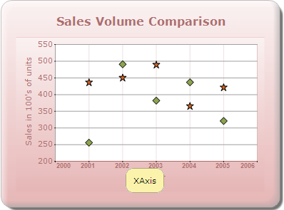
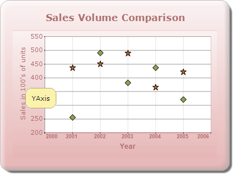

::: {style="DISPLAY: none"}
{#d2h_url_template}{#d2h_package_url style="WIDTH: 0px; DISPLAY: none; HEIGHT: 0px"}
:::

:::: {.d2h_secondary_topic style="PADDING-BOTTOM: 10pt; MARGIN: 0pt; PADDING-LEFT: 0pt; PADDING-RIGHT: 0pt; PADDING-TOP: 0pt"}
#### Chart Axis Tooltip {#chart-axis-tooltip style="tab-stops: 0pt"}

 

You can also set the tooltip for the axis. The following code snippet shows how to set the tooltip for the axis.

::: {style="BORDER-BOTTOM: #c8c8c8 1pt solid; BORDER-LEFT: #c8c8c8 1pt solid; PADDING-BOTTOM: 1pt; MARGIN-TOP: 0pt; PADDING-LEFT: 4pt; PADDING-RIGHT: 4pt; MARGIN-BOTTOM: 0pt; BACKGROUND: #f0f0f0; BORDER-TOP: #c8c8c8 1pt solid; BORDER-RIGHT: #c8c8c8 1pt solid; PADDING-TOP: 1pt"}
\[C#\]

[            ]{style="FONT-FAMILY: 'Calibri','sans-serif'"}[chartModel.PrimaryXAxis.ToolTip = [\"XAxis\"]{style="COLOR: #a31515"};]{style="FONT-FAMILY: 'Courier New'"}

[            chartModel.PrimaryYAxis.ToolTip = [\"YAxis\"]{style="COLOR: #a31515"};]{style="FONT-FAMILY: 'Courier New'"}
:::

{border="0"}

Figure 336: Chart XAxis ToolTip

**[]{style="FONT-FAMILY: 'Calibri','sans-serif'"}** 

[]{style="FONT-FAMILY: 'Calibri','sans-serif'"} 

[]{style="FONT-FAMILY: 'Calibri','sans-serif'"} 

{border="0"}

Figure 337: Chart YAxis Tooltip

**[]{style="FONT-FAMILY: 'Calibri','sans-serif'"}** 

[]{#related-topics}
::::
