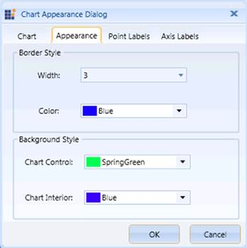

::: {style="DISPLAY: none"}
{#d2h_url_template}{#d2h_package_url style="WIDTH: 0px; DISPLAY: none; HEIGHT: 0px"}
:::

:::: {.d2h_secondary_topic style="PADDING-BOTTOM: 10pt; MARGIN: 0pt; PADDING-LEFT: 0pt; PADDING-RIGHT: 0pt; PADDING-TOP: 0pt"}
##### Chart Border and Background Style {#chart-border-and-background-style style="tab-stops: 0pt"}

[]{style="FONT-FAMILY: 'Calibri','sans-serif'; FONT-SIZE: 11pt"} 

The Chart Appearance dialog box of the OLAP Chart also provides options to set the Chart Border and the Background Style.

The following table lists the properties that are used to customize the Chart Border and the Background Style programmatically:

 

::: {align="center"}
  ----------------- ---------------------------------------------------------------------
  Property          Description
  BorderThickness   Sets the border thickness for the OLAP Chart control.
  BorderBrush       Specifies the border color for the OLAP Chart control.
  Background        Specifies the background color for the OLAP Chart control.
  GridBackground    Specifies the interior background color for the OLAP Chart control.
  ----------------- ---------------------------------------------------------------------
:::

 

The following code examples illustrate how to customize the Chart Border and the Background Style:

 

+-----------------------------------------------------------------------------------------------------------------------------+
| **\[C#\]**                                                                                                                  |
|                                                                                                                             |
| [// Set the Chart Border Style.]{style="COLOR: green"}                                                                      |
|                                                                                                                             |
| [this]{style="COLOR: blue"}.olapchart1.BorderThickness = [new]{style="COLOR: blue"} [Thickness]{style="COLOR: #2b91af"}(2); |
|                                                                                                                             |
| [this]{style="COLOR: blue"}.olapchart1.BorderBrush = [Brushes]{style="COLOR: #2b91af"}.Blue;                                |
|                                                                                                                             |
|                                                                                                                             |
|                                                                                                                             |
| [// Set the Chart Background Style.]{style="COLOR: green"}                                                                  |
|                                                                                                                             |
| [this]{style="COLOR: blue"}.olapchart1.Background = [Brushes]{style="COLOR: #2b91af"}.LightBlue;                            |
|                                                                                                                             |
| [this]{style="COLOR: blue"}.olapchart1.GridBackground = [Brushes]{style="COLOR: #2b91af"}.LightGray;                        |
+-----------------------------------------------------------------------------------------------------------------------------+

[]{style="FONT-FAMILY: 'Calibri','sans-serif'; FONT-SIZE: 11pt"} 

+---------------------------------------------------------------------------------------------------------------------------+
| **\[VB\]**                                                                                                                |
|                                                                                                                           |
| [\' Set the Chart Border Style.]{style="COLOR: green"}\                                                                   |
| [Me]{style="COLOR: blue"}.olapchart1.BorderThickness = [New]{style="COLOR: blue"} [Thickness]{style="COLOR: #2b91af"}(2)\ |
| [Me]{style="COLOR: blue"}.olapchart1.BorderBrush = [Brushes]{style="COLOR: #2b91af"}.Blue\                                |
|  \                                                                                                                        |
| [\' Set the Chart Background Style.]{style="COLOR: green"}\                                                               |
| [Me]{style="COLOR: blue"}.olapchart1.Background = [Brushes]{style="COLOR: #2b91af"}.LightBlue\                            |
| [Me]{style="COLOR: blue"}.olapchart1.GridBackground = [Brushes]{style="COLOR: #2b91af"}.LightGray                         |
+---------------------------------------------------------------------------------------------------------------------------+

[]{style="FONT-FAMILY: 'Calibri','sans-serif'; FONT-SIZE: 11pt"} 

{border="0"}

 

Figure 66: Customizing the Chart Border and the Background Style[]{style="FONT-FAMILY: 'Calibri','sans-serif'; FONT-SIZE: 11pt"}

A sample, which demonstrates all the appearance properties, is available in the following installation location:

**..\\Syncfusion\\\<Version Number\>\\BI\\WPF\\OlapChart.WPF\\Samples\\Chart Appearance**

[]{style="FONT-FAMILY: 'Calibri','sans-serif'; FONT-SIZE: 11pt"} 

[]{#related-topics}
::::
