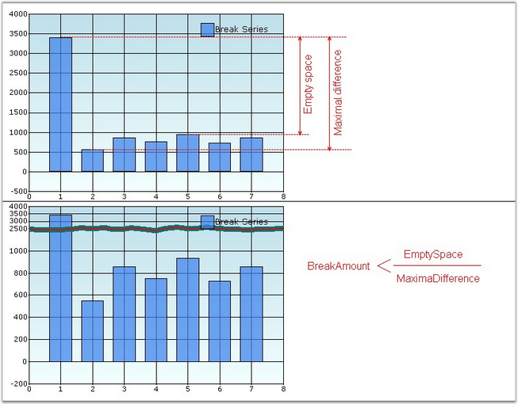
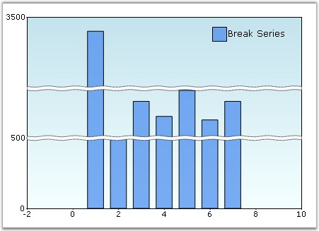

::: {style="DISPLAY: none"}
{#d2h_url_template}{#d2h_package_url style="WIDTH: 0px; DISPLAY: none; HEIGHT: 0px"}
:::

::::: {#nsbanner .d2h_main_nsbanner style="BORDER-BOTTOM: #999999 1px solid; POSITION: relative; PADDING-BOTTOM: 0px; BACKGROUND-COLOR: transparent; PADDING-LEFT: 0px; PADDING-RIGHT: 0px; DISPLAY: none; BORDER-TOP: #999999 1px solid; PADDING-TOP: 0px; LEFT: 0px"}
:::: {#TitleRow .d2h_main_titlerow style="PADDING-BOTTOM: 4px; BACKGROUND-COLOR: transparent; PADDING-LEFT: 22px; WIDTH: 100%; PADDING-RIGHT: 10px; DISPLAY: none; PADDING-TOP: 4px"}
::: {#ienav .d2h_main_ienav style="DISPLAY: none"}
{#D2HPrevious .D2HPreviousEnabled}  {#D2HNext .D2HNextEnabled}
:::
::::
:::::

:::: {#nstext .d2h_main_nstext style="PADDING-BOTTOM: 10px; BACKGROUND-COLOR: transparent; PADDING-LEFT: 22px; PADDING-RIGHT: 10px; HEIGHT: 100%; OVERFLOW: auto; PADDING-TOP: 5px" hasuserbackground="true" valign="bottom"}
::: {#d2h_breadcrumbs .d2h_breadcrumbs}
[Essential Studio User Guide Documentation](ms-xhelp:///?Id=12457748-09e3-4d74-a240-8e049cedf030){.d2h_breadcrumbsNormal}[ \> ]{.d2h_breadcrumbsLinkSeparator}[User Interface Edition](ms-xhelp:///?Id=c29296b7-531c-413b-a0ec-488ca1f7f669){.d2h_breadcrumbsNormal}[ \> ]{.d2h_breadcrumbsLinkSeparator}[Essential Windows](ms-xhelp:///?Id=e60759d8-47a4-4570-9d7a-16a68d63f2ea){.d2h_breadcrumbsNormal}[ \> ]{.d2h_breadcrumbsLinkSeparator}[Essential Chart]{.d2h_breadcrumbsContentsOnly}[ \> ]{.d2h_breadcrumbsLinkSeparator}[Concepts and Features](ms-xhelp:///?Id=71321e9c-336c-4c1c-a127-be9f135ad4bb){.d2h_breadcrumbsNormal}[ \> ]{.d2h_breadcrumbsLinkSeparator}[Chart Axes](ms-xhelp:///?Id=e0d0de4a-3c3c-41cd-9d94-6496172cab48){.d2h_breadcrumbsNormal}
:::

### Chart Breaks {#chart-breaks style="tab-stops: 0pt"}

 

Breaks are very useful if you add points with too large difference in values. To enable breaks, you need to set the **ChartAxis.MakeBreaks** property to **true** and set the break mode (ChartAxis.BreakRanges.BreaksMode property).

 

There are three possible modes. They are,

 

[·      ]{style="FONT-FAMILY: Symbol"}**ChartBreaksMode.None -** If this value is set, breaks are not used.

 

[·      ]{style="FONT-FAMILY: Symbol"}**ChartBreaksMode.Manual** (default) - If this value is set, you can manually set the breaks ranges. To do this, use following methods.

[o  ]{style="FONT-FAMILY: 'Courier New'"}**ChartAxis.BreakRanges.Union** -- add a new break range.

[o  ]{style="FONT-FAMILY: 'Courier New'"}**ChartAxis.BreakRanges.Exclude** -- remove the break range.

[o  ]{style="FONT-FAMILY: 'Courier New'"}**ChartAxis.BreakRanges.Clear** -- remove all break ranges.

 

[·      ]{style="FONT-FAMILY: Symbol"}**ChartBreaksMode.Auto -** If this mode is enabled, chart will compute the breaks ranges automatically. You can use the ChartAxis.BreakRanges.BreakAmount to set the minimal relative difference between values (default value is 0.1, value range is 0.1 ). The ratio of empty space should be less than the property value to break the range.

 

[·      ]{style="FONT-FAMILY: Symbol"}This mode has several exclusions.

 

 

[·      ]{style="FONT-FAMILY: Symbol"}Breaks are computed only for actual y-axis of series.

 

[·      ]{style="FONT-FAMILY: Symbol"}Breaks don\'t work with zooming.

 

 

[·      ]{style="FONT-FAMILY: Symbol"}Breaks don\'t work with stacking.

 

All breaks work only with decart axes.

 

{border="0"}

 

Figure 275: **[Illustrates Chart ]{style="FONT-STYLE: normal"}**BreakAmount**[ Value]{style="FONT-STYLE: normal"}**

 

+-----------------------------------------------------------------------------------------------------------------------------------------------------------------------------------------------------------------------+
| **[\[C#\]]{style="FONT-FAMILY: 'Courier New'; COLOR: black"}**                                                                                                                                                        |
|                                                                                                                                                                                                                       |
| **[]{style="FONT-FAMILY: 'Courier New'; COLOR: black"}**                                                                                                                                                              |
|                                                                                                                                                                                                                       |
| [this]{style="FONT-FAMILY: 'Courier New'; COLOR: blue"}[.chartControl1.PrimaryYAxis.MakeBreaks = [true]{style="COLOR: blue"};]{style="FONT-FAMILY: 'Courier New'"}                                                    |
|                                                                                                                                                                                                                       |
| []{style="FONT-FAMILY: 'Courier New'"}                                                                                                                                                                                |
|                                                                                                                                                                                                                       |
| [this]{style="FONT-FAMILY: 'Courier New'; COLOR: blue"}[.chartControl1.PrimaryYAxis.BreakRanges.BreaksMode = [ChartBreaksMode]{style="COLOR: teal"}.Manual;]{style="FONT-FAMILY: 'Courier New'"}                      |
|                                                                                                                                                                                                                       |
| [this]{style="FONT-FAMILY: 'Courier New'; COLOR: blue"}[.chartControl1.PrimaryYAxis.BreakRanges.Union([new]{style="COLOR: blue"} [DoubleRange]{style="COLOR: teal"}(500, 600));]{style="FONT-FAMILY: 'Courier New'"}  |
|                                                                                                                                                                                                                       |
| [this]{style="FONT-FAMILY: 'Courier New'; COLOR: blue"}[.chartControl1.PrimaryYAxis.BreakRanges.Union([new]{style="COLOR: blue"} [DoubleRange]{style="COLOR: teal"}(950, 3000));]{style="FONT-FAMILY: 'Courier New'"} |
|                                                                                                                                                                                                                       |
| []{style="FONT-FAMILY: 'Courier New'"}                                                                                                                                                                                |
|                                                                                                                                                                                                                       |
| [this]{style="FONT-FAMILY: 'Courier New'; COLOR: blue"}[.chartControl1.PrimaryYAxis.BreakInfo.LineType = [ChartBreakLineType]{style="COLOR: teal"}.Wave;]{style="FONT-FAMILY: 'Courier New'"}                         |
|                                                                                                                                                                                                                       |
| [this]{style="FONT-FAMILY: 'Courier New'; COLOR: blue"}[.chartControl1.PrimaryYAxis.BreakInfo.LineSpacing = 5;]{style="FONT-FAMILY: 'Courier New'"}                                                                   |
|                                                                                                                                                                                                                       |
| [this]{style="FONT-FAMILY: 'Courier New'; COLOR: blue"}[.chartControl1.PrimaryYAxis.BreakInfo.LineColor = [Color]{style="COLOR: teal"}.Black;]{style="FONT-FAMILY: 'Courier New'"}                                    |
|                                                                                                                                                                                                                       |
| [this]{style="FONT-FAMILY: 'Courier New'; COLOR: blue"}[.chartControl1.PrimaryYAxis.BreakInfo.LineWidth = 1;]{style="FONT-FAMILY: 'Courier New'"}                                                                     |
|                                                                                                                                                                                                                       |
| [this]{style="FONT-FAMILY: 'Courier New'; COLOR: blue"}[.chartControl1.PrimaryYAxis.BreakInfo.LineStyle = [DashStyle]{style="COLOR: teal"}.Dot;]{style="FONT-FAMILY: 'Courier New'"}                                  |
|                                                                                                                                                                                                                       |
| [this]{style="FONT-FAMILY: 'Courier New'; COLOR: blue"}[.chartControl1.PrimaryYAxis.BreakInfo.SpacingColor = [Color]{style="COLOR: teal"}.White;]{style="FONT-FAMILY: 'Courier New'"}                                 |
|                                                                                                                                                                                                                       |
| [this]{style="FONT-FAMILY: 'Courier New'; COLOR: blue"}[.chartControl1.PrimaryYAxis.BreakRanges.BreakAmount = 0.5;]{style="FONT-FAMILY: 'Courier New'"}                                                               |
+-----------------------------------------------------------------------------------------------------------------------------------------------------------------------------------------------------------------------+

 

+----------------------------------------------------------------------------------------------------------------------------------------------------------------------------------------------+
| **[\[VB.NET\]]{style="FONT-FAMILY: 'Courier New'; COLOR: black"}**                                                                                                                           |
|                                                                                                                                                                                              |
| **[]{style="FONT-FAMILY: 'Courier New'; COLOR: black"}**                                                                                                                                     |
|                                                                                                                                                                                              |
| [Me]{style="FONT-FAMILY: 'Courier New'; COLOR: blue"}[.chartControl1.PrimaryYAxis.MakeBreaks = [True]{style="COLOR: blue"} ]{style="FONT-FAMILY: 'Courier New'"}                             |
|                                                                                                                                                                                              |
| []{style="FONT-FAMILY: 'Courier New'"}                                                                                                                                                       |
|                                                                                                                                                                                              |
| [Me]{style="FONT-FAMILY: 'Courier New'; COLOR: blue"}[.chartControl1.PrimaryYAxis.BreakRanges.BreaksMode = ChartBreaksMode.Manual ]{style="FONT-FAMILY: 'Courier New'"}                      |
|                                                                                                                                                                                              |
| [Me]{style="FONT-FAMILY: 'Courier New'; COLOR: blue"}[.chartControl1.PrimaryYAxis.BreakRanges.Union([New]{style="COLOR: blue"} DoubleRange(500, 600)) ]{style="FONT-FAMILY: 'Courier New'"}  |
|                                                                                                                                                                                              |
| [Me]{style="FONT-FAMILY: 'Courier New'; COLOR: blue"}[.chartControl1.PrimaryYAxis.BreakRanges.Union([New]{style="COLOR: blue"} DoubleRange(950, 3000)) ]{style="FONT-FAMILY: 'Courier New'"} |
|                                                                                                                                                                                              |
| []{style="FONT-FAMILY: 'Courier New'"}                                                                                                                                                       |
|                                                                                                                                                                                              |
| [Me]{style="FONT-FAMILY: 'Courier New'; COLOR: blue"}[.chartControl1.PrimaryYAxis.BreakInfo.LineType = ChartBreakLineType.Wave ]{style="FONT-FAMILY: 'Courier New'"}                         |
|                                                                                                                                                                                              |
| [Me]{style="FONT-FAMILY: 'Courier New'; COLOR: blue"}[.chartControl1.PrimaryYAxis.BreakInfo.LineSpacing = 5 ]{style="FONT-FAMILY: 'Courier New'"}                                            |
|                                                                                                                                                                                              |
| [Me]{style="FONT-FAMILY: 'Courier New'; COLOR: blue"}[.chartControl1.PrimaryYAxis.BreakInfo.LineColor = Color.Black ]{style="FONT-FAMILY: 'Courier New'"}                                    |
|                                                                                                                                                                                              |
| [Me]{style="FONT-FAMILY: 'Courier New'; COLOR: blue"}[.chartControl1.PrimaryYAxis.BreakInfo.LineWidth = 1 ]{style="FONT-FAMILY: 'Courier New'"}                                              |
|                                                                                                                                                                                              |
| [Me]{style="FONT-FAMILY: 'Courier New'; COLOR: blue"}[.chartControl1.PrimaryYAxis.BreakInfo.LineStyle = DashStyle.Dot ]{style="FONT-FAMILY: 'Courier New'"}                                  |
|                                                                                                                                                                                              |
| [Me]{style="FONT-FAMILY: 'Courier New'; COLOR: blue"}[.chartControl1.PrimaryYAxis.BreakInfo.SpacingColor = Color.White ]{style="FONT-FAMILY: 'Courier New'"}                                 |
|                                                                                                                                                                                              |
| [Me]{style="FONT-FAMILY: 'Courier New'; COLOR: blue"}[.chartControl1.PrimaryYAxis.BreakRanges.BreakAmount = 0.5]{style="FONT-FAMILY: 'Courier New'"}                                         |
+----------------------------------------------------------------------------------------------------------------------------------------------------------------------------------------------+

 

{border="0"}

 

Figure 276: **[Chart ]{style="FONT-STYLE: normal"}**BreakAmount**[ = \"0.5\"]{style="FONT-STYLE: normal"}**

**[]{style="FONT-STYLE: normal"}** 

[]{#related-topics}
::::
