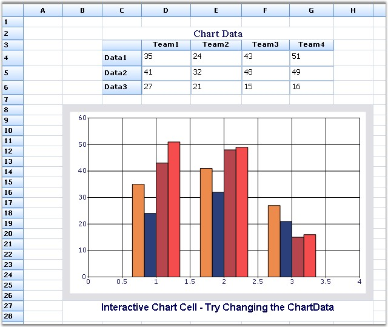

::: {style="DISPLAY: none"}
{#d2h_url_template}{#d2h_package_url style="WIDTH: 0px; DISPLAY: none; HEIGHT: 0px"}
:::

::: {.d2h_secondary_topic style="PADDING-BOTTOM: 10pt; MARGIN: 0pt; PADDING-LEFT: 0pt; PADDING-RIGHT: 0pt; PADDING-TOP: 0pt"}
##### Chart Cell {#chart-cell style="tab-stops: 0pt"}

 

Essential Chart control can be embedded in grid cells by creating and registering a custom Chart Cell cell type. The **CellModel** class handles any serialization that a cell type requires, and also creates the CellRenderer class associated with the cell type.

 

The actions mentioned can be performed by using the following code example.

[]{style="FONT-FAMILY: 'Trebuchet MS','sans-serif'; COLOR: #15428b; FONT-SIZE: 9pt"} 

1.   Using C#

[]{style="FONT-FAMILY: 'Trebuchet MS','sans-serif'; COLOR: #15428b; FONT-SIZE: 9pt"} 

+----------------------------------------------------------------------------------------------------------------------------------------------------------------------------------------------------------------------------------------------------------------------------------------------+
| **[\[C#\]]{style="FONT-FAMILY: 'Courier New'; COLOR: black"}**                                                                                                                                                                                                                               |
|                                                                                                                                                                                                                                                                                              |
| []{style="FONT-FAMILY: 'Courier New'; COLOR: black"}                                                                                                                                                                                                                                         |
|                                                                                                                                                                                                                                                                                              |
| [ChartStyleProperties]{style="FONT-FAMILY: 'Courier New'; COLOR: #2b91af"}[ csp;]{style="FONT-FAMILY: 'Courier New'"}                                                                                                                                                                        |
|                                                                                                                                                                                                                                                                                              |
| [this]{style="FONT-FAMILY: 'Courier New'; COLOR: blue"}[.gridControl1.CellModels.Add([\"ChartCell\"]{style="COLOR: #a31515"}, [new]{style="COLOR: blue"} [GridChartCellModel]{style="COLOR: #2b91af"}([this]{style="COLOR: blue"}.gridControl1.Model));]{style="FONT-FAMILY: 'Courier New'"} |
|                                                                                                                                                                                                                                                                                              |
| [style = [this]{style="COLOR: blue"}.gridControl1\[8, 2\];]{style="FONT-FAMILY: 'Courier New'"}                                                                                                                                                                                              |
|                                                                                                                                                                                                                                                                                              |
| [style.CellType = [\"ChartCell\"]{style="COLOR: #a31515"};]{style="FONT-FAMILY: 'Courier New'"}                                                                                                                                                                                              |
|                                                                                                                                                                                                                                                                                              |
| [csp = [new]{style="COLOR: blue"} [ChartStyleProperties]{style="COLOR: #2b91af"}(style);]{style="FONT-FAMILY: 'Courier New'"}                                                                                                                                                                |
|                                                                                                                                                                                                                                                                                              |
| [csp.ChartType = ChartSeriesType.Column;]{style="FONT-FAMILY: 'Courier New'"}                                                                                                                                                                                                                |
|                                                                                                                                                                                                                                                                                              |
| [csp.TitleText = [\"Chart Cell\"]{style="COLOR: #a31515"};]{style="FONT-FAMILY: 'Courier New'"}                                                                                                                                                                                              |
|                                                                                                                                                                                                                                                                                              |
| [csp.Series3D = [false]{style="COLOR: blue"};]{style="FONT-FAMILY: 'Courier New'"}                                                                                                                                                                                                           |
|                                                                                                                                                                                                                                                                                              |
| [csp.TitleAlignment = [StringAlignment]{style="COLOR: #2b91af"}.Center;]{style="FONT-FAMILY: 'Courier New'"}                                                                                                                                                                                 |
+----------------------------------------------------------------------------------------------------------------------------------------------------------------------------------------------------------------------------------------------------------------------------------------------+

[]{style="FONT-FAMILY: 'Trebuchet MS','sans-serif'; COLOR: #15428b; FONT-SIZE: 9pt"} 

2.   Using VB.NET

[]{style="FONT-FAMILY: 'Trebuchet MS','sans-serif'; COLOR: #15428b; FONT-SIZE: 9pt"} 

+---------------------------------------------------------------------------------------------------------------------------------------------------------------------------------------------------------------------------------------------------------------+
| **[\[VB.NET\]]{style="FONT-FAMILY: 'Courier New'; COLOR: black"}**                                                                                                                                                                                            |
|                                                                                                                                                                                                                                                               |
| []{style="FONT-FAMILY: 'Courier New'; COLOR: black"}                                                                                                                                                                                                          |
|                                                                                                                                                                                                                                                               |
| [Dim]{style="FONT-FAMILY: 'Courier New'; COLOR: blue"}[ csp [As]{style="COLOR: blue"} ChartStyleProperties]{style="FONT-FAMILY: 'Courier New'"}                                                                                                               |
|                                                                                                                                                                                                                                                               |
| [Me]{style="FONT-FAMILY: 'Courier New'; COLOR: blue"}[.gridControl1.CellModels.Add([\"ChartCell\"]{style="COLOR: #a31515"}, [New]{style="COLOR: blue"} GridChartCellModel([Me]{style="COLOR: blue"}.gridControl1.Model))]{style="FONT-FAMILY: 'Courier New'"} |
|                                                                                                                                                                                                                                                               |
| [style = [Me]{style="COLOR: blue"}.gridControl1(8, 2)]{style="FONT-FAMILY: 'Courier New'"}                                                                                                                                                                    |
|                                                                                                                                                                                                                                                               |
| [style.CellType = [\"ChartCell\"]{style="COLOR: #a31515"}]{style="FONT-FAMILY: 'Courier New'"}                                                                                                                                                                |
|                                                                                                                                                                                                                                                               |
| [csp = [New]{style="COLOR: blue"} ChartStyleProperties(style)]{style="FONT-FAMILY: 'Courier New'"}                                                                                                                                                            |
|                                                                                                                                                                                                                                                               |
| [csp.ChartType = ChartSeriesType.Column]{style="FONT-FAMILY: 'Courier New'"}                                                                                                                                                                                  |
|                                                                                                                                                                                                                                                               |
| [csp.TitleText = [\"Chart Cell\"]{style="COLOR: #a31515"}]{style="FONT-FAMILY: 'Courier New'"}                                                                                                                                                                |
|                                                                                                                                                                                                                                                               |
| [csp.Series3D = [False]{style="COLOR: blue"}]{style="FONT-FAMILY: 'Courier New'"}                                                                                                                                                                             |
|                                                                                                                                                                                                                                                               |
| [csp.TitleAlignment = StringAlignment.Center]{style="FONT-FAMILY: 'Courier New'"}                                                                                                                                                                             |
+---------------------------------------------------------------------------------------------------------------------------------------------------------------------------------------------------------------------------------------------------------------+

[]{style="FONT-FAMILY: 'Trebuchet MS','sans-serif'; COLOR: #15428b; FONT-SIZE: 9pt"} 

{border="0"}

[]{style="FONT-FAMILY: 'Trebuchet MS','sans-serif'; COLOR: #15428b; FONT-SIZE: 9pt"} 

*[Figure ]{style="FONT-SIZE: 9pt"}[115]{style="FONT-SIZE: 9pt"}[: Chart Cell]{style="FONT-SIZE: 9pt"}*

 

[]{#p104} 

 

[]{#related-topics}
:::
