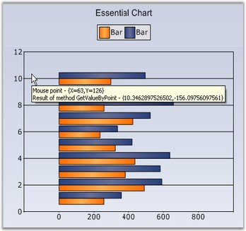

::: {style="DISPLAY: none"}
{#d2h_url_template}{#d2h_package_url style="WIDTH: 0px; DISPLAY: none; HEIGHT: 0px"}
:::

::::: {#nsbanner .d2h_main_nsbanner style="BORDER-BOTTOM: #999999 1px solid; POSITION: relative; PADDING-BOTTOM: 0px; BACKGROUND-COLOR: transparent; PADDING-LEFT: 0px; PADDING-RIGHT: 0px; DISPLAY: none; BORDER-TOP: #999999 1px solid; PADDING-TOP: 0px; LEFT: 0px"}
:::: {#TitleRow .d2h_main_titlerow style="PADDING-BOTTOM: 4px; BACKGROUND-COLOR: transparent; PADDING-LEFT: 22px; WIDTH: 100%; PADDING-RIGHT: 10px; DISPLAY: none; PADDING-TOP: 4px"}
::: {#ienav .d2h_main_ienav style="DISPLAY: none"}
{#D2HPrevious .D2HPreviousEnabled}  {#D2HNext .D2HNextEnabled}
:::
::::
:::::

:::: {#nstext .d2h_main_nstext style="PADDING-BOTTOM: 10px; BACKGROUND-COLOR: transparent; PADDING-LEFT: 22px; PADDING-RIGHT: 10px; HEIGHT: 100%; OVERFLOW: auto; PADDING-TOP: 5px" hasuserbackground="true" valign="bottom"}
::: {#d2h_breadcrumbs .d2h_breadcrumbs}
[Essential Studio User Guide Documentation](ms-xhelp:///?Id=12457748-09e3-4d74-a240-8e049cedf030){.d2h_breadcrumbsNormal}[ \> ]{.d2h_breadcrumbsLinkSeparator}[User Interface Edition](ms-xhelp:///?Id=c29296b7-531c-413b-a0ec-488ca1f7f669){.d2h_breadcrumbsNormal}[ \> ]{.d2h_breadcrumbsLinkSeparator}[Essential Windows](ms-xhelp:///?Id=e60759d8-47a4-4570-9d7a-16a68d63f2ea){.d2h_breadcrumbsNormal}[ \> ]{.d2h_breadcrumbsLinkSeparator}[Essential Chart]{.d2h_breadcrumbsContentsOnly}[ \> ]{.d2h_breadcrumbsLinkSeparator}[Concepts and Features](ms-xhelp:///?Id=71321e9c-336c-4c1c-a127-be9f135ad4bb){.d2h_breadcrumbsNormal}[ \> ]{.d2h_breadcrumbsLinkSeparator}[Hit Testing](ms-xhelp:///?Id=a2d68182-9008-46c2-83db-a4cbb9e9efd7){.d2h_breadcrumbsNormal}
:::

### Chart Coordinates by Point {#chart-coordinates-by-point style="tab-stops: 0pt"}

 

Chart Coordinates by point

 

GetValueByPoint()

 

Using the **GetValueByPoint** method, the mouse position in chart client-coordinates can be converted into a corresponding Chart Coordinate in terms of x, y values.

 

The below figure shows a chart where the tooltip text for each point shows the corresponding x, y value at that position.

 

{border="0"}

 

Figure 361: Chart displaying Coordinate value at a Client Point

 

**Code snippet for the above sample**

 

+------------------------------------------------------------------------------------------------------------------------------------------------------------------------------------------------------------------------------------------------------------------------------------------------------------------------------------------------------------------+
| **[\[C#\]]{style="FONT-FAMILY: 'Courier New'; COLOR: black"}**                                                                                                                                                                                                                                                                                                   |
|                                                                                                                                                                                                                                                                                                                                                                  |
| **[]{style="FONT-FAMILY: 'Courier New'; COLOR: black"}**                                                                                                                                                                                                                                                                                                         |
|                                                                                                                                                                                                                                                                                                                                                                  |
| [// Chartcontrol mouse move event.]{style="FONT-FAMILY: 'Courier New'; COLOR: green"}                                                                                                                                                                                                                                                                            |
|                                                                                                                                                                                                                                                                                                                                                                  |
| [private void]{style="FONT-FAMILY: 'Courier New'; COLOR: blue"}[ chartControl_MouseMove(]{style="FONT-FAMILY: 'Courier New'; COLOR: black"}[object]{style="FONT-FAMILY: 'Courier New'; COLOR: blue"}[ sender,System.Windows.Forms.MouseEventArgs e)  ]{style="FONT-FAMILY: 'Courier New'; COLOR: black"}                                                         |
|                                                                                                                                                                                                                                                                                                                                                                  |
| [{]{style="FONT-FAMILY: 'Courier New'; COLOR: black"}                                                                                                                                                                                                                                                                                                            |
|                                                                                                                                                                                                                                                                                                                                                                  |
| [       ChartPoint chpt = ]{style="FONT-FAMILY: 'Courier New'; COLOR: black"}[this]{style="FONT-FAMILY: 'Courier New'; COLOR: blue"}[.chartControl.ChartArea.GetValueByPoint( ]{style="FONT-FAMILY: 'Courier New'; COLOR: black"}[new]{style="FONT-FAMILY: 'Courier New'; COLOR: blue"}[ Point( e.X, e.Y ) );]{style="FONT-FAMILY: 'Courier New'; COLOR: black"} |
|                                                                                                                                                                                                                                                                                                                                                                  |
| [       string]{style="FONT-FAMILY: 'Courier New'; COLOR: blue"}[ text = \"Result of method GetValueByPoint - {\" + chpt.X.ToString() + \",\" + chpt.YValues\[0\].ToString() + \"}\" ;]{style="FONT-FAMILY: 'Courier New'; COLOR: black"}                                                                                                                        |
|                                                                                                                                                                                                                                                                                                                                                                  |
| [       toolTip.SetToolTip( chartControl, text );]{style="FONT-FAMILY: 'Courier New'; COLOR: black"}                                                                                                                                                                                                                                                             |
|                                                                                                                                                                                                                                                                                                                                                                  |
| [}]{style="FONT-FAMILY: 'Courier New'; COLOR: black"}                                                                                                                                                                                                                                                                                                            |
+------------------------------------------------------------------------------------------------------------------------------------------------------------------------------------------------------------------------------------------------------------------------------------------------------------------------------------------------------------------+

 

+-----------------------------------------------------------------------------------------------------------------------------------------------------------------------------------------------------------------------------------------------------------------------------------------------------------------------------------------------------------------------------------------------------------------------------------------------------------------------------------------------------------------------------------------------------------------------------------------------------------------------------------------------+
| **[\[VB]{style="FONT-FAMILY: 'Courier New'; COLOR: black"}[.NET]{style="FONT-FAMILY: 'Courier New'; COLOR: black"}[\]]{style="FONT-FAMILY: 'Courier New'; COLOR: black"}**                                                                                                                                                                                                                                                                                                                                                                                                                                                                    |
|                                                                                                                                                                                                                                                                                                                                                                                                                                                                                                                                                                                                                                               |
| **[]{style="FONT-FAMILY: 'Courier New'; COLOR: black"}**                                                                                                                                                                                                                                                                                                                                                                                                                                                                                                                                                                                      |
|                                                                                                                                                                                                                                                                                                                                                                                                                                                                                                                                                                                                                                               |
| [\' ChartControl mouse move event.]{style="FONT-FAMILY: 'Courier New'; COLOR: green"}                                                                                                                                                                                                                                                                                                                                                                                                                                                                                                                                                         |
|                                                                                                                                                                                                                                                                                                                                                                                                                                                                                                                                                                                                                                               |
| [Private Sub]{style="FONT-FAMILY: 'Courier New'; COLOR: blue"}[ chartControl_MouseMove(]{style="FONT-FAMILY: 'Courier New'; COLOR: black"}[ByVal]{style="FONT-FAMILY: 'Courier New'; COLOR: blue"}[ sender ]{style="FONT-FAMILY: 'Courier New'; COLOR: black"}[As Object]{style="FONT-FAMILY: 'Courier New'; COLOR: blue"}[, ]{style="FONT-FAMILY: 'Courier New'; COLOR: black"}[ByVal]{style="FONT-FAMILY: 'Courier New'; COLOR: blue"}[ e ]{style="FONT-FAMILY: 'Courier New'; COLOR: black"}[As]{style="FONT-FAMILY: 'Courier New'; COLOR: blue"}[ System.Windows.Forms.MouseEventArgs)]{style="FONT-FAMILY: 'Courier New'; COLOR: black"} |
|                                                                                                                                                                                                                                                                                                                                                                                                                                                                                                                                                                                                                                               |
| [    Dim]{style="FONT-FAMILY: 'Courier New'; COLOR: blue"}[ chpt ]{style="FONT-FAMILY: 'Courier New'; COLOR: black"}[As]{style="FONT-FAMILY: 'Courier New'; COLOR: blue"}[ ChartPoint = ]{style="FONT-FAMILY: 'Courier New'; COLOR: black"}[Me]{style="FONT-FAMILY: 'Courier New'; COLOR: blue"}[.chartControl.ChartArea.GetValueByPoint(]{style="FONT-FAMILY: 'Courier New'; COLOR: black"}[New]{style="FONT-FAMILY: 'Courier New'; COLOR: blue"}[ Point(e.X, e.Y))]{style="FONT-FAMILY: 'Courier New'; COLOR: black"}                                                                                                                       |
|                                                                                                                                                                                                                                                                                                                                                                                                                                                                                                                                                                                                                                               |
| [    Dim]{style="FONT-FAMILY: 'Courier New'; COLOR: blue"}[ \[text\] ]{style="FONT-FAMILY: 'Courier New'; COLOR: black"}[As String]{style="FONT-FAMILY: 'Courier New'; COLOR: blue"}[ = \"Result of method GetValueByPoint - {\" + chpt.X.ToString() + \",\" + chpt.YValues(0).ToString() + \"}\" ]{style="FONT-FAMILY: 'Courier New'; COLOR: black"}                                                                                                                                                                                                                                                                                         |
|                                                                                                                                                                                                                                                                                                                                                                                                                                                                                                                                                                                                                                               |
| [    toolTip.SetToolTip(chartControl, text)]{style="FONT-FAMILY: 'Courier New'; COLOR: black"}                                                                                                                                                                                                                                                                                                                                                                                                                                                                                                                                                |
|                                                                                                                                                                                                                                                                                                                                                                                                                                                                                                                                                                                                                                               |
| [End Sub]{style="FONT-FAMILY: 'Courier New'; COLOR: blue"}                                                                                                                                                                                                                                                                                                                                                                                                                                                                                                                                                                                    |
+-----------------------------------------------------------------------------------------------------------------------------------------------------------------------------------------------------------------------------------------------------------------------------------------------------------------------------------------------------------------------------------------------------------------------------------------------------------------------------------------------------------------------------------------------------------------------------------------------------------------------------------------------+

 

GetPointByValue()

 

The **GetPointByValue** method does the opposite of the above - given a chart coordinate it returns the client co-ordinate corresponding to that chart point.

[]{#p264} 

[]{#related-topics}
::::
