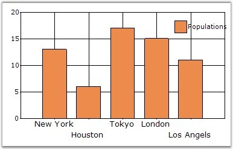

::: {style="DISPLAY: none"}
{#d2h_url_template}{#d2h_package_url style="WIDTH: 0px; DISPLAY: none; HEIGHT: 0px"}
:::

::::: {#nsbanner .d2h_main_nsbanner style="BORDER-BOTTOM: #999999 1px solid; POSITION: relative; PADDING-BOTTOM: 0px; BACKGROUND-COLOR: transparent; PADDING-LEFT: 0px; PADDING-RIGHT: 0px; DISPLAY: none; BORDER-TOP: #999999 1px solid; PADDING-TOP: 0px; LEFT: 0px"}
:::: {#TitleRow .d2h_main_titlerow style="PADDING-BOTTOM: 4px; BACKGROUND-COLOR: transparent; PADDING-LEFT: 22px; WIDTH: 100%; PADDING-RIGHT: 10px; DISPLAY: none; PADDING-TOP: 4px"}
::: {#ienav .d2h_main_ienav style="DISPLAY: none"}
{#D2HPrevious .D2HPreviousEnabled}  {#D2HNext .D2HNextEnabled}
:::
::::
:::::

:::: {#nstext .d2h_main_nstext style="PADDING-BOTTOM: 10px; BACKGROUND-COLOR: transparent; PADDING-LEFT: 22px; PADDING-RIGHT: 10px; HEIGHT: 100%; OVERFLOW: auto; PADDING-TOP: 5px" hasuserbackground="true" valign="bottom"}
::: {#d2h_breadcrumbs .d2h_breadcrumbs}
[Essential Studio User Guide Documentation](ms-xhelp:///?Id=12457748-09e3-4d74-a240-8e049cedf030){.d2h_breadcrumbsNormal}[ \> ]{.d2h_breadcrumbsLinkSeparator}[User Interface Edition](ms-xhelp:///?Id=c29296b7-531c-413b-a0ec-488ca1f7f669){.d2h_breadcrumbsNormal}[ \> ]{.d2h_breadcrumbsLinkSeparator}[Essential ASP.NET](ms-xhelp:///?Id=25c35330-c127-4dad-9a92-ed79dc7261a6){.d2h_breadcrumbsNormal}[ \> ]{.d2h_breadcrumbsLinkSeparator}[Essential Chart]{.d2h_breadcrumbsContentsOnly}[ \> ]{.d2h_breadcrumbsLinkSeparator}[Concepts and Features](ms-xhelp:///?Id=100687ce-82f2-4424-9d16-0949ea76cf15){.d2h_breadcrumbsNormal}[ \> ]{.d2h_breadcrumbsLinkSeparator}[Chart Data](ms-xhelp:///?Id=c804e764-0923-4357-859a-5b3200a87165){.d2h_breadcrumbsNormal}
:::

### Chart Data Binding with IEnumerables {#chart-data-binding-with-ienumerables style="tab-stops: 0pt"}

[]{style="FONT-FAMILY: 'Trebuchet MS','sans-serif'; FONT-SIZE: 9pt"} 

Syncfusion chart provides an option of binding the Chart with IEnumerables, like ArrayList for Indexed or Non Indexed model data through ChartDataBindModel implementation.

[]{style="FONT-FAMILY: 'Trebuchet MS','sans-serif'; FONT-SIZE: 9pt"} 

+----------------------------------------------------------------------------------------------------------------------------------------------------------------------+
| **[\[C#\]]{style="FONT-FAMILY: 'Courier New'; COLOR: black"}**                                                                                                       |
|                                                                                                                                                                      |
| **[]{style="FONT-FAMILY: 'Courier New'; COLOR: black"}**                                                                                                             |
|                                                                                                                                                                      |
| [class]{style="FONT-FAMILY: 'Courier New'; COLOR: blue"}[ PopulationData]{style="FONT-FAMILY: 'Courier New'"}                                                        |
|                                                                                                                                                                      |
| [{]{style="FONT-FAMILY: 'Courier New'"}                                                                                                                              |
|                                                                                                                                                                      |
| []{style="FONT-FAMILY: 'Courier New'"}                                                                                                                               |
|                                                                                                                                                                      |
| [    [private]{style="COLOR: blue"} [string]{style="COLOR: blue"} city;]{style="FONT-FAMILY: 'Courier New'"}                                                         |
|                                                                                                                                                                      |
| []{style="FONT-FAMILY: 'Courier New'"}                                                                                                                               |
|                                                                                                                                                                      |
| [    [public]{style="COLOR: blue"} [string]{style="COLOR: blue"} City]{style="FONT-FAMILY: 'Courier New'"}                                                           |
|                                                                                                                                                                      |
| [    {]{style="FONT-FAMILY: 'Courier New'"}                                                                                                                          |
|                                                                                                                                                                      |
| []{style="FONT-FAMILY: 'Courier New'"}                                                                                                                               |
|                                                                                                                                                                      |
| [        [get]{style="COLOR: blue"} { [return]{style="COLOR: blue"} city; }]{style="FONT-FAMILY: 'Courier New'"}                                                     |
|                                                                                                                                                                      |
| []{style="FONT-FAMILY: 'Courier New'"}                                                                                                                               |
|                                                                                                                                                                      |
| [        [set]{style="COLOR: blue"} { city = [value]{style="COLOR: blue"}; }]{style="FONT-FAMILY: 'Courier New'"}                                                    |
|                                                                                                                                                                      |
| [    }]{style="FONT-FAMILY: 'Courier New'"}                                                                                                                          |
|                                                                                                                                                                      |
| []{style="FONT-FAMILY: 'Courier New'"}                                                                                                                               |
|                                                                                                                                                                      |
| [    [private]{style="COLOR: blue"} [double]{style="COLOR: blue"} population;]{style="FONT-FAMILY: 'Courier New'"}                                                   |
|                                                                                                                                                                      |
| []{style="FONT-FAMILY: 'Courier New'"}                                                                                                                               |
|                                                                                                                                                                      |
| [    [public]{style="COLOR: blue"} [double]{style="COLOR: blue"} Population]{style="FONT-FAMILY: 'Courier New'"}                                                     |
|                                                                                                                                                                      |
| [    {]{style="FONT-FAMILY: 'Courier New'"}                                                                                                                          |
|                                                                                                                                                                      |
| []{style="FONT-FAMILY: 'Courier New'"}                                                                                                                               |
|                                                                                                                                                                      |
| [        [get]{style="COLOR: blue"} { [return]{style="COLOR: blue"} population; }]{style="FONT-FAMILY: 'Courier New'"}                                               |
|                                                                                                                                                                      |
| []{style="FONT-FAMILY: 'Courier New'"}                                                                                                                               |
|                                                                                                                                                                      |
| [        [set]{style="COLOR: blue"} { population = [value]{style="COLOR: blue"}; }]{style="FONT-FAMILY: 'Courier New'"}                                              |
|                                                                                                                                                                      |
| []{style="FONT-FAMILY: 'Courier New'"}                                                                                                                               |
|                                                                                                                                                                      |
| [    }]{style="FONT-FAMILY: 'Courier New'"}                                                                                                                          |
|                                                                                                                                                                      |
| []{style="FONT-FAMILY: 'Courier New'"}                                                                                                                               |
|                                                                                                                                                                      |
| [    [public]{style="COLOR: blue"} PopulationData([string]{style="COLOR: blue"} city, [double]{style="COLOR: blue"} population)]{style="FONT-FAMILY: 'Courier New'"} |
|                                                                                                                                                                      |
| [    {]{style="FONT-FAMILY: 'Courier New'"}                                                                                                                          |
|                                                                                                                                                                      |
| [        [this]{style="COLOR: blue"}.city = city;]{style="FONT-FAMILY: 'Courier New'"}                                                                               |
|                                                                                                                                                                      |
| [        [this]{style="COLOR: blue"}.population = population;]{style="FONT-FAMILY: 'Courier New'"}                                                                   |
|                                                                                                                                                                      |
| [    }]{style="FONT-FAMILY: 'Courier New'"}                                                                                                                          |
|                                                                                                                                                                      |
| []{style="FONT-FAMILY: 'Courier New'"}                                                                                                                               |
|                                                                                                                                                                      |
| [}]{style="FONT-FAMILY: 'Courier New'"}                                                                                                                              |
+----------------------------------------------------------------------------------------------------------------------------------------------------------------------+

[]{style="FONT-FAMILY: 'Trebuchet MS','sans-serif'; FONT-SIZE: 9pt"} 

+------------------------------------------------------------------------------------------------------------------------------------------------------------------------------+
| **[\[VB.NET\]]{style="FONT-FAMILY: 'Courier New'; COLOR: black"}**                                                                                                           |
|                                                                                                                                                                              |
| **[]{style="FONT-FAMILY: 'Courier New'; COLOR: black"}**                                                                                                                     |
|                                                                                                                                                                              |
| [Class]{style="FONT-FAMILY: 'Courier New'; COLOR: blue"}[ PopulationData]{style="FONT-FAMILY: 'Courier New'"}                                                                |
|                                                                                                                                                                              |
| []{style="FONT-FAMILY: 'Courier New'"}                                                                                                                                       |
|                                                                                                                                                                              |
| [    [Private]{style="COLOR: blue"} m_city [As]{style="COLOR: blue"} [String]{style="COLOR: blue"}]{style="FONT-FAMILY: 'Courier New'"}                                      |
|                                                                                                                                                                              |
| []{style="FONT-FAMILY: 'Courier New'; COLOR: blue"}                                                                                                                          |
|                                                                                                                                                                              |
| [    [Public]{style="COLOR: blue"} [Property]{style="COLOR: blue"} City() [As]{style="COLOR: blue"} [String]{style="COLOR: blue"}]{style="FONT-FAMILY: 'Courier New'"}       |
|                                                                                                                                                                              |
| []{style="FONT-FAMILY: 'Courier New'; COLOR: blue"}                                                                                                                          |
|                                                                                                                                                                              |
| [        [Get]{style="COLOR: blue"}]{style="FONT-FAMILY: 'Courier New'"}                                                                                                     |
|                                                                                                                                                                              |
| [            [Return]{style="COLOR: blue"} m_city]{style="FONT-FAMILY: 'Courier New'"}                                                                                       |
|                                                                                                                                                                              |
| [        [End]{style="COLOR: blue"} [Get]{style="COLOR: blue"}]{style="FONT-FAMILY: 'Courier New'"}                                                                          |
|                                                                                                                                                                              |
| []{style="FONT-FAMILY: 'Courier New'; COLOR: blue"}                                                                                                                          |
|                                                                                                                                                                              |
| [        [Set]{style="COLOR: blue"}([ByVal]{style="COLOR: blue"} value [As]{style="COLOR: blue"} [String]{style="COLOR: blue"})]{style="FONT-FAMILY: 'Courier New'"}         |
|                                                                                                                                                                              |
| [            m_city = value]{style="FONT-FAMILY: 'Courier New'"}                                                                                                             |
|                                                                                                                                                                              |
| [        [End]{style="COLOR: blue"} [Set]{style="COLOR: blue"}]{style="FONT-FAMILY: 'Courier New'"}                                                                          |
|                                                                                                                                                                              |
| [    [End]{style="COLOR: blue"} [Property]{style="COLOR: blue"}]{style="FONT-FAMILY: 'Courier New'"}                                                                         |
|                                                                                                                                                                              |
| []{style="FONT-FAMILY: 'Courier New'; COLOR: blue"}                                                                                                                          |
|                                                                                                                                                                              |
| [    [Private]{style="COLOR: blue"} m_population [As]{style="COLOR: blue"} [Double]{style="COLOR: blue"}]{style="FONT-FAMILY: 'Courier New'"}                                |
|                                                                                                                                                                              |
| []{style="FONT-FAMILY: 'Courier New'; COLOR: blue"}                                                                                                                          |
|                                                                                                                                                                              |
| [    [Public]{style="COLOR: blue"} [Property]{style="COLOR: blue"} Population() [As]{style="COLOR: blue"} [Double]{style="COLOR: blue"}]{style="FONT-FAMILY: 'Courier New'"} |
|                                                                                                                                                                              |
| []{style="FONT-FAMILY: 'Courier New'; COLOR: blue"}                                                                                                                          |
|                                                                                                                                                                              |
| [        [Get]{style="COLOR: blue"}]{style="FONT-FAMILY: 'Courier New'"}                                                                                                     |
|                                                                                                                                                                              |
| [            [Return]{style="COLOR: blue"} m_population]{style="FONT-FAMILY: 'Courier New'"}                                                                                 |
|                                                                                                                                                                              |
| [        [End]{style="COLOR: blue"} [Get]{style="COLOR: blue"}]{style="FONT-FAMILY: 'Courier New'"}                                                                          |
|                                                                                                                                                                              |
| []{style="FONT-FAMILY: 'Courier New'; COLOR: blue"}                                                                                                                          |
|                                                                                                                                                                              |
| [        [Set]{style="COLOR: blue"}([ByVal]{style="COLOR: blue"} value [As]{style="COLOR: blue"} [Double]{style="COLOR: blue"})]{style="FONT-FAMILY: 'Courier New'"}         |
|                                                                                                                                                                              |
| [            m_population = value]{style="FONT-FAMILY: 'Courier New'"}                                                                                                       |
|                                                                                                                                                                              |
| [        [End]{style="COLOR: blue"} [Set]{style="COLOR: blue"}]{style="FONT-FAMILY: 'Courier New'"}                                                                          |
|                                                                                                                                                                              |
| [    [End]{style="COLOR: blue"} [Property]{style="COLOR: blue"}]{style="FONT-FAMILY: 'Courier New'"}                                                                         |
+------------------------------------------------------------------------------------------------------------------------------------------------------------------------------+

[]{style="FONT-FAMILY: 'Trebuchet MS','sans-serif'; FONT-SIZE: 9pt"} 

If you have a class like above, you will have a collection of this class instances, in an ArrayList. To bind with the Chart, you need to create a ChartDataBindModel instance, by supplying the instance of data source(In our case, ArrayList is the data source).

[]{style="FONT-FAMILY: 'Trebuchet MS','sans-serif'; FONT-SIZE: 9pt"} 

In this example, we are binding with a Non Indexed data, with YNames alone and the chart will not be rendered with x-axis values. We need to assign the x-axis values through **ChartDataBindAxisLabelModel** class. ChartDataBindAxisLabelModel class provides a facility to bind the axis label values through the data source like ChartDataBindModel.

[]{style="FONT-FAMILY: 'Trebuchet MS','sans-serif'; FONT-SIZE: 9pt"} 

+--------------------------------------------------------------------------------------------------------------------------------------------------------------------------------------------------------------------------------------------------------------------------------------------------------------------------+
| **[\[C#\]]{style="FONT-FAMILY: 'Courier New'; COLOR: black"}**                                                                                                                                                                                                                                                           |
|                                                                                                                                                                                                                                                                                                                          |
| []{style="FONT-FAMILY: 'Courier New'; COLOR: green"}                                                                                                                                                                                                                                                                     |
|                                                                                                                                                                                                                                                                                                                          |
| [ArrayList]{style="FONT-FAMILY: 'Courier New'; COLOR: teal"}[ populations = [new]{style="COLOR: blue"} [ArrayList]{style="COLOR: teal"}();]{style="FONT-FAMILY: 'Courier New'"}                                                                                                                                          |
|                                                                                                                                                                                                                                                                                                                          |
| [populations.Add([new]{style="COLOR: blue"} PopulationData([\"New York\"]{style="COLOR: maroon"}, 13));]{style="FONT-FAMILY: 'Courier New'"}                                                                                                                                                                             |
|                                                                                                                                                                                                                                                                                                                          |
| [populations.Add([new]{style="COLOR: blue"} PopulationData([\"Houston\"]{style="COLOR: maroon"}, 6));]{style="FONT-FAMILY: 'Courier New'"}                                                                                                                                                                               |
|                                                                                                                                                                                                                                                                                                                          |
| [populations.Add([new]{style="COLOR: blue"} PopulationData([\"Tokyo\"]{style="COLOR: maroon"}, 17));]{style="FONT-FAMILY: 'Courier New'"}                                                                                                                                                                                |
|                                                                                                                                                                                                                                                                                                                          |
| [populations.Add([new]{style="COLOR: blue"} PopulationData([\"London\"]{style="COLOR: maroon"}, 15));]{style="FONT-FAMILY: 'Courier New'"}                                                                                                                                                                               |
|                                                                                                                                                                                                                                                                                                                          |
| [populations.Add([new]{style="COLOR: blue"} PopulationData([\"Los Angels\"]{style="COLOR: maroon"}, 11));]{style="FONT-FAMILY: 'Courier New'"}                                                                                                                                                                           |
|                                                                                                                                                                                                                                                                                                                          |
| []{style="FONT-FAMILY: 'Courier New'"}                                                                                                                                                                                                                                                                                   |
|                                                                                                                                                                                                                                                                                                                          |
| [ChartSeries]{style="FONT-FAMILY: 'Courier New'; COLOR: teal"}[ series = [new]{style="COLOR: blue"} [ChartSeries]{style="COLOR: teal"}([\"Populations\"]{style="COLOR: maroon"});]{style="FONT-FAMILY: 'Courier New'"}                                                                                                   |
|                                                                                                                                                                                                                                                                                                                          |
| [ChartDataBindModel]{style="FONT-FAMILY: 'Courier New'; COLOR: teal"}[ dataSeriesModel = [new]{style="COLOR: blue"} [ChartDataBindModel]{style="COLOR: teal"}(populations);]{style="FONT-FAMILY: 'Courier New'"}                                                                                                         |
|                                                                                                                                                                                                                                                                                                                          |
| []{style="FONT-FAMILY: 'Courier New'"}                                                                                                                                                                                                                                                                                   |
|                                                                                                                                                                                                                                                                                                                          |
| [// If ChartDataBindModel.XName is empty or null, X value is index of point.]{style="FONT-FAMILY: 'Courier New'; COLOR: green"}                                                                                                                                                                                          |
|                                                                                                                                                                                                                                                                                                                          |
| [//Here I have assigned the property name Population as Y axis name and ChartDataBindModel automatically detects the Population property and will bind the data from it.]{style="FONT-FAMILY: 'Courier New'; COLOR: green"}                                                                                              |
|                                                                                                                                                                                                                                                                                                                          |
| [dataSeriesModel.YNames = [new]{style="COLOR: blue"} [string]{style="COLOR: blue"}\[\] { [\"Population\"]{style="COLOR: maroon"} };]{style="FONT-FAMILY: 'Courier New'"}                                                                                                                                                 |
|                                                                                                                                                                                                                                                                                                                          |
| []{style="FONT-FAMILY: 'Courier New'"}                                                                                                                                                                                                                                                                                   |
|                                                                                                                                                                                                                                                                                                                          |
| []{style="FONT-FAMILY: 'Courier New'"}                                                                                                                                                                                                                                                                                   |
|                                                                                                                                                                                                                                                                                                                          |
| [//Binding the ChartDataBindModel with the Series. This is the best practise for binding with the large amount of data since it will reduce the performance issue of Chart rendering and manipulating data.]{style="FONT-FAMILY: 'Courier New'; COLOR: green"}                                                           |
|                                                                                                                                                                                                                                                                                                                          |
| [series.SeriesModel = dataSeriesModel;]{style="FONT-FAMILY: 'Courier New'"}                                                                                                                                                                                                                                              |
|                                                                                                                                                                                                                                                                                                                          |
| []{style="FONT-FAMILY: 'Courier New'"}                                                                                                                                                                                                                                                                                   |
|                                                                                                                                                                                                                                                                                                                          |
| [//Since we have specified YNames only for the DataBind model, it will take the data source is non indexed model and it will ignore the X axis values. We need to assign the X axis values what we need to show on X axis by ChartDataBindAxisLableModel separately. ]{style="FONT-FAMILY: 'Courier New'; COLOR: green"} |
|                                                                                                                                                                                                                                                                                                                          |
| [ChartDataBindAxisLabelModel]{style="FONT-FAMILY: 'Courier New'; COLOR: teal"}[ dataLabelsModel = [new]{style="COLOR: blue"} [ChartDataBindAxisLabelModel]{style="COLOR: teal"}(populations);]{style="FONT-FAMILY: 'Courier New'"}                                                                                       |
|                                                                                                                                                                                                                                                                                                                          |
| []{style="FONT-FAMILY: 'Courier New'"}                                                                                                                                                                                                                                                                                   |
|                                                                                                                                                                                                                                                                                                                          |
| [dataLabelsModel.LabelName = [\"City\"]{style="COLOR: maroon"};]{style="FONT-FAMILY: 'Courier New'"}                                                                                                                                                                                                                     |
|                                                                                                                                                                                                                                                                                                                          |
| []{style="FONT-FAMILY: 'Courier New'"}                                                                                                                                                                                                                                                                                   |
|                                                                                                                                                                                                                                                                                                                          |
| [ChartWebControl1.Series.Add(series);]{style="FONT-FAMILY: 'Courier New'"}                                                                                                                                                                                                                                               |
|                                                                                                                                                                                                                                                                                                                          |
| [ChartWebControl1.PrimaryXAxis.LabelsImpl = dataLabelsModel; ]{style="FONT-FAMILY: 'Courier New'"}                                                                                                                                                                                                                       |
+--------------------------------------------------------------------------------------------------------------------------------------------------------------------------------------------------------------------------------------------------------------------------------------------------------------------------+

[]{style="FONT-FAMILY: 'Trebuchet MS','sans-serif'; FONT-SIZE: 9pt"} 

+--------------------------------------------------------------------------------------------------------------------------------------------------------------------------------------------------------------------------------------------------------------------------------------------------------------------------+
| **[\[VB.NET\]]{style="FONT-FAMILY: 'Courier New'; COLOR: black"}**                                                                                                                                                                                                                                                       |
|                                                                                                                                                                                                                                                                                                                          |
| []{style="COLOR: black"}                                                                                                                                                                                                                                                                                                 |
|                                                                                                                                                                                                                                                                                                                          |
| [Dim]{style="FONT-FAMILY: 'Courier New'; COLOR: blue"}[ populations [As]{style="COLOR: blue"} [New]{style="COLOR: blue"} ArrayList()]{style="FONT-FAMILY: 'Courier New'"}                                                                                                                                                |
|                                                                                                                                                                                                                                                                                                                          |
| [populations.Add([New]{style="COLOR: blue"} PopulationData([\"New York\"]{style="COLOR: maroon"}, 13)) ]{style="FONT-FAMILY: 'Courier New'"}                                                                                                                                                                             |
|                                                                                                                                                                                                                                                                                                                          |
| [populations.Add([New]{style="COLOR: blue"} PopulationData([\"Houston\"]{style="COLOR: maroon"}, 6)) ]{style="FONT-FAMILY: 'Courier New'"}                                                                                                                                                                               |
|                                                                                                                                                                                                                                                                                                                          |
| [populations.Add([New]{style="COLOR: blue"} PopulationData([\"Tokyo\"]{style="COLOR: maroon"}, 17)) ]{style="FONT-FAMILY: 'Courier New'"}                                                                                                                                                                                |
|                                                                                                                                                                                                                                                                                                                          |
| [populations.Add([New]{style="COLOR: blue"} PopulationData([\"London\"]{style="COLOR: maroon"}, 15)) ]{style="FONT-FAMILY: 'Courier New'"}                                                                                                                                                                               |
|                                                                                                                                                                                                                                                                                                                          |
| [populations.Add([New]{style="COLOR: blue"} PopulationData([\"Los Angels\"]{style="COLOR: maroon"}, 11)) ]{style="FONT-FAMILY: 'Courier New'"}                                                                                                                                                                           |
|                                                                                                                                                                                                                                                                                                                          |
| []{style="FONT-FAMILY: 'Courier New'"}                                                                                                                                                                                                                                                                                   |
|                                                                                                                                                                                                                                                                                                                          |
| [Dim]{style="FONT-FAMILY: 'Courier New'; COLOR: blue"}[ series [As]{style="COLOR: blue"} [New]{style="COLOR: blue"} ChartSeries([\"Populations\"]{style="COLOR: maroon"})]{style="FONT-FAMILY: 'Courier New'"}                                                                                                           |
|                                                                                                                                                                                                                                                                                                                          |
| [Dim]{style="FONT-FAMILY: 'Courier New'; COLOR: blue"}[ dataSeriesModel [As]{style="COLOR: blue"} [New]{style="COLOR: blue"} ChartDataBindModel(populations)]{style="FONT-FAMILY: 'Courier New'"}                                                                                                                        |
|                                                                                                                                                                                                                                                                                                                          |
| []{style="FONT-FAMILY: 'Courier New'"}                                                                                                                                                                                                                                                                                   |
|                                                                                                                                                                                                                                                                                                                          |
| [\' If ChartDataBindModel.XName is empty or null, X value is index of point. ]{style="FONT-FAMILY: 'Courier New'; COLOR: green"}                                                                                                                                                                                         |
|                                                                                                                                                                                                                                                                                                                          |
| [\'Here I have assigned the property name Population as Y axis name and ChartDataBindModel automatically detects the Population property and will bind the data from it. ]{style="FONT-FAMILY: 'Courier New'; COLOR: green"}                                                                                             |
|                                                                                                                                                                                                                                                                                                                          |
| [dataSeriesModel.YNames = [New]{style="COLOR: blue"} [String]{style="COLOR: blue"}() {[\"Population\"]{style="COLOR: maroon"}} ]{style="FONT-FAMILY: 'Courier New'"}                                                                                                                                                     |
|                                                                                                                                                                                                                                                                                                                          |
| []{style="FONT-FAMILY: 'Courier New'"}                                                                                                                                                                                                                                                                                   |
|                                                                                                                                                                                                                                                                                                                          |
| []{style="FONT-FAMILY: 'Courier New'"}                                                                                                                                                                                                                                                                                   |
|                                                                                                                                                                                                                                                                                                                          |
| [\'Binding the ChartDataBindModel with the Series. This is the best practise for binding with the large amount of data since it will reduce the performance issue of Chart rendering and manipulating data. ]{style="FONT-FAMILY: 'Courier New'; COLOR: green"}                                                          |
|                                                                                                                                                                                                                                                                                                                          |
| [series.SeriesModel = dataSeriesModel ]{style="FONT-FAMILY: 'Courier New'"}                                                                                                                                                                                                                                              |
|                                                                                                                                                                                                                                                                                                                          |
| []{style="FONT-FAMILY: 'Courier New'"}                                                                                                                                                                                                                                                                                   |
|                                                                                                                                                                                                                                                                                                                          |
| [\'Since we have specified YNames only for the DataBind model, it will take the data source is non indexed model and it will ignore the X axis values. We need to assign the X axis values what we need to show on X axis by ChartDataBindAxisLableModel separately. ]{style="FONT-FAMILY: 'Courier New'; COLOR: green"} |
|                                                                                                                                                                                                                                                                                                                          |
| [Dim]{style="FONT-FAMILY: 'Courier New'; COLOR: blue"}[ dataLabelsModel [As]{style="COLOR: blue"} [New]{style="COLOR: blue"} ChartDataBindAxisLabelModel(populations)]{style="FONT-FAMILY: 'Courier New'"}                                                                                                               |
|                                                                                                                                                                                                                                                                                                                          |
| []{style="FONT-FAMILY: 'Courier New'"}                                                                                                                                                                                                                                                                                   |
|                                                                                                                                                                                                                                                                                                                          |
| [dataLabelsModel.LabelName = [\"City\"]{style="COLOR: maroon"} ]{style="FONT-FAMILY: 'Courier New'"}                                                                                                                                                                                                                     |
|                                                                                                                                                                                                                                                                                                                          |
| []{style="FONT-FAMILY: 'Courier New'"}                                                                                                                                                                                                                                                                                   |
|                                                                                                                                                                                                                                                                                                                          |
| [ChartWebControl1.Series.Add(series) ]{style="FONT-FAMILY: 'Courier New'"}                                                                                                                                                                                                                                               |
|                                                                                                                                                                                                                                                                                                                          |
| [ChartWebControl1.PrimaryXAxis.LabelsImpl = dataLabelsModel ]{style="FONT-FAMILY: 'Courier New'"}                                                                                                                                                                                                                        |
+--------------------------------------------------------------------------------------------------------------------------------------------------------------------------------------------------------------------------------------------------------------------------------------------------------------------------+

[]{style="FONT-FAMILY: 'Trebuchet MS','sans-serif'; FONT-SIZE: 9pt"} 

{border="0"}

**[]{style="FONT-FAMILY: 'Trebuchet MS','sans-serif'; FONT-SIZE: 9pt"}** 

Figure 38: Chart bound with IEnumerables

[]{#p27} 

[]{#related-topics}
::::
