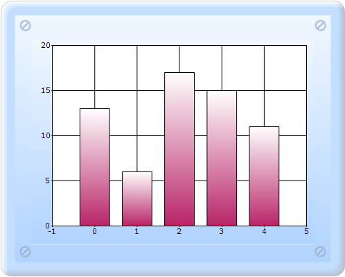

::: {style="DISPLAY: none"}
{#d2h_url_template}{#d2h_package_url style="WIDTH: 0px; DISPLAY: none; HEIGHT: 0px"}
:::

::::: {#nsbanner .d2h_main_nsbanner style="BORDER-BOTTOM: #999999 1px solid; POSITION: relative; PADDING-BOTTOM: 0px; BACKGROUND-COLOR: transparent; PADDING-LEFT: 0px; PADDING-RIGHT: 0px; DISPLAY: none; BORDER-TOP: #999999 1px solid; PADDING-TOP: 0px; LEFT: 0px"}
:::: {#TitleRow .d2h_main_titlerow style="PADDING-BOTTOM: 4px; BACKGROUND-COLOR: transparent; PADDING-LEFT: 22px; WIDTH: 100%; PADDING-RIGHT: 10px; DISPLAY: none; PADDING-TOP: 4px"}
::: {#ienav .d2h_main_ienav style="DISPLAY: none"}
{#D2HPrevious .D2HPreviousEnabled}  {#D2HNext .D2HNextEnabled}
:::
::::
:::::

:::::::: {#nstext .d2h_main_nstext style="PADDING-BOTTOM: 10px; BACKGROUND-COLOR: transparent; PADDING-LEFT: 22px; PADDING-RIGHT: 10px; HEIGHT: 100%; OVERFLOW: auto; PADDING-TOP: 5px" hasuserbackground="true" valign="bottom"}
::: {#d2h_breadcrumbs .d2h_breadcrumbs}
[Essential Studio User Guide Documentation](ms-xhelp:///?Id=12457748-09e3-4d74-a240-8e049cedf030){.d2h_breadcrumbsNormal}[ \> ]{.d2h_breadcrumbsLinkSeparator}[User Interface Edition](ms-xhelp:///?Id=c29296b7-531c-413b-a0ec-488ca1f7f669){.d2h_breadcrumbsNormal}[ \> ]{.d2h_breadcrumbsLinkSeparator}[Essential ASP.NET MVC](ms-xhelp:///?Id=4b14e7d1-65c4-4f67-b1aa-2c37709905a5){.d2h_breadcrumbsNormal}[ \> ]{.d2h_breadcrumbsLinkSeparator}[Essential Chart]{.d2h_breadcrumbsContentsOnly}[ \> ]{.d2h_breadcrumbsLinkSeparator}[Concepts and Features](ms-xhelp:///?Id=696f5666-8b81-4685-9bd9-12198f06f3ad){.d2h_breadcrumbsNormal}[ \> ]{.d2h_breadcrumbsLinkSeparator}[Chart Data](ms-xhelp:///?Id=1c4580ce-85a3-4687-a83d-1ba13cec0e65){.d2h_breadcrumbsNormal}
:::

### Chart Data Binding with IEnumerables {#chart-data-binding-with-ienumerables style="tab-stops: 0pt"}

Syncfusion chart provides an option of binding the chart with IEnumerables, such as ArrayList for Indexed or Non-indexed model data by using ChartDataBindModel implementation.

The steps to bind the chart by using IEnumerables are as follows:

[]{style="FONT-FAMILY: 'Calibri','sans-serif'"} 

[1. ]{style="FONT-FAMILY: Consolas; FONT-SIZE: 9.5pt"}Create one Data in the cs page, as shown in the following code snippet.[]{style="FONT-FAMILY: Consolas; FONT-SIZE: 9.5pt"}

[]{style="FONT-FAMILY: Consolas; FONT-SIZE: 9.5pt"} 

::: {style="BORDER-BOTTOM: #c8c8c8 1pt solid; BORDER-LEFT: #c8c8c8 1pt solid; PADDING-BOTTOM: 1pt; MARGIN-TOP: 0pt; PADDING-LEFT: 4pt; PADDING-RIGHT: 4pt; MARGIN-BOTTOM: 0pt; BACKGROUND: #f0f0f0; BORDER-TOP: #c8c8c8 1pt solid; BORDER-RIGHT: #c8c8c8 1pt solid; PADDING-TOP: 1pt"}
[       [public]{style="COLOR: blue"} [class]{style="COLOR: blue"} [PopulationData]{style="COLOR: #2b91af"}]{style="FONT-FAMILY: 'Courier New'"}

[        {]{style="FONT-FAMILY: 'Courier New'"}

[            [private]{style="COLOR: blue"} [string]{style="COLOR: blue"} city;]{style="FONT-FAMILY: 'Courier New'"}

[]{style="FONT-FAMILY: 'Courier New'"} 

[            [public]{style="COLOR: blue"} [string]{style="COLOR: blue"} City]{style="FONT-FAMILY: 'Courier New'"}

[            {]{style="FONT-FAMILY: 'Courier New'"}

[                [get]{style="COLOR: blue"} { [return]{style="COLOR: blue"} city; }]{style="FONT-FAMILY: 'Courier New'"}

[                [set]{style="COLOR: blue"} { city = [value]{style="COLOR: blue"}; }]{style="FONT-FAMILY: 'Courier New'"}

[            }]{style="FONT-FAMILY: 'Courier New'"}

[]{style="FONT-FAMILY: 'Courier New'"} 

[            [private]{style="COLOR: blue"} [double]{style="COLOR: blue"} population;]{style="FONT-FAMILY: 'Courier New'"}

[]{style="FONT-FAMILY: 'Courier New'"} 

[            [public]{style="COLOR: blue"} [double]{style="COLOR: blue"} Population]{style="FONT-FAMILY: 'Courier New'"}

[            {]{style="FONT-FAMILY: 'Courier New'"}

[                [get]{style="COLOR: blue"} { [return]{style="COLOR: blue"} population; }]{style="FONT-FAMILY: 'Courier New'"}

[                [set]{style="COLOR: blue"} { population = [value]{style="COLOR: blue"}; }]{style="FONT-FAMILY: 'Courier New'"}

[            }]{style="FONT-FAMILY: 'Courier New'"}

[]{style="FONT-FAMILY: 'Courier New'"} 

[            [public]{style="COLOR: blue"} PopulationData([string]{style="COLOR: blue"} city, [double]{style="COLOR: blue"} population)]{style="FONT-FAMILY: 'Courier New'"}

[            {]{style="FONT-FAMILY: 'Courier New'"}

[                [this]{style="COLOR: blue"}.city = city;]{style="FONT-FAMILY: 'Courier New'"}

[                [this]{style="COLOR: blue"}.population = population;]{style="FONT-FAMILY: 'Courier New'"}

[            }]{style="FONT-FAMILY: 'Courier New'"}

[        }]{style="FONT-FAMILY: 'Courier New'"}
:::

[]{style="FONT-FAMILY: Consolas; FONT-SIZE: 9.5pt"} 

2.   In Controller, create an instance for **MVCChartModel**, and set its properties.

3.   Create the **Series** instance, and set the seriestype.

4.   Bind the **chart** by using the following code snippet.[]{style="FONT-FAMILY: 'Times New Roman','serif'; FONT-SIZE: 12pt"}

[]{style="FONT-FAMILY: Consolas; FONT-SIZE: 9.5pt"} 

::: {style="BORDER-BOTTOM: #c8c8c8 1pt solid; BORDER-LEFT: #c8c8c8 1pt solid; PADDING-BOTTOM: 1pt; MARGIN-TOP: 0pt; PADDING-LEFT: 4pt; PADDING-RIGHT: 4pt; MARGIN-BOTTOM: 0pt; BACKGROUND: #f0f0f0; BORDER-TOP: #c8c8c8 1pt solid; BORDER-RIGHT: #c8c8c8 1pt solid; PADDING-TOP: 1pt"}
[ ]{style="FONT-FAMILY: Consolas; FONT-SIZE: 9.5pt"}[public]{style="FONT-FAMILY: 'Courier New'; COLOR: blue"}[ [ActionResult]{style="COLOR: #2b91af"} SimpleChart()]{style="FONT-FAMILY: 'Courier New'"}

[        {]{style="FONT-FAMILY: 'Courier New'"}

[            [MVCChartModel]{style="COLOR: #2b91af"} chartModel = [new]{style="COLOR: blue"} [MVCChartModel]{style="COLOR: #2b91af"}();]{style="FONT-FAMILY: 'Courier New'"}

[            [// Create chart series and add data points into it.]{style="COLOR: green"}]{style="FONT-FAMILY: 'Courier New'"}

[]{style="FONT-FAMILY: 'Courier New'"} 

**[            [ArrayList]{style="COLOR: #2b91af"} populations = [new]{style="COLOR: blue"} [ArrayList]{style="COLOR: #2b91af"}();]{style="FONT-FAMILY: 'Courier New'"}**

**[]{style="FONT-FAMILY: 'Courier New'"}** 

**[            populations.Add([new]{style="COLOR: blue"} [PopulationData]{style="COLOR: #2b91af"}([\"New York\"]{style="COLOR: #a31515"}, 13));]{style="FONT-FAMILY: 'Courier New'"}**

**[]{style="FONT-FAMILY: 'Courier New'"}** 

**[            populations.Add([new]{style="COLOR: blue"} [PopulationData]{style="COLOR: #2b91af"}([\"Houston\"]{style="COLOR: #a31515"}, 6));]{style="FONT-FAMILY: 'Courier New'"}**

**[]{style="FONT-FAMILY: 'Courier New'"}** 

**[            populations.Add([new]{style="COLOR: blue"} [PopulationData]{style="COLOR: #2b91af"}([\"Tokyo\"]{style="COLOR: #a31515"}, 17));]{style="FONT-FAMILY: 'Courier New'"}**

**[]{style="FONT-FAMILY: 'Courier New'"}** 

**[            populations.Add([new]{style="COLOR: blue"} [PopulationData]{style="COLOR: #2b91af"}([\"London\"]{style="COLOR: #a31515"}, 15));]{style="FONT-FAMILY: 'Courier New'"}**

**[]{style="FONT-FAMILY: 'Courier New'"}** 

**[            populations.Add([new]{style="COLOR: blue"} [PopulationData]{style="COLOR: #2b91af"}([\"Los Angels\"]{style="COLOR: #a31515"}, 11));]{style="FONT-FAMILY: 'Courier New'"}**

**[]{style="FONT-FAMILY: 'Courier New'"}** 

**[]{style="FONT-FAMILY: 'Courier New'"}** 

[            [ChartSeries]{style="COLOR: #2b91af"} series = [new]{style="COLOR: blue"} [ChartSeries]{style="COLOR: #2b91af"}([\"Populations\"]{style="COLOR: #a31515"});]{style="FONT-FAMILY: 'Courier New'"}

[]{style="FONT-FAMILY: 'Courier New'"} 

**[            [ChartDataBindModel]{style="COLOR: #2b91af"} dataSeriesModel = [new]{style="COLOR: blue"} [ChartDataBindModel]{style="COLOR: #2b91af"}(populations);]{style="FONT-FAMILY: 'Courier New'"}**

**[]{style="FONT-FAMILY: 'Courier New'"}** 

**[]{style="FONT-FAMILY: 'Courier New'"}** 

**[            [// If ChartDataBindModel.XName is empty or null, X value is the index of point.]{style="COLOR: green"}]{style="FONT-FAMILY: 'Courier New'"}**

**[]{style="FONT-FAMILY: 'Courier New'"}** 

**[            [//Here I have assigned the property name Population as the Y axis name and ChartDataBindModel automatically detects the Population property and will bind the data from it.]{style="COLOR: green"}]{style="FONT-FAMILY: 'Courier New'"}**

**[]{style="FONT-FAMILY: 'Courier New'"}** 

**[            dataSeriesModel.YNames = [new]{style="COLOR: blue"} [string]{style="COLOR: blue"}\[\] { [\"Population\"]{style="COLOR: #a31515"} };]{style="FONT-FAMILY: 'Courier New'"}**

**[]{style="FONT-FAMILY: 'Courier New'"}** 

**[]{style="FONT-FAMILY: 'Courier New'"}** 

**[]{style="FONT-FAMILY: 'Courier New'"}** 

**[            [//Binding the ChartDataBindModel with the Series. This is the best practise for binding with a large amount of data since it will reduce the performance issue of Chart rendering and manipulating data.]{style="COLOR: green"}]{style="FONT-FAMILY: 'Courier New'"}**

**[]{style="FONT-FAMILY: 'Courier New'"}** 

**[            series.SeriesModel = dataSeriesModel;]{style="FONT-FAMILY: 'Courier New'"}**

**[]{style="FONT-FAMILY: 'Courier New'"}** 

**[]{style="FONT-FAMILY: 'Courier New'"}** 

**[            [//Since we have specified YNames only for the DataBind model, it will take the data source in non indexed model and it will ignore the X axis values. We need to assign the X axis values what we need to show on X axis by ChartDataBindAxisLableModel separately.]{style="COLOR: green"}]{style="FONT-FAMILY: 'Courier New'"}**

**[]{style="FONT-FAMILY: 'Courier New'"}** 

**[            [ChartDataBindAxisLabelModel]{style="COLOR: #2b91af"} dataLabelsModel = [new]{style="COLOR: blue"} [ChartDataBindAxisLabelModel]{style="COLOR: #2b91af"}(populations);]{style="FONT-FAMILY: 'Courier New'"}**

**[]{style="FONT-FAMILY: 'Courier New'"}** 

**[]{style="FONT-FAMILY: 'Courier New'"}** 

**[            dataLabelsModel.LabelName = [\"City\"]{style="COLOR: #a31515"};]{style="FONT-FAMILY: 'Courier New'"}**

**[]{style="FONT-FAMILY: 'Courier New'"}** 

**[]{style="FONT-FAMILY: 'Courier New'"}** 

**[            chartModel.Series.Add(series);]{style="FONT-FAMILY: 'Courier New'"}**

**[]{style="FONT-FAMILY: 'Courier New'"}** 

**[            chartModel.PrimaryXAxis.LabelsImpl = dataLabelsModel;  ]{style="FONT-FAMILY: 'Courier New'"}**

[]{style="FONT-FAMILY: 'Courier New'"} 

[            chartModel.Skins = [ChartModelSkins]{style="COLOR: #2b91af"}.Office2007Blue;]{style="FONT-FAMILY: 'Courier New'"}

[            chartModel.ChartSeriesSkins = [ChartSeriesSkins]{style="COLOR: #2b91af"}.Analog;]{style="FONT-FAMILY: 'Courier New'"}

[]{style="FONT-FAMILY: 'Courier New'"} 

[            chartModel.BorderAppearance.SkinStyle = [ChartBorderSkinStyle]{style="COLOR: #2b91af"}.Pinned;]{style="FONT-FAMILY: 'Courier New'"}

[            chartModel.Size = [new]{style="COLOR: blue"} [Size]{style="COLOR: #2b91af"}(500, 400);]{style="FONT-FAMILY: 'Courier New'"}

[]{style="FONT-FAMILY: 'Courier New'"} 

[            ViewData.Model = chartModel;]{style="FONT-FAMILY: 'Courier New'"}

[]{style="FONT-FAMILY: 'Courier New'"} 

[            [return]{style="COLOR: blue"} View();]{style="FONT-FAMILY: 'Courier New'"}

[        }]{style="FONT-FAMILY: 'Courier New'"}
:::

[]{style="FONT-FAMILY: 'Calibri','sans-serif'"} 

5.   In the View page, invoke the ChartBuilder by using the control ID as the first argument, and convert the ViewData to **MVCChartModel** and set it as the second argument.

[]{style="FONT-FAMILY: Consolas; FONT-SIZE: 9.5pt"} 

::: {style="BORDER-BOTTOM: #c8c8c8 1pt solid; BORDER-LEFT: #c8c8c8 1pt solid; PADDING-BOTTOM: 1pt; MARGIN-TOP: 0pt; PADDING-LEFT: 4pt; PADDING-RIGHT: 4pt; MARGIN-BOTTOM: 0pt; BACKGROUND: #f0f0f0; BORDER-TOP: #c8c8c8 1pt solid; BORDER-RIGHT: #c8c8c8 1pt solid; PADDING-TOP: 1pt"}
View \[ASPX\]

[]{style="FONT-FAMILY: 'Courier New'; FONT-SIZE: 12pt"} 

[\<%]{style="FONT-FAMILY: 'Courier New'; BACKGROUND: yellow"}[=]{style="FONT-FAMILY: 'Courier New'; COLOR: blue"}[ Html.Chart([\"SimpleChart\"]{style="COLOR: #a31515"},([MVCChartModel]{style="COLOR: #2b91af"})ViewData.Model) [%\>]{style="BACKGROUND: yellow"}]{style="FONT-FAMILY: 'Courier New'"}[]{style="FONT-FAMILY: Consolas; BACKGROUND: yellow; FONT-SIZE: 9.5pt"}
:::

[]{style="FONT-FAMILY: Consolas; BACKGROUND: yellow; FONT-SIZE: 9.5pt"} 

[]{style="FONT-FAMILY: Consolas; BACKGROUND: yellow; FONT-SIZE: 9.5pt"} 

[]{style="FONT-FAMILY: Consolas; FONT-SIZE: 9.5pt"} 

::: {style="BORDER-BOTTOM: #c8c8c8 1pt solid; BORDER-LEFT: #c8c8c8 1pt solid; PADDING-BOTTOM: 1pt; MARGIN-TOP: 0pt; PADDING-LEFT: 4pt; PADDING-RIGHT: 4pt; MARGIN-BOTTOM: 0pt; BACKGROUND: #f0f0f0; BORDER-TOP: #c8c8c8 1pt solid; BORDER-RIGHT: #c8c8c8 1pt solid; PADDING-TOP: 1pt"}
View \[cshtml\]

[]{style="FONT-FAMILY: 'Calibri','sans-serif'"} 

[@(]{style="FONT-FAMILY: 'Courier New'; BACKGROUND: yellow"}[new]{style="FONT-FAMILY: Consolas; COLOR: blue; FONT-SIZE: 9.5pt"}[ [HtmlString]{style="COLOR: #2b91af"}]{style="FONT-FAMILY: Consolas; FONT-SIZE: 9.5pt"}[(Html.Chart([\"SimpleChart\"]{style="COLOR: #a31515"},([MVCChartModel]{style="COLOR: #2b91af"})ViewData.Model).ToString())[)]{style="BACKGROUND: yellow"}]{style="FONT-FAMILY: 'Courier New'"}

[]{style="FONT-FAMILY: 'Courier New'; BACKGROUND: yellow"} 
:::

[]{style="FONT-FAMILY: Consolas; BACKGROUND: yellow; FONT-SIZE: 9.5pt"} 

[]{style="FONT-FAMILY: Consolas; BACKGROUND: yellow; FONT-SIZE: 9.5pt"} 

6.   Run the code, to get the following output:

{border="0"}[]{style="FONT-FAMILY: 'Times New Roman','serif'; FONT-SIZE: 12pt"}

Figure 281: Custom Data Binding with IEnumerables

[]{#related-topics}
::::::::
