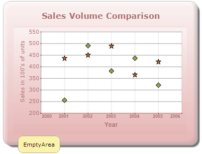

::: {style="DISPLAY: none"}
{#d2h_url_template}{#d2h_package_url style="WIDTH: 0px; DISPLAY: none; HEIGHT: 0px"}
:::

::: {.d2h_secondary_topic style="PADDING-BOTTOM: 10pt; MARGIN: 0pt; PADDING-LEFT: 0pt; PADDING-RIGHT: 0pt; PADDING-TOP: 0pt"}
#### Chart Empty Area ToolTip {#chart-empty-area-tooltip style="tab-stops: 0pt"}

The chart also allows you to show a tooltip when the mouse hovers over empty areas in the chart (usually around the legend) by using the ChartToolTip property.

chartModel.ChartToolTip = [\"EmptyArea\"]{style="COLOR: #a31515"};

{border="0"}

Figure 335: Chart Empty Area Tooltip

**[]{style="FONT-FAMILY: 'Calibri','sans-serif'"}** 

[]{#related-topics}
:::
