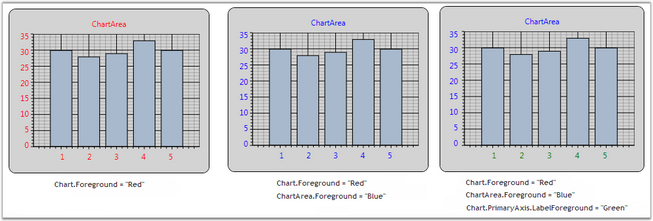

::: {style="DISPLAY: none"}
{#d2h_url_template}{#d2h_package_url style="WIDTH: 0px; DISPLAY: none; HEIGHT: 0px"}
:::

:::: {.d2h_secondary_topic style="PADDING-BOTTOM: 10pt; MARGIN: 0pt; PADDING-LEFT: 0pt; PADDING-RIGHT: 0pt; PADDING-TOP: 0pt"}
##### Chart Font Settings {#chart-font-settings style="tab-stops: 0pt"}

Font settings of each and every part of Chart such as Chart, ChartArea, ChartLegend and ChartAreaLegend can be customized with the below given properties.

[]{style="FONT-FAMILY: 'Trebuchet MS','sans-serif'; COLOR: #15428b; FONT-SIZE: 9pt"} 

[·      ]{style="FONT-FAMILY: Symbol"}FontFamily

[·      ]{style="FONT-FAMILY: Symbol"}FontSize

[·      ]{style="FONT-FAMILY: Symbol"}FontStretch

[·      ]{style="FONT-FAMILY: Symbol"}FontStyle

[·      ]{style="FONT-FAMILY: Symbol"}FontWeight

[·      ]{style="FONT-FAMILY: Symbol"}Foreground

[]{style="FONT-FAMILY: 'Trebuchet MS','sans-serif'; COLOR: #15428b; FONT-SIZE: 9pt"} 

::: {style="BORDER-BOTTOM: windowtext 1pt solid; BORDER-LEFT: medium none; PADDING-BOTTOM: 1pt; MARGIN-TOP: 9pt; PADDING-LEFT: 0pt; PADDING-RIGHT: 0pt; MARGIN-BOTTOM: 9pt; BORDER-TOP: windowtext 1pt solid; BORDER-RIGHT: medium none; PADDING-TOP: 1pt"}
{border="0"}Note: Font settings set to the Chart will be applied to all the units of chart. However, properties set separately for those units such as ChartArea, ChartAxis, ChartLegend will override, these settings.
:::

[]{style="FONT-FAMILY: 'Trebuchet MS','sans-serif'; COLOR: #15428b; FONT-SIZE: 9pt"} 

{border="0"}

Figure 207: Font Settings customized for the Chart Control

[]{style="FONT-FAMILY: 'Trebuchet MS','sans-serif'; COLOR: #15428b; FONT-SIZE: 9pt"} 

See Also

[[Chart Axis Label]{.UGHyperlink}](ms-xhelp:///?Id=fd92a661-fbc5-45ac-a250-c07dac9b533e)[, ]{style="FONT-FAMILY: 'Trebuchet MS','sans-serif'; COLOR: #15428b; FONT-SIZE: 9pt"}[[Chart Axis Label Rotate]{.UGHyperlink}](ms-xhelp:///?Id=b1c21b8d-8c5c-47cf-9b9b-fcf42554913b)[, ]{style="FONT-FAMILY: 'Trebuchet MS','sans-serif'; COLOR: #15428b; FONT-SIZE: 9pt"}[[Intersecting Labels]{.UGHyperlink}](ms-xhelp:///?Id=fd92a661-fbc5-45ac-a250-c07dac9b533e)[]{style="FONT-FAMILY: 'Trebuchet MS','sans-serif'; COLOR: #15428b; FONT-SIZE: 9pt"}

[]{#p139} 

[]{#related-topics}
::::
