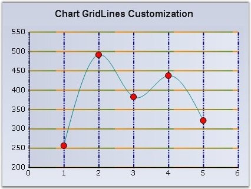

::: {style="DISPLAY: none"}
{#d2h_url_template}{#d2h_package_url style="WIDTH: 0px; DISPLAY: none; HEIGHT: 0px"}
:::

::::: {#nsbanner .d2h_main_nsbanner style="BORDER-BOTTOM: #999999 1px solid; POSITION: relative; PADDING-BOTTOM: 0px; BACKGROUND-COLOR: transparent; PADDING-LEFT: 0px; PADDING-RIGHT: 0px; DISPLAY: none; BORDER-TOP: #999999 1px solid; PADDING-TOP: 0px; LEFT: 0px"}
:::: {#TitleRow .d2h_main_titlerow style="PADDING-BOTTOM: 4px; BACKGROUND-COLOR: transparent; PADDING-LEFT: 22px; WIDTH: 100%; PADDING-RIGHT: 10px; DISPLAY: none; PADDING-TOP: 4px"}
::: {#ienav .d2h_main_ienav style="DISPLAY: none"}
{#D2HPrevious .D2HPreviousEnabled}  {#D2HNext .D2HNextEnabled}
:::
::::
:::::

::::: {#nstext .d2h_main_nstext style="PADDING-BOTTOM: 10px; BACKGROUND-COLOR: transparent; PADDING-LEFT: 22px; PADDING-RIGHT: 10px; HEIGHT: 100%; OVERFLOW: auto; PADDING-TOP: 5px" hasuserbackground="true" valign="bottom"}
::: {#d2h_breadcrumbs .d2h_breadcrumbs}
[Essential Studio User Guide Documentation](ms-xhelp:///?Id=12457748-09e3-4d74-a240-8e049cedf030){.d2h_breadcrumbsNormal}[ \> ]{.d2h_breadcrumbsLinkSeparator}[User Interface Edition](ms-xhelp:///?Id=c29296b7-531c-413b-a0ec-488ca1f7f669){.d2h_breadcrumbsNormal}[ \> ]{.d2h_breadcrumbsLinkSeparator}[Essential Windows](ms-xhelp:///?Id=e60759d8-47a4-4570-9d7a-16a68d63f2ea){.d2h_breadcrumbsNormal}[ \> ]{.d2h_breadcrumbsLinkSeparator}[Essential Chart]{.d2h_breadcrumbsContentsOnly}[ \> ]{.d2h_breadcrumbsLinkSeparator}[Concepts and Features](ms-xhelp:///?Id=71321e9c-336c-4c1c-a127-be9f135ad4bb){.d2h_breadcrumbsNormal}[ \> ]{.d2h_breadcrumbsLinkSeparator}[Chart Axes](ms-xhelp:///?Id=e0d0de4a-3c3c-41cd-9d94-6496172cab48){.d2h_breadcrumbsNormal}
:::

### Chart Grid Lines {#chart-grid-lines style="tab-stops: 0pt"}

 

The grid lines in the chart that delineates the intervals in the axes can be customized using the following properties.

 

::: {align="center"}
  ------------------------ --------------------------------------------------
  Chart control Property   Description
  DrawGrid                 Specifies whether or not to draw the grid lines.
  GridLineType.ForeColor   The forecolor of the line.
  GridLineType.BackColor   The back color of the line.
  GridLineType.DashStyle   The **DashStyle** to use for drawing the line.
  GridLineType.PenType     The **PenType** to use for drawing the line.
  GridLineType.Width       The thickness of the lines.
  ------------------------ --------------------------------------------------
:::

\
\

{border="0"}

 

Figure 272: Axes Gridlines customized with Properties

 

Using the **GridLineType** property, **BackColor**, **DashStyle**, **ForeColor**, **PenType** and the **Width** can be specified.

 

The following code snippet illustrates how to show the gridlines on both axes and how to customize them.

 

+-------------------------------------------------------------------------------------------------------------------------------------------------------------------------------------------------------------------------+
| **[\[C#\]]{style="FONT-FAMILY: 'Courier New'; COLOR: black"}**                                                                                                                                                          |
|                                                                                                                                                                                                                         |
| **[]{style="FONT-FAMILY: 'Courier New'; COLOR: black"}**                                                                                                                                                                |
|                                                                                                                                                                                                                         |
| [//Customizing X-Axis Gridlines]{style="FONT-FAMILY: 'Courier New'; COLOR: green"}                                                                                                                                      |
|                                                                                                                                                                                                                         |
| [this]{style="FONT-FAMILY: 'Courier New'; COLOR: blue"}[.chartControl1.PrimaryXAxis.DrawGrid = [true]{style="COLOR: blue"};]{style="FONT-FAMILY: 'Courier New'"}                                                        |
|                                                                                                                                                                                                                         |
| [this]{style="FONT-FAMILY: 'Courier New'; COLOR: blue"}[.chartControl1.PrimaryXAxis.GridLineType.BackColor = System.Drawing.[Color]{style="COLOR: teal"}.Transparent;]{style="FONT-FAMILY: 'Courier New'"}              |
|                                                                                                                                                                                                                         |
| [this]{style="FONT-FAMILY: 'Courier New'; COLOR: blue"}[.chartControl1.PrimaryXAxis.GridLineType.DashStyle = System.Drawing.Drawing2D.[DashStyle]{style="COLOR: teal"}.DashDotDot;]{style="FONT-FAMILY: 'Courier New'"} |
|                                                                                                                                                                                                                         |
| [this]{style="FONT-FAMILY: 'Courier New'; COLOR: blue"}[.chartControl1.PrimaryXAxis.GridLineType.ForeColor = System.Drawing.[Color]{style="COLOR: teal"}.DarkBlue;]{style="FONT-FAMILY: 'Courier New'"}                 |
|                                                                                                                                                                                                                         |
| [this]{style="FONT-FAMILY: 'Courier New'; COLOR: blue"}[.chartControl1.PrimaryXAxis.GridLineType.Width = 2F;]{style="FONT-FAMILY: 'Courier New'"}                                                                       |
|                                                                                                                                                                                                                         |
| [            ]{style="FONT-FAMILY: 'Courier New'"}                                                                                                                                                                      |
|                                                                                                                                                                                                                         |
| [//Customizing Y-Axis Gridlines]{style="FONT-FAMILY: 'Courier New'; COLOR: green"}                                                                                                                                      |
|                                                                                                                                                                                                                         |
| [this]{style="FONT-FAMILY: 'Courier New'; COLOR: blue"}[.chartControl1.PrimaryYAxis.DrawGrid = [true]{style="COLOR: blue"};]{style="FONT-FAMILY: 'Courier New'"}                                                        |
|                                                                                                                                                                                                                         |
| [this]{style="FONT-FAMILY: 'Courier New'; COLOR: blue"}[.chartControl1.PrimaryYAxis.GridLineType.BackColor = System.Drawing.[Color]{style="COLOR: teal"}.OliveDrab;]{style="FONT-FAMILY: 'Courier New'"}                |
|                                                                                                                                                                                                                         |
| [this]{style="FONT-FAMILY: 'Courier New'; COLOR: blue"}[.chartControl1.PrimaryYAxis.GridLineType.ForeColor = System.Drawing.[Color]{style="COLOR: teal"}.DarkOrange;]{style="FONT-FAMILY: 'Courier New'"}               |
|                                                                                                                                                                                                                         |
| [this]{style="FONT-FAMILY: 'Courier New'; COLOR: blue"}[.chartControl1.PrimaryYAxis.GridLineType.PenType = System.Drawing.Drawing2D.[PenType]{style="COLOR: teal"}.LinearGradient;]{style="FONT-FAMILY: 'Courier New'"} |
|                                                                                                                                                                                                                         |
| [this]{style="FONT-FAMILY: 'Courier New'; COLOR: blue"}[.chartControl1.PrimaryYAxis.GridLineType.Width = 2F;]{style="FONT-FAMILY: 'Courier New'"}                                                                       |
+-------------------------------------------------------------------------------------------------------------------------------------------------------------------------------------------------------------------------+

 

+----------------------------------------------------------------------------------------------------------------------------------------------------------------------------------------------------------------------+
| **[\[VB.NET\]]{style="FONT-FAMILY: 'Courier New'; COLOR: black"}**                                                                                                                                                   |
|                                                                                                                                                                                                                      |
| **[]{style="FONT-FAMILY: 'Courier New'; COLOR: black"}**                                                                                                                                                             |
|                                                                                                                                                                                                                      |
| [\'Customizing X-Axis Gridlines]{style="FONT-FAMILY: 'Courier New'; COLOR: green"}                                                                                                                                   |
|                                                                                                                                                                                                                      |
| [Me]{style="FONT-FAMILY: 'Courier New'; COLOR: blue"}[.chartControl1.PrimaryXAxis.DrawGrid = [True]{style="COLOR: blue"}]{style="FONT-FAMILY: 'Courier New'"}                                                        |
|                                                                                                                                                                                                                      |
| [Me]{style="FONT-FAMILY: 'Courier New'; COLOR: blue"}[.chartControl1.PrimaryXAxis.GridLineType.BackColor = System.Drawing.[Color]{style="COLOR: teal"}.Transparent]{style="FONT-FAMILY: 'Courier New'"}              |
|                                                                                                                                                                                                                      |
| [Me]{style="FONT-FAMILY: 'Courier New'; COLOR: blue"}[.chartControl1.PrimaryXAxis.GridLineType.DashStyle = System.Drawing.Drawing2D.[DashStyle]{style="COLOR: teal"}.DashDotDot]{style="FONT-FAMILY: 'Courier New'"} |
|                                                                                                                                                                                                                      |
| [Me]{style="FONT-FAMILY: 'Courier New'; COLOR: blue"}[.chartControl1.PrimaryXAxis.GridLineType.ForeColor = System.Drawing.[Color]{style="COLOR: teal"}.DarkBlue]{style="FONT-FAMILY: 'Courier New'"}                 |
|                                                                                                                                                                                                                      |
| [Me]{style="FONT-FAMILY: 'Courier New'; COLOR: blue"}[.chartControl1.PrimaryXAxis.GridLineType.Width = 2F]{style="FONT-FAMILY: 'Courier New'"}                                                                       |
|                                                                                                                                                                                                                      |
| [            ]{style="FONT-FAMILY: 'Courier New'"}                                                                                                                                                                   |
|                                                                                                                                                                                                                      |
| [\'Customizing Y-Axis Gridlines]{style="FONT-FAMILY: 'Courier New'; COLOR: green"}                                                                                                                                   |
|                                                                                                                                                                                                                      |
| [Me]{style="FONT-FAMILY: 'Courier New'; COLOR: blue"}[.chartControl1.PrimaryYAxis.DrawGrid = [True]{style="COLOR: blue"}]{style="FONT-FAMILY: 'Courier New'"}                                                        |
|                                                                                                                                                                                                                      |
| [Me]{style="FONT-FAMILY: 'Courier New'; COLOR: blue"}[.chartControl1.PrimaryYAxis.GridLineType.BackColor = System.Drawing.[Color]{style="COLOR: teal"}.OliveDrab]{style="FONT-FAMILY: 'Courier New'"}                |
|                                                                                                                                                                                                                      |
| [Me]{style="FONT-FAMILY: 'Courier New'; COLOR: blue"}[.chartControl1.PrimaryYAxis.GridLineType.ForeColor = System.Drawing.[Color]{style="COLOR: teal"}.DarkOrange]{style="FONT-FAMILY: 'Courier New'"}               |
|                                                                                                                                                                                                                      |
| [Me]{style="FONT-FAMILY: 'Courier New'; COLOR: blue"}[.chartControl1.PrimaryYAxis.GridLineType.PenType = System.Drawing.Drawing2D.[PenType]{style="COLOR: teal"}.LinearGradient]{style="FONT-FAMILY: 'Courier New'"} |
|                                                                                                                                                                                                                      |
| [Me]{style="FONT-FAMILY: 'Courier New'; COLOR: blue"}[.chartControl1.PrimaryYAxis.GridLineType.Width = 2F]{style="FONT-FAMILY: 'Courier New'"}                                                                       |
+----------------------------------------------------------------------------------------------------------------------------------------------------------------------------------------------------------------------+

 

[]{#p189} 

[]{#related-topics}
:::::
