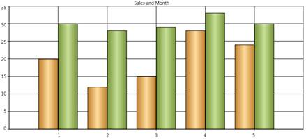
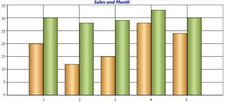

::: {style="DISPLAY: none"}
{#d2h_url_template}{#d2h_package_url style="WIDTH: 0px; DISPLAY: none; HEIGHT: 0px"}
:::

:::: {.d2h_secondary_topic style="PADDING-BOTTOM: 10pt; MARGIN: 0pt; PADDING-LEFT: 0pt; PADDING-RIGHT: 0pt; PADDING-TOP: 0pt"}
##### Chart Header {#chart-header style="tab-stops: 0pt"}

Essential Chart for WPF enables users to set the title for a chart.

[]{style="FONT-FAMILY: 'Trebuchet MS','sans-serif'; FONT-SIZE: 9pt"} 

Table 8: Property Table

::: {align="center"}
+------------------+------------------------------+----------------------+------------------------+---------------------------------------------------------------+------------------------------------------------------+
| Name of Property | Description                  | Type of Property     | Value It Accepts       | Property Syntax                                               | Sub Properties                                       |
|                  |                              |                      |                        |                                                               |                                                      |
|                  |                              |                      |                        |                                                               |                                                      |
+------------------+------------------------------+----------------------+------------------------+---------------------------------------------------------------+------------------------------------------------------+
| Header           | Sets the title of the chart. | Dependency  Property | Object/ "Chart Header" |  \<syncfusion:Chart Name=\"chart1\" Header=\"Chart Header\"\> | Sub Property Name : HeaderAlignment                  |
|                  |                              |                      |                        |                                                               |                                                      |
|                  |                              |                      |                        |                                                               | Type: HorizontalAlignment / HorizontalAlignment.Left |
+------------------+------------------------------+----------------------+------------------------+---------------------------------------------------------------+------------------------------------------------------+
:::

 

###### 4.1.1.2.4.1 Setting the Title for a Chart {#setting-the-title-for-a-chart style="tab-stops: 0pt"}

Set the title for a chart by using the following code.

 

+----------------------------------------------------------------------------------------------------+
| [\[XAML\]]{style="FONT-FAMILY: 'Courier New'"}                                                     |
|                                                                                                    |
| []{style="FONT-FAMILY: 'Courier New'"}                                                             |
|                                                                                                    |
| [\<sfchart:Chart Name=\"Chart1\" Header=\"Sales and Month\"\>]{style="FONT-FAMILY: 'Courier New'"} |
|                                                                                                    |
| [\</sfchart:Chart\>]{style="FONT-FAMILY: 'Courier New'"}                                           |
|                                                                                                    |
| []{style="FONT-FAMILY: 'Courier New'"}                                                             |
+----------------------------------------------------------------------------------------------------+

 

+---------------------------------------------------------------------------------------------------------------------------------------------------------+
| **[\[C#\]]{style="FONT-FAMILY: 'Courier New'"}**                                                                                                        |
|                                                                                                                                                         |
| **[]{style="FONT-FAMILY: 'Courier New'"}**                                                                                                              |
|                                                                                                                                                         |
| [chart1.Header = \"]{style="FONT-FAMILY: 'Courier New'"}[ ]{style="FONT-FAMILY: 'Courier New'"}[Sales and Month \"]{style="FONT-FAMILY: 'Courier New'"} |
+---------------------------------------------------------------------------------------------------------------------------------------------------------+

 

{border="0"}

Figure 63: Chart with Title

 

###### 4.1.1.2.4.2 Customizing Chart Title {#customizing-chart-title style="tab-stops: 0pt"}

Users can customize the chart header using a text block, text box, rectangle, or border control.

Customize the chart header by using the following code.

 

+---------------------------------------------------------------------------------------------------------------------------------------------------------------------------------+
| **[\[XAML\]]{style="FONT-FAMILY: 'Courier New'"}**                                                                                                                              |
|                                                                                                                                                                                 |
| []{style="FONT-FAMILY: 'Courier New'"}                                                                                                                                          |
|                                                                                                                                                                                 |
| [\<sfchart:Chart Name=\"Chart1\" \>]{style="FONT-FAMILY: 'Courier New'"}                                                                                                        |
|                                                                                                                                                                                 |
| [   \<sfchart:Chart.Header\>]{style="FONT-FAMILY: 'Courier New'"}                                                                                                               |
|                                                                                                                                                                                 |
| [     \<TextBlock Text=\"Sales and Month\" FontSize=\"16\" Foreground=\"Blue\" FontStyle=\"Italic\" FontWeight=\"Bold\" Margin=\"-5\"  /\>]{style="FONT-FAMILY: 'Courier New'"} |
|                                                                                                                                                                                 |
| [   \</sfchart:Chart.Header\>]{style="FONT-FAMILY: 'Courier New'"}                                                                                                              |
|                                                                                                                                                                                 |
| [\</sfchart:Chart\>]{style="FONT-FAMILY: 'Courier New'"}                                                                                                                        |
|                                                                                                                                                                                 |
| []{style="FONT-FAMILY: 'Courier New'"}                                                                                                                                          |
+---------------------------------------------------------------------------------------------------------------------------------------------------------------------------------+

 

 

{border="0"}

Figure 64: Customized Chart Header

 

[]{#related-topics}
::::
