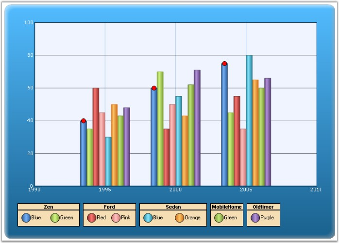

::: {style="DISPLAY: none"}
{#d2h_url_template}{#d2h_package_url style="WIDTH: 0px; DISPLAY: none; HEIGHT: 0px"}
:::

::::: {#nsbanner .d2h_main_nsbanner style="BORDER-BOTTOM: #999999 1px solid; POSITION: relative; PADDING-BOTTOM: 0px; BACKGROUND-COLOR: transparent; PADDING-LEFT: 0px; PADDING-RIGHT: 0px; DISPLAY: none; BORDER-TOP: #999999 1px solid; PADDING-TOP: 0px; LEFT: 0px"}
:::: {#TitleRow .d2h_main_titlerow style="PADDING-BOTTOM: 4px; BACKGROUND-COLOR: transparent; PADDING-LEFT: 22px; WIDTH: 100%; PADDING-RIGHT: 10px; DISPLAY: none; PADDING-TOP: 4px"}
::: {#ienav .d2h_main_ienav style="DISPLAY: none"}
{#D2HPrevious .D2HPreviousEnabled}  {#D2HNext .D2HNextEnabled}
:::
::::
:::::

::::::: {#nstext .d2h_main_nstext style="PADDING-BOTTOM: 10px; BACKGROUND-COLOR: transparent; PADDING-LEFT: 22px; PADDING-RIGHT: 10px; HEIGHT: 100%; OVERFLOW: auto; PADDING-TOP: 5px" hasuserbackground="true" valign="bottom"}
::: {#d2h_breadcrumbs .d2h_breadcrumbs}
[Essential Studio User Guide Documentation](ms-xhelp:///?Id=12457748-09e3-4d74-a240-8e049cedf030){.d2h_breadcrumbsNormal}[ \> ]{.d2h_breadcrumbsLinkSeparator}[User Interface Edition](ms-xhelp:///?Id=c29296b7-531c-413b-a0ec-488ca1f7f669){.d2h_breadcrumbsNormal}[ \> ]{.d2h_breadcrumbsLinkSeparator}[Essential ASP.NET](ms-xhelp:///?Id=25c35330-c127-4dad-9a92-ed79dc7261a6){.d2h_breadcrumbsNormal}[ \> ]{.d2h_breadcrumbsLinkSeparator}[Essential Chart]{.d2h_breadcrumbsContentsOnly}[ \> ]{.d2h_breadcrumbsLinkSeparator}[Concepts and Features](ms-xhelp:///?Id=100687ce-82f2-4424-9d16-0949ea76cf15){.d2h_breadcrumbsNormal}[ \> ]{.d2h_breadcrumbsLinkSeparator}[Chart Legend and Legend Items](ms-xhelp:///?Id=5063ada2-ebde-4a71-bfe0-9ae66155b1a7){.d2h_breadcrumbsNormal}
:::

### ChartLegend {#chartlegend style="tab-stops: 0pt"}

**[]{style="FONT-FAMILY: 'Trebuchet MS','sans-serif'; FONT-SIZE: 9pt"}** 

The legend is represented by the ChartLegend type.

[]{style="FONT-FAMILY: 'Trebuchet MS','sans-serif'; FONT-SIZE: 9pt"} 

Default Legend

[]{style="FONT-FAMILY: 'Trebuchet MS','sans-serif'; FONT-SIZE: 9pt"} 

By default, a custom **ChartLegend** instance gets added to the **Legends** list in the control. You can access this default legend as follows.

[]{style="FONT-FAMILY: 'Trebuchet MS','sans-serif'; FONT-SIZE: 9pt"} 

+----------------------------------------------------------------------------------------------------------------------------------------------------------------------------------------------------------+
| **[\[C#\]]{style="FONT-FAMILY: 'Courier New'; COLOR: black"}**                                                                                                                                           |
|                                                                                                                                                                                                          |
| **[]{style="FONT-FAMILY: 'Courier New'; COLOR: black"}**                                                                                                                                                 |
|                                                                                                                                                                                                          |
| [// Changing the position of the default legend]{style="FONT-FAMILY: 'Courier New'; COLOR: green"}                                                                                                       |
|                                                                                                                                                                                                          |
| [this]{style="FONT-FAMILY: 'Courier New'; COLOR: blue"}[.ChartWebControl1.Legends\[0\].LegendPosition = Syncfusion.Windows.Forms.Chart.ChartDock.Top;]{style="FONT-FAMILY: 'Courier New'; COLOR: black"} |
+----------------------------------------------------------------------------------------------------------------------------------------------------------------------------------------------------------+

[]{style="FONT-FAMILY: 'Trebuchet MS','sans-serif'; FONT-SIZE: 9pt"} 

+----------------------------------------------------------------------------------------------------------------------------------------------------------------------------------------------------------------------------------------+
| **[\[VB.NET\]]{style="FONT-FAMILY: 'Courier New'; COLOR: black"}**                                                                                                                                                                     |
|                                                                                                                                                                                                                                        |
| **[]{style="FONT-FAMILY: 'Courier New'; COLOR: black"}**                                                                                                                                                                               |
|                                                                                                                                                                                                                                        |
| [\' Changing the position of the default legend]{style="FONT-FAMILY: 'Courier New'; COLOR: green"}                                                                                                                                     |
|                                                                                                                                                                                                                                        |
| [Me]{style="FONT-FAMILY: 'Courier New'; COLOR: blue"}[.[ChartWebControl1]{style="COLOR: black"}.Legends\[0\].LegendPosition = Syncfusion.Windows.Forms.Chart.[ChartDock]{style="COLOR: teal"}.Top]{style="FONT-FAMILY: 'Courier New'"} |
+----------------------------------------------------------------------------------------------------------------------------------------------------------------------------------------------------------------------------------------+

[]{style="FONT-FAMILY: 'Trebuchet MS','sans-serif'; FONT-SIZE: 9pt"} 

Adding Custom Legends

[]{style="FONT-FAMILY: 'Trebuchet MS','sans-serif'; FONT-SIZE: 9pt"} 

You can add custom legends to the chart through the Legends list as follows:

[]{style="FONT-FAMILY: 'Trebuchet MS','sans-serif'; FONT-SIZE: 9pt"} 

+-------------------------------------------------------------------------------------------------------------------------------------------------------------------------------------------------------------+
| **[\[C#\]]{style="FONT-FAMILY: 'Courier New'; COLOR: black"}**                                                                                                                                              |
|                                                                                                                                                                                                             |
| **[]{style="FONT-FAMILY: 'Courier New'; COLOR: black"}**                                                                                                                                                    |
|                                                                                                                                                                                                             |
| [ChartWebLegend]{style="FONT-FAMILY: 'Courier New'; COLOR: #2b91af"}[ legend1 = [new]{style="COLOR: blue"} [ChartWebLegend]{style="COLOR: #2b91af"}(ChartWebControl1);]{style="FONT-FAMILY: 'Courier New'"} |
|                                                                                                                                                                                                             |
| [legend1.Name = [\"legend1\"]{style="COLOR: #a31515"};]{style="FONT-FAMILY: 'Courier New'"}                                                                                                                 |
|                                                                                                                                                                                                             |
| [legend1.Text = [\"Zen\"]{style="COLOR: #a31515"};]{style="FONT-FAMILY: 'Courier New'"}                                                                                                                     |
|                                                                                                                                                                                                             |
| [legend1.Position = [ChartDock]{style="COLOR: #2b91af"}.Bottom;]{style="FONT-FAMILY: 'Courier New'"}                                                                                                        |
|                                                                                                                                                                                                             |
| [ChartWebControl1.Legends.Add(legend1);]{style="FONT-FAMILY: 'Courier New'"}                                                                                                                                |
+-------------------------------------------------------------------------------------------------------------------------------------------------------------------------------------------------------------+

[]{style="FONT-FAMILY: 'Trebuchet MS','sans-serif'; FONT-SIZE: 9pt"} 

+--------------------------------------------------------------------------------------------------------------------------------------------------------------------------------------------+
| **[\[VB.NET\]]{style="FONT-FAMILY: 'Courier New'; COLOR: black"}**                                                                                                                         |
|                                                                                                                                                                                            |
| **[]{style="FONT-FAMILY: 'Courier New'; COLOR: black"}**                                                                                                                                   |
|                                                                                                                                                                                            |
| [Dim]{style="FONT-FAMILY: 'Courier New'; COLOR: blue"}[ legend1 [As]{style="COLOR: blue"} [New]{style="COLOR: blue"} ChartWebLegend(ChartWebControl1)]{style="FONT-FAMILY: 'Courier New'"} |
|                                                                                                                                                                                            |
| [legend1.Name = [\"legend1\"]{style="COLOR: maroon"}]{style="FONT-FAMILY: 'Courier New'"}                                                                                                  |
|                                                                                                                                                                                            |
| [legend1.Text = [\"Zen\"]{style="COLOR: maroon"}]{style="FONT-FAMILY: 'Courier New'"}                                                                                                      |
|                                                                                                                                                                                            |
| [legend1.Position = ChartDock.Bottom]{style="FONT-FAMILY: 'Courier New'"}                                                                                                                  |
|                                                                                                                                                                                            |
| [ChartWebControl1.Legends.Add(legend1)]{style="FONT-FAMILY: 'Courier New'"}                                                                                                                |
+--------------------------------------------------------------------------------------------------------------------------------------------------------------------------------------------+

[]{style="FONT-FAMILY: 'Trebuchet MS','sans-serif'; FONT-SIZE: 9pt"} 

You can then add custom legend items into the ChartLegend through the **CustomItems** property as explained in the next topic ([ChartLegendItem]{.UGHyperlink}).

You can also associate a Chart Series to a custom ChartLegend as follows (then the legend item corresponding to that series will be rendered within the specified legend):

[]{style="FONT-FAMILY: 'Trebuchet MS','sans-serif'; FONT-SIZE: 9pt"} 

+------------------------------------------------------------------------------------------------------+
| **[\[C#\]]{style="FONT-FAMILY: 'Courier New'; COLOR: black"}**                                       |
|                                                                                                      |
| **[]{style="FONT-FAMILY: 'Courier New'; COLOR: black"}**                                             |
|                                                                                                      |
| [// Associate legend1 with series1]{style="FONT-FAMILY: 'Courier New'; COLOR: green"}                |
|                                                                                                      |
| [series\[0\].LegendName = [\"legend1\"]{style="COLOR: maroon"};]{style="FONT-FAMILY: 'Courier New'"} |
|                                                                                                      |
| [// Associate legend2 with series2]{style="FONT-FAMILY: 'Courier New'; COLOR: green"}                |
|                                                                                                      |
| [series\[1\].LegendName = [\"legend2\"]{style="COLOR: maroon"};]{style="FONT-FAMILY: 'Courier New'"} |
+------------------------------------------------------------------------------------------------------+

[]{style="FONT-FAMILY: 'Trebuchet MS','sans-serif'; FONT-SIZE: 9pt"} 

+-----------------------------------------------------------------------------------------------------+
| **[\[VB.NET\]]{style="FONT-FAMILY: 'Courier New'; COLOR: black"}**                                  |
|                                                                                                     |
| **[]{style="FONT-FAMILY: 'Courier New'; COLOR: black"}**                                            |
|                                                                                                     |
| [\' Associate legend1 with series1]{style="FONT-FAMILY: 'Courier New'; COLOR: green"}               |
|                                                                                                     |
| [series\[0\].LegendName = [\"legend1\"]{style="COLOR: maroon"}]{style="FONT-FAMILY: 'Courier New'"} |
|                                                                                                     |
| [\' Associate legend2 with series2]{style="FONT-FAMILY: 'Courier New'; COLOR: green"}               |
|                                                                                                     |
| [series\[1\].LegendName = [\"legend2\"]{style="COLOR: maroon"}]{style="FONT-FAMILY: 'Courier New'"} |
+-----------------------------------------------------------------------------------------------------+

[]{style="FONT-FAMILY: 'Trebuchet MS','sans-serif'; FONT-SIZE: 9pt"} 

{border="0"}

[]{style="FONT-FAMILY: 'Trebuchet MS','sans-serif'; FONT-SIZE: 9pt"} 

Figure 271: Chart with Multiple Legends

**[]{style="FONT-FAMILY: 'Trebuchet MS','sans-serif'; FONT-SIZE: 9pt"}** 

Legend Look and Feel

[]{style="FONT-FAMILY: 'Trebuchet MS','sans-serif'; FONT-SIZE: 9pt"} 

Here are some common properties you could use to customize the overall legend appearance:

[]{style="FONT-FAMILY: 'Trebuchet MS','sans-serif'; FONT-SIZE: 9pt"} 

::: {align="center"}
  ------------------------- ------------------------------------------------------------------------------------------------------------------------------------------------------------------------------------------------
  Chart Legend Properties   Description
  BackColor                 Gets / sets the background color of the legend. The default value is **Transparent**.
  VisibleCheckBox           If set to **true**, a checkbox will be displayed beside each legend item. And if this checkbox is unchecked the corresponding series will disappear from the chart plot. Default is **false**.
  BorderColor               Specifies the border color for the legend.
  BorderStyle               Specifies the border style for the legend.
  BorderWidth               Specifies the border width for the legend.
  ------------------------- ------------------------------------------------------------------------------------------------------------------------------------------------------------------------------------------------
:::

[]{style="FONT-FAMILY: 'Trebuchet MS','sans-serif'; FONT-SIZE: 9pt"} 

Legend Positioning

**[]{style="FONT-FAMILY: 'Trebuchet MS','sans-serif'; FONT-SIZE: 9pt"}** 

The legend positioning can be affected in the following ways.

[]{style="FONT-FAMILY: 'Trebuchet MS','sans-serif'; FONT-SIZE: 9pt"} 

::: {align="center"}
+-----------------------------------+------------------------------------------------------------------------------------------------------------------------------------------------------+
| Chart Legend Properties           | Description                                                                                                                                          |
+-----------------------------------+------------------------------------------------------------------------------------------------------------------------------------------------------+
| LegendPosition                    | Specifies the position relative to the chart at which to render the legend.                                                                          |
|                                   |                                                                                                                                                      |
|                                   | Top - above the chart                                                                                                                                |
|                                   |                                                                                                                                                      |
|                                   | Left - left of the chart                                                                                                                             |
|                                   |                                                                                                                                                      |
|                                   | Right - right of the chart                                                                                                                           |
|                                   |                                                                                                                                                      |
|                                   | Bottom - below the chart                                                                                                                             |
|                                   |                                                                                                                                                      |
|                                   | Floating - will not be docked to any specific location(**default setting**)                                                                          |
+-----------------------------------+------------------------------------------------------------------------------------------------------------------------------------------------------+
| LegendsPlacement                  | Specifies the placement of a legend in a chart. It can be placed Inside or Outside the chart area using ChartPlacement enum.                         |
+-----------------------------------+------------------------------------------------------------------------------------------------------------------------------------------------------+
| Alignment                         | When docked to a side, this property specifies how the legend should be aligned with respect to the chart boundaries. It can be Near, Far or Center. |
+-----------------------------------+------------------------------------------------------------------------------------------------------------------------------------------------------+
| LegendsLayoutMode                 | Specifies the layout mode of the legends. The options are,                                                                                           |
|                                   |                                                                                                                                                      |
|                                   | Wrap - Selecting this option will wrap all the legends and arrange then side by side on a single line.                                               |
|                                   |                                                                                                                                                      |
|                                   | Stack (**default**) - This options arranges the legends one by one in a stacked manner.                                                              |
+-----------------------------------+------------------------------------------------------------------------------------------------------------------------------------------------------+
| Behavior                          | Specifies the docking behavior of the Legend.                                                                                                        |
|                                   |                                                                                                                                                      |
|                                   | **Docking** - It is dockable on all four sides                                                                                                       |
|                                   |                                                                                                                                                      |
|                                   | **Movable** - It is movable                                                                                                                          |
|                                   |                                                                                                                                                      |
|                                   | **All** - It is movable and dockable                                                                                                                 |
|                                   |                                                                                                                                                      |
|                                   | **None** - It is neither movable nor dockable                                                                                                        |
+-----------------------------------+------------------------------------------------------------------------------------------------------------------------------------------------------+
| FloatingAutoSize                  | Specifies whether to determine the size automatically or not, while floating.                                                                        |
+-----------------------------------+------------------------------------------------------------------------------------------------------------------------------------------------------+
| OnlyColumnsForFloating            | The legend items will be displayed vertically in columns when floating.                                                                              |
+-----------------------------------+------------------------------------------------------------------------------------------------------------------------------------------------------+
| RowsCount                         | Specifies the number of rows in which the legend items should be rendered.                                                                           |
+-----------------------------------+------------------------------------------------------------------------------------------------------------------------------------------------------+
| ColumnsCount                      | Specifies the number of columns in which the legend items should be rendered.                                                                        |
+-----------------------------------+------------------------------------------------------------------------------------------------------------------------------------------------------+
:::

[]{style="FONT-FAMILY: 'Trebuchet MS','sans-serif'; COLOR: black; FONT-SIZE: 9pt"} 

::: {style="BORDER-BOTTOM: windowtext 1pt solid; BORDER-LEFT: medium none; PADDING-BOTTOM: 1pt; MARGIN-TOP: 9pt; PADDING-LEFT: 0pt; PADDING-RIGHT: 0pt; MARGIN-BOTTOM: 9pt; BORDER-TOP: windowtext 1pt solid; BORDER-RIGHT: medium none; PADDING-TOP: 1pt"}
[{border="0"}]{style="COLOR: black"}Note: The Legend.Alignment property works only for stacked legend layout mode. It will show no change when Alignment is set to \'Wrap\'.
:::

[]{style="FONT-FAMILY: 'Trebuchet MS','sans-serif'; FONT-SIZE: 9pt"} 

+----------------------------------------------------------------------------------------------------------------------------------------------------------------------------------------------------------------------------------------+
| **[\[C#\]]{style="FONT-FAMILY: 'Courier New'; COLOR: black"}**                                                                                                                                                                         |
|                                                                                                                                                                                                                                        |
| **[]{style="FONT-FAMILY: 'Courier New'; COLOR: black"}**                                                                                                                                                                               |
|                                                                                                                                                                                                                                        |
| [//Legend Setting;]{style="FONT-FAMILY: 'Courier New'; COLOR: green"}                                                                                                                                                                  |
|                                                                                                                                                                                                                                        |
| [foreach]{style="FONT-FAMILY: 'Courier New'; COLOR: blue"}[ ([ChartWebLegend]{style="COLOR: #2b91af"} chartLegend [in]{style="COLOR: blue"} [this]{style="COLOR: blue"}.ChartWebControl1.Legends)]{style="FONT-FAMILY: 'Courier New'"} |
|                                                                                                                                                                                                                                        |
| [{]{style="FONT-FAMILY: 'Courier New'"}                                                                                                                                                                                                |
|                                                                                                                                                                                                                                        |
| [    chartLegend.Position = [ChartDock]{style="COLOR: #2b91af"}.Left;]{style="FONT-FAMILY: 'Courier New'"}                                                                                                                             |
|                                                                                                                                                                                                                                        |
| [    chartLegend.RepresentationType = [ChartLegendRepresentationType]{style="COLOR: #2b91af"}.Circle;]{style="FONT-FAMILY: 'Courier New'"}                                                                                             |
|                                                                                                                                                                                                                                        |
| [    chartLegend.Font.Name = [\"Arial\"]{style="COLOR: #a31515"};]{style="FONT-FAMILY: 'Courier New'"}                                                                                                                                 |
|                                                                                                                                                                                                                                        |
| [    chartLegend.Font.Bold = [true]{style="COLOR: blue"};]{style="FONT-FAMILY: 'Courier New'"}                                                                                                                                         |
|                                                                                                                                                                                                                                        |
| [    chartLegend.Spacing = 8;]{style="FONT-FAMILY: 'Courier New'"}                                                                                                                                                                     |
|                                                                                                                                                                                                                                        |
| [    chartLegend.ForeColor = [Color]{style="COLOR: #2b91af"}.FromArgb(23, 83, 120);]{style="FONT-FAMILY: 'Courier New'"}                                                                                                               |
|                                                                                                                                                                                                                                        |
| [    chartLegend.BorderStyle = System.Web.UI.WebControls.[BorderStyle]{style="COLOR: #2b91af"}.Solid;]{style="FONT-FAMILY: 'Courier New'"}                                                                                             |
|                                                                                                                                                                                                                                        |
| [    chartLegend.BackColor = [Color]{style="COLOR: #2b91af"}.Wheat;]{style="FONT-FAMILY: 'Courier New'"}                                                                                                                               |
|                                                                                                                                                                                                                                        |
| [    chartLegend.ShowSymbol = [false]{style="COLOR: blue"};]{style="FONT-FAMILY: 'Courier New'"}                                                                                                                                       |
|                                                                                                                                                                                                                                        |
| [    chartLegend.TextColor = [Color]{style="COLOR: #2b91af"}.Black;]{style="FONT-FAMILY: 'Courier New'"}                                                                                                                               |
|                                                                                                                                                                                                                                        |
| [    chartLegend.BorderColor = [Color]{style="COLOR: #2b91af"}.Black;]{style="FONT-FAMILY: 'Courier New'"}                                                                                                                             |
|                                                                                                                                                                                                                                        |
| [}]{style="FONT-FAMILY: 'Courier New'"}                                                                                                                                                                                                |
+----------------------------------------------------------------------------------------------------------------------------------------------------------------------------------------------------------------------------------------+

[]{style="FONT-FAMILY: 'Trebuchet MS','sans-serif'; FONT-SIZE: 9pt"} 

+------------------------------------------------------------------------------------------------------------------------------------------------------------------------------------------------------------------------------------------------------------+
| **[\[VB.NET\]]{style="FONT-FAMILY: 'Courier New'; COLOR: black"}**                                                                                                                                                                                         |
|                                                                                                                                                                                                                                                            |
| **[]{style="FONT-FAMILY: 'Courier New'; COLOR: black"}**                                                                                                                                                                                                   |
|                                                                                                                                                                                                                                                            |
| [\'Legend Setting;]{style="FONT-FAMILY: 'Courier New'; COLOR: green"}                                                                                                                                                                                      |
|                                                                                                                                                                                                                                                            |
| [For]{style="FONT-FAMILY: 'Courier New'; COLOR: blue"}[ [Each]{style="COLOR: blue"} chartLegend [As]{style="COLOR: blue"} ChartWebLegend [In]{style="COLOR: blue"} [Me]{style="COLOR: blue"}.ChartWebControl1.Legends]{style="FONT-FAMILY: 'Courier New'"} |
|                                                                                                                                                                                                                                                            |
| [    chartLegend.Position = ChartDock.Left]{style="FONT-FAMILY: 'Courier New'"}                                                                                                                                                                            |
|                                                                                                                                                                                                                                                            |
| [    chartLegend.RepresentationType = ChartLegendRepresentationType.Circle]{style="FONT-FAMILY: 'Courier New'"}                                                                                                                                            |
|                                                                                                                                                                                                                                                            |
| [    chartLegend.Font.Name = [\"Arial\"]{style="COLOR: maroon"}]{style="FONT-FAMILY: 'Courier New'"}                                                                                                                                                       |
|                                                                                                                                                                                                                                                            |
| [    chartLegend.Font.Bold = [True]{style="COLOR: blue"}]{style="FONT-FAMILY: 'Courier New'"}                                                                                                                                                              |
|                                                                                                                                                                                                                                                            |
| [    chartLegend.Spacing = 8]{style="FONT-FAMILY: 'Courier New'"}                                                                                                                                                                                          |
|                                                                                                                                                                                                                                                            |
| [    chartLegend.ForeColor = Color.FromArgb(23, 83, 120)]{style="FONT-FAMILY: 'Courier New'"}                                                                                                                                                              |
|                                                                                                                                                                                                                                                            |
| [    chartLegend.BorderStyle = System.Web.UI.WebControls.BorderStyle.Solid]{style="FONT-FAMILY: 'Courier New'"}                                                                                                                                            |
|                                                                                                                                                                                                                                                            |
| [    chartLegend.BackColor = Color.Wheat]{style="FONT-FAMILY: 'Courier New'"}                                                                                                                                                                              |
|                                                                                                                                                                                                                                                            |
| [    chartLegend.ShowSymbol = [False]{style="COLOR: blue"}]{style="FONT-FAMILY: 'Courier New'"}                                                                                                                                                            |
|                                                                                                                                                                                                                                                            |
| [    chartLegend.TextColor = Color.Black]{style="FONT-FAMILY: 'Courier New'"}                                                                                                                                                                              |
|                                                                                                                                                                                                                                                            |
| [    chartLegend.BorderColor = Color.Black]{style="FONT-FAMILY: 'Courier New'"}                                                                                                                                                                            |
|                                                                                                                                                                                                                                                            |
| [Next]{style="FONT-FAMILY: 'Courier New'; COLOR: blue"}                                                                                                                                                                                                    |
+------------------------------------------------------------------------------------------------------------------------------------------------------------------------------------------------------------------------------------------------------------+

[]{style="FONT-FAMILY: 'Trebuchet MS','sans-serif'; FONT-SIZE: 9pt"} 

A sample which demonstrates the legend features is available in the following sample installation path.

 

\<Install Location\>\\Syncfusion\\EssentialStudio\\\<***Version Number***\>\\Web\\chart.web\\Samples\\3.5\\Chart Title and Legends\\ChartLegendCustomization

[]{#p196} 

[]{#related-topics}
:::::::
