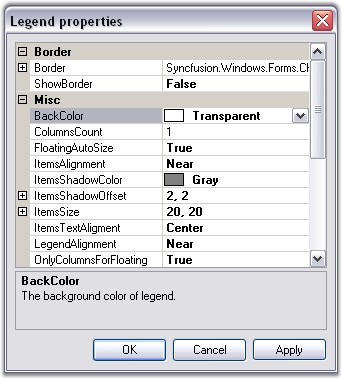

::: {style="DISPLAY: none"}
{#d2h_url_template}{#d2h_package_url style="WIDTH: 0px; DISPLAY: none; HEIGHT: 0px"}
:::

::::: {#nsbanner .d2h_main_nsbanner style="BORDER-BOTTOM: #999999 1px solid; POSITION: relative; PADDING-BOTTOM: 0px; BACKGROUND-COLOR: transparent; PADDING-LEFT: 0px; PADDING-RIGHT: 0px; DISPLAY: none; BORDER-TOP: #999999 1px solid; PADDING-TOP: 0px; LEFT: 0px"}
:::: {#TitleRow .d2h_main_titlerow style="PADDING-BOTTOM: 4px; BACKGROUND-COLOR: transparent; PADDING-LEFT: 22px; WIDTH: 100%; PADDING-RIGHT: 10px; DISPLAY: none; PADDING-TOP: 4px"}
::: {#ienav .d2h_main_ienav style="DISPLAY: none"}
{#D2HPrevious .D2HPreviousEnabled}  {#D2HNext .D2HNextEnabled}
:::
::::
:::::

:::::::: {#nstext .d2h_main_nstext style="PADDING-BOTTOM: 10px; BACKGROUND-COLOR: transparent; PADDING-LEFT: 22px; PADDING-RIGHT: 10px; HEIGHT: 100%; OVERFLOW: auto; PADDING-TOP: 5px" hasuserbackground="true" valign="bottom"}
::: {#d2h_breadcrumbs .d2h_breadcrumbs}
[Essential Studio User Guide Documentation](ms-xhelp:///?Id=12457748-09e3-4d74-a240-8e049cedf030){.d2h_breadcrumbsNormal}[ \> ]{.d2h_breadcrumbsLinkSeparator}[User Interface Edition](ms-xhelp:///?Id=c29296b7-531c-413b-a0ec-488ca1f7f669){.d2h_breadcrumbsNormal}[ \> ]{.d2h_breadcrumbsLinkSeparator}[Essential Windows](ms-xhelp:///?Id=e60759d8-47a4-4570-9d7a-16a68d63f2ea){.d2h_breadcrumbsNormal}[ \> ]{.d2h_breadcrumbsLinkSeparator}[Essential Chart]{.d2h_breadcrumbsContentsOnly}[ \> ]{.d2h_breadcrumbsLinkSeparator}[Concepts and Features](ms-xhelp:///?Id=71321e9c-336c-4c1c-a127-be9f135ad4bb){.d2h_breadcrumbsNormal}[ \> ]{.d2h_breadcrumbsLinkSeparator}[Chart Legend and Legend Items](ms-xhelp:///?Id=26574a97-1fe1-4f3d-803d-3a7568072747){.d2h_breadcrumbsNormal}
:::

### ChartLegend {#chartlegend style="tab-stops: 0pt"}

 

The legend is represented by the ChartLegend type.

 

Default Legend

 

By default, a custom **ChartLegend** instance gets added to the **Legends** list in the control. You can access this default legend as follows.

 

+-------------------------------------------------------------------------------------------------------------------------------------------------------------------------------------------------------+
| **[\[C#\]]{style="FONT-FAMILY: 'Courier New'; COLOR: black"}**                                                                                                                                        |
|                                                                                                                                                                                                       |
| **[]{style="FONT-FAMILY: 'Courier New'; COLOR: black"}**                                                                                                                                              |
|                                                                                                                                                                                                       |
| [// Changing the position of the default legend]{style="FONT-FAMILY: 'Courier New'; COLOR: green"}                                                                                                    |
|                                                                                                                                                                                                       |
| [this]{style="FONT-FAMILY: 'Courier New'; COLOR: blue"}[.chartControl1.Legends\[0\].LegendPosition = Syncfusion.Windows.Forms.Chart.ChartDock.Top;]{style="FONT-FAMILY: 'Courier New'; COLOR: black"} |
+-------------------------------------------------------------------------------------------------------------------------------------------------------------------------------------------------------+

 

+-------------------------------------------------------------------------------------------------------------------------------------------------------------------------------------------------------------+
| **[\[VB.NET\]]{style="FONT-FAMILY: 'Courier New'; COLOR: black"}**                                                                                                                                          |
|                                                                                                                                                                                                             |
| **[]{style="FONT-FAMILY: 'Courier New'; COLOR: black"}**                                                                                                                                                    |
|                                                                                                                                                                                                             |
| [\' Changing the position of the default legend]{style="FONT-FAMILY: 'Courier New'; COLOR: green"}                                                                                                          |
|                                                                                                                                                                                                             |
| [Me]{style="FONT-FAMILY: 'Courier New'; COLOR: blue"}[.chartControl1.Legends\[0\].LegendPosition = Syncfusion.Windows.Forms.Chart.[ChartDock]{style="COLOR: teal"}.Top]{style="FONT-FAMILY: 'Courier New'"} |
+-------------------------------------------------------------------------------------------------------------------------------------------------------------------------------------------------------------+

 

 

 

Adding Custom Legends

 

You can add custom legends to the chart through the Legends list as follows:

 

+----------------------------------------------------------------------------------------------------------------------------------------------------------------------------------------------+
| **[\[C#\]]{style="FONT-FAMILY: 'Courier New'; COLOR: black"}**                                                                                                                               |
|                                                                                                                                                                                              |
| **[]{style="FONT-FAMILY: 'Courier New'; COLOR: black"}**                                                                                                                                     |
|                                                                                                                                                                                              |
| [// Changing the position of the default legend]{style="FONT-FAMILY: 'Courier New'; COLOR: green"}                                                                                           |
|                                                                                                                                                                                              |
| [ChartLegend]{style="FONT-FAMILY: 'Courier New'; COLOR: teal"}[ legend2 = [new]{style="COLOR: blue"} [ChartLegend]{style="COLOR: teal"}(chartControl1);]{style="FONT-FAMILY: 'Courier New'"} |
|                                                                                                                                                                                              |
| [legend2.Name = [\"MyLegend\"]{style="COLOR: maroon"};]{style="FONT-FAMILY: 'Courier New'"}                                                                                                  |
|                                                                                                                                                                                              |
| [chartControl1.Legends.Add(legend2);]{style="FONT-FAMILY: 'Courier New'"}                                                                                                                    |
+----------------------------------------------------------------------------------------------------------------------------------------------------------------------------------------------+

 

+-------------------------------------------------------------------------------------------------------------------------------------------------------------------------+
| **[\[VB.NET\]]{style="FONT-FAMILY: 'Courier New'; COLOR: black"}**                                                                                                      |
|                                                                                                                                                                         |
| **[]{style="FONT-FAMILY: 'Courier New'; COLOR: black"}**                                                                                                                |
|                                                                                                                                                                         |
| [Dim]{style="FONT-FAMILY: 'Courier New'; COLOR: blue"}[ legend2 [As]{style="COLOR: blue"} [New]{style="COLOR: blue"} ChartLegend()]{style="FONT-FAMILY: 'Courier New'"} |
|                                                                                                                                                                         |
| [legend2.Name = [\"MyLegend\"]{style="COLOR: maroon"}]{style="FONT-FAMILY: 'Courier New'"}                                                                              |
|                                                                                                                                                                         |
| [chartControl1.Legends.Add(legend2)]{style="FONT-FAMILY: 'Courier New'"}                                                                                                |
+-------------------------------------------------------------------------------------------------------------------------------------------------------------------------+

 

You can then add custom legend items into the ChartLegend through the **CustomItems** property as explained in the next topic ([ChartLegendItem]{.UGHyperlink}).

 

You can also associate a ChartSeries to a custom ChartLegend as follows (then the legend item corresponding to that series will be rendered within the specified legend):

 

+------------------------------------------------------------------------------------------------------+
| **[\[C#\]]{style="FONT-FAMILY: 'Courier New'; COLOR: black"}**                                       |
|                                                                                                      |
| **[]{style="FONT-FAMILY: 'Courier New'; COLOR: black"}**                                             |
|                                                                                                      |
| [// Associate legend1 with series1]{style="FONT-FAMILY: 'Courier New'; COLOR: green"}                |
|                                                                                                      |
| [series\[0\].LegendName = [\"legend1\"]{style="COLOR: maroon"};]{style="FONT-FAMILY: 'Courier New'"} |
|                                                                                                      |
| [// Associate legend2 with series2]{style="FONT-FAMILY: 'Courier New'; COLOR: green"}                |
|                                                                                                      |
| [series\[1\].LegendName = [\"legend2\"]{style="COLOR: maroon"};]{style="FONT-FAMILY: 'Courier New'"} |
+------------------------------------------------------------------------------------------------------+

 

+-----------------------------------------------------------------------------------------------------+
| **[\[VB.NET\]]{style="FONT-FAMILY: 'Courier New'; COLOR: black"}**                                  |
|                                                                                                     |
| **[]{style="FONT-FAMILY: 'Courier New'; COLOR: black"}**                                            |
|                                                                                                     |
| [\' Associate legend1 with series1]{style="FONT-FAMILY: 'Courier New'; COLOR: green"}               |
|                                                                                                     |
| [series\[0\].LegendName = [\"legend1\"]{style="COLOR: maroon"}]{style="FONT-FAMILY: 'Courier New'"} |
|                                                                                                     |
| [\' Associate legend2 with series2]{style="FONT-FAMILY: 'Courier New'; COLOR: green"}               |
|                                                                                                     |
| [series\[1\].LegendName = [\"legend2\"]{style="COLOR: maroon"}]{style="FONT-FAMILY: 'Courier New'"} |
+-----------------------------------------------------------------------------------------------------+

 

Legend Look and Feel

 

Here are some common properties you could use to customize the overall legend appearance:

 

::: {align="center"}
+-------------------------------------+------------------------------------------------------------------------------------------------------------------------------------------------------------------------------------------------+
|                                     |                                                                                                                                                                                                |
|                                     |                                                                                                                                                                                                |
| ChartLegend Property                | Description                                                                                                                                                                                    |
+-------------------------------------+------------------------------------------------------------------------------------------------------------------------------------------------------------------------------------------------+
| BackColor                           | Gets / sets the background color of the legend. The default value is **Transparent**.                                                                                                          |
+-------------------------------------+------------------------------------------------------------------------------------------------------------------------------------------------------------------------------------------------+
| VisibleCheckBox                     | If set to **true**, a checkbox will be displayed beside each legend item. And if this checkbox is unchecked the corresponding series will disappear from the chart plot. Default is **false**. |
+-------------------------------------+------------------------------------------------------------------------------------------------------------------------------------------------------------------------------------------------+
| Windows                                                                                                                                                                                                                              |
+-------------------------------------+------------------------------------------------------------------------------------------------------------------------------------------------------------------------------------------------+
| Border                              | Gets / sets the border style of the legend. **ShowBorder** should be **true**.                                                                                                                 |
+-------------------------------------+------------------------------------------------------------------------------------------------------------------------------------------------------------------------------------------------+
| ShowBorder                          | Specifies whether a border should be drawn. By default it is set to **false**.                                                                                                                 |
+-------------------------------------+------------------------------------------------------------------------------------------------------------------------------------------------------------------------------------------------+
| Font                                | Specifies the font that is to be used for the text rendered in the legend items. The default font style is Verdana, 8, Regular.                                                                |
+-------------------------------------+------------------------------------------------------------------------------------------------------------------------------------------------------------------------------------------------+
| BackInterior                        | Sets the interior appearance for the legend. This overrides the **BackColor** property.                                                                                                        |
+-------------------------------------+------------------------------------------------------------------------------------------------------------------------------------------------------------------------------------------------+
| BackgroundImage                     | Sets the background image for the legend. This setting overrides the **BackInterior** property settings.                                                                                       |
+-------------------------------------+------------------------------------------------------------------------------------------------------------------------------------------------------------------------------------------------+
| BackgroundImageLayout               | Sets the layout for the background image.                                                                                                                                                      |
+-------------------------------------+------------------------------------------------------------------------------------------------------------------------------------------------------------------------------------------------+
:::

 

 

 

Legend Positioning

 

The legend positioning can be affected in the following ways.

 

::: {align="center"}
+-----------------------------------+------------------------------------------------------------------------------------------------------------------------------+
|                                   |                                                                                                                              |
|                                   |                                                                                                                              |
| **ChartLegend Property**          | **Description**                                                                                                              |
+-----------------------------------+------------------------------------------------------------------------------------------------------------------------------+
| Position                          | Specifies the position relative to the chart at which to render the legend.                                                  |
|                                   |                                                                                                                              |
|                                   | [·      ]{style="FONT-FAMILY: Symbol"}Top - above the chart                                                                  |
|                                   |                                                                                                                              |
|                                   | [·      ]{style="FONT-FAMILY: Symbol"}Left - left of the chart                                                               |
|                                   |                                                                                                                              |
|                                   | [·      ]{style="FONT-FAMILY: Symbol"}Right - right of the chart                                                             |
|                                   |                                                                                                                              |
|                                   | [·      ]{style="FONT-FAMILY: Symbol"}Bottom - below the chart                                                               |
|                                   |                                                                                                                              |
|                                   | [·      ]{style="FONT-FAMILY: Symbol"}Floating - will not be docked to any specific location(**default setting**)            |
+-----------------------------------+------------------------------------------------------------------------------------------------------------------------------+
| LegendAlignment                   | When docked to a side, this property specifies how the legend should be aligned with respect to the chart boundaries.        |
+-----------------------------------+------------------------------------------------------------------------------------------------------------------------------+
| LegendPlacement                   | Specifies the placement of a legend in a chart. It can be placed Inside or Outside the chart area using ChartPlacement enum. |
+-----------------------------------+------------------------------------------------------------------------------------------------------------------------------+
| DockingFree                       | If set to **true**, the legend will be floating and cannot be dragged and docked to the sides.                               |
+-----------------------------------+------------------------------------------------------------------------------------------------------------------------------+
| Behavior                          | Specifies the docking behavior of the Legend.                                                                                |
|                                   |                                                                                                                              |
|                                   | [·      ]{style="FONT-FAMILY: Symbol"}**Docking** - It is dockable on all four sides                                         |
|                                   |                                                                                                                              |
|                                   | [·      ]{style="FONT-FAMILY: Symbol"}**Movable** - It is movable                                                            |
|                                   |                                                                                                                              |
|                                   | [·      ]{style="FONT-FAMILY: Symbol"}**All** - It is movable and dockable                                                   |
|                                   |                                                                                                                              |
|                                   | [·      ]{style="FONT-FAMILY: Symbol"}**None** - It is neither movable nor dockable                                          |
+-----------------------------------+------------------------------------------------------------------------------------------------------------------------------+
| FloatingAutoSize                  | Specifies whether to determine the size automatically or not, while floating.                                                |
+-----------------------------------+------------------------------------------------------------------------------------------------------------------------------+
| OnlyColumnsForFloating            | The legend items will be displayed vertically in columns when floating.                                                      |
+-----------------------------------+------------------------------------------------------------------------------------------------------------------------------+
| RowsCount                         | Specifies the number of rows in which the legend items should be rendered.                                                   |
+-----------------------------------+------------------------------------------------------------------------------------------------------------------------------+
| ColumnsCount                      | Specifies the number of columns in which the legend items should be rendered.                                                |
+-----------------------------------+------------------------------------------------------------------------------------------------------------------------------+
:::

 

::: {style="BORDER-BOTTOM: windowtext 1pt solid; BORDER-LEFT: medium none; PADDING-BOTTOM: 1pt; MARGIN-TOP: 9pt; PADDING-LEFT: 0pt; PADDING-RIGHT: 0pt; MARGIN-BOTTOM: 9pt; BORDER-TOP: windowtext 1pt solid; BORDER-RIGHT: medium none; PADDING-TOP: 1pt"}
{border="0"}Note:[ ]{style="COLOR: black; FONT-SIZE: 8pt"}Note that the user can drag the legend around during run time. He can dock it to the sides if docking is enabled. Docking behavior is controlled by Behavior property which is described in the above table.
:::

 

Changing Legend Properties at Run Time

 

The Legend\'s look and feel can also be customized during runtime. Double-clicking legend\'s text will pop up the below properties window. Properties set through this dialogue can be applied to the chart.

 

::: {style="BORDER-BOTTOM: windowtext 1pt solid; BORDER-LEFT: medium none; PADDING-BOTTOM: 1pt; MARGIN-TOP: 9pt; PADDING-LEFT: 0pt; PADDING-RIGHT: 0pt; MARGIN-BOTTOM: 9pt; BORDER-TOP: windowtext 1pt solid; BORDER-RIGHT: medium none; PADDING-TOP: 1pt"}
{border="0"}Note: These settings will be lost when the application is closed.
:::

 

{border="0"}

 

Figure 280: Legend Properties Dialog Box

 

See Also

 

[[ChartLegend]{.UGHyperlink}]()[]{.UGHyperlink}

[]{#p194} 

[]{#related-topics}
::::::::
