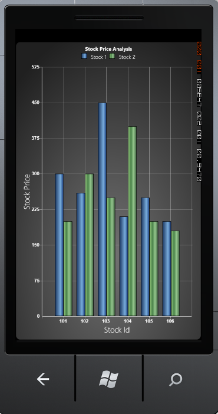

::: {style="DISPLAY: none"}
{#d2h_url_template}{#d2h_package_url style="WIDTH: 0px; DISPLAY: none; HEIGHT: 0px"}
:::

::::: {#nsbanner .d2h_main_nsbanner style="BORDER-BOTTOM: #999999 1px solid; POSITION: relative; PADDING-BOTTOM: 0px; BACKGROUND-COLOR: transparent; PADDING-LEFT: 0px; PADDING-RIGHT: 0px; DISPLAY: none; BORDER-TOP: #999999 1px solid; PADDING-TOP: 0px; LEFT: 0px"}
:::: {#TitleRow .d2h_main_titlerow style="PADDING-BOTTOM: 4px; BACKGROUND-COLOR: transparent; PADDING-LEFT: 22px; WIDTH: 100%; PADDING-RIGHT: 10px; DISPLAY: none; PADDING-TOP: 4px"}
::: {#ienav .d2h_main_ienav style="DISPLAY: none"}
{#D2HPrevious .D2HPreviousEnabled}  {#D2HNext .D2HNextEnabled}
:::
::::
:::::

:::: {#nstext .d2h_main_nstext style="PADDING-BOTTOM: 10px; BACKGROUND-COLOR: transparent; PADDING-LEFT: 22px; PADDING-RIGHT: 10px; HEIGHT: 100%; OVERFLOW: auto; PADDING-TOP: 5px" hasuserbackground="true" valign="bottom"}
::: {#d2h_breadcrumbs .d2h_breadcrumbs}
[Essential Studio User Guide Documentation](ms-xhelp:///?Id=12457748-09e3-4d74-a240-8e049cedf030){.d2h_breadcrumbsNormal}[ \> ]{.d2h_breadcrumbsLinkSeparator}[User Interface Edition](ms-xhelp:///?Id=c29296b7-531c-413b-a0ec-488ca1f7f669){.d2h_breadcrumbsNormal}[ \> ]{.d2h_breadcrumbsLinkSeparator}[Essential Windows Phone](ms-xhelp:///?Id=5ea1999c-4eff-4775-b84e-407dc825f555){.d2h_breadcrumbsNormal}[ \> ]{.d2h_breadcrumbsLinkSeparator}[Essential Chart]{.d2h_breadcrumbsContentsOnly}[ \> ]{.d2h_breadcrumbsLinkSeparator}[Concepts and Features](ms-xhelp:///?Id=080edead-2400-410b-a7ad-9155e5f1ae92){.d2h_breadcrumbsNormal}[ \> ]{.d2h_breadcrumbsLinkSeparator}[Chart Axes](ms-xhelp:///?Id=479ac964-2f1e-465b-96e9-40f65868066b){.d2h_breadcrumbsNormal}
:::

### Chart Legend {#chart-legend style="tab-stops: 0pt"}

 

Legend is the one that displays all the series information that is plotted on the chart.

The Chart Legends can be used to give information about the series in chart control. Chart Legend has CheckBoxVisibility property.  If this property value is *Visible*, then the particular series will be displayed in the chart control. If the check box is unchecked, then the series will be in the *Hidden* state. 

The Legend has collections of series namely LegendLabel data and its template. We can position the legends using the Dock position of the DockPanel. The following code illustrates adding a legend to the chart area.

**[]{style="COLOR: #15428b"}** 

+------------------------------------------------------------------------------------------------------------------------------------------------------------------------------------------------------------------------------------------------------------------------------------------------------------------------------------------------------------------------------------------------------------------------------------------------------------------------------------------------------------------------------------------------------------------------------+
| [\[XAML\]]{style="FONT-FAMILY: 'Courier New'"}                                                                                                                                                                                                                                                                                                                                                                                                                                                                                                                               |
|                                                                                                                                                                                                                                                                                                                                                                                                                                                                                                                                                                              |
| []{style="FONT-FAMILY: 'Courier New'"}                                                                                                                                                                                                                                                                                                                                                                                                                                                                                                                                       |
|                                                                                                                                                                                                                                                                                                                                                                                                                                                                                                                                                                              |
| **[\<]{style="FONT-FAMILY: 'Courier New'; COLOR: blue"}[syncfusion]{style="FONT-FAMILY: 'Courier New'; COLOR: #a31515"}[:]{style="FONT-FAMILY: 'Courier New'; COLOR: blue"}[ChartArea.Legends]{style="FONT-FAMILY: 'Courier New'; COLOR: #a31515"}[\>]{style="FONT-FAMILY: 'Courier New'; COLOR: blue"}**                                                                                                                                                                                                                                                                    |
|                                                                                                                                                                                                                                                                                                                                                                                                                                                                                                                                                                              |
| **[ ]{style="FONT-FAMILY: 'Courier New'; COLOR: #a31515"}[\<]{style="FONT-FAMILY: 'Courier New'; COLOR: blue"}[syncfusion]{style="FONT-FAMILY: 'Courier New'; COLOR: #a31515"}[:]{style="FONT-FAMILY: 'Courier New'; COLOR: blue"}[ChartLegend]{style="FONT-FAMILY: 'Courier New'; COLOR: #a31515"}[ CheckboxVisibility]{style="FONT-FAMILY: 'Courier New'; COLOR: red"}[=\"Visible\"]{style="FONT-FAMILY: 'Courier New'; COLOR: blue"}[ IconVisibility]{style="FONT-FAMILY: 'Courier New'; COLOR: red"}[=\"Visible\"/\>]{style="FONT-FAMILY: 'Courier New'; COLOR: blue"}** |
|                                                                                                                                                                                                                                                                                                                                                                                                                                                                                                                                                                              |
| **[\</]{style="FONT-FAMILY: 'Courier New'; COLOR: blue"}[syncfusion]{style="FONT-FAMILY: 'Courier New'; COLOR: #a31515"}[:]{style="FONT-FAMILY: 'Courier New'; COLOR: blue"}[ChartArea.Legends]{style="FONT-FAMILY: 'Courier New'; COLOR: #a31515"}[\>]{style="FONT-FAMILY: 'Courier New'; COLOR: blue"}**                                                                                                                                                                                                                                                                   |
+------------------------------------------------------------------------------------------------------------------------------------------------------------------------------------------------------------------------------------------------------------------------------------------------------------------------------------------------------------------------------------------------------------------------------------------------------------------------------------------------------------------------------------------------------------------------------+

**[]{style="COLOR: #15428b"}** 

+--------------------------------------------------------------------------------------------------------------------------------------------------------------------------------------------------------------------------------------------------------------------------------------------------------------------------------------------------------------------------+
| [\[C#\]]{style="FONT-FAMILY: 'Courier New'"}                                                                                                                                                                                                                                                                                                                             |
|                                                                                                                                                                                                                                                                                                                                                                          |
| []{style="FONT-FAMILY: 'Courier New'"}                                                                                                                                                                                                                                                                                                                                   |
|                                                                                                                                                                                                                                                                                                                                                                          |
| **[Chart]{style="FONT-FAMILY: 'Courier New'; COLOR: #2b91af"}[ chart = ]{style="FONT-FAMILY: 'Courier New'; COLOR: black"}[new]{style="FONT-FAMILY: 'Courier New'; COLOR: blue"}[ ]{style="FONT-FAMILY: 'Courier New'; COLOR: black"}[Chart]{style="FONT-FAMILY: 'Courier New'; COLOR: #2b91af"}[();]{style="FONT-FAMILY: 'Courier New'; COLOR: black"}**                |
|                                                                                                                                                                                                                                                                                                                                                                          |
| **[ChartArea]{style="FONT-FAMILY: 'Courier New'; COLOR: #2b91af"}[ area = ]{style="FONT-FAMILY: 'Courier New'; COLOR: black"}[new]{style="FONT-FAMILY: 'Courier New'; COLOR: blue"}[ ]{style="FONT-FAMILY: 'Courier New'; COLOR: black"}[ChartArea]{style="FONT-FAMILY: 'Courier New'; COLOR: #2b91af"}[();]{style="FONT-FAMILY: 'Courier New'; COLOR: black"}**         |
|                                                                                                                                                                                                                                                                                                                                                                          |
| **[ChartLegends]{style="FONT-FAMILY: 'Courier New'; COLOR: #2b91af"}[ legend = ]{style="FONT-FAMILY: 'Courier New'; COLOR: black"}[new]{style="FONT-FAMILY: 'Courier New'; COLOR: blue"}[ ]{style="FONT-FAMILY: 'Courier New'; COLOR: black"}[ChartLegends]{style="FONT-FAMILY: 'Courier New'; COLOR: #2b91af"}[();]{style="FONT-FAMILY: 'Courier New'; COLOR: black"}** |
|                                                                                                                                                                                                                                                                                                                                                                          |
| **[legend.CheckboxVisibility = ]{style="FONT-FAMILY: 'Courier New'; COLOR: black"}[Visibility]{style="FONT-FAMILY: 'Courier New'; COLOR: #2b91af"}[.Visible;]{style="FONT-FAMILY: 'Courier New'; COLOR: black"}**                                                                                                                                                        |
|                                                                                                                                                                                                                                                                                                                                                                          |
| **[legend.IconVisibility = ]{style="FONT-FAMILY: 'Courier New'; COLOR: black"}[Visibility]{style="FONT-FAMILY: 'Courier New'; COLOR: #2b91af"}[.Visible;]{style="FONT-FAMILY: 'Courier New'; COLOR: black"}**                                                                                                                                                            |
|                                                                                                                                                                                                                                                                                                                                                                          |
| **[area.Legends = legend;]{style="FONT-FAMILY: 'Courier New'; COLOR: black"}**                                                                                                                                                                                                                                                                                           |
|                                                                                                                                                                                                                                                                                                                                                                          |
| **[chart.Areas.Add(area);]{style="FONT-FAMILY: 'Courier New'; COLOR: black"}**                                                                                                                                                                                                                                                                                           |
+--------------------------------------------------------------------------------------------------------------------------------------------------------------------------------------------------------------------------------------------------------------------------------------------------------------------------------------------------------------------------+

**[]{style="COLOR: #15428b"}** 

**[]{style="COLOR: #15428b"}** 

Run the code. The following output is displayed.

**[]{style="COLOR: #15428b"}** 

{border="0"}

 

Figure 104 : Chart Legend**[]{style="COLOR: #15428b"}**

**[]{style="COLOR: #15428b"}** 

Some important settings of chart legend are discussed in detail, under the following topic.

**[]{style="COLOR: #15428b"}** 

More:

[ ]{#related-topics}

[{border="0" align="absMiddle"}Legend Label](ms-xhelp:///?Id=61f234f1-86bd-4419-a7e6-cc4c0ba01977){style="TEXT-DECORATION: none"}

[{border="0" align="absMiddle"}Legend ICON](ms-xhelp:///?Id=3e6c7608-61a0-437e-ac47-9ec27e550353){style="TEXT-DECORATION: none"}
::::
