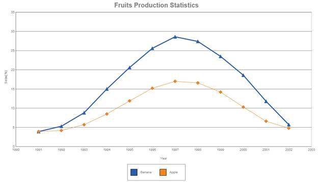

::: {style="DISPLAY: none"}
{#d2h_url_template}{#d2h_package_url style="WIDTH: 0px; DISPLAY: none; HEIGHT: 0px"}
:::

::::: {#nsbanner .d2h_main_nsbanner style="BORDER-BOTTOM: #999999 1px solid; POSITION: relative; PADDING-BOTTOM: 0px; BACKGROUND-COLOR: transparent; PADDING-LEFT: 0px; PADDING-RIGHT: 0px; DISPLAY: none; BORDER-TOP: #999999 1px solid; PADDING-TOP: 0px; LEFT: 0px"}
:::: {#TitleRow .d2h_main_titlerow style="PADDING-BOTTOM: 4px; BACKGROUND-COLOR: transparent; PADDING-LEFT: 22px; WIDTH: 100%; PADDING-RIGHT: 10px; DISPLAY: none; PADDING-TOP: 4px"}
::: {#ienav .d2h_main_ienav style="DISPLAY: none"}
{#D2HPrevious .D2HPreviousEnabled}  {#D2HNext .D2HNextEnabled}
:::
::::
:::::

:::::: {#nstext .d2h_main_nstext style="PADDING-BOTTOM: 10px; BACKGROUND-COLOR: transparent; PADDING-LEFT: 22px; PADDING-RIGHT: 10px; HEIGHT: 100%; OVERFLOW: auto; PADDING-TOP: 5px" hasuserbackground="true" valign="bottom"}
::: {#d2h_breadcrumbs .d2h_breadcrumbs}
[Essential Studio User Guide Documentation](ms-xhelp:///?Id=12457748-09e3-4d74-a240-8e049cedf030){.d2h_breadcrumbsNormal}[ \> ]{.d2h_breadcrumbsLinkSeparator}[User Interface Edition](ms-xhelp:///?Id=c29296b7-531c-413b-a0ec-488ca1f7f669){.d2h_breadcrumbsNormal}[ \> ]{.d2h_breadcrumbsLinkSeparator}[Essential ASP.NET](ms-xhelp:///?Id=25c35330-c127-4dad-9a92-ed79dc7261a6){.d2h_breadcrumbsNormal}[ \> ]{.d2h_breadcrumbsLinkSeparator}[Essential Chart in HTML 5]{.d2h_breadcrumbsContentsOnly}[ \> ]{.d2h_breadcrumbsLinkSeparator}[Concepts and Features](ms-xhelp:///?Id=895ee437-1738-49ea-b2a5-247d41ce7a5b){.d2h_breadcrumbsNormal}[ \> ]{.d2h_breadcrumbsLinkSeparator}[Chart Legend with Legend Items](ms-xhelp:///?Id=7bf84905-23d2-486d-a186-bb5afd98f1b5){.d2h_breadcrumbsNormal}
:::

### Chart Legend {#chart-legend style="tab-stops: 0pt"}

The legend is represented by the **ChartLegend** type.

**Default Legend**

By default, a custom **ChartLegend** instance is added to the legends list in the control. You can access this default legend.

**Legend Look and Feel**

The following table lists some common properties you could use to customize the overall legend appearance:

::: {align="center"}
+-----------------------+--------------------------------------------------------------------------------------------------------------------------+---------------+--------------------+-------------------------------------------------------+
| Chart Legend Property | Description                                                                                                              | Property Type | Value it Accepts   | Dependencies                                          |
+-----------------------+--------------------------------------------------------------------------------------------------------------------------+---------------+--------------------+-------------------------------------------------------+
| Visible               | Gets or sets if the legend is visible or not.                                                                            | bool          | True               | NA                                                    |
|                       |                                                                                                                          |               |                    |                                                       |
|                       |                                                                                                                          |               | False              |                                                       |
+-----------------------+--------------------------------------------------------------------------------------------------------------------------+---------------+--------------------+-------------------------------------------------------+
| ItemPadding           | Gets or sets the padding for every item in the legend.                                                                   | double        | Any double value   | Visible---Only applies if chart legend is visible     |
+-----------------------+--------------------------------------------------------------------------------------------------------------------------+---------------+--------------------+-------------------------------------------------------+
| TextColor             | Gets or sets the forecolor of the item                                                                                   | Color         | Color.AliceBlue    | Visible---Only applies if chart legend is visible     |
|                       |                                                                                                                          |               |                    |                                                       |
|                       |                                                                                                                          |               | Color.Black        |                                                       |
|                       |                                                                                                                          |               |                    |                                                       |
|                       |                                                                                                                          |               | Color.White        |                                                       |
|                       |                                                                                                                          |               |                    |                                                       |
|                       |                                                                                                                          |               | Color.YellowGreen  |                                                       |
+-----------------------+--------------------------------------------------------------------------------------------------------------------------+---------------+--------------------+-------------------------------------------------------+
| Shape                 | Gets or sets the shape of the legend.                                                                                    | LegendShape   | LegendShape.Circle | Visible---Only applies if the chart legend is visible |
|                       |                                                                                                                          |               |                    |                                                       |
|                       |                                                                                                                          |               | LegendShape.Cross  |                                                       |
|                       |                                                                                                                          |               |                    |                                                       |
|                       |                                                                                                                          |               | LegendShape.Wedge  |                                                       |
+-----------------------+--------------------------------------------------------------------------------------------------------------------------+---------------+--------------------+-------------------------------------------------------+
| ShapeSize             | Gets or sets the size of every legend item.                                                                              | Size          | SizeObject         | Visible---Only applies if chart legend is visible     |
+-----------------------+--------------------------------------------------------------------------------------------------------------------------+---------------+--------------------+-------------------------------------------------------+
| Style                 | Gets or sets the style of the legend item which includes the border, interior, line cap, line join, opacity, and shadow. | Style         | StyleObject        | Visible---Only applies if chart legend is visible     |
+-----------------------+--------------------------------------------------------------------------------------------------------------------------+---------------+--------------------+-------------------------------------------------------+
:::

[]{style="FONT-FAMILY: 'Times New Roman','serif'; FONT-SIZE: 12pt; FONT-WEIGHT: normal"} 

Legend Positioning

The legend positioning can be affected in the following ways:

::: {align="center"}
+-----------------+--------------------------------------------------------------------------------------------------------------------------+-----------------+------------------------+---------------------------------------------------+
| Chart Model     | Description                                                                                                              | Property Type   | Value it Accepts       | Dependencies                                      |
|                 |                                                                                                                          |                 |                        |                                                   |
| Property        |                                                                                                                          |                 |                        |                                                   |
+-----------------+--------------------------------------------------------------------------------------------------------------------------+-----------------+------------------------+---------------------------------------------------+
| LegendAlignment | Gets or sets the alignment of the legend in the chart.                                                                   | StringAlignment | StringAlignment.Far    | NA                                                |
|                 |                                                                                                                          |                 |                        |                                                   |
|                 |                                                                                                                          |                 | StringAlignment.Center |                                                   |
|                 |                                                                                                                          |                 |                        |                                                   |
|                 |                                                                                                                          |                 | StringAlignment.Near   |                                                   |
+-----------------+--------------------------------------------------------------------------------------------------------------------------+-----------------+------------------------+---------------------------------------------------+
| LegendPosition  | Gets or sets the padding for every item in the legend.                                                                   | double          | Any double value       | Visible---Only applies if chart legend is visible |
+-----------------+--------------------------------------------------------------------------------------------------------------------------+-----------------+------------------------+---------------------------------------------------+
| TextColor       | Gets or sets the forecolor of the item.                                                                                  | Color           | Color.AliceBlue        | Visible---Only applies if chart legend is visible |
|                 |                                                                                                                          |                 |                        |                                                   |
|                 |                                                                                                                          |                 | Color.Black            |                                                   |
|                 |                                                                                                                          |                 |                        |                                                   |
|                 |                                                                                                                          |                 | Color.White            |                                                   |
|                 |                                                                                                                          |                 |                        |                                                   |
|                 |                                                                                                                          |                 | Color.YellowGreen      |                                                   |
+-----------------+--------------------------------------------------------------------------------------------------------------------------+-----------------+------------------------+---------------------------------------------------+
| Shape           | Gets or sets the shape of the legend.                                                                                    | LegendShape     | LegendShape.Circle     | Visible---Only applies if chart legend is visible |
|                 |                                                                                                                          |                 |                        |                                                   |
|                 |                                                                                                                          |                 | LegendShape.Cross      |                                                   |
|                 |                                                                                                                          |                 |                        |                                                   |
|                 |                                                                                                                          |                 | LegendShape.Wedge      |                                                   |
+-----------------+--------------------------------------------------------------------------------------------------------------------------+-----------------+------------------------+---------------------------------------------------+
| ShapeSize       | Gets or sets the size of every legend item.                                                                              | Size            | SizeObject             | Visible---Only applies if chart legend is visible |
+-----------------+--------------------------------------------------------------------------------------------------------------------------+-----------------+------------------------+---------------------------------------------------+
| Style           | Gets or sets the style of the legend items which include the border, interior, line cap, line join, opacity, and shadow. | Style           | StyleObject            | Visible---Only applies if chart legend is visible |
+-----------------+--------------------------------------------------------------------------------------------------------------------------+-----------------+------------------------+---------------------------------------------------+
:::

 

Chart legends can be added to the chart using the following code.

 

+---------------------------------------------------------------------------------------------------------------------------------------------------------------------------------------------------+
| **[\[C#\]]{style="FONT-FAMILY: 'Courier New'"}[      ]{style="FONT-FAMILY: Consolas; FONT-SIZE: 9.5pt"}[]{style="FONT-FAMILY: 'Courier New'"}**                                                   |
|                                                                                                                                                                                                   |
| [this]{style="FONT-FAMILY: Consolas; COLOR: blue; FONT-SIZE: 9.5pt"}[.ChartAdv1.Legend.Visible = [true]{style="COLOR: blue"};]{style="FONT-FAMILY: Consolas; FONT-SIZE: 9.5pt"}                   |
|                                                                                                                                                                                                   |
| [this]{style="FONT-FAMILY: Consolas; COLOR: blue; FONT-SIZE: 9.5pt"}[.ChartAdv1.LegendPosition = [DockPosition]{style="COLOR: #2b91af"}.Bottom;]{style="FONT-FAMILY: Consolas; FONT-SIZE: 9.5pt"} |
|                                                                                                                                                                                                   |
| [ [this]{style="COLOR: blue"}.ChartAdv1.Legend.Shape = [LegendShape]{style="COLOR: #2b91af"}.Rectangle;]{style="FONT-FAMILY: Consolas; FONT-SIZE: 9.5pt"}                                         |
|                                                                                                                                                                                                   |
| []{style="FONT-FAMILY: Consolas; FONT-SIZE: 9.5pt"}                                                                                                                                               |
+---------------------------------------------------------------------------------------------------------------------------------------------------------------------------------------------------+

 

+-------------------------------------------------------------------------------------------------------------------------------------------------------------------------------------------------+
| **[\[VB\]]{style="FONT-FAMILY: 'Courier New'"}[      ]{style="FONT-FAMILY: Consolas; FONT-SIZE: 9.5pt"}[]{style="FONT-FAMILY: 'Courier New'"}**                                                 |
|                                                                                                                                                                                                 |
| [Me]{style="FONT-FAMILY: Consolas; COLOR: blue; FONT-SIZE: 9.5pt"}[.ChartAdv1.Legend.Visible = [True]{style="COLOR: blue"}]{style="FONT-FAMILY: Consolas; FONT-SIZE: 9.5pt"}                    |
|                                                                                                                                                                                                 |
| [Me]{style="FONT-FAMILY: Consolas; COLOR: blue; FONT-SIZE: 9.5pt"}[.ChartAdv1.Legend.Shape = [LegendShape]{style="COLOR: #2b91af"}.Rectangle]{style="FONT-FAMILY: Consolas; FONT-SIZE: 9.5pt"}  |
|                                                                                                                                                                                                 |
| [Me]{style="FONT-FAMILY: Consolas; COLOR: blue; FONT-SIZE: 9.5pt"}[.ChartAdv1.LegendPosition = [DockPosition]{style="COLOR: #2b91af"}.Bottom ]{style="FONT-FAMILY: Consolas; FONT-SIZE: 9.5pt"} |
|                                                                                                                                                                                                 |
| []{style="FONT-FAMILY: Consolas; FONT-SIZE: 9.5pt"}                                                                                                                                             |
+-------------------------------------------------------------------------------------------------------------------------------------------------------------------------------------------------+

 

 

{border="0"}

 

Figure 19: Chart Legend

[]{#related-topics}
::::::
