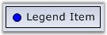
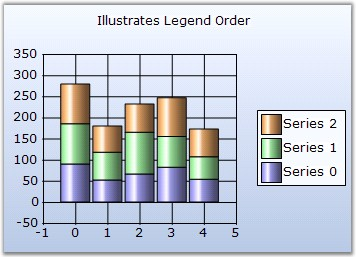
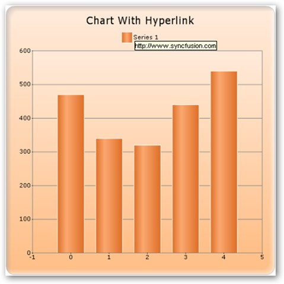
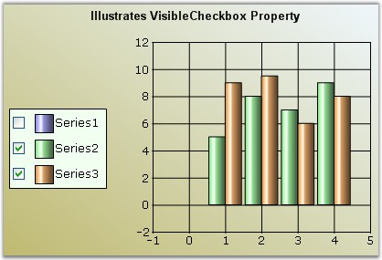
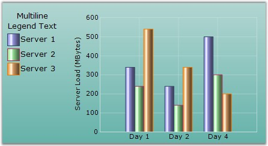

::: {style="DISPLAY: none"}
{#d2h_url_template}{#d2h_package_url style="WIDTH: 0px; DISPLAY: none; HEIGHT: 0px"}
:::

::::: {#nsbanner .d2h_main_nsbanner style="BORDER-BOTTOM: #999999 1px solid; POSITION: relative; PADDING-BOTTOM: 0px; BACKGROUND-COLOR: transparent; PADDING-LEFT: 0px; PADDING-RIGHT: 0px; DISPLAY: none; BORDER-TOP: #999999 1px solid; PADDING-TOP: 0px; LEFT: 0px"}
:::: {#TitleRow .d2h_main_titlerow style="PADDING-BOTTOM: 4px; BACKGROUND-COLOR: transparent; PADDING-LEFT: 22px; WIDTH: 100%; PADDING-RIGHT: 10px; DISPLAY: none; PADDING-TOP: 4px"}
::: {#ienav .d2h_main_ienav style="DISPLAY: none"}
{#D2HPrevious .D2HPreviousEnabled}  {#D2HNext .D2HNextEnabled}
:::
::::
:::::

::::::::: {#nstext .d2h_main_nstext style="PADDING-BOTTOM: 10px; BACKGROUND-COLOR: transparent; PADDING-LEFT: 22px; PADDING-RIGHT: 10px; HEIGHT: 100%; OVERFLOW: auto; PADDING-TOP: 5px" hasuserbackground="true" valign="bottom"}
::: {#d2h_breadcrumbs .d2h_breadcrumbs}
[Essential Studio User Guide Documentation](ms-xhelp:///?Id=12457748-09e3-4d74-a240-8e049cedf030){.d2h_breadcrumbsNormal}[ \> ]{.d2h_breadcrumbsLinkSeparator}[User Interface Edition](ms-xhelp:///?Id=c29296b7-531c-413b-a0ec-488ca1f7f669){.d2h_breadcrumbsNormal}[ \> ]{.d2h_breadcrumbsLinkSeparator}[Essential ASP.NET](ms-xhelp:///?Id=25c35330-c127-4dad-9a92-ed79dc7261a6){.d2h_breadcrumbsNormal}[ \> ]{.d2h_breadcrumbsLinkSeparator}[Essential Chart]{.d2h_breadcrumbsContentsOnly}[ \> ]{.d2h_breadcrumbsLinkSeparator}[Concepts and Features](ms-xhelp:///?Id=100687ce-82f2-4424-9d16-0949ea76cf15){.d2h_breadcrumbsNormal}[ \> ]{.d2h_breadcrumbsLinkSeparator}[Chart Legend and Legend Items](ms-xhelp:///?Id=5063ada2-ebde-4a71-bfe0-9ae66155b1a7){.d2h_breadcrumbsNormal}
:::

### ChartLegendItem {#chartlegenditem style="tab-stops: 0pt"}

**[]{style="FONT-FAMILY: 'Trebuchet MS','sans-serif'; FONT-SIZE: 9pt"}** 

[]{style="FONT-FAMILY: 'Trebuchet MS','sans-serif'; FONT-SIZE: 9pt"} 

The legend item is represented by the ChartLegendItem type.

[]{style="FONT-FAMILY: 'Trebuchet MS','sans-serif'; FONT-SIZE: 9pt"} 

Default Series LegendItems

**[]{style="FONT-FAMILY: 'Trebuchet MS','sans-serif'"}** 

Every ChartSeries in the chart control has a ChartLegendItem associated with it. This legend item gets automatically added to the default ChartLegend.

 

But, if you want to get that associated with a custom ChartLegend, use the LegendName to specify that chart legend as follows:

[]{style="FONT-FAMILY: 'Trebuchet MS','sans-serif'; FONT-SIZE: 9pt"} 

+--------------------------------------------------------------------------------------------------------------------------------------------------------+
| **[\[C#\]]{style="FONT-FAMILY: 'Courier New'; COLOR: black"}**                                                                                         |
|                                                                                                                                                        |
| **[]{style="FONT-FAMILY: 'Courier New'; COLOR: black"}**                                                                                               |
|                                                                                                                                                        |
| [// Specifies the custom ChartLegend with which this series\' legend item should be associated with]{style="FONT-FAMILY: 'Courier New'; COLOR: green"} |
|                                                                                                                                                        |
| [series1.LegendName = [\"MyLegend\"]{style="COLOR: maroon"};]{style="FONT-FAMILY: 'Courier New'"}                                                      |
+--------------------------------------------------------------------------------------------------------------------------------------------------------+

[]{style="FONT-FAMILY: 'Trebuchet MS','sans-serif'; FONT-SIZE: 9pt"} 

+--------------------------------------------------------------------------------------------------------------------------------------------------------+
| **[\[VB.NET\]]{style="FONT-FAMILY: 'Courier New'; COLOR: black"}**                                                                                     |
|                                                                                                                                                        |
| **[]{style="FONT-FAMILY: 'Courier New'; COLOR: black"}**                                                                                               |
|                                                                                                                                                        |
| [\' Specifies the custom ChartLegend with which this series\' legend item should be associated with]{style="FONT-FAMILY: 'Courier New'; COLOR: green"} |
|                                                                                                                                                        |
| [series1.LegendName = [\"MyLegend\"]{style="COLOR: maroon"}]{style="FONT-FAMILY: 'Courier New'"}                                                       |
+--------------------------------------------------------------------------------------------------------------------------------------------------------+

**[]{style="FONT-FAMILY: 'Trebuchet MS','sans-serif'"}** 

Adding Custom Legend Items

**[]{style="FONT-FAMILY: 'Trebuchet MS','sans-serif'"}** 

To add your own custom legend items to a legend, use the **CustomItems** property in the ChartLegend as follows.

[]{style="FONT-FAMILY: 'Trebuchet MS','sans-serif'; FONT-SIZE: 9pt"} 

+---------------------------------------------------------------------------------------------------------------------------------------------------------------------------------------------------------------------------------------------------------+
| **[\[C#\]]{style="FONT-FAMILY: 'Courier New'; COLOR: black"}**                                                                                                                                                                                          |
|                                                                                                                                                                                                                                                         |
| **[]{style="FONT-FAMILY: 'Courier New'; COLOR: black"}**                                                                                                                                                                                                |
|                                                                                                                                                                                                                                                         |
| [// Adding some custom items into the 2nd custom Legend]{style="FONT-FAMILY: 'Courier New'; COLOR: green"}                                                                                                                                              |
|                                                                                                                                                                                                                                                         |
| []{style="FONT-FAMILY: 'Courier New'; COLOR: green"}                                                                                                                                                                                                    |
|                                                                                                                                                                                                                                                         |
| [ChartLegendItem]{style="FONT-FAMILY: 'Courier New'; COLOR: teal"}[ legendItem1 = [new]{style="COLOR: blue"} [ChartLegendItem]{style="COLOR: teal"}();]{style="FONT-FAMILY: 'Courier New'"}                                                             |
|                                                                                                                                                                                                                                                         |
| [legendItem1.ItemStyle.ShowSymbol = [true]{style="COLOR: blue"};]{style="FONT-FAMILY: 'Courier New'"}                                                                                                                                                   |
|                                                                                                                                                                                                                                                         |
| [legendItem1.ItemStyle.Symbol.Shape = [ChartSymbolShape]{style="COLOR: teal"}.Circle;]{style="FONT-FAMILY: 'Courier New'"}                                                                                                                              |
|                                                                                                                                                                                                                                                         |
| [legendItem1.ItemStyle.Symbol.Color = [Color]{style="COLOR: teal"}.Blue;]{style="FONT-FAMILY: 'Courier New'"}                                                                                                                                           |
|                                                                                                                                                                                                                                                         |
| [legendItem1.Text = [\"Legend Item\"]{style="COLOR: maroon"};]{style="FONT-FAMILY: 'Courier New'"}                                                                                                                                                      |
|                                                                                                                                                                                                                                                         |
| []{style="FONT-FAMILY: 'Courier New'"}                                                                                                                                                                                                                  |
|                                                                                                                                                                                                                                                         |
| [this]{style="FONT-FAMILY: 'Courier New'; COLOR: blue"}[.[ChartWebControl1]{style="COLOR: black"}.Legends\[1\].CustomItems = [new]{style="COLOR: blue"} [ChartLegendItem]{style="COLOR: teal"}\[\] { legendItem1};]{style="FONT-FAMILY: 'Courier New'"} |
+---------------------------------------------------------------------------------------------------------------------------------------------------------------------------------------------------------------------------------------------------------+

[]{style="FONT-FAMILY: 'Trebuchet MS','sans-serif'; FONT-SIZE: 9pt"} 

+----------------------------------------------------------------------------------------------------------------------------------------------------------------------------------------------------------------------------+
| **[\[VB.NET\]]{style="FONT-FAMILY: 'Courier New'; COLOR: black"}**                                                                                                                                                         |
|                                                                                                                                                                                                                            |
| **[]{style="FONT-FAMILY: 'Courier New'; COLOR: black"}**                                                                                                                                                                   |
|                                                                                                                                                                                                                            |
| [\'Adding some custom items into the 2nd custom Legend]{style="FONT-FAMILY: 'Courier New'; COLOR: green"}                                                                                                                  |
|                                                                                                                                                                                                                            |
| []{style="FONT-FAMILY: 'Courier New'; COLOR: green"}                                                                                                                                                                       |
|                                                                                                                                                                                                                            |
| [Dim]{style="FONT-FAMILY: 'Courier New'; COLOR: blue"}[ legendItem1 [As]{style="COLOR: blue"} [New]{style="COLOR: blue"} ChartLegendItem()]{style="FONT-FAMILY: 'Courier New'"}                                            |
|                                                                                                                                                                                                                            |
| [legendItem1.ItemStyle.ShowSymbol = [True]{style="COLOR: blue"}]{style="FONT-FAMILY: 'Courier New'"}                                                                                                                       |
|                                                                                                                                                                                                                            |
| [legendItem1.ItemStyle.Symbol.Shape = ChartSymbolShape.Circle]{style="FONT-FAMILY: 'Courier New'"}                                                                                                                         |
|                                                                                                                                                                                                                            |
| [legendItem1.ItemStyle.Symbol.Color = Color.Blue]{style="FONT-FAMILY: 'Courier New'"}                                                                                                                                      |
|                                                                                                                                                                                                                            |
| [legendItem1.Text = [\"Legend Item\"]{style="COLOR: maroon"}]{style="FONT-FAMILY: 'Courier New'"}                                                                                                                          |
|                                                                                                                                                                                                                            |
| []{style="FONT-FAMILY: 'Courier New'; COLOR: maroon"}                                                                                                                                                                      |
|                                                                                                                                                                                                                            |
| [\'Adding the custom Legend item to the chart]{style="FONT-FAMILY: 'Courier New'; COLOR: green"}                                                                                                                           |
|                                                                                                                                                                                                                            |
| [Me]{style="FONT-FAMILY: 'Courier New'; COLOR: blue"}[.[ChartWebControl1]{style="COLOR: black"}.Legends\[1\].CustomItems = [New]{style="COLOR: blue"} ChartLegendItem() {legendItem1}]{style="FONT-FAMILY: 'Courier New'"} |
+----------------------------------------------------------------------------------------------------------------------------------------------------------------------------------------------------------------------------+

[]{style="FONT-FAMILY: 'Trebuchet MS','sans-serif'; FONT-SIZE: 9pt"} 

{border="0"}

**[]{style="FONT-FAMILY: 'Trebuchet MS','sans-serif'; FONT-SIZE: 9pt"}** 

Figure 272: Custom Legend Item

**[]{style="FONT-FAMILY: 'Trebuchet MS','sans-serif'"}** 

Customizing items through event

**[]{style="FONT-FAMILY: 'Trebuchet MS','sans-serif'"}** 

There is also a way to specify custom legend item via events right before they get rendered.

In this example, we reverse the order in which the legend items are rendered through the **FilterItems** event.

[]{style="FONT-FAMILY: 'Trebuchet MS','sans-serif'; FONT-SIZE: 9pt"} 

+-------------------------------------------------------------------------------------------------------------------------------------------------------------------------------------------------------------------------------------------------+
| **[\[C#\]]{style="FONT-FAMILY: 'Courier New'; COLOR: black"}**                                                                                                                                                                                  |
|                                                                                                                                                                                                                                                 |
| **[]{style="FONT-FAMILY: 'Courier New'; COLOR: black"}**                                                                                                                                                                                        |
|                                                                                                                                                                                                                                                 |
| [private]{style="FONT-FAMILY: 'Courier New'; COLOR: blue"}[ [void]{style="COLOR: blue"} Legend_FilterItems([object]{style="COLOR: blue"} sender, [ChartLegendFilterItemsEventArgs]{style="COLOR: teal"} e)]{style="FONT-FAMILY: 'Courier New'"} |
|                                                                                                                                                                                                                                                 |
| [{]{style="FONT-FAMILY: 'Courier New'"}                                                                                                                                                                                                         |
|                                                                                                                                                                                                                                                 |
| [    [//This creates an new instance of the ChartLegendItemCollection]{style="COLOR: green"}]{style="FONT-FAMILY: 'Courier New'"}                                                                                                               |
|                                                                                                                                                                                                                                                 |
| [    [ChartLegendItemsCollection]{style="COLOR: teal"} items = [new]{style="COLOR: blue"} [ChartLegendItemsCollection]{style="COLOR: teal"}();]{style="FONT-FAMILY: 'Courier New'"}                                                             |
|                                                                                                                                                                                                                                                 |
| [    [for]{style="COLOR: blue"} ([int]{style="COLOR: blue"} i = e.Items.Count - 1; i \>= 0; i\--)]{style="FONT-FAMILY: 'Courier New'"}                                                                                                          |
|                                                                                                                                                                                                                                                 |
| [        items.Add(e.Items\[i\]);]{style="FONT-FAMILY: 'Courier New'"}                                                                                                                                                                          |
|                                                                                                                                                                                                                                                 |
| [    e.Items = items;]{style="FONT-FAMILY: 'Courier New'"}                                                                                                                                                                                      |
|                                                                                                                                                                                                                                                 |
| [}]{style="FONT-FAMILY: 'Courier New'"}                                                                                                                                                                                                         |
+-------------------------------------------------------------------------------------------------------------------------------------------------------------------------------------------------------------------------------------------------+

[]{style="FONT-FAMILY: 'Trebuchet MS','sans-serif'; FONT-SIZE: 9pt"} 

+----------------------------------------------------------------------------------------------------------------------------------------------------------------------------------------------------------------------------------------------------------------------------------------------------------------------------------------------------------------------------------------------------------------------------------------------------------------------------------------------------------------------------------------------------------------------------------------------------------------------------------------+
| **[\[VB.NET\]]{style="FONT-FAMILY: 'Courier New'; COLOR: black"}**                                                                                                                                                                                                                                                                                                                                                                                                                                                                                                                                                                     |
|                                                                                                                                                                                                                                                                                                                                                                                                                                                                                                                                                                                                                                        |
| **[]{style="FONT-FAMILY: 'Courier New'; COLOR: black"}**                                                                                                                                                                                                                                                                                                                                                                                                                                                                                                                                                                               |
|                                                                                                                                                                                                                                                                                                                                                                                                                                                                                                                                                                                                                                        |
| [Private Sub]{style="FONT-FAMILY: 'Courier New'; COLOR: blue"}[ Legend_FilterItems(]{style="FONT-FAMILY: 'Courier New'; COLOR: black"}[ByVal]{style="FONT-FAMILY: 'Courier New'; COLOR: blue"}[ sender ]{style="FONT-FAMILY: 'Courier New'; COLOR: black"}[As]{style="FONT-FAMILY: 'Courier New'; COLOR: blue"}[ Object, ]{style="FONT-FAMILY: 'Courier New'; COLOR: black"}[ByVal]{style="FONT-FAMILY: 'Courier New'; COLOR: blue"}[ e ]{style="FONT-FAMILY: 'Courier New'; COLOR: black"}[As]{style="FONT-FAMILY: 'Courier New'; COLOR: blue"}[ ChartLegendFilterItemsEventArgs) ]{style="FONT-FAMILY: 'Courier New'; COLOR: black"} |
|                                                                                                                                                                                                                                                                                                                                                                                                                                                                                                                                                                                                                                        |
| [    \'This creates an new instance of the ChartLegendItemCollection ]{style="FONT-FAMILY: 'Courier New'; COLOR: green"}                                                                                                                                                                                                                                                                                                                                                                                                                                                                                                               |
|                                                                                                                                                                                                                                                                                                                                                                                                                                                                                                                                                                                                                                        |
| [    ]{style="FONT-FAMILY: 'Courier New'; COLOR: black"}[Dim]{style="FONT-FAMILY: 'Courier New'; COLOR: blue"}[ item ]{style="FONT-FAMILY: 'Courier New'; COLOR: black"}[As New]{style="FONT-FAMILY: 'Courier New'; COLOR: blue"}[ ChartLegendItemsCollection() ]{style="FONT-FAMILY: 'Courier New'; COLOR: black"}                                                                                                                                                                                                                                                                                                                    |
|                                                                                                                                                                                                                                                                                                                                                                                                                                                                                                                                                                                                                                        |
| [    ]{style="FONT-FAMILY: 'Courier New'; COLOR: black"}[For]{style="FONT-FAMILY: 'Courier New'; COLOR: blue"}[ i ]{style="FONT-FAMILY: 'Courier New'; COLOR: black"}[As]{style="FONT-FAMILY: 'Courier New'; COLOR: blue"}[ Integer = e.Items.Count - 1 To 0 Step -1 ]{style="FONT-FAMILY: 'Courier New'; COLOR: black"}                                                                                                                                                                                                                                                                                                               |
|                                                                                                                                                                                                                                                                                                                                                                                                                                                                                                                                                                                                                                        |
| [        item.Add(e.Items(i)) ]{style="FONT-FAMILY: 'Courier New'; COLOR: black"}                                                                                                                                                                                                                                                                                                                                                                                                                                                                                                                                                      |
|                                                                                                                                                                                                                                                                                                                                                                                                                                                                                                                                                                                                                                        |
| [    ]{style="FONT-FAMILY: 'Courier New'; COLOR: black"}[Next]{style="FONT-FAMILY: 'Courier New'; COLOR: blue"}[ ]{style="FONT-FAMILY: 'Courier New'; COLOR: black"}                                                                                                                                                                                                                                                                                                                                                                                                                                                                   |
|                                                                                                                                                                                                                                                                                                                                                                                                                                                                                                                                                                                                                                        |
| [    e.Items = item ]{style="FONT-FAMILY: 'Courier New'; COLOR: black"}                                                                                                                                                                                                                                                                                                                                                                                                                                                                                                                                                                |
|                                                                                                                                                                                                                                                                                                                                                                                                                                                                                                                                                                                                                                        |
| [End Sub ]{style="FONT-FAMILY: 'Courier New'; COLOR: blue"}                                                                                                                                                                                                                                                                                                                                                                                                                                                                                                                                                                            |
+----------------------------------------------------------------------------------------------------------------------------------------------------------------------------------------------------------------------------------------------------------------------------------------------------------------------------------------------------------------------------------------------------------------------------------------------------------------------------------------------------------------------------------------------------------------------------------------------------------------------------------------+

[]{style="COLOR: red; FONT-SIZE: 8pt"} 

{border="0"}

**[]{style="FONT-FAMILY: 'Trebuchet MS','sans-serif'"}** 

Figure 273: Chart with Legends in specified order using FilterItems Event

***[]{style="FONT-FAMILY: 'Trebuchet MS','sans-serif'; FONT-SIZE: 9pt"}*** 

Hyperlink for Legend Item

**[]{style="FONT-FAMILY: 'Trebuchet MS','sans-serif'; FONT-SIZE: 9pt"}** 

Specify hyperlink for each legend items in a legend, by using the following code.

[]{style="FONT-FAMILY: 'Calibri','sans-serif'; FONT-SIZE: 12pt"} 

+----------------------------------------------------------------------------------------------------------------------------------------------------------------------------------------------------+
| **[\[CS\]]{style="FONT-FAMILY: 'Times New Roman','serif'"}**                                                                                                                                       |
|                                                                                                                                                                                                    |
| **[]{style="FONT-FAMILY: 'Times New Roman','serif'"}**                                                                                                                                             |
|                                                                                                                                                                                                    |
| [this]{style="FONT-FAMILY: 'Courier New'; COLOR: blue"}[.ChartWebControl1.EnableUrl = [true]{style="COLOR: blue"};]{style="FONT-FAMILY: 'Courier New'"}                                            |
|                                                                                                                                                                                                    |
| [this]{style="FONT-FAMILY: 'Courier New'; COLOR: blue"}[.ChartWebControl1.CalcRegions = [true]{style="COLOR: blue"};]{style="FONT-FAMILY: 'Courier New'"}                                          |
|                                                                                                                                                                                                    |
| [this]{style="FONT-FAMILY: 'Courier New'; COLOR: blue"}[.ChartWebControl1.Legend.Items\[0\].ItemStyle.Url = [\"www.syncfusion.com\"]{style="COLOR: #a31515"};]{style="FONT-FAMILY: 'Courier New'"} |
+----------------------------------------------------------------------------------------------------------------------------------------------------------------------------------------------------+

[]{style="FONT-FAMILY: 'Calibri','sans-serif'; FONT-SIZE: 12pt"} 

[]{style="FONT-FAMILY: 'Calibri','sans-serif'; FONT-SIZE: 12pt"} 

+---------------------------------------------------------------------------------------------------------------------------------------------------------------------+
| **[\[VB\]]{style="FONT-FAMILY: 'Times New Roman','serif'"}**                                                                                                        |
|                                                                                                                                                                     |
| **[]{style="FONT-FAMILY: 'Times New Roman','serif'"}**                                                                                                              |
|                                                                                                                                                                     |
| [Me]{style="FONT-FAMILY: 'Courier New'; COLOR: blue"}[.ChartWebControl1.EnableUrl = [True]{style="COLOR: blue"}]{style="FONT-FAMILY: 'Courier New'"}                |
|                                                                                                                                                                     |
| [Me]{style="FONT-FAMILY: 'Courier New'; COLOR: blue"}[.ChartWebControl1.CalcRegions = [True]{style="COLOR: blue"}]{style="FONT-FAMILY: 'Courier New'"}              |
|                                                                                                                                                                     |
| [Me]{style="FONT-FAMILY: 'Courier New'; COLOR: blue"}[.ChartWebControl1.Legend.Items(0).ItemStyle.Url = \"www.syncfusion.com\"]{style="FONT-FAMILY: 'Courier New'"} |
+---------------------------------------------------------------------------------------------------------------------------------------------------------------------+

**[]{style="FONT-FAMILY: 'Trebuchet MS','sans-serif'"}** 

**[]{style="FONT-FAMILY: 'Trebuchet MS','sans-serif'"}** 

{border="0"}

 

Figure 274: Hyperlink Support for the Legend Item

::: {style="BORDER-BOTTOM: windowtext 1pt solid; BORDER-LEFT: medium none; PADDING-BOTTOM: 1pt; MARGIN-TOP: 9pt; PADDING-LEFT: 0pt; PADDING-RIGHT: 0pt; MARGIN-BOTTOM: 9pt; BORDER-TOP: windowtext 1pt solid; BORDER-RIGHT: medium none; PADDING-TOP: 1pt"}
{border="0"}Note: this URL Property supports only for chart web.
:::

**[]{style="FONT-FAMILY: 'Trebuchet MS','sans-serif'"}** 

Legend Item\'s Look and Feel

**[]{style="FONT-FAMILY: 'Trebuchet MS','sans-serif'"}** 

The legend item\'s look and feel can be customized to a good extent using the following properties in ChartLegend**.**

 

These settings affect all the items in the legend.

**[]{style="FONT-FAMILY: 'Trebuchet MS','sans-serif'"}** 

::: {align="center"}
+-----------------------------------+--------------------------------------------------------------------------------------------------------------------------------------------------------------------------------------------------------------+
| Chart Legend Properties           | Description                                                                                                                                                                                                  |
+-----------------------------------+--------------------------------------------------------------------------------------------------------------------------------------------------------------------------------------------------------------+
| RowCount                          | Specifies the number of rows to be used in the legend.                                                                                                                                                       |
+-----------------------------------+--------------------------------------------------------------------------------------------------------------------------------------------------------------------------------------------------------------+
| ColumnCount                       | Specifies the number of columns to be used in the legend.                                                                                                                                                    |
+-----------------------------------+--------------------------------------------------------------------------------------------------------------------------------------------------------------------------------------------------------------+
| ItemsAlignment                    | Specifies the horizontal alignment of the items within the legend. Possible values:                                                                                                                          |
|                                   |                                                                                                                                                                                                              |
|                                   | Near - **Default value**                                                                                                                                                                                     |
|                                   |                                                                                                                                                                                                              |
|                                   | Center                                                                                                                                                                                                       |
|                                   |                                                                                                                                                                                                              |
|                                   | Far                                                                                                                                                                                                          |
+-----------------------------------+--------------------------------------------------------------------------------------------------------------------------------------------------------------------------------------------------------------+
| ShowItemsShadow                   | Will render a shadow around the item image and text using the ItemsShadowColor. Default is **false**.                                                                                                        |
+-----------------------------------+--------------------------------------------------------------------------------------------------------------------------------------------------------------------------------------------------------------+
| ItemsShadowColor                  | Specifies the color of the shadow to use. **ShowItemsShadow** should be set to **true**. Default is **Gray**.                                                                                                |
+-----------------------------------+--------------------------------------------------------------------------------------------------------------------------------------------------------------------------------------------------------------+
| ItemsShadowOffset                 | Specifies the breadth of the shadow. Default is **{2, 2}**.                                                                                                                                                  |
+-----------------------------------+--------------------------------------------------------------------------------------------------------------------------------------------------------------------------------------------------------------+
| ItemsSize                         | Specifies the size of the legend item rectangle. If the specified size is smaller than necessary to render the text, then it\'s ignored.                                                                     |
+-----------------------------------+--------------------------------------------------------------------------------------------------------------------------------------------------------------------------------------------------------------+
| ItemsTextAlignment                | Specifies the vertical alignment of the legend item text within the item bounds. Possible Values:                                                                                                            |
|                                   |                                                                                                                                                                                                              |
|                                   | Bottom                                                                                                                                                                                                       |
|                                   |                                                                                                                                                                                                              |
|                                   | Center - **Default value**                                                                                                                                                                                   |
|                                   |                                                                                                                                                                                                              |
|                                   | Top                                                                                                                                                                                                          |
+-----------------------------------+--------------------------------------------------------------------------------------------------------------------------------------------------------------------------------------------------------------+
| Spacing                           | Specifies the space between the legend borders and the legend items. Default is **4**.                                                                                                                       |
+-----------------------------------+--------------------------------------------------------------------------------------------------------------------------------------------------------------------------------------------------------------+
| Text                              | Specifies the title text for the legend. You can set multiline text for the legend; Enter the text in the combobox and press ENTER key to begin a new line and CTRL+ENTER to set the entered multiline text. |
+-----------------------------------+--------------------------------------------------------------------------------------------------------------------------------------------------------------------------------------------------------------+
| TextColor                         | Specifies the color of the title text.                                                                                                                                                                       |
+-----------------------------------+--------------------------------------------------------------------------------------------------------------------------------------------------------------------------------------------------------------+
| TextAlignment                     | Specifies the horizontal alignment of the title text. Possible Values:                                                                                                                                       |
|                                   |                                                                                                                                                                                                              |
|                                   | Center (**Default value**)                                                                                                                                                                                   |
|                                   |                                                                                                                                                                                                              |
|                                   | Far                                                                                                                                                                                                          |
|                                   |                                                                                                                                                                                                              |
|                                   | Near                                                                                                                                                                                                         |
+-----------------------------------+--------------------------------------------------------------------------------------------------------------------------------------------------------------------------------------------------------------+
:::

**[]{style="FONT-FAMILY: 'Trebuchet MS','sans-serif'; FONT-SIZE: 9pt"}** 

**[]{style="FONT-FAMILY: 'Trebuchet MS','sans-serif'; FONT-SIZE: 9pt"}** 

::: {align="center"}
  --------------------- --------------------------------------------------------------------------------------------------------------------------------------------------------
  Chart Legend Events   Description
  MinSize               Lets you specify a minimum rectangular size for the legend item.
  DrawItem              Handle this event to customize the rendering of the legend.
  FilterItems           Handle this event to dynamically provide a list of legend items during runtime. For more details, see [Customizing items through event]{.UGHyperlink}.
  --------------------- --------------------------------------------------------------------------------------------------------------------------------------------------------
:::

[]{style="FONT-FAMILY: 'Trebuchet MS','sans-serif'; FONT-SIZE: 9pt"} 

[]{style="FONT-FAMILY: 'Trebuchet MS','sans-serif'; FONT-SIZE: 9pt"} 

::: {align="center"}
  ---------------------- ----------------------------------------------------
  Chart Legend Methods   Description
  GetItemBy              Gets the legend item at the specified coordinates.
  ---------------------- ----------------------------------------------------
:::

[]{style="FONT-FAMILY: 'Trebuchet MS','sans-serif'; FONT-SIZE: 9pt"} 

[]{style="FONT-FAMILY: 'Trebuchet MS','sans-serif'; FONT-SIZE: 9pt"} 

You can also reference specific legend items and apply settings on them individually:

[]{style="FONT-FAMILY: 'Trebuchet MS','sans-serif'; FONT-SIZE: 9pt"} 

[]{style="FONT-FAMILY: 'Trebuchet MS','sans-serif'; FONT-SIZE: 9pt"} 

::: {align="center"}
+-----------------------------------+------------------------------------------------------------------------------------------------------------------------------------------------------------------+
|                                   |                                                                                                                                                                  |
|                                   |                                                                                                                                                                  |
| Legend Item Properties            | Description                                                                                                                                                      |
+-----------------------------------+------------------------------------------------------------------------------------------------------------------------------------------------------------------+
| BorderColor                       | Specifies the color of the border around the legend shape.                                                                                                       |
+-----------------------------------+------------------------------------------------------------------------------------------------------------------------------------------------------------------+
| Font                              | Specifies the font for the text in this legend item.                                                                                                             |
+-----------------------------------+------------------------------------------------------------------------------------------------------------------------------------------------------------------+
| Spacing                           | Specifies the space between this item and it\'s adjacent items. Default is **20**.                                                                               |
+-----------------------------------+------------------------------------------------------------------------------------------------------------------------------------------------------------------+
| Text                              | Specifies the text of the legend item. By default this will reflect the corresponding series name.                                                               |
+-----------------------------------+------------------------------------------------------------------------------------------------------------------------------------------------------------------+
| TextColor                         | Specifies the text color for this item.                                                                                                                          |
+-----------------------------------+------------------------------------------------------------------------------------------------------------------------------------------------------------------+
| IconAlignment                     | Specifies how the icon should be aligned within the item rectangle.                                                                                              |
+-----------------------------------+------------------------------------------------------------------------------------------------------------------------------------------------------------------+
| TextAlignment                     | Specifies how the text should be aligned within the item rectangle.                                                                                              |
+-----------------------------------+------------------------------------------------------------------------------------------------------------------------------------------------------------------+
| VisibleCheckBox                   | If this property is set to **true**, a checkbox will be shown beside the legend item through which the user can show/hide the corresponding series in the chart. |
+-----------------------------------+------------------------------------------------------------------------------------------------------------------------------------------------------------------+
| ShowShadow                        | Will render a shadow around the item image and text using the ItemsShadowColor.                                                                                  |
+-----------------------------------+------------------------------------------------------------------------------------------------------------------------------------------------------------------+
| ShadowOffset                      | Specifies the breadth of the shadow.                                                                                                                             |
+-----------------------------------+------------------------------------------------------------------------------------------------------------------------------------------------------------------+
| ShadowColor                       | Specifies the color of the shadow to use. ShowItemsShadow should be set to **true**. Default is **Gray**.                                                        |
+-----------------------------------+------------------------------------------------------------------------------------------------------------------------------------------------------------------+
| Children                          | Returns the child collection of the LegendItem.                                                                                                                  |
+-----------------------------------+------------------------------------------------------------------------------------------------------------------------------------------------------------------+
| IsChecked                         | Gets / sets the checkstate of the ChartLegendItem checkbox. By default it is set to **true**.                                                                    |
+-----------------------------------+------------------------------------------------------------------------------------------------------------------------------------------------------------------+
| Visible                           | Lets you show / hide the legend item.                                                                                                                            |
+-----------------------------------+------------------------------------------------------------------------------------------------------------------------------------------------------------------+
:::

[]{style="FONT-FAMILY: 'Trebuchet MS','sans-serif'; FONT-SIZE: 9pt"} 

{border="0"}

[]{style="FONT-FAMILY: 'Trebuchet MS','sans-serif'; FONT-SIZE: 9pt"} 

Figure 275: Chart with \"Series1\" Legend Item Unchecked

**[]{style="FONT-FAMILY: 'Trebuchet MS','sans-serif'; FONT-SIZE: 9pt"}** 

{border="0"}

[]{style="FONT-FAMILY: 'Trebuchet MS','sans-serif'; FONT-SIZE: 9pt"} 

Figure 276: Chart with multiline Legend title \'Multiline Legend Text\'

[]{style="FONT-FAMILY: 'Trebuchet MS','sans-serif'; FONT-SIZE: 9pt"} 

A sample which demonstrates the legend features is available in the following sample installation path.

 

\<Install Location\>\\Syncfusion\\EssentialStudio\\\<***Version Number***\>\\Web\\chart.web\\Samples\\3.5\\Chart Title and Legends\\ChartLegendCustomization

[]{style="FONT-FAMILY: 'Trebuchet MS','sans-serif'; FONT-SIZE: 9pt"} 

See Also

**[]{style="FONT-FAMILY: 'Trebuchet MS','sans-serif'; FONT-SIZE: 9pt"}** 

[ChartLegend]{.UGHyperlink}[, ]{.UGHyperlink}[Customizing LegendItem Image]{.UGHyperlink}[]{.UGHyperlink}

[]{#p197} 

[]{#related-topics}
:::::::::
