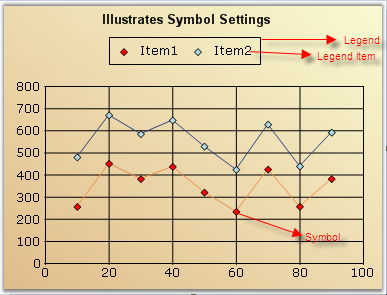

::: {style="DISPLAY: none"}
{#d2h_url_template}{#d2h_package_url style="WIDTH: 0px; DISPLAY: none; HEIGHT: 0px"}
:::

::::: {#nsbanner .d2h_main_nsbanner style="BORDER-BOTTOM: #999999 1px solid; POSITION: relative; PADDING-BOTTOM: 0px; BACKGROUND-COLOR: transparent; PADDING-LEFT: 0px; PADDING-RIGHT: 0px; DISPLAY: none; BORDER-TOP: #999999 1px solid; PADDING-TOP: 0px; LEFT: 0px"}
:::: {#TitleRow .d2h_main_titlerow style="PADDING-BOTTOM: 4px; BACKGROUND-COLOR: transparent; PADDING-LEFT: 22px; WIDTH: 100%; PADDING-RIGHT: 10px; DISPLAY: none; PADDING-TOP: 4px"}
::: {#ienav .d2h_main_ienav style="DISPLAY: none"}
{#D2HPrevious .D2HPreviousEnabled}  {#D2HNext .D2HNextEnabled}
:::
::::
:::::

:::: {#nstext .d2h_main_nstext style="PADDING-BOTTOM: 10px; BACKGROUND-COLOR: transparent; PADDING-LEFT: 22px; PADDING-RIGHT: 10px; HEIGHT: 100%; OVERFLOW: auto; PADDING-TOP: 5px" hasuserbackground="true" valign="bottom"}
::: {#d2h_breadcrumbs .d2h_breadcrumbs}
[Essential Studio User Guide Documentation](ms-xhelp:///?Id=12457748-09e3-4d74-a240-8e049cedf030){.d2h_breadcrumbsNormal}[ \> ]{.d2h_breadcrumbsLinkSeparator}[User Interface Edition](ms-xhelp:///?Id=c29296b7-531c-413b-a0ec-488ca1f7f669){.d2h_breadcrumbsNormal}[ \> ]{.d2h_breadcrumbsLinkSeparator}[Essential ASP.NET MVC](ms-xhelp:///?Id=4b14e7d1-65c4-4f67-b1aa-2c37709905a5){.d2h_breadcrumbsNormal}[ \> ]{.d2h_breadcrumbsLinkSeparator}[Essential Chart]{.d2h_breadcrumbsContentsOnly}[ \> ]{.d2h_breadcrumbsLinkSeparator}[Concepts and Features](ms-xhelp:///?Id=696f5666-8b81-4685-9bd9-12198f06f3ad){.d2h_breadcrumbsNormal}
:::

## Chart Legend with Legend Items {#chart-legend-with-legend-items style="tab-stops: 0pt"}

Essential Chart by default displays a legend with information on each series that has been plotted on the chart.

[]{style="FONT-FAMILY: 'Times New Roman','serif'; FONT-SIZE: 12pt"} 

{border="0"}

Figure 285: Chart with legend and legend items

[]{style="FONT-FAMILY: 'Times New Roman','serif'; FONT-SIZE: 12pt"} 

**Legend** - The rectangular region that lists one or more legend items.

**Legend Item** - Represented by an icon or image and a text. This usually gets rendered automatically corresponding to each ChartSeries in the chart. You can also add custom legend items to a legend.

**Symbols** - These refer to the symbols drawn at the data points in a plot. The legend items corresponding to the series can also be rendered with this symbol instead of an icon.

You can turn off the legend by setting the ShowLegend property in the chart to false. The legend instances in the chart are exposed by using the Legends collection. The first entry in this list is considered the \"default legend\" and is exposed by using the Legend property.

More:

[ ]{#related-topics}

[{border="0" align="absMiddle"}ChartLegend](ms-xhelp:///?Id=2815de49-6e19-434a-84cc-e31fef352b85){style="TEXT-DECORATION: none"}

[{border="0" align="absMiddle"}Customizing ChartLegendItem](ms-xhelp:///?Id=efdefd7d-b2b3-4820-b8f4-06098b422219){style="TEXT-DECORATION: none"}

[{border="0" align="absMiddle"}Customizing Legend Location](ms-xhelp:///?Id=2706a838-5c31-4735-9761-eecbe7d81505){style="TEXT-DECORATION: none"}
::::
