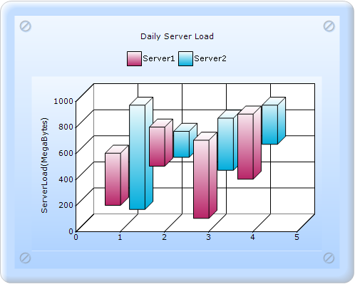

::: {style="DISPLAY: none"}
{#d2h_url_template}{#d2h_package_url style="WIDTH: 0px; DISPLAY: none; HEIGHT: 0px"}
:::

::: {.d2h_secondary_topic style="PADDING-BOTTOM: 10pt; MARGIN: 0pt; PADDING-LEFT: 0pt; PADDING-RIGHT: 0pt; PADDING-TOP: 0pt"}
##### ChartModel {#chartmodel style="tab-stops: 0pt"}

[]{style="FONT-FAMILY: 'Calibri','sans-serif'"} 

To create a Column Range chart through ChartModel:

1.   In Controller, create an instance of **MVCChartModel**.

2.   Create an instance of **ChartSeries**, and set the **SeriesType** to **ColumnRange**.

3.   Set the **ChartSeries**, **ChartArea**, and **ChartModel** properties.

4.   Return view to the corresponding **View** page after setting the **ChartModel** to the **ViewData**.

[]{style="FONT-FAMILY: 'Calibri','sans-serif'"} 

+------------------------------------------------------------------------------------------------------------------------------------------------------------------------------------------------------------------------------------------------------------------------------------------------------------------+
| \[C#\]                                                                                                                                                                                                                                                                                                           |
|                                                                                                                                                                                                                                                                                                                  |
| [        ]{style="FONT-FAMILY: Consolas; FONT-SIZE: 9.5pt"}[public]{style="FONT-FAMILY: 'Courier New'; COLOR: blue"}[ [ActionResult]{style="COLOR: #2b91af"} SimpleChart()]{style="FONT-FAMILY: 'Courier New'"}                                                                                                  |
|                                                                                                                                                                                                                                                                                                                  |
| [        {            ]{style="FONT-FAMILY: 'Courier New'"}                                                                                                                                                                                                                                                      |
|                                                                                                                                                                                                                                                                                                                  |
| [            [MVCChartModel]{style="COLOR: #2b91af"} chartModel = [new]{style="COLOR: blue"} [MVCChartModel]{style="COLOR: #2b91af"}();]{style="FONT-FAMILY: 'Courier New'"}                                                                                                                                     |
|                                                                                                                                                                                                                                                                                                                  |
| [            [// Creating chart series and adding data points to it.]{style="COLOR: green"}]{style="FONT-FAMILY: 'Courier New'"}                                                                                                                                                                                 |
|                                                                                                                                                                                                                                                                                                                  |
| []{style="FONT-FAMILY: 'Courier New'"}                                                                                                                                                                                                                                                                           |
|                                                                                                                                                                                                                                                                                                                  |
| [          **  [ChartSeries]{style="COLOR: #2b91af"} series1 = [new]{style="COLOR: blue"} [ChartSeries]{style="COLOR: #2b91af"}([\"Server1\"]{style="COLOR: #a31515"}, [ChartSeriesType]{style="COLOR: #2b91af"}.** **ColumnRange);**]{style="FONT-FAMILY: 'Courier New'"}                                       |
|                                                                                                                                                                                                                                                                                                                  |
| []{style="FONT-FAMILY: 'Courier New'"}                                                                                                                                                                                                                                                                           |
|                                                                                                                                                                                                                                                                                                                  |
| [            series1.Points.Add(1, 200, 600);]{style="FONT-FAMILY: 'Courier New'"}                                                                                                                                                                                                                               |
|                                                                                                                                                                                                                                                                                                                  |
| []{style="FONT-FAMILY: 'Courier New'"}                                                                                                                                                                                                                                                                           |
|                                                                                                                                                                                                                                                                                                                  |
| [            series1.Points.Add(2, 500, 800);]{style="FONT-FAMILY: 'Courier New'"}                                                                                                                                                                                                                               |
|                                                                                                                                                                                                                                                                                                                  |
| []{style="FONT-FAMILY: 'Courier New'"}                                                                                                                                                                                                                                                                           |
|                                                                                                                                                                                                                                                                                                                  |
| [            series1.Points.Add(3, 100, 700);]{style="FONT-FAMILY: 'Courier New'"}                                                                                                                                                                                                                               |
|                                                                                                                                                                                                                                                                                                                  |
| []{style="FONT-FAMILY: 'Courier New'"}                                                                                                                                                                                                                                                                           |
|                                                                                                                                                                                                                                                                                                                  |
| [            series1.Points.Add(4, 400, 900);]{style="FONT-FAMILY: 'Courier New'"}                                                                                                                                                                                                                               |
|                                                                                                                                                                                                                                                                                                                  |
| []{style="FONT-FAMILY: 'Courier New'"}                                                                                                                                                                                                                                                                           |
|                                                                                                                                                                                                                                                                                                                  |
| []{style="FONT-FAMILY: 'Courier New'"}                                                                                                                                                                                                                                                                           |
|                                                                                                                                                                                                                                                                                                                  |
| [            [// Adding the series to the chart series collection.]{style="COLOR: green"}]{style="FONT-FAMILY: 'Courier New'"}                                                                                                                                                                                   |
|                                                                                                                                                                                                                                                                                                                  |
| []{style="FONT-FAMILY: 'Courier New'"}                                                                                                                                                                                                                                                                           |
|                                                                                                                                                                                                                                                                                                                  |
| [            **chartModel.Series.Add(series1);**]{style="FONT-FAMILY: 'Courier New'"}                                                                                                                                                                                                                            |
|                                                                                                                                                                                                                                                                                                                  |
| **[            [ChartSeries]{style="COLOR: #2b91af"} series2 = [new]{style="COLOR: blue"} [ChartSeries]{style="COLOR: #2b91af"}([\"Server2\"]{style="COLOR: #a31515"}, [ChartSeriesType]{style="COLOR: #2b91af"}.]{style="FONT-FAMILY: 'Courier New'"}**[ **ColumnRange);**]{style="FONT-FAMILY: 'Courier New'"} |
|                                                                                                                                                                                                                                                                                                                  |
| []{style="FONT-FAMILY: 'Courier New'"}                                                                                                                                                                                                                                                                           |
|                                                                                                                                                                                                                                                                                                                  |
| [            series2.Points.Add(1, 900, 100);]{style="FONT-FAMILY: 'Courier New'"}                                                                                                                                                                                                                               |
|                                                                                                                                                                                                                                                                                                                  |
| []{style="FONT-FAMILY: 'Courier New'"}                                                                                                                                                                                                                                                                           |
|                                                                                                                                                                                                                                                                                                                  |
| [            series2.Points.Add(2, 700, 500);]{style="FONT-FAMILY: 'Courier New'"}                                                                                                                                                                                                                               |
|                                                                                                                                                                                                                                                                                                                  |
| []{style="FONT-FAMILY: 'Courier New'"}                                                                                                                                                                                                                                                                           |
|                                                                                                                                                                                                                                                                                                                  |
| [            series2.Points.Add(3, 800, 400);]{style="FONT-FAMILY: 'Courier New'"}                                                                                                                                                                                                                               |
|                                                                                                                                                                                                                                                                                                                  |
| []{style="FONT-FAMILY: 'Courier New'"}                                                                                                                                                                                                                                                                           |
|                                                                                                                                                                                                                                                                                                                  |
| [            series2.Points.Add(4, 600, 900);]{style="FONT-FAMILY: 'Courier New'"}                                                                                                                                                                                                                               |
|                                                                                                                                                                                                                                                                                                                  |
| []{style="FONT-FAMILY: 'Courier New'"}                                                                                                                                                                                                                                                                           |
|                                                                                                                                                                                                                                                                                                                  |
| []{style="FONT-FAMILY: 'Courier New'"}                                                                                                                                                                                                                                                                           |
|                                                                                                                                                                                                                                                                                                                  |
| [            [// Adding the series to the chart series collection.]{style="COLOR: green"}]{style="FONT-FAMILY: 'Courier New'"}                                                                                                                                                                                   |
|                                                                                                                                                                                                                                                                                                                  |
| []{style="FONT-FAMILY: 'Courier New'"}                                                                                                                                                                                                                                                                           |
|                                                                                                                                                                                                                                                                                                                  |
| [            **chartModel.Series.Add(series2);**]{style="FONT-FAMILY: 'Courier New'"}                                                                                                                                                                                                                            |
|                                                                                                                                                                                                                                                                                                                  |
| [            ]{style="FONT-FAMILY: 'Courier New'"}                                                                                                                                                                                                                                                               |
|                                                                                                                                                                                                                                                                                                                  |
| [            chartModel.Skins = [ChartModelSkins]{style="COLOR: #2b91af"}.Office2007Blue;]{style="FONT-FAMILY: 'Courier New'"}                                                                                                                                                                                   |
|                                                                                                                                                                                                                                                                                                                  |
| [            chartModel.ChartSeriesSkins = [ChartSeriesSkins]{style="COLOR: #2b91af"}.Analog;]{style="FONT-FAMILY: 'Courier New'"}                                                                                                                                                                               |
|                                                                                                                                                                                                                                                                                                                  |
| []{style="FONT-FAMILY: 'Courier New'"}                                                                                                                                                                                                                                                                           |
|                                                                                                                                                                                                                                                                                                                  |
| [            chartModel.BorderAppearance.SkinStyle = [ChartBorderSkinStyle]{style="COLOR: #2b91af"}.Pinned;]{style="FONT-FAMILY: 'Courier New'"}                                                                                                                                                                 |
|                                                                                                                                                                                                                                                                                                                  |
| [            ]{style="FONT-FAMILY: 'Courier New'"}                                                                                                                                                                                                                                                               |
|                                                                                                                                                                                                                                                                                                                  |
| [            chartModel.Series3D = [true]{style="COLOR: blue"};]{style="FONT-FAMILY: 'Courier New'"}                                                                                                                                                                                                             |
|                                                                                                                                                                                                                                                                                                                  |
| [            chartModel.PrimaryYAxis.Title = [\"ServerLoad(MegaBytes)\"]{style="COLOR: #a31515"};]{style="FONT-FAMILY: 'Courier New'"}                                                                                                                                                                           |
|                                                                                                                                                                                                                                                                                                                  |
| [            chartModel.Text = [\"Daily Server Load\"]{style="COLOR: #a31515"};]{style="FONT-FAMILY: 'Courier New'"}                                                                                                                                                                                             |
|                                                                                                                                                                                                                                                                                                                  |
| [            ]{style="FONT-FAMILY: 'Courier New'"}                                                                                                                                                                                                                                                               |
|                                                                                                                                                                                                                                                                                                                  |
| [            chartModel.ShowLegend = [true]{style="COLOR: blue"};]{style="FONT-FAMILY: 'Courier New'"}                                                                                                                                                                                                           |
|                                                                                                                                                                                                                                                                                                                  |
| [            chartModel.LegendPosition = [ChartDock]{style="COLOR: #2b91af"}.Top;]{style="FONT-FAMILY: 'Courier New'"}                                                                                                                                                                                           |
|                                                                                                                                                                                                                                                                                                                  |
| [            chartModel.LegendsPlacement = [ChartPlacement]{style="COLOR: #2b91af"}.Outside;]{style="FONT-FAMILY: 'Courier New'"}                                                                                                                                                                                |
|                                                                                                                                                                                                                                                                                                                  |
| [            chartModel.Legend.Alignment = [ChartAlignment]{style="COLOR: #2b91af"}.Center;]{style="FONT-FAMILY: 'Courier New'"}                                                                                                                                                                                 |
|                                                                                                                                                                                                                                                                                                                  |
| [            ]{style="FONT-FAMILY: 'Courier New'"}                                                                                                                                                                                                                                                               |
|                                                                                                                                                                                                                                                                                                                  |
| [            chartModel.Size = [new]{style="COLOR: blue"} System.Drawing.[Size]{style="COLOR: #2b91af"}(500, 400);]{style="FONT-FAMILY: 'Courier New'"}                                                                                                                                                          |
|                                                                                                                                                                                                                                                                                                                  |
| [            ViewData.Model = chartModel;]{style="FONT-FAMILY: 'Courier New'"}                                                                                                                                                                                                                                   |
|                                                                                                                                                                                                                                                                                                                  |
| [            [return]{style="COLOR: blue"} View(); ]{style="FONT-FAMILY: 'Courier New'"}                                                                                                                                                                                                                         |
|                                                                                                                                                                                                                                                                                                                  |
| [}]{style="FONT-FAMILY: 'Courier New'"}                                                                                                                                                                                                                                                                          |
|                                                                                                                                                                                                                                                                                                                  |
| []{style="FONT-FAMILY: Consolas; COLOR: blue; FONT-SIZE: 9.5pt"}                                                                                                                                                                                                                                                 |
+------------------------------------------------------------------------------------------------------------------------------------------------------------------------------------------------------------------------------------------------------------------------------------------------------------------+

[]{style="FONT-FAMILY: 'Calibri','sans-serif'"} 

5.   In the **View** page, invoke the ChartBuilder by using the control ID as the first argument, and convert the **ViewData** to **MVCChartModel** and set it as the second argument.

[]{style="FONT-FAMILY: Consolas; FONT-SIZE: 9.5pt"} 

+-------------------------------------------------------------------------------------------------------------------------------------------------------------------------------------------------------------------------------------------------------------------------------------------------------------------------------------------------------------------------------------+
| **View\[ASPX\]**                                                                                                                                                                                                                                                                                                                                                                    |
|                                                                                                                                                                                                                                                                                                                                                                                     |
|                                                                                                                                                                                                                                                                                                                                                                                     |
|                                                                                                                                                                                                                                                                                                                                                                                     |
| [\<%]{style="FONT-FAMILY: 'Courier New'; BACKGROUND: yellow"}[=]{style="FONT-FAMILY: 'Courier New'; COLOR: blue"}[ Html.Chart([\"SimpleChart\"]{style="COLOR: #a31515"},([MVCChartModel]{style="COLOR: #2b91af"})ViewData.Model) [%\>]{style="BACKGROUND: yellow"}]{style="FONT-FAMILY: 'Courier New'"}[]{style="FONT-FAMILY: 'Courier New'; BACKGROUND: yellow; FONT-SIZE: 9.5pt"} |
+-------------------------------------------------------------------------------------------------------------------------------------------------------------------------------------------------------------------------------------------------------------------------------------------------------------------------------------------------------------------------------------+

[]{style="FONT-FAMILY: Consolas; BACKGROUND: yellow; FONT-SIZE: 9.5pt"} 

[]{style="FONT-FAMILY: Consolas; FONT-SIZE: 9.5pt"} 

+--------------------------------------------------------------------------------------------------------------------------------------------------------------------------------------------------------------------------------------------------------------------------------------------------------------------------------------------------------------------------------------------+
| **View\[cshtml\]**                                                                                                                                                                                                                                                                                                                                                                         |
|                                                                                                                                                                                                                                                                                                                                                                                            |
|                                                                                                                                                                                                                                                                                                                                                                                            |
|                                                                                                                                                                                                                                                                                                                                                                                            |
| [\@{]{style="FONT-FAMILY: 'Courier New'; BACKGROUND: yellow"}[ ]{style="FONT-FAMILY: 'Courier New'; COLOR: blue"}[Html.Chart([\"SimpleChart\"]{style="COLOR: #a31515"},([MVCChartModel]{style="COLOR: #2b91af"})ViewData.Model).Render(); [}]{style="BACKGROUND: yellow"}]{style="FONT-FAMILY: 'Courier New'"}[]{style="FONT-FAMILY: 'Courier New'; BACKGROUND: yellow; FONT-SIZE: 9.5pt"} |
+--------------------------------------------------------------------------------------------------------------------------------------------------------------------------------------------------------------------------------------------------------------------------------------------------------------------------------------------------------------------------------------------+

[]{style="FONT-FAMILY: Consolas; BACKGROUND: yellow; FONT-SIZE: 9.5pt"} 

[]{style="FONT-FAMILY: Consolas; BACKGROUND: yellow; FONT-SIZE: 9.5pt"} 

6.   Build and run the code, to get the following output:

{border="0"}

Figure 96: Chart displaying Column Range Series

[]{#related-topics}
:::
